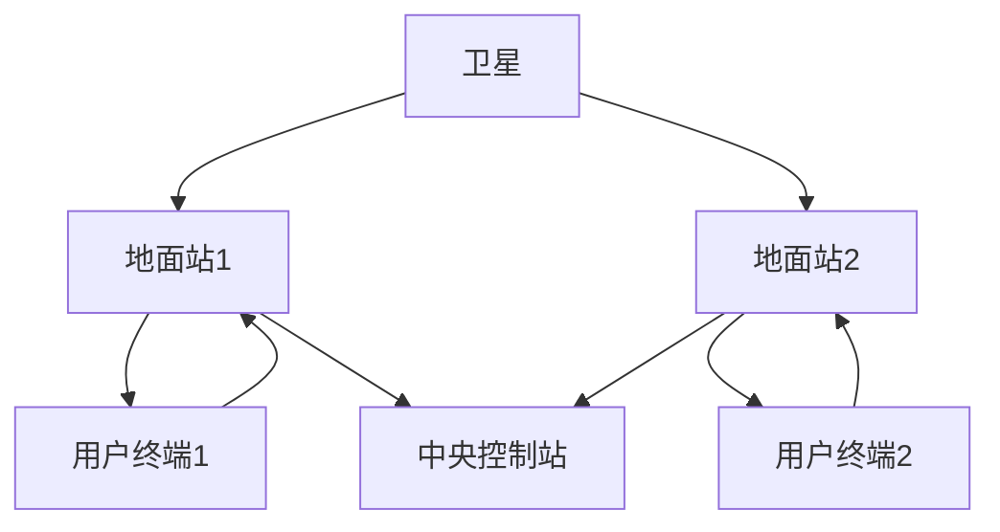

                 

# 企业估值中的量子加密通信卫星网络评估

> 关键词：量子加密通信、卫星网络、企业估值、数据安全、系统架构

> 摘要：本文深入探讨了量子加密通信技术在企业估值中的应用，特别是卫星网络在其中的关键作用。文章从技术原理、系统架构、项目实战等多个方面进行了详细分析，并结合实际案例，展示了如何通过量子加密通信卫星网络提升企业估值的安全性和准确性。

---

## 第一部分: 量子加密通信卫星网络评估的背景介绍

### 第1章: 量子加密通信卫星网络概述

#### 1.1 量子加密通信的基本概念
- 1.1.1 量子加密通信的定义
  - 量子加密通信是一种基于量子力学原理的通信技术，通过量子密钥分发（QKD）实现信息的加密传输。
  - 量子密钥分发利用单光子的不可分割性和量子态的叠加性，确保密钥的安全传输，任何窃听都会被立即检测。

- 1.1.2 量子加密通信的核心原理
  - 量子密钥分发（QKD）：通过发射单光子，接收方利用基矢测量提取密钥，确保密钥的安全性。
  - 量子纠缠：利用量子纠缠的特性，实现通信双方的同步和认证。

- 1.1.3 卫星网络在量子通信中的作用
  - 卫星网络提供了广域的通信覆盖，解决了传统光纤通信的覆盖限制。
  - 卫星量子通信能够在全球范围内实现安全的通信，适用于跨国企业的数据传输。

#### 1.2 量子加密通信的技术发展
- 1.2.1 量子密钥分发（QKD）的发展历程
  - 从实验室研究到实际应用的逐步发展。
  - 国际上的里程碑事件，如中国发射的“墨子号”量子卫星实现了千公里级的量子通信。

- 1.2.2 卫星量子通信的里程碑事件
  - 墨子号量子卫星的成功运行，展示了卫星量子通信的可行性。
  - 其他国家的量子卫星项目，如欧洲的ATHEN阿基米德项目。

- 1.2.3 当前量子通信技术的现状
  - 工业化应用逐步展开，特别是在金融、能源等领域。
  - 技术标准化工作正在进行中，推动量子通信的普及。

#### 1.3 量子加密通信的应用场景
- 1.3.1 企业估值中的数据安全需求
  - 高价值企业的估值过程涉及大量敏感数据，如财务报表、交易记录等。
  - 数据泄露可能导致估值结果的不准确，甚至引发法律风险。

- 1.3.2 卫星网络在企业通信中的优势
  - 覆盖范围广，适合跨国企业在全球范围内的数据传输。
  - 高安全性，抗截获能力。

- 1.3.3 量子加密通信在企业估值中的潜在应用
  - 保护估值过程中涉及的敏感数据，确保数据的完整性和真实性。
  - 提供更安全的通信渠道，提升估值结果的可信度。

### 第2章: 企业估值中的数据安全挑战

#### 2.1 企业估值的核心要素
- 2.1.1 企业估值的基本方法
  - 市盈率法、市净率法、现金流折现法等。
  - 这些方法都需要大量准确的数据支持。

- 2.1.2 数据在企业估值中的重要性
  - 数据是估值的基础，数据的准确性和完整性直接影响估值结果。
  - 高质量的数据有助于提高估值的准确性。

- 2.1.3 数据安全对企业估值的影响
  - 数据泄露可能导致估值过程中的数据被篡改，影响结果的准确性。
  - 数据安全问题可能影响企业的信用评级，进而影响估值。

#### 2.2 数据泄露对企业估值的潜在风险
- 2.2.1 数据泄露对企业价值的具体影响
  - 数据泄露可能导致企业声誉受损，影响投资者信心。
  - 泄露的财务数据可能被竞争对手利用，影响企业的市场地位。

- 2.2.2 数据安全对企业信用评级的影响
  - 数据安全能力强的企业更容易获得高的信用评级。
  - 数据泄露可能导致信用评级下调，增加融资成本。

- 2.2.3 数据安全对企业合规性的影响
  - 数据安全是企业合规的重要部分，不达标可能导致法律处罚。
  - 合规性问题会影响企业的估值结果。

#### 2.3 量子加密通信在企业估值中的解决方案
- 2.3.1 量子加密通信的技术优势
  - 高安全性，抗量子计算攻击。
  - 传输速度快，适合实时数据传输。

- 2.3.2 卫星网络在企业通信中的安全性
  - 卫星通信覆盖广，适合全球业务的企业。
  - 卫星网络的高可靠性，确保数据传输的连续性。

- 2.3.3 量子加密通信对企业估值的具体应用
  - 保护估值过程中的数据传输，确保数据的完整性。
  - 提供安全的通信渠道，提升估值结果的可信度。

---

## 第二部分: 量子加密通信卫星网络的核心概念与联系

### 第3章: 量子加密通信的技术原理

#### 3.1 量子密钥分发（QKD）的原理
- 3.1.1 QKD的基本原理
  - QKD通过单光子发射和基矢测量实现密钥的分发。
  - 任何窃听都会导致量子态的坍塌，从而被检测到。

- 3.1.2 QKD的实现步骤
  - 单光子发射：发射方发送单光子，每个光子携带一个随机的二进制位。
  - 基矢测量：接收方随机选择基矢进行测量，只有在相同基矢下才能正确读取信息。
  - 密钥提取：双方通过协商保留相同基矢测量的结果，形成密钥。

- 3.1.3 QKD的安全性分析
  - 不可克隆性：量子态无法被克隆而不被察觉。
  - 不可分割性：单光子不可分割，确保每个光子携带的信息唯一。

#### 3.2 卫星量子通信的实现机制
- 3.2.1 卫星量子通信的架构
  - 卫星作为中继节点，连接多个地面站。
  - 地面站通过卫星进行量子密钥分发，实现广域的量子通信。

- 3.2.2 卫星量子通信的信号传输过程
  - 卫星接收地面站发送的量子信号。
  - 卫星将信号转发到目标地面站，完成量子密钥的分发。

- 3.2.3 卫星量子通信的误差校正机制
  - 利用经典通信信道进行误差校正，确保密钥的正确性。
  - 通过协商丢弃错误部分，保留正确的密钥部分。

#### 3.3 量子加密通信与经典加密通信的对比
- 3.3.1 技术原理对比
  - 量子加密通信基于量子态的不可分割性和叠加性。
  - 经典加密通信基于数学算法的复杂性。

- 3.3.2 安全性对比
  - 量子加密通信安全性更高，抗量子计算攻击。
  - 经典加密通信可能被强大的计算能力破解。

- 3.3.3 传输距离对比
  - 量子加密通信传输距离受限，但卫星通信可以扩展覆盖范围。
  - 经典加密通信依赖光纤传输，距离受限。

- 3.3.4 适用场景对比
  - 量子加密通信适用于高安全需求的场景，如金融、能源。
  - 经典加密通信适用于一般场景，如互联网通信。

---

### 第4章: 量子加密通信卫星网络的系统架构

#### 4.1 系统整体架构
- 4.1.1 卫星量子通信系统的组成
  - 中央控制站：负责系统的管理和协调。
  - 地面站：接收和发送量子信号。
  - 用户终端：连接企业应用，进行数据加密和解密。

- 4.1.2 网络拓扑结构
  - 星型拓扑：卫星为中心节点，连接多个地面站。
  - 网状拓扑：卫星作为中继节点，连接多个用户终端。

- 4.1.3 通信协议
  - 量子密钥分发协议：如BB84协议。
  - 经典通信协议：用于误差校正和密钥协商。

#### 4.2 系统功能设计
- 4.2.1 量子密钥分发功能
  - 支持多种量子密钥分发协议，适应不同需求。
  - 提供高效的密钥生成和分发能力。

- 4.2.2 数据加密功能
  - 使用生成的量子密钥对数据进行加密。
  - 支持多种加密算法，如AES、RSA等。

- 4.2.3 网络管理功能
  - 监控系统运行状态，确保网络的高可用性。
  - 自动故障恢复，减少 downtime。

#### 4.3 系统架构图

---

### 第5章: 量子加密通信卫星网络的安全评估

#### 5.1 安全威胁分析
- 5.1.1 量子计算攻击
  - 抗量子加密算法的发展情况。
  - 量子计算机对传统加密算法的威胁。

- 5.1.2 侧信道攻击
  - 防范措施：如物理隔离、严格的访问控制。

- 5.1.3 卫星通信中的潜在威胁
  - 信号干扰：如太阳活动、地球环境的影响。
  - 未授权访问：防止未经授权的用户接入网络。

#### 5.2 安全评估指标
- 5.2.1 密钥安全性
  - 密钥分发的效率和安全性。
  - 密钥管理的规范性。

- 5.2.2 网络可用性
  - 网络的高可用性设计。
  - 系统的容错能力。

- 5.2.3 系统合规性
  - 符合相关行业标准和法规。
  - 定期安全审计和漏洞修复。

---

### 第6章: 量子加密通信卫星网络的经济价值评估

#### 6.1 投资成本分析
- 6.1.1 卫星发射成本
  - 卫星制造、发射及维护成本。
  - 规模效应：多个卫星组成的星座降低成本。

- 6.1.2 地面站建设成本
  - 站点选址、设备采购及安装成本。
  - 维护和运营成本。

#### 6.2 运营成本分析
- 6.2.1 通信服务收费
  - 基于使用的计费模式。
  - 批量折扣。

- 6.2.2 维护和升级成本
  - 系统定期维护和升级。
  - 技术更新带来的成本变化。

#### 6.3 经济效益分析
- 6.3.1 市场需求
  - 高安全需求行业的增长。
  - 新兴市场的拓展。

- 6.3.2 价格弹性
  - 高端市场的定价策略。
  - 大众市场的价格竞争。

- 6.3.3 附加值
  - 提供增值服务，如数据分析、安全咨询。
  - 打造生态系统，形成协同效应。

---

## 第三部分: 量子加密通信卫星网络的实际应用与案例分析

### 第7章: 量子加密通信卫星网络的实际应用场景

#### 7.1 金融行业的应用
- 7.1.1 高频交易中的数据安全
  - 实时数据传输的安全性。
  - 防止数据篡改和窃取。

- 7.1.2 金融数据的跨境传输
  - 跨国金融交易的安全保障。
  - 提高交易效率和安全性。

#### 7.2 能源行业的应用
- 7.2.1 能源数据的安全传输
  - 智能电网中的数据安全。
  - 防止数据泄露和篡改。

- 7.2.2 能源管理系统的远程控制
  - 远程设备控制的安全性。
  - 提高能源管理的效率。

#### 7.3 其他行业的应用
- 7.3.1 政府机构的数据安全
  - 公共数据的安全传输。
  - 提高政府信息系统的安全性。

- 7.3.2 医疗行业的数据保护
  - 医疗数据的隐私保护。
  - 远程医疗中的数据安全。

---

### 第8章: 量子加密通信卫星网络的案例分析

#### 8.1 案例背景介绍
- 8.1.1 案例选择：跨国能源公司
  - 全球范围内的数据传输需求。
  - 高安全性的数据传输要求。

#### 8.2 系统实施过程
- 8.2.1 系统设计
  - 架构设计：星型拓扑，卫星为中心节点。
  - 协议选择：采用BB84量子密钥分发协议。
  - 网络管理：自动化监控和故障恢复。

- 8.2.2 系统实现
  - 卫星发射与部署。
  - 地面站的建设和调试。
  - 用户终端的安装和配置。

#### 8.3 实施效果
- 8.3.1 数据传输的安全性提升
  - 数据传输的加密强度提高。
  - 数据泄露风险降低。

- 8.3.2 系统可用性的提升
  - 网络的高可用性设计。
  - 系统运行的稳定性增强。

- 8.3.3 经济效益的提升
  - 数据传输成本降低。
  - 企业估值的准确性提高。

---

## 第四部分: 量子加密通信卫星网络的未来发展趋势

### 第9章: 量子加密通信卫星网络的技术发展趋势

#### 9.1 新型量子加密算法的发展
- 9.1.1 后量子加密算法的研究
  - 抗量子计算攻击的加密算法。
  - 标准化工作进展。

- 9.1.2 量子加密算法的优化
  - 提高密钥分发效率。
  - 减少资源消耗。

#### 9.2 卫星通信技术的演进
- 9.2.1 卫星网络的扩展
  - 高低轨卫星的结合。
  - 卫星星座的优化设计。

- 9.2.2 卫星通信的智能化
  - 智能路由和资源分配。
  - 自适应的通信策略。

#### 9.3 量子加密与卫星通信的融合
- 9.3.1 融合架构的设计
  - 统一的系统架构设计。
  - 融合优化的技术方案。

- 9.3.2 融合应用的探索
  - 新型应用场景的开拓。
  - 融合技术的商业化推广。

---

### 第10章: 量子加密通信卫星网络的未来挑战与机遇

#### 10.1 未来挑战
- 10.1.1 技术挑战
  - 量子计算的发展对加密算法的威胁。
  - 卫星通信的信号稳定性和抗干扰能力。

- 10.1.2 市场挑战
  - 市场接受度的问题。
  - 成本高昂的商业化挑战。

- 10.1.3 法律与政策挑战
  - 数据主权和跨境数据传输的法律问题。
  - 国际合作与竞争的政策环境。

#### 10.2 未来机遇
- 10.2.1 技术进步带来的新机会
  - 新型量子加密算法的商业化。
  - 卫星通信技术的不断创新。

- 10.2.2 市场扩展带来的新机会
  - 新兴市场的需求增长。
  - 多行业的应用拓展。

- 10.2.3 国际合作带来的新机会
  - 国际标准的制定。
  - 跨国合作项目的机会。

---

## 结语

量子加密通信卫星网络评估是企业估值中的一个重要环节，它不仅关系到企业的数据安全，还影响着企业的整体价值。随着量子通信技术的不断发展和卫星网络的日益完善，量子加密通信卫星网络将在企业估值中发挥越来越重要的作用。通过科学的评估方法和合理的系统架构设计，企业可以更好地利用量子加密通信技术，提升数据安全性和估值的准确性。

作者：AI天才研究院/AI Genius Institute & 禅与计算机程序设计艺术 /Zen And The Art of Computer Programming

