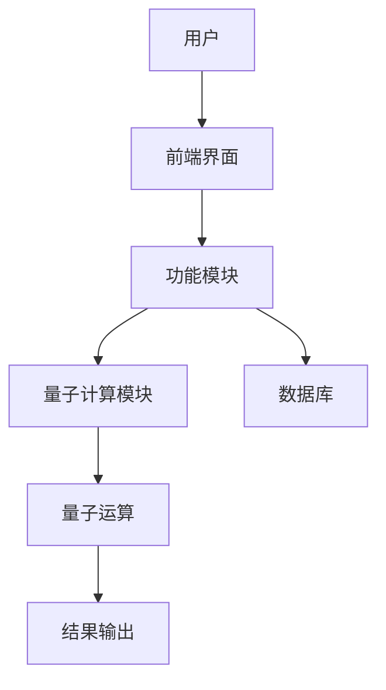

                 

# 企业估值中的量子计算优化物流路径平台评估

> 关键词：量子计算、物流路径优化、企业估值、算法优化、系统架构

> 摘要：本文将探讨量子计算在物流路径优化中的应用及其对企业估值的影响。通过分析量子计算的基本原理、物流路径优化的数学模型、量子算法在物流路径优化中的具体应用、物流路径优化系统的架构设计以及实际项目中的应用案例，本文旨在为企业估值提供新的视角和方法。文章内容包括量子计算的基本概念、物流路径优化的核心原理、量子计算优化物流路径的算法实现、系统架构设计、项目实战以及最佳实践等内容，为读者提供全面而深入的技术分析。

---

# 第一部分: 量子计算与物流路径优化的背景

## 第1章: 量子计算的基本概念

### 1.1 量子计算的定义与特点

量子计算是一种基于量子力学原理的计算方式，与经典计算相比，其最大的特点是利用量子叠加和量子纠缠的特性来处理信息。量子计算机能够在处理某些特定问题时显著提高计算效率，尤其是在处理组合优化问题时表现尤为突出。

- **量子叠加**：量子位（qubit）可以同时处于多个状态的叠加态，这使得量子计算机能够同时处理多种可能性。
- **量子纠缠**：两个或多个量子位之间可以形成纠缠态，这种纠缠态使得对其中一个量子位的测量会立即影响另一个量子位的状态。

### 1.2 物流路径优化的基本概念

物流路径优化是指通过优化运输路径和资源分配，以最小化运输成本、时间或其他目标函数的过程。物流路径优化是物流管理中的一个核心问题，广泛应用于供应链管理、配送中心选址、车辆路径规划等领域。

- **物流路径优化的目标**：通常包括最小化运输成本、最大化运输效率、最小化运输时间等。
- **物流路径优化的挑战**：包括复杂的地理环境、动态的需求变化、多目标优化等。

---

## 第2章: 量子计算与物流路径优化的结合

### 2.1 量子计算在物流路径优化中的优势

量子计算在物流路径优化中具有显著优势，尤其是在处理大规模复杂问题时，其并行计算能力可以显著提高计算效率。

- **并行计算能力**：量子计算机可以同时处理大量的可能性，从而显著减少计算时间。
- **复杂问题的处理能力**：量子计算在处理NP-hard问题时具有潜在的优势，而物流路径优化中的许多问题都属于NP-hard问题。

### 2.2 量子计算与物流路径优化的核心联系

量子计算通过其独特的计算方式，能够为物流路径优化提供新的解决方案，尤其是在处理大规模数据和复杂约束条件时表现尤为突出。

- **量子退火算法**：一种基于量子叠加原理的优化算法，能够有效解决物流路径优化中的组合优化问题。
- **量子计算与物流网络的结合**：通过量子计算技术，可以优化物流网络的结构和资源分配，从而提高整体效率。

### 2.3 量子计算优化物流路径的数学模型

量子计算优化物流路径的数学模型是基于量子叠加和量子纠缠原理构建的，其核心是将物流路径优化问题转化为量子计算的数学表达式。

- **量子退火算法的数学模型**：通过构建量子退火模型，将物流路径优化问题转化为量子系统能量最小化问题。
- **量子计算模型的构建**：通过量子叠加原理，将物流路径优化问题中的多个变量进行叠加，从而实现对所有可能路径的并行计算。

---

# 第二部分: 量子计算优化物流路径的算法原理

## 第3章: 量子退火算法

### 3.1 量子退火算法的基本原理

量子退火算法是一种基于量子叠加原理的优化算法，其基本原理是通过量子系统能量的最小化来找到优化问题的最优解。

- **量子叠加原理**：量子位可以同时处于多个状态的叠加态，从而实现对所有可能解的并行计算。
- **能量最小化**：通过量子系统的能量最小化，找到优化问题的最优解。

### 3.2 量子退火算法的数学模型

量子退火算法的数学模型通常包括状态表示、能量函数和量子动力学方程。

- **状态表示**：通过量子位表示问题中的变量，每个量子位可以处于叠加态。
- **能量函数**：定义问题的目标函数为量子系统的能量函数。
- **量子动力学方程**：描述量子系统的演化过程，从而找到能量最小化的状态。

### 3.3 量子退火算法在物流路径优化中的应用

量子退火算法在物流路径优化中的应用主要体现在以下几个方面：

- **路径优化**：通过量子退火算法优化物流路径，减少运输成本和时间。
- **资源分配**：优化资源分配，提高物流效率。
- **动态路径调整**：在动态环境下，实时调整物流路径，以应对突发情况。

---

## 第4章: 其他量子计算算法

### 4.1 Grover算法

Grover算法是一种用于在无序数据库中搜索特定元素的量子算法，其优势在于能够在O(√N)的时间复杂度内找到目标元素，而经典算法的时间复杂度为O(N)。

- **Grover算法的应用**：在物流路径优化中，Grover算法可以用于优化路径搜索，提高路径优化的效率。

### 4.2 Shor算法

Shor算法是一种用于大整数因式分解的量子算法，其在密码学和网络安全领域具有重要应用。

- **Shor算法的应用**：在物流路径优化中，Shor算法可以用于优化物流网络的结构，提高网络的安全性。

### 4.3 其他量子算法在物流路径优化中的潜在应用

除了Grover算法和Shor算法，其他量子算法如量子傅里叶变换、量子模拟等也在物流路径优化中具有潜在的应用价值。

---

## 第5章: 量子计算算法与物流路径优化的结合

### 5.1 算法选择的依据

在选择量子算法时，需要综合考虑算法的复杂度、计算效率、问题规模等因素。

- **算法复杂度**：量子算法的时间复杂度通常是O(√N)，而经典算法的时间复杂度通常是O(N)。
- **问题规模**：对于大规模问题，量子算法通常具有显著优势。

### 5.2 算法实现的具体步骤

量子算法的实现通常包括以下几个步骤：

1. **问题建模**：将物流路径优化问题转化为量子计算的数学模型。
2. **量子电路设计**：设计量子电路，实现算法的计算过程。
3. **量子态初始化**：初始化量子态，表示问题中的变量。
4. **量子运算**：执行量子运算，求解问题。
5. **测量与结果解读**：通过测量量子态，获取优化结果。

### 5.3 算法优化的策略与技巧

在实现量子算法时，需要考虑算法的优化策略和技巧，以提高计算效率和结果准确性。

- **算法优化策略**：包括参数调整、算法并行化等。
- **算法技巧**：包括量子态的叠加与纠缠、量子误差校正等。

---

# 第三部分: 量子计算优化物流路径的系统架构

## 第6章: 系统架构设计

### 6.1 系统整体架构图

以下是一个典型的量子计算优化物流路径平台的系统架构图：

### 6.2 系统功能模块划分

量子计算优化物流路径平台的功能模块通常包括以下几个部分：

1. **用户界面**：提供用户交互界面，用户可以通过界面输入参数和查看结果。
2. **功能模块**：包括路径优化模块、资源分配模块等。
3. **量子计算模块**：实现量子算法的运算，提供优化结果。
4. **数据库**：存储物流路径优化的相关数据。

### 6.3 系统核心模块的实现方式

系统核心模块的实现方式通常包括以下几个方面：

- **路径优化模块**：通过量子退火算法优化物流路径，减少运输成本和时间。
- **资源分配模块**：优化资源分配，提高物流效率。
- **量子计算模块**：实现量子算法的运算，提供优化结果。

---

## 第7章: 系统功能设计

### 7.1 用户界面设计

用户界面设计需要考虑用户的使用习惯和需求，通常包括以下几个方面：

- **输入界面**：用户可以通过输入界面输入物流路径优化的相关参数。
- **输出界面**：用户可以通过输出界面查看优化结果。

### 7.2 数据输入与处理

数据输入与处理是系统实现的重要环节，通常包括以下几个方面：

- **数据输入**：用户可以通过输入界面输入物流路径优化的相关数据。
- **数据处理**：系统对输入数据进行预处理，为后续的优化运算做准备。

### 7.3 算法执行与结果输出

算法执行与结果输出是系统实现的核心环节，通常包括以下几个方面：

- **算法执行**：系统执行量子算法，优化物流路径。
- **结果输出**：系统输出优化结果，供用户查看。

---

## 第8章: 系统接口设计

### 8.1 系统内部接口

系统内部接口是指系统内部各模块之间的接口，通常包括以下几个方面：

- **功能模块接口**：功能模块之间的接口，用于数据传递和功能调用。
- **量子计算模块接口**：量子计算模块与其他模块之间的接口，用于数据传递和功能调用。

### 8.2 系统外部接口

系统外部接口是指系统与外部系统之间的接口，通常包括以下几个方面：

- **用户界面接口**：用户与系统之间的接口，用于数据输入和输出。
- **外部数据接口**：系统与外部数据源之间的接口，用于数据获取。

### 8.3 接口协议与数据格式

接口协议与数据格式是系统实现的重要部分，通常包括以下几个方面：

- **接口协议**：系统使用的接口协议，如HTTP、TCP/IP等。
- **数据格式**：系统使用的数据格式，如JSON、XML等。

---

# 第四部分: 量子计算优化物流路径的项目实战

## 第9章: 项目背景与目标

### 9.1 项目背景介绍

项目背景介绍需要说明项目的背景和意义，通常包括以下几个方面：

- **项目背景**：说明项目的背景和意义。
- **项目目标**：说明项目的具体目标和预期成果。

### 9.2 项目目标设定

项目目标设定需要明确项目的具体目标和预期成果，通常包括以下几个方面：

- **优化目标**：通过量子计算优化物流路径，减少运输成本和时间。
- **技术目标**：实现量子计算优化物流路径的系统架构。

---

## 第10章: 项目核心实现

### 10.1 环境安装

项目核心实现需要考虑环境的安装和配置，通常包括以下几个方面：

- **量子计算环境**：安装和配置量子计算环境，如量子计算机、量子模拟器等。
- **开发环境**：安装和配置开发环境，如编程语言、开发工具等。

### 10.2 系统功能实现

系统功能实现需要实现系统的各项功能，通常包括以下几个方面：

- **路径优化模块**：实现路径优化功能，通过量子退火算法优化物流路径。
- **资源分配模块**：实现资源分配功能，优化物流资源的分配。

### 10.3 量子算法实现

量子算法实现需要实现量子算法的运算，通常包括以下几个方面：

- **量子退火算法**：实现量子退火算法的运算，优化物流路径。
- **其他量子算法**：实现其他量子算法的运算，优化物流路径。

---

## 第11章: 项目小结

### 11.1 项目成果总结

项目小结需要总结项目的成果和经验，通常包括以下几个方面：

- **项目成果**：总结项目的具体成果和预期成果。
- **项目经验**：总结项目实施过程中积累的经验和教训。

### 11.2 项目优化建议

项目优化建议需要提出项目的优化建议，通常包括以下几个方面：

- **算法优化建议**：提出算法优化的建议，进一步提高计算效率和优化效果。
- **系统优化建议**：提出系统优化的建议，进一步提高系统的稳定性和可靠性。

---

# 第五部分: 量子计算优化物流路径的最佳实践

## 第12章: 最佳实践

### 12.1 量子计算优化物流路径的注意事项

量子计算优化物流路径的注意事项包括以下几个方面：

- **算法选择**：选择合适的量子算法，根据问题的具体需求选择合适的算法。
- **系统设计**：合理设计系统架构，确保系统的稳定性和可靠性。
- **数据处理**：合理处理数据，确保数据的准确性和完整性。

### 12.2 量子计算优化物流路径的技巧

量子计算优化物流路径的技巧包括以下几个方面：

- **算法优化技巧**：通过参数调整、算法并行化等技巧优化算法的性能。
- **系统优化技巧**：通过系统架构优化、接口优化等技巧优化系统的性能。

### 12.3 量子计算优化物流路径的未来发展方向

量子计算优化物流路径的未来发展方向包括以下几个方面：

- **算法研究**：进一步研究量子算法，提出新的量子算法和优化方法。
- **系统设计**：进一步研究系统架构，提出新的系统设计和优化方法。
- **应用拓展**：将量子计算优化物流路径的技术拓展到更多领域，如智能制造、智慧城市等。

---

# 第六部分: 结语

## 第13章: 量子计算优化物流路径的未来发展

### 13.1 量子计算与物流路径优化的未来趋势

量子计算与物流路径优化的未来趋势包括以下几个方面：

- **技术进步**：随着量子计算技术的进步，量子算法的优化能力和应用范围将进一步扩大。
- **应用拓展**：量子计算在物流路径优化中的应用将进一步拓展，覆盖更多的领域和场景。
- **技术融合**：量子计算将与其他技术如人工智能、大数据等进一步融合，形成更强大的技术组合。

### 13.2 量子计算优化物流路径的未来挑战

量子计算优化物流路径的未来挑战包括以下几个方面：

- **技术瓶颈**：量子计算技术仍处于发展阶段，存在许多技术瓶颈，如量子噪声、量子纠错等。
- **成本问题**：量子计算的硬件成本较高，限制了其广泛应用。
- **人才培养**：量子计算优化物流路径需要大量专业人才，目前人才短缺问题较为突出。

---

# 作者：AI天才研究院/AI Genius Institute & 禅与计算机程序设计艺术 /Zen And The Art of Computer Programming

