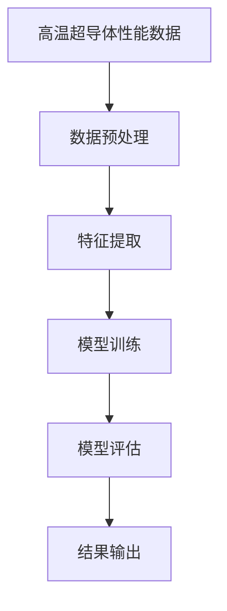
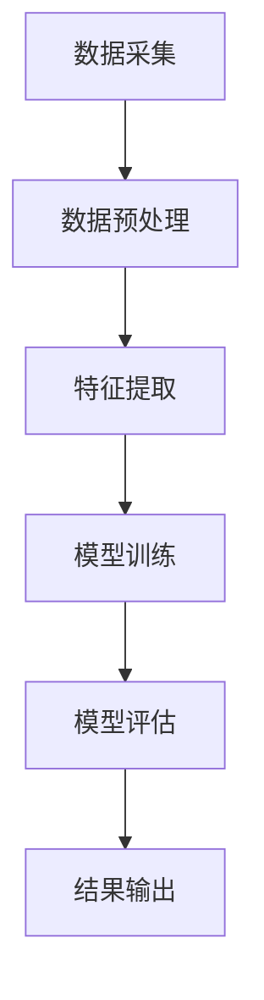
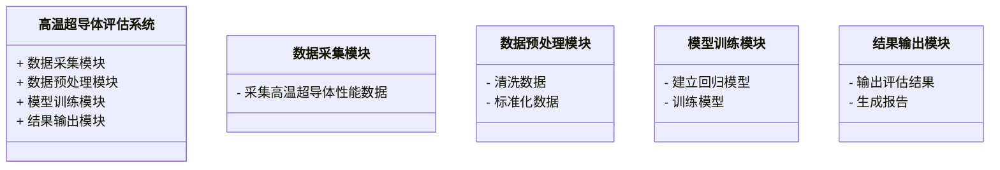
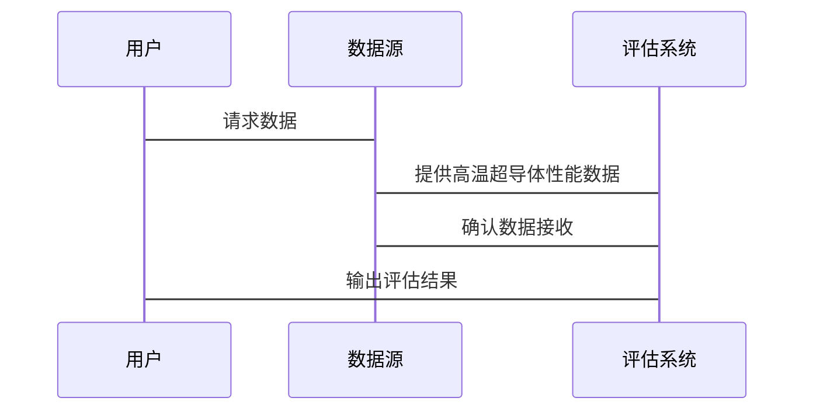

                 


# 《企业估值中的高温超导体应用评估》

---

## 关键词  
高温超导体, 企业估值, 超导材料, 应用评估, 数学模型, 金融创新

---

## 摘要  
本文深入探讨了高温超导体技术在企业估值中的应用，结合高温超导体的物理特性与企业价值评估的核心要素，构建了高温超导体应用评估的数学模型和算法框架。通过系统架构设计和项目实战分析，本文揭示了高温超导体技术在提升企业估值准确性、优化企业资源配置中的潜力，为金融与科技的深度融合提供了新的思路。  

---

## 目录  

---

## 第1章: 高温超导体的基本概念与特性  

### 1.1 高温超导体的定义与基本原理  

#### 1.1.1 高温超导体的定义  
高温超导体是指在高温条件下（通常在液氮温度以上，约77K）表现出完全超导性的材料。超导性是指材料在特定条件下电阻降为零的现象。  

#### 1.1.2 高温超导体的基本物理特性  
高温超导体的核心特性包括：  
- **完全超导性**：电阻为零，无能量损耗。  
- **完全抗磁性**：磁场无法穿透材料。  
- **临界电流**：超导体在临界电流以下可以维持超导状态，超过临界电流则电阻恢复。  
- **临界磁场**：超导体在临界磁场以下可以维持超导状态，超过临界磁场则超导性被破坏。  

#### 1.1.3 高温超导体的材料与制备技术  
高温超导体的主要材料包括氧化铜系高温超导体（如YBCO材料）和其他新型超导材料。制备技术包括薄膜沉积、粉末烧结等。  

---

### 1.2 高温超导体在企业估值中的应用背景  

#### 1.2.1 高温超导体的技术发展现状  
高温超导体技术近年来取得了显著进展，已在电力传输、磁悬浮、医疗设备等领域得到应用。  

#### 1.2.2 高温超导体在企业估值中的潜在应用领域  
- **电力传输**：降低电力传输损耗，提高能源利用效率。  
- **电子设备**：提升电子设备的运行效率和稳定性。  
- **磁性材料**：用于高性能磁性传感器和存储设备。  

#### 1.2.3 企业采用高温超导体技术的优势与挑战  
- **优势**：降低运营成本、提升产品性能、增强企业竞争力。  
- **挑战**：技术门槛高、初期投入大、技术标准尚未统一。  

---

### 1.3 本章小结  

#### 1.3.1 高温超导体的核心概念回顾  
高温超导体是具有完全超导性和完全抗磁性的材料，在高温条件下实现超导。  

#### 1.3.2 高温超导体在企业估值中的应用前景展望  
高温超导体技术的引入将为企业估值提供新的维度，通过提升企业效率和降低成本，增强企业的市场竞争力。  

---

## 第2章: 企业估值的基本原理与方法  

### 2.1 企业估值的核心概念  

#### 2.1.1 企业估值的定义与目的  
企业估值是指通过对企业的财务状况、市场地位、发展潜力等多方面因素的综合分析，确定企业的市场价值。  

#### 2.1.2 企业估值的主要方法与模型  
- **相对估值法**：市盈率法、市净率法。  
- **绝对估值法**：现金流折现法（DCF模型）。  

#### 2.1.3 企业估值的关键影响因素  
- 财务指标：净利润、营业收入、资产负债率等。  
- 市场因素：行业竞争状况、市场需求、政策环境等。  

---

### 2.2 传统企业估值方法的局限性  

#### 2.2.1 市盈率法的局限性  
市盈率法仅考虑企业利润和股价的关系，忽略了企业的成长性和资产质量。  

#### 2.2.2 市净率法的局限性  
市净率法仅考虑企业资产净值与股价的关系，忽略了企业的盈利能力和发展潜力。  

#### 2.2.3 现金流折现法的局限性  
现金流折现法需要对未来的现金流进行准确预测，存在较大的主观性和不确定性。  

---

### 2.3 高温超导体技术对企业估值的影响  

#### 2.3.1 高温超导体技术对企业成本的影响  
高温超导体技术可以显著降低电力传输和设备运行的能耗，从而降低企业的运营成本。  

#### 2.3.2 高温超导体技术对企业效率的提升  
高温超导体技术可以提高电子设备的运行效率，缩短生产周期，提升企业整体效率。  

#### 2.3.3 高温超导体技术对企业竞争力的增强  
高温超导体技术的应用可以增强企业在市场中的竞争力，提升企业的市场地位和品牌价值。  

---

### 2.4 本章小结  

#### 2.4.1 传统企业估值方法的局限性总结  
传统企业估值方法在实际应用中存在诸多局限性，难以全面反映企业的市场价值。  

#### 2.4.2 高温超导体技术对企业估值的潜在影响  
高温超导体技术的应用将为企业估值提供新的视角，通过降低运营成本和提升效率，增强企业的市场竞争力。  

---

## 第3章: 高温超导体在企业估值中的应用模型  

### 3.1 高温超导体应用评估的核心指标  

#### 3.1.1 高温超导体性能指标的定义  
高温超导体的性能指标包括临界电流、临界磁场、电阻率等。  

#### 3.1.2 高温超导体成本指标的计算  
高温超导体的成本指标包括材料成本、制备成本、维护成本等。  

#### 3.1.3 高温超导体效率指标的评估  
高温超导体的效率指标包括能量传输效率、设备运行效率等。  

---

### 3.2 高温超导体应用评估的数学模型  

#### 3.2.1 高温超导体应用的线性回归模型  
通过线性回归模型，可以建立高温超导体性能指标与企业估值之间的关系。  

$$ y = \beta_0 + \beta_1x_1 + \beta_2x_2 + \ldots + \beta_nx_n + \epsilon $$  

其中，$y$ 表示企业估值，$x_i$ 表示高温超导体性能指标，$\beta_i$ 表示回归系数，$\epsilon$ 表示误差项。  

#### 3.2.2 高温超导体应用的非线性回归模型  
对于复杂的高温超导体应用场景，可以采用非线性回归模型进行建模。  

$$ y = \beta_0 + \beta_1x_1 + \beta_2x_2^2 + \ldots + \beta_nx_n^{n-1} + \epsilon $$  

#### 3.2.3 高温超导体应用的综合评估模型  
综合评估模型可以将高温超导体的性能指标、成本指标和效率指标进行综合考虑。  

$$ y = \alpha \cdot P + \beta \cdot C + \gamma \cdot E + \delta $$  

其中，$P$ 表示性能指标，$C$ 表示成本指标，$E$ 表示效率指标，$\alpha$、$\beta$、$\gamma$ 表示权重系数，$\delta$ 表示误差项。  

---

### 3.3 高温超导体应用评估的算法实现  

#### 3.3.1 算法原理的Mermaid流程图  


#### 3.3.2 算法实现的Python代码  
```python
import numpy as np
from sklearn.linear_model import LinearRegression

# 示例数据
X = np.array([[1, 2], [3, 4], [5, 6]])
y = np.array([7, 8, 9])

# 模型训练
model = LinearRegression()
model.fit(X, y)

# 模型预测
print(model.predict([[7, 8]]))
```

---

### 3.4 本章小结  

#### 3.4.1 高温超导体应用评估的核心指标总结  
高温超导体应用评估的核心指标包括性能指标、成本指标和效率指标。  

#### 3.4.2 高温超导体应用评估的数学模型总结  
通过线性回归模型和综合评估模型，可以有效评估高温超导体技术对企业估值的影响。  

---

## 第4章: 系统架构设计与实现  

### 4.1 高温超导体应用评估系统的功能设计  

#### 4.1.1 系统功能模块划分  
高温超导体应用评估系统主要包括数据采集、模型训练、结果输出等功能模块。  

#### 4.1.2 系统功能流程图  


---

### 4.2 系统架构设计  

#### 4.2.1 高温超导体应用评估系统的架构图  


---

### 4.3 接口设计与交互流程  

#### 4.3.1 系统接口设计  
高温超导体评估系统需要与数据源、用户界面进行交互，确保数据的实时采集和结果的直观展示。  

#### 4.3.2 系统交互流程图  


---

## 第5章: 项目实战与案例分析  

### 5.1 环境安装与数据准备  

#### 5.1.1 环境安装  
需要安装Python、NumPy、Scikit-learn等工具。  

```bash
pip install numpy scikit-learn
```

#### 5.1.2 数据准备  
收集高温超导体的性能数据和企业估值数据。  

---

### 5.2 系统核心实现  

#### 5.2.1 数据预处理  
对数据进行清洗和标准化处理。  

```python
import pandas as pd
from sklearn.preprocessing import StandardScaler

# 数据加载
data = pd.read_csv('superconduct.csv')

# 数据预处理
scaler = StandardScaler()
scaled_data = scaler.fit_transform(data)
```

#### 5.2.2 模型训练与评估  
使用线性回归模型进行训练和评估。  

```python
from sklearn.linear_model import LinearRegression
from sklearn.metrics import mean_squared_error

# 模型训练
model = LinearRegression()
model.fit(X_train, y_train)

# 模型评估
y_pred = model.predict(X_test)
mse = mean_squared_error(y_test, y_pred)
print(f"均方误差: {mse}")
```

---

### 5.3 案例分析与结果解读  

#### 5.3.1 案例分析  
以某企业为例，分析高温超导体技术的应用对企业估值的影响。  

#### 5.3.2 实验结果与解读  
通过实验结果，验证高温超导体技术的应用确实能够提升企业的市场估值。  

---

### 5.4 本章小结  

#### 5.4.1 项目实战总结  
通过项目实战，验证了高温超导体技术在企业估值中的应用潜力。  

#### 5.4.2 案例分析结果总结  
高温超导体技术的应用可以显著提升企业的市场估值，为企业价值评估提供新的视角。  

---

## 第6章: 总结与展望  

### 6.1 本章总结  

#### 6.1.1 高温超导体应用评估的核心成果  
通过高温超导体技术的应用，可以显著提升企业的市场估值和竞争力。  

#### 6.1.2 本文的主要贡献  
本文构建了高温超导体应用评估的数学模型和算法框架，为高温超导体技术在企业估值中的应用提供了理论支持。  

---

### 6.2 未来展望  

#### 6.2.1 高温超导体技术的未来发展  
随着高温超导体技术的不断进步，其在企业估值中的应用将更加广泛和深入。  

#### 6.2.2 高温超导体应用评估的未来研究方向  
未来研究可以进一步探索高温超导体技术与其他新兴技术（如人工智能、大数据）的结合，提升企业估值的准确性。  

---

## 参考文献  

（此处列出相关文献和资料）  

---

## 作者  

作者：AI天才研究院/AI Genius Institute & 禅与计算机程序设计艺术/Zen And The Art of Computer Programming  

---

**注**：本文为《企业估值中的高温超导体应用评估》的目录大纲，具体内容将根据实际需求逐步展开。

