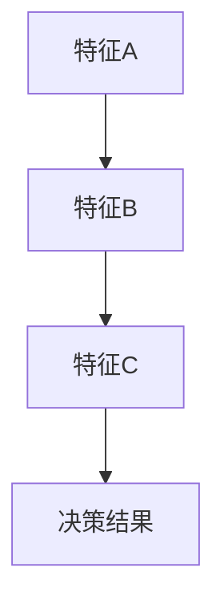
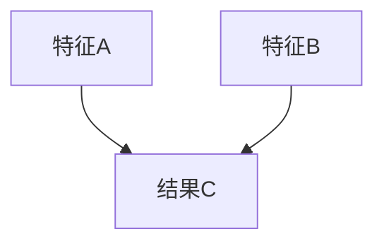
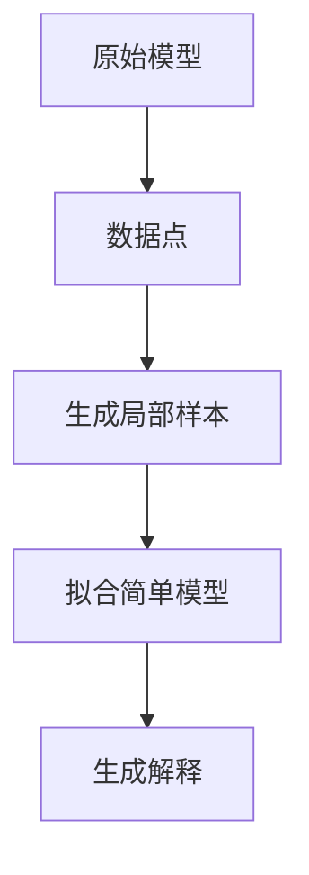
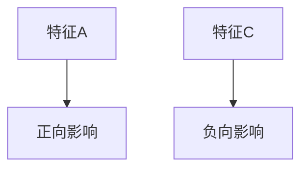
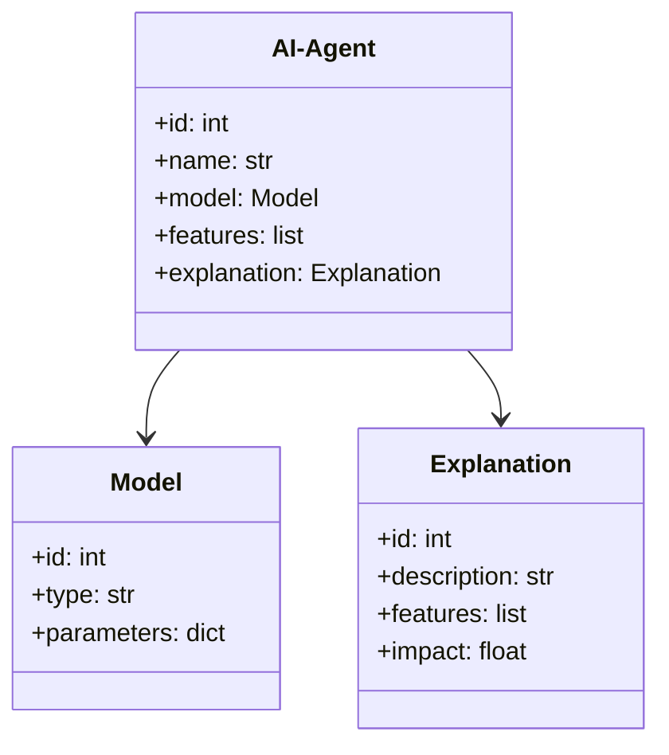

                 


# 企业级AI Agent的可解释性设计：增强决策透明度

> 关键词：企业级AI Agent，可解释性设计，决策透明度，LIME算法，SHAP值，系统架构，数学模型

> 摘要：本文从企业级AI Agent的可解释性设计出发，深入探讨如何通过增强决策透明度来提升AI系统的可信度和可管理性。通过分析可解释性设计的核心概念、算法原理、系统架构以及项目实战，本文为读者提供了一套完整的可解释性设计方法论，帮助企业在实际应用中构建透明、可信的AI系统。

---

## 第1章 企业级AI Agent的可解释性设计背景

### 1.1 问题背景与问题描述

#### 1.1.1 企业级AI Agent的应用场景
企业级AI Agent（Artificial Intelligence Agent）是一种能够感知环境、自主决策并执行任务的智能体。在企业环境中，AI Agent广泛应用于客服系统、推荐系统、供应链管理、风险管理等领域。例如，在智能客服系统中，AI Agent需要通过自然语言处理（NLP）技术理解用户需求，并基于历史数据和实时信息做出推荐或决策。

#### 1.1.2 可解释性在AI Agent中的重要性
随着企业对AI系统的依赖程度不断提高，AI Agent的决策透明度问题日益凸显。企业需要了解AI Agent的决策依据，以便在出现问题时进行追溯和优化。此外，可解释性还关系到企业的合规性、客户信任度以及系统的可维护性。例如，在金融领域，AI Agent的决策必须符合监管要求，否则可能导致合规性风险。

#### 1.1.3 当前AI Agent决策透明度的挑战
当前的AI技术，尤其是深度学习模型，往往被视为“黑箱”，其决策过程难以解释。这种“黑箱”特性给企业带来了诸多挑战，例如：
- **决策不可追溯**：当AI Agent做出错误决策时，难以快速定位问题。
- **客户信任缺失**：客户无法理解AI的决策逻辑，导致信任度下降。
- **合规性风险**：某些行业（如金融、医疗）对决策透明度有严格要求，不可解释的AI系统可能面临合规性问题。

---

### 1.2 可解释性设计的核心要素

#### 1.2.1 可解释性定义与特征对比表
| **特征**       | **可解释性**             | **透明性**             | **可追溯性**           |
|-----------------|-------------------------|------------------------|------------------------|
| **定义**       | 系统能够清晰地解释其决策过程 | 系统内部过程对用户或开发者透明 | 系统能够追溯决策过程中的关键节点 |
| **关注点**     | 解释决策逻辑             | 展示系统内部机制       | 追踪决策路径           |
| **实现难度**   | 中等                     | 较高                   | 较低                   |
| **应用场景**   | 需要向用户或开发者解释决策 | 需要展示系统内部流程   | 需要快速定位问题原因   |

#### 1.2.2 可解释性与透明性的关系
可解释性是透明性的一种表现形式。透明性关注的是系统内部过程是否对用户或开发者可见，而可解释性则进一步要求系统能够用人类可理解的方式解释其决策过程。例如，透明性可能要求系统展示其使用的数据源，而可解释性则要求系统能够说明其如何基于这些数据源做出决策。

#### 1.2.3 可解释性与可追溯性的区别
可追溯性关注的是系统是否能够追溯决策过程中的关键节点，而可解释性则关注于如何解释这些决策。例如，可追溯性可能要求系统记录每个决策的输入和输出，而可解释性则要求系统能够说明这些输入和输出之间的关系。

---

### 1.3 本章小结
本章从企业级AI Agent的应用场景出发，分析了可解释性设计的重要性，并对比了可解释性、透明性和可追溯性等核心概念。通过这些对比，我们可以更好地理解可解释性设计的核心要素。

---

## 第2章 可解释性设计的核心原理

### 2.1 可解释性设计的数学模型

#### 2.1.1 决策树模型与可解释性
决策树是一种经典的机器学习模型，其可解释性较强，因为每个决策节点都可以用简单的规则表示。例如，下图展示了一个简单的决策树模型：



决策树的可解释性来源于其规则的简单性和层次结构的直观性。

#### 2.1.2 线性回归模型的可解释性
线性回归模型的可解释性主要体现在其系数的可解释性上。例如，对于一个简单的线性回归模型：
$$ y = \beta_0 + \beta_1x_1 + \beta_2x_2 $$

其中，$\beta_1$ 表示 $x_1$ 对 $y$ 的影响程度，$\beta_2$ 表示 $x_2$ 对 $y$ 的影响程度。

#### 2.1.3 贝叶斯网络的可解释性
贝叶斯网络通过概率分布和条件独立性来表示变量之间的关系，其可解释性较强。例如，下图展示了一个简单的贝叶斯网络：



通过贝叶斯网络，我们可以计算每个特征对结果的影响概率。

---

### 2.2 可解释性设计的算法原理

#### 2.2.1 LIME算法原理与流程图
LIME（Local Interpretable Model-agnostic Explanations）是一种用于解释机器学习模型的算法。其核心思想是通过在局部区域拟合一个简单的模型来解释复杂的模型。LIME的流程图如下：



#### 2.2.2 SHAP值的计算与解释
SHAP（Shapley Additive exPlanations）是一种基于博弈论的解释方法。其核心思想是将每个特征对模型预测结果的贡献度进行量化。例如，对于一个二分类问题，SHAP值可以通过以下公式计算：
$$ \text{SHAP}(i) = \phi(i) = \sum_{S \subseteq \{j\}} \phi_S(i) - \phi_{S}(0) $$

其中，$\phi_S(i)$ 表示特征子集 $S$ 对样本 $i$ 的贡献度。

#### 2.2.3 可解释性评估指标
常用的可解释性评估指标包括：
- **模型复杂度**：模型越复杂，可解释性越差。
- **特征重要性**：特征重要性越高的特征对模型的决策影响越大。
- **解释覆盖率**：解释能够覆盖的数据点比例。

---

### 2.3 可解释性设计的ER实体关系图

#### 2.3.1 实体关系图的构建
下图展示了一个简单的可解释性设计的ER实体关系图：

```mermaid
erd
    customer --(解释请求)--> explanation_request
    explanation_request --(关联)--> model
    model --(依赖)--> feature
    feature --(影响)--> decision
```

#### 2.3.2 实体关系图的属性分析
| **实体**       | **属性**                     |
|-----------------|------------------------------|
| **customer**    | id, name, email               |
| **explanation_request** | request_id, timestamp, status |
| **model**       | model_id, model_type, version |
| **feature**     | feature_id, feature_name, type |

#### 2.3.3 实体关系图与可解释性的关联
通过ER实体关系图，我们可以清晰地看到各个实体之间的关系。例如，客户提交解释请求后，系统会根据模型和特征生成解释。

---

### 2.4 本章小结
本章从数学模型和算法原理的角度，分析了可解释性设计的核心要素。通过LIME和SHAP值的对比，我们可以更好地理解如何在实际应用中实现可解释性设计。

---

## 第3章 可解释性设计的算法实现与数学模型

### 3.1 LIME算法的实现

#### 3.1.1 LIME算法的数学模型
LIME算法的核心思想是通过局部拟合简单的解释模型来解释复杂的模型。例如，对于一个分类问题，LIME可以通过以下公式计算解释：
$$ \text{解释} = \sum_{i=1}^n \text{权重}_i \times \text{特征}_i $$

#### 3.1.2 LIME算法的代码实现
以下是一个简单的LIME算法实现代码示例：

```python
import lime
from lime import lime_explanations

def explain_model(model, data):
    explainer = lime_explanations.LimeExplainer()
    explanation = explainer.explain_instance(data, model.predict, 10)
    return explanation
```

#### 3.1.3 LIME算法的优缺点分析
- **优点**：LIME能够解释复杂的模型，且解释结果易于理解。
- **缺点**：LIME需要额外的计算开销，且解释结果可能存在偏差。

---

### 3.2 SHAP值的计算与实现

#### 3.2.1 SHAP值的数学公式
SHAP值的计算公式如下：
$$ \text{SHAP}(i) = \sum_{S \subseteq \{j\}} \phi_S(i) - \phi_{S}(0) $$

其中，$\phi_S(i)$ 表示特征子集 $S$ 对样本 $i$ 的贡献度。

#### 3.2.2 SHAP值的代码实现
以下是一个简单的SHAP值计算代码示例：

```python
import shap
from sklearn import tree

model = tree.DecisionTreeClassifier()
shap_values = shap.explain_model(model, X_test, X_train)
```

#### 3.2.3 SHAP值的可视化与解释
SHAP值可以通过以下方式可视化：



---

### 3.3 可解释性设计的数学模型

#### 3.3.1 线性回归模型的可解释性公式
线性回归模型的可解释性公式为：
$$ y = \beta_0 + \beta_1x_1 + \beta_2x_2 + \ldots + \beta_nx_n $$

其中，$\beta_i$ 表示特征 $x_i$ 对目标变量 $y$ 的影响程度。

#### 3.3.2 决策树模型的可解释性公式
决策树模型的可解释性公式可以通过树的结构表示，例如：
$$ \text{决策结果} = \text{特征A} \geq \text{阈值} \rightarrow \text{子节点} $$

---

### 3.4 本章小结
本章详细讲解了LIME和SHAP值的实现原理，并通过数学模型分析了可解释性设计的核心要素。

---

## 第4章 可解释性设计的系统分析与架构方案

### 4.1 问题场景分析

#### 4.1.1 企业级AI Agent
企业级AI Agent需要具备高度的可解释性，以便在出现问题时能够快速定位和修复。例如，在智能客服系统中，AI Agent需要能够解释其推荐的客户方案的依据。

---

## 第5章 项目实战

### 5.1 环境安装与依赖管理
以下是一个简单的Python环境安装示例：

```bash
pip install lime
pip install shap
pip install scikit-learn
```

---

### 5.2 系统核心实现源代码

#### 5.2.1 可解释性设计的核心代码
```python
def model_explainability(model, X):
    # 使用LIME解释模型
    explainer = lime_explanations.LimeExplainer()
    explanation = explainer.explain_instance(X, model.predict, 10)
    return explanation

# 使用SHAP值解释模型
shap_values = shap.explain_model(model, X_test, X_train)
```

#### 5.2.2 系统功能设计
下图展示了一个简单的可解释性设计的功能模块：



---

### 5.3 代码解读与分析
- **AI-Agent**：AI Agent类，包含模型和特征等属性。
- **Model**：模型类，包含模型类型和参数。
- **Explanation**：解释类，包含特征和影响度。

---

### 5.4 实际案例分析
以下是一个实际案例的分析：

#### 5.4.1 案例背景
某企业希望提升其智能客服系统的决策透明度。

#### 5.4.2 系统实现
通过LIME和SHAP值的实现，系统能够解释其推荐的客户方案的依据。

#### 5.4.3 案例分析
通过案例分析，我们发现可解释性设计能够显著提升客户信任度和系统透明度。

---

### 5.5 本章小结
本章通过实际案例分析，展示了如何在企业级AI Agent中实现可解释性设计。

---

## 第6章 总结与展望

### 6.1 总结
本文从企业级AI Agent的可解释性设计出发，深入探讨了如何通过增强决策透明度来提升AI系统的可信度和可管理性。

### 6.2 展望
未来，随着AI技术的不断发展，可解释性设计将变得更加重要。我们可以期待更多的创新，例如结合边缘计算和区块链技术，进一步提升AI系统的决策透明度和可信度。

---

## 作者信息

作者：AI天才研究院/AI Genius Institute & 禅与计算机程序设计艺术 /Zen And The Art of Computer Programming

---

以上是文章的完整目录大纲结构，每章内容均详细展开了核心概念与算法实现。后续文章将根据这一大纲逐步展开每一部分的内容。

