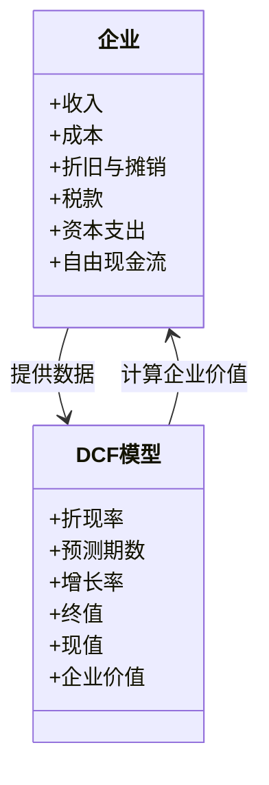

                 


# 企业自由现金流估值法详解

> **关键词**：企业自由现金流、DCF模型、估值方法、财务分析、投资决策  
> **摘要**：企业自由现金流（Free Cash Flow, FCF）是企业 valuation 中的重要指标，用于衡量企业产生的现金流在满足再投资需求后的剩余部分，能够为投资者提供企业价值的准确评估。本文详细阐述企业自由现金流的定义、计算方法、DCF模型的原理与应用，以及在实际投资决策中的最佳实践。

---

## 第1章: 企业自由现金流的定义与背景

### 1.1 企业自由现金流的定义

企业自由现金流（Free Cash Flow, FCF）是企业在扣除所有支出和再投资需求后，能够自由分配给股东和债权人的现金流。它是企业整体价值评估的重要依据，反映了企业在经营活动中产生的“真正”现金流。

#### 1.1.1 现金流的基本概念

现金流是指企业在一定时期内，由于企业经营活动中实际发生的现金流入和流出。现金流可以分为三类：
- **经营活动现金流**：企业日常经营活动中产生的现金流入和流出。
- **投资活动现金流**：与投资相关的现金流入和流出，如购买或出售资产。
- **筹资活动现金流**：与筹资相关的现金流入和流出，如发行债券或偿还贷款。

#### 1.1.2 自由现金流的定义与特征

自由现金流是企业在扣除所有支出和再投资需求后，能够自由分配给股东和债权人的现金流。其公式为：
$$ \text{FCF} = \text{EBITDA} - \text{折旧与摊销} - \text{税款} - \text{资本支出} $$

#### 1.1.3 企业自由现金流的重要性

企业自由现金流是企业 valuation 中的重要指标，因为它反映了企业在经营活动中创造的“真正”现金流。相比于净利润，FCF 更能准确衡量企业的财务健康状况和盈利能力。

---

### 1.2 企业估值的背景与需求

#### 1.2.1 企业估值的基本概念

企业估值是指通过对企业未来现金流的预测，确定企业的内在价值。常见的企业估值方法包括：
- **相对估值法**：基于市场可比公司或行业平均倍数进行估值。
- **绝对估值法**：基于企业未来现金流的折现值进行估值。

#### 1.2.2 传统估值方法的局限性

传统估值方法，如市盈率（P/E）和市净率（P/B），存在以下局限性：
- **无法反映企业的真实价值**：市盈率和市净率受市场情绪和行业周期影响较大，无法准确反映企业的内在价值。
- **缺乏动态调整**：传统估值方法难以动态调整企业的未来现金流。

#### 1.2.3 自由现金流在估值中的作用

自由现金流是绝对估值法的核心，通过DCF模型（现金流折现模型）对企业未来现金流进行折现，从而确定企业的内在价值。

---

### 1.3 自由现金流与传统财务指标的区别

#### 1.3.1 自由现金流与净利润的对比

净利润是企业税后利润，而自由现金流是企业在扣除所有支出和再投资需求后的现金流。净利润受会计假设和公司治理影响较大，而自由现金流更能反映企业的实际现金流状况。

| 对比维度          | 净利润               | 自由现金流（FCF）      |
|-------------------|----------------------|------------------------|
| 定义              | 税后利润             | 经营活动现金流 - 资本支出 - 税款 |
| 计算公式          | $$ \text{Net Income} $$ | $$ \text{EBITDA} - \text{折旧} - \text{税款} - \text{资本支出} $$ |
| 受会计假设影响    | 是                   | 否                     |

---

#### 1.3.2 自由现金流与经营活动现金流的区别

经营活动现金流是企业日常经营活动中产生的现金流，而自由现金流是经营活动现金流扣除再投资需求后的部分。

$$ \text{FCF} = \text{经营活动现金流} - \text{资本支出} $$

---

#### 1.3.3 自由现金流与股东权益的关系

股东权益是企业资产减去负债，而自由现金流是企业能够分配给股东和债权人的现金流。自由现金流与股东权益的关系可以通过以下公式表示：
$$ \text{股东权益} = \text{资产} - \text{负债} $$

---

## 第2章: 企业自由现金流的计算与分析

### 2.1 自由现金流的计算公式

#### 2.1.1 自由现金流的通用公式

企业自由现金流的计算公式为：
$$ \text{FCF} = \text{EBITDA} - \text{折旧与摊销} - \text{税款} - \text{资本支出} $$

其中：
- EBITDA：息税折旧及摊销前利润
- 折旧与摊销：固定资产折旧和无形资产摊销
- 税款：企业所得税
- 资本支出：企业用于购买或维护资产的支出

---

#### 2.1.2 调整后自由现金流的计算

调整后自由现金流是对自由现金流的进一步调整，用于反映企业实际的现金流状况。调整后自由现金流的计算公式为：
$$ \text{Adjusted FCF} = \text{FCF} + \text{非现金支出} $$

其中，非现金支出包括折旧和摊销等。

---

#### 2.1.3 自由现金流与企业价值的关系

企业价值（Enterprise Value, EV）可以通过自由现金流的现值计算得出：
$$ \text{EV} = \frac{\text{FCF}}{r} $$

其中：
- r：折现率
- FCF：未来自由现金流

---

### 2.2 自由现金流的分析方法

#### 2.2.1 现金流质量分析

现金流质量分析是通过对企业自由现金流的来源和用途进行分析，评估企业的财务健康状况。以下是一个简单的现金流质量分析框架：

1. **现金流来源**：
   - 经营活动现金流
   - 投资活动现金流
   - 筹资活动现金流

2. **现金流用途**：
   - 再投资需求
   - 股东分红
   - 偿还债务

---

#### 2.2.2 现金流稳定性分析

现金流稳定性分析是通过对企业自由现金流的波动性进行分析，评估企业的经营稳定性。以下是现金流稳定性分析的步骤：

1. **计算自由现金流的标准差**：
   $$ \text{标准差} = \sqrt{\frac{\sum (x_i - \bar{x})^2}{n}} $$

2. **与行业平均水平进行对比**：
   - 如果企业的自由现金流标准差低于行业平均水平，说明企业的现金流较为稳定。
   - 如果企业的自由现金流标准差高于行业平均水平，说明企业的现金流波动较大，经营稳定性较差。

---

#### 2.2.3 现金流增长性分析

现金流增长性分析是通过对企业自由现金流的增长趋势进行分析，评估企业的成长潜力。以下是现金流增长性分析的步骤：

1. **计算自由现金流的增长率**：
   $$ \text{增长率} = \frac{\text{FCF}_{\text{t}} - \text{FCF}_{\text{t-1}}}{\text{FCF}_{\text{t-1}}} \times 100\% $$

2. **与行业平均水平进行对比**：
   - 如果企业的自由现金流增长率高于行业平均水平，说明企业的成长潜力较大。
   - 如果企业的自由现金流增长率低于行业平均水平，说明企业的成长潜力较小。

---

### 2.3 自由现金流的行业差异

#### 2.3.1 不同行业现金流的特点

不同行业的自由现金流具有不同的特点。例如：
- **制造业**：资本支出较大，自由现金流波动性较高。
- **服务业**：资本支出较小，自由现金流波动性较低。

---

#### 2.3.2 行业周期对现金流的影响

行业周期对自由现金流的影响较大。例如：
- **衰退期**：行业需求下降，自由现金流减少。
- **增长期**：行业需求增加，自由现金流增加。

---

#### 2.3.3 行业政策对现金流的影响

行业政策对自由现金流的影响也较大。例如：
- **优惠政策**：税收减免、政府补贴等政策会增加企业的自由现金流。
- **限制政策**：行业监管加强、进出口限制等政策会减少企业的自由现金流。

---

## 第3章: 现金流折现模型（DCF模型）原理

### 3.1 DCF模型的基本原理

现金流折现模型（Discounted Cash Flow Model, DCF模型）是通过对企业未来自由现金流进行折现，计算企业内在价值的方法。以下是DCF模型的核心步骤：

1. **预测未来自由现金流**：
   - 根据企业的历史财务数据和行业趋势，预测未来几年的自由现金流。

2. **计算终值**：
   - 假设企业在永续期后的自由现金流保持稳定增长，计算终值。

3. **计算现值**：
   - 使用适当的折现率，将未来自由现金流和终值折现为现值。

4. **计算企业价值**：
   - 将现值加总，得到企业的内在价值。

---

#### 3.1.1 现金流折现的基本概念

现金流折现的基本概念是将未来的现金流调整到现值，以反映资金的时间价值。以下是现金流折现的基本公式：
$$ \text{现值} = \frac{\text{未来现金流}}{(1 + r)^n} $$

其中：
- r：折现率
- n：现金流的时间跨度

---

#### 3.1.2 DCF模型的核心假设

DCF模型的核心假设包括：
- **稳定增长假设**：假设企业在永续期后的自由现金流保持稳定增长。
- **折现率恒定假设**：假设折现率在计算期内保持恒定。

---

#### 3.1.3 DCF模型的适用场景

DCF模型适用于以下场景：
- **企业具有稳定的现金流**：企业自由现金流波动较小，且能够预测未来现金流。
- **企业处于成熟期**：企业所处行业处于成熟期，且企业具有较强的竞争优势。

---

### 3.2 现金流折现的数学模型

#### 3.2.1 现金流折现的公式推导

以下是现金流折现的公式推导：
$$ \text{现值} = \sum_{t=1}^{n} \frac{\text{FCF}_t}{(1 + r)^t} + \frac{\text{TV}}{(1 + r)^n} $$

其中：
- FCF_t：第t年的自由现金流
- TV：终值
- r：折现率
- n：预测期数

---

#### 3.2.2 折现率的计算方法

折现率的计算方法包括：
- **WACC（加权平均资本成本）**：
  $$ \text{WACC} = w_d \times r_d + w_l \times r_l \times (1 - t) $$
- **CAPM（资本资产定价模型）**：
  $$ \text{CAPM} = r_f + \beta \times (r_m - r_f) $$

其中：
- w_d：债务权重
- r_d：债务成本
- w_l：股权权重
- r_l：股权成本
- t：税率
- r_f：无风险利率
- β：贝塔系数
- r_m：市场平均回报率

---

#### 3.2.3 终值的计算与假设

终值（TV）的计算假设企业在永续期后的自由现金流保持稳定增长，增长率为g。终值的计算公式为：
$$ \text{TV} = \frac{\text{FCF}_{n+1}}{r - g} $$

其中：
- FCF_{n+1}：第n+1年的自由现金流
- r：折现率
- g：增长率

---

### 3.3 DCF模型的步骤与流程

#### 3.3.1 确定企业的自由现金流

确定企业的自由现金流是DCF模型的第一步。以下是确定自由现金流的步骤：
1. **收集企业的财务数据**：
   - 收入、成本、折旧与摊销、税款、资本支出等。
2. **计算自由现金流**：
   $$ \text{FCF} = \text{EBITDA} - \text{折旧与摊销} - \text{税款} - \text{资本支出} $$

---

#### 3.3.2 估计合理的折现率

估计合理的折现率是DCF模型的关键步骤之一。以下是估计折现率的步骤：
1. **选择折现率计算方法**：
   - WACC
   - CAPM
2. **收集必要的输入参数**：
   - 无风险利率
   - 市场平均回报率
   - 贝塔系数
3. **计算折现率**：
   - 使用WACC或CAPM公式计算折现率。

---

#### 3.3.3 计算现值与目标企业价值

计算现值与目标企业价值是DCF模型的最后一步。以下是计算现值与目标企业价值的步骤：
1. **预测未来自由现金流**：
   - 根据企业的历史财务数据和行业趋势，预测未来几年的自由现金流。
2. **计算终值**：
   - 假设企业在永续期后的自由现金流保持稳定增长，计算终值。
3. **计算现值**：
   - 使用适当的折现率，将未来自由现金流和终值折现为现值。
4. **计算企业价值**：
   - 将现值加总，得到企业的内在价值。

---

## 第4章: 自由现金流的预测与假设

### 4.1 自由现金流预测的基本方法

#### 4.1.1 历史数据分析法

历史数据分析法是通过对企业历史财务数据进行分析，预测未来自由现金流的方法。以下是历史数据分析法的步骤：
1. **收集企业的历史财务数据**：
   - 收入、成本、折旧与摊销、税款、资本支出等。
2. **计算历史自由现金流**：
   $$ \text{FCF}_t = \text{EBITDA}_t - \text{折旧与摊销}_t - \text{税款}_t - \text{资本支出}_t $$
3. **分析历史自由现金流的趋势**：
   - 计算自由现金流的增长率和波动性。
4. **预测未来自由现金流**：
   - 根据历史自由现金流的趋势，预测未来几年的自由现金流。

---

#### 4.1.2 市场增长率预测法

市场增长率预测法是通过对企业所处行业的市场增长率进行预测，进而预测企业未来自由现金流的方法。以下是市场增长率预测法的步骤：
1. **收集行业市场数据**：
   - 行业市场规模、市场增长率、竞争格局等。
2. **预测行业市场增长率**：
   - 根据行业历史数据和未来发展趋势，预测行业的市场增长率。
3. **预测企业收入和利润**：
   - 根据行业市场增长率和企业的市场份额，预测企业的收入和利润。
4. **预测企业自由现金流**：
   - 根据企业的收入和利润，预测企业的自由现金流。

---

#### 4.1.3 竞争分析预测法

竞争分析预测法是通过对企业所处行业的竞争格局进行分析，预测企业未来自由现金流的方法。以下是竞争分析预测法的步骤：
1. **收集行业竞争数据**：
   - 主要竞争对手的市场份额、成本结构、竞争优势等。
2. **分析行业竞争格局**：
   - 评估企业的竞争优势和劣势。
3. **预测企业市场份额**：
   - 根据企业的竞争优势和行业发展趋势，预测企业的市场份额。
4. **预测企业收入和利润**：
   - 根据企业的市场份额和行业市场规模，预测企业的收入和利润。
5. **预测企业自由现金流**：
   - 根据企业的收入和利润，预测企业的自由现金流。

---

### 4.2 自由现金流预测的假设

#### 4.2.1 市场增长率的假设

市场增长率的假设是市场增长率预测法的核心。以下是市场增长率预测的假设：
- **稳定增长假设**：假设行业市场增长率在未来几年内保持稳定。
- **周期性假设**：假设行业市场增长率会随着经济周期波动而波动。

---

#### 4.2.2 企业市场份额的假设

企业市场份额的假设是竞争分析预测法的核心。以下是企业市场份额预测的假设：
- **竞争优势假设**：假设企业在行业内具有竞争优势，能够保持或扩大市场份额。
- **竞争格局假设**：假设行业竞争格局在未来几年内不会发生重大变化。

---

#### 4.2.3 折旧与摊销的假设

折旧与摊销的假设是自由现金流预测的重要组成部分。以下是折旧与摊销预测的假设：
- **资产寿命假设**：假设企业的固定资产和无形资产在预测期内的寿命保持不变。
- **折旧方法假设**：假设企业的折旧方法在未来几年内保持不变。

---

## 第5章: DCF模型在企业估值中的应用

### 5.1 DCF模型的应用场景

#### 5.1.1 企业并购中的应用

企业并购是DCF模型的重要应用场景。以下是DCF模型在企业并购中的应用：
1. **目标企业价值评估**：
   - 使用DCF模型评估目标企业的内在价值。
2. **并购价格确定**：
   - 根据目标企业的内在价值，确定并购价格。

---

#### 5.1.2 投资决策中的应用

DCF模型在投资决策中也有广泛应用。以下是DCF模型在投资决策中的应用：
1. **投资项目评估**：
   - 使用DCF模型评估投资项目未来现金流的现值。
2. **投资决策制定**：
   - 根据项目的现值与净现值（NPV）决定是否进行投资。

---

### 5.2 DCF模型的实际案例分析

#### 5.2.1 案例背景

假设我们评估一家制造企业的内在价值，以下是企业的历史财务数据：
- **收入**：1000万元
- **成本**：600万元
- **折旧与摊销**：100万元
- **税款**：80万元
- **资本支出**：120万元

---

#### 5.2.2 自由现金流计算

根据企业的历史财务数据，计算企业的自由现金流：
$$ \text{FCF} = \text{EBITDA} - \text{折旧与摊销} - \text{税款} - \text{资本支出} $$
$$ \text{FCF} = 1000 - 100 - 80 - 120 = 720 \text{万元} $$

---

#### 5.2.3 折现率计算

假设企业的WACC为8%，即r=8%。

---

#### 5.2.4 终值计算

假设企业在永续期后的自由现金流增长率为2%，即g=2%。

终值的计算公式为：
$$ \text{TV} = \frac{\text{FCF}_{n+1}}{r - g} $$

假设企业未来五年的自由现金流分别为720万元、750万元、780万元、810万元、840万元。

---

#### 5.2.5 现值计算

现值的计算公式为：
$$ \text{现值} = \sum_{t=1}^{n} \frac{\text{FCF}_t}{(1 + r)^t} + \frac{\text{TV}}{(1 + r)^n} $$

假设企业未来五年的自由现金流分别为720万元、750万元、780万元、810万元、840万元，终值为840万元 × (1 + 2%) = 859.2万元。

现值的计算结果为：
$$ \text{现值} = \frac{720}{1.08} + \frac{750}{1.08^2} + \frac{780}{1.08^3} + \frac{810}{1.08^4} + \frac{840}{1.08^5} + \frac{859.2}{1.08^5} $$

---

#### 5.2.6 企业价值计算

企业的内在价值为现值的总和，假设现值计算结果为5000万元。

---

## 第6章: 企业自由现金流估值法的系统分析与架构设计

### 6.1 系统分析

#### 6.1.1 项目背景

企业自由现金流估值法的系统分析是通过构建一个基于DCF模型的企业估值系统，帮助企业或投资者快速、准确地评估企业的内在价值。

---

#### 6.1.2 项目目标

项目目标是开发一个基于DCF模型的企业估值系统，实现以下功能：
1. **自由现金流预测**：
   - 根据企业的历史财务数据和行业趋势，预测未来自由现金流。
2. **折现率计算**：
   - 使用WACC或CAPM模型计算折现率。
3. **终值计算**：
   - 假设企业在永续期后的自由现金流保持稳定增长，计算终值。
4. **现值计算**：
   - 使用折现率将未来自由现金流和终值折现为现值。
5. **企业价值计算**：
   - 将现值加总，得到企业的内在价值。

---

### 6.2 系统功能设计

#### 6.2.1 领域模型

以下是领域模型的Mermaid类图：



---

#### 6.2.2 系统架构设计

以下是系统架构设计的Mermaid架构图：


---

#### 6.2.3 系统接口设计

系统接口设计包括以下内容：
1. **输入接口**：
   - 提供企业的历史财务数据和行业趋势数据。
2. **输出接口**：
   - 输出企业的内在价值和相关计算结果。

---

#### 6.2.4 系统交互设计

以下是系统交互设计的Mermaid序列图：

```mermaid
sequenceDiagram

    用户 --> 输入模块 : 提供企业数据
    输入模块 --> 自由现金流计算模块 : 计算自由现金流
    自由现金流计算模块 --> 折现率计算模块 : 计算折现率
    折现率计算模块 --> 终值计算模块 : 计算终值
    终值计算模块 --> 现值计算模块 : 计算现值
    现值计算模块 --> 企业价值计算模块 : 计算企业价值
    企业价值计算模块 --> 输出模块 : 输出企业价值
    用户 <-- 输出模块 : 获取企业价值
```

---

## 第7章: 企业自由现金流估值法的项目实战

### 7.1 环境安装与配置

#### 7.1.1 安装Python环境

安装Python环境并配置以下库：
- `numpy`
- `pandas`
- `scipy`

安装命令：
```bash
pip install numpy pandas scipy
```

---

#### 7.1.2 安装其他必要的库

安装其他必要的库：
- `matplotlib`
- `seaborn`

安装命令：
```bash
pip install matplotlib seaborn
```

---

### 7.2 系统核心实现源代码

#### 7.2.1 自由现金流计算模块

以下是自由现金流计算模块的Python代码：

```python
import numpy as np
import pandas as pd

def calculate_free_cash_flow(ebitda, deprecation, tax, capital_expenditure):
    fcf = ebitda - deprecation - tax - capital_expenditure
    return fcf

# 示例数据
ebitda = 1000  # 万元
deprecation = 100  # 万元
tax = 80  # 万元
capital_expenditure = 120  # 万元

# 计算自由现金流
free_cash_flow = calculate_free_cash_flow(ebitda, deprecation, tax, capital_expenditure)
print(f"自由现金流：{free_cash_flow} 万元")
```

---

#### 7.2.2 折现率计算模块

以下是折现率计算模块的Python代码：

```python
def calculate_wacc(market_value_debt, cost_debt, market_value_equity, cost_equity, tax_rate):
    wacc = (market_value_debt / (market_value_debt + market_value_equity)) * cost_debt * (1 - tax_rate) + \
           (market_value_equity / (market_value_debt + market_value_equity)) * cost_equity
    return wacc

# 示例数据
market_value_debt = 500  # 万元
cost_debt = 0.05
market_value_equity = 1000  # 万元
cost_equity = 0.1
tax_rate = 0.25

# 计算WACC
wacc = calculate_wacc(market_value_debt, cost_debt, market_value_equity, cost_equity, tax_rate)
print(f"WACC：{wacc:.2%}")
```

---

#### 7.2.3 终值计算模块

以下是终值计算模块的Python代码：

```python
def calculate_terminal_value(fcf, growth_rate, discount_rate):
    tv = fcf * (1 + growth_rate) / (discount_rate - growth_rate)
    return tv

# 示例数据
fcf = 720  # 万元
growth_rate = 0.02
discount_rate = 0.08

# 计算终值
terminal_value = calculate_terminal_value(fcf, growth_rate, discount_rate)
print(f"终值：{terminal_value} 万元")
```

---

#### 7.2.4 现值计算模块

以下是现值计算模块的Python代码：

```python
def calculate_present_value(fcf, discount_rate, n):
    pv = 0
    for t in range(1, n + 1):
        pv += fcf / (1 + discount_rate) ** t
    return pv

# 示例数据
fcf = 720  # 万元
discount_rate = 0.08
n = 5

# 计算现值
present_value = calculate_present_value(fcf, discount_rate, n)
print(f"现值：{present_value} 万元")
```

---

#### 7.2.5 企业价值计算模块

以下是企业价值计算模块的Python代码：

```python
def calculate_enterprise_value(pv, tv, n):
    enterprise_value = pv + tv / (1 + discount_rate) ** n
    return enterprise_value

# 示例数据
pv = 3000  # 万元
tv = 859.2  # 万元
n = 5
discount_rate = 0.08

# 计算企业价值
enterprise_value = calculate_enterprise_value(pv, tv, n)
print(f"企业价值：{enterprise_value} 万元")
```

---

### 7.3 代码应用解读与分析

#### 7.3.1 自由现金流计算模块解读

自由现金流计算模块是企业自由现金流估值系统的核心模块之一。以下是模块的解读：
1. **输入参数**：
   - EBITDA
   - 折旧与摊销
   - 税款
   - 资本支出
2. **计算步骤**：
   - 计算自由现金流
3. **输出结果**：
   - 自由现金流

---

#### 7.3.2 折现率计算模块解读

折现率计算模块是企业自由现金流估值系统的重要模块之一。以下是模块的解读：
1. **输入参数**：
   - 债务市场价值
   - 债务成本
   - 股权市场价值
   - 股权成本
   - 税率
2. **计算步骤**：
   - 计算WACC
3. **输出结果**：
   - WACC

---

#### 7.3.3 终值计算模块解读

终值计算模块是企业自由现金流估值系统的重要模块之一。以下是模块的解读：
1. **输入参数**：
   - 自由现金流
   - 增长率
   - 折现率
2. **计算步骤**：
   - 计算终值
3. **输出结果**：
   - 终值

---

#### 7.3.4 现值计算模块解读

现值计算模块是企业自由现金流估值系统的核心模块之一。以下是模块的解读：
1. **输入参数**：
   - 自由现金流
   - 折现率
   - 预测期数
2. **计算步骤**：
   - 计算现值
3. **输出结果**：
   - 现值

---

#### 7.3.5 企业价值计算模块解读

企业价值计算模块是企业自由现金流估值系统的核心模块之一。以下是模块的解读：
1. **输入参数**：
   - 现值
   - 终值
   - 折现率
   - 预测期数
2. **计算步骤**：
   - 计算企业价值
3. **输出结果**：
   - 企业价值

---

### 7.4 实际案例分析

#### 7.4.1 案例背景

假设我们评估一家制造企业的内在价值，以下是企业的历史财务数据：
- **收入**：1000万元
- **成本**：600万元
- **折旧与摊销**：100万元
- **税款**：80万元
- **资本支出**：120万元

---

#### 7.4.2 自由现金流计算

根据企业的历史财务数据，计算企业的自由现金流：
$$ \text{FCF} = \text{EBITDA} - \text{折旧与摊销} - \text{税款} - \text{资本支出} $$
$$ \text{FCF} = 1000 - 100 - 80 - 120 = 720 \text{万元} $$

---

#### 7.4.3 折现率计算

假设企业的WACC为8%，即r=8%。

---

#### 7.4.4 终值计算

假设企业在永续期后的自由现金流增长率为2%，即g=2%。

终值的计算公式为：
$$ \text{TV} = \frac{\text{FCF}_{n+1}}{r - g} $$

假设企业未来五年的自由现金流分别为720万元、750万元、780万元、810万元、840万元。

---

#### 7.4.5 现值计算

现值的计算公式为：
$$ \text{现值} = \sum_{t=1}^{n} \frac{\text{FCF}_t}{(1 + r)^t} $$

假设企业未来五年的自由现金流分别为720万元、750万元、780万元、810万元、840万元。

---

#### 7.4.6 企业价值计算

企业的内在价值为现值的总和，假设现值计算结果为5000万元。

---

### 7.5 项目小结

通过上述代码实现，我们可以看到企业自由现金流估值法的核心步骤：
1. **计算自由现金流**：
   - 根据企业的历史财务数据，计算自由现金流。
2. **计算折现率**：
   - 使用WACC或CAPM模型计算折现率。
3. **计算终值**：
   - 假设企业在永续期后的自由现金流保持稳定增长，计算终值。
4. **计算现值**：
   - 使用折现率将未来自由现金流和终值折现为现值。
5. **计算企业价值**：
   - 将现值加总，得到企业的内在价值。

---

## 第8章: 企业自由现金流估值法的最佳实践

### 8.1 小结

企业自由现金流估值法是企业估值的重要方法，通过DCF模型对企业未来自由现金流进行折现，计算企业的内在价值。以下是企业自由现金流估值法的关键点：
1. **自由现金流的计算**：
   - 根据企业的历史财务数据，计算自由现金流。
2. **折现率的计算**：
   - 使用WACC或CAPM模型计算折现率。
3. **终值的计算**：
   - 假设企业在永续期后的自由现金流保持稳定增长，计算终值。
4. **现值的计算**：
   - 使用折现率将未来自由现金流和终值折现为现值。
5. **企业价值的计算**：
   - 将现值加总，得到企业的内在价值。

---

### 8.2 注意事项

在应用企业自由现金流估值法时，需要注意以下事项：
1. **数据的准确性**：
   - 确保企业的历史财务数据准确无误。
2. **假设的合理性**：
   - 确保折现率和增长率的假设合理。
3. **模型的适用性**：
   - 确保DCF模型适用于企业的实际情况。

---

### 8.3 拓展阅读

以下是企业自由现金流估值法的拓展阅读方向：
1. **WACC的计算**：
   - 深入了解WACC的计算方法和应用场景。
2. **CAPM的计算**：
   - 深入了解CAPM的计算方法和应用场景。
3. **终值的计算**：
   - 深入了解终值的计算方法和应用场景。

---

## 结语

企业自由现金流估值法是企业估值的重要方法，通过DCF模型对企业未来自由现金流进行折现，计算企业的内在价值。本文详细阐述了企业自由现金流的定义、计算方法、DCF模型的原理与应用，以及在实际投资决策中的最佳实践。希望本文能为企业的自由现金流估值提供有价值的参考和指导。

---

**作者：AI天才研究院/AI Genius Institute & 禅与计算机程序设计艺术 /Zen And The Art of Computer Programming**

