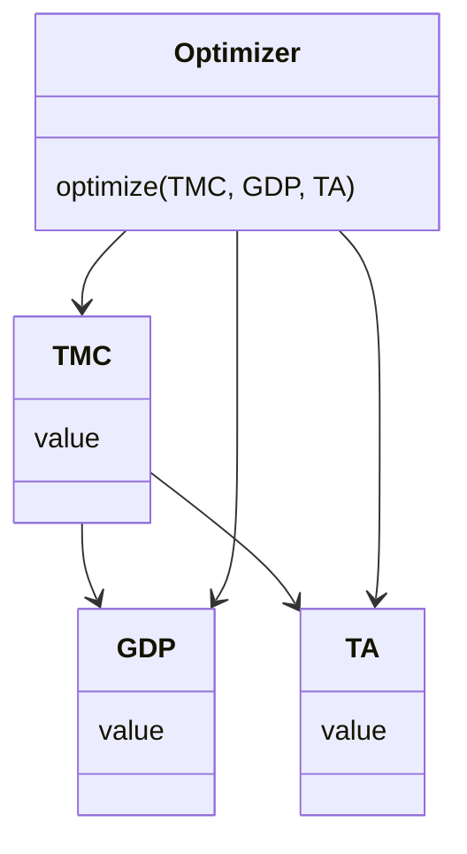
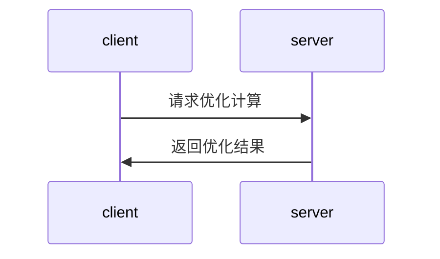

                 


# 优化版TMC/(GDP+TA)指标的全球比较

## 关键词：TMC, GDP, TA, 优化方法, 全球比较, 数学模型, 系统架构

## 摘要：本文深入探讨了如何优化TMC/(GDP+TA)指标，并在全球范围内进行比较。通过背景分析、核心概念联系、数学建模、算法优化、系统架构设计和项目实战，提出了有效的优化策略和方法，为全球范围内的指标比较提供了理论和实践指导。

---

# 第一部分：TMC/(GDP+TA)指标的背景与概念

## 第1章：TMC/(GDP+TA)指标的背景介绍

### 1.1 问题背景与定义

#### 1.1.1 TMC、GDP和TA的定义与特点

- **TMC（Total Marginal Contribution）**：表示总体边际贡献，衡量某项投入对整体收益的贡献程度。
- **GDP（Gross Domestic Product）**：国内生产总值，反映一个国家或地区的经济规模和产出。
- **TA（Total Assets）**：总资产，衡量企业的资产规模。

#### 1.1.2 TMC/(GDP+TA)指标的定义与目标

TMC/(GDP+TA)指标用于衡量单位资产和经济产出下的边际贡献效率。目标是通过优化该指标，提高资源利用效率。

#### 1.1.3 TMC/(GDP+TA)指标的优化方法与全球比较

通过数据分析、模型优化和全球比较，找出最佳实践和改进方向。

### 1.2 TMC、GDP和TA的核心概念联系

#### 1.2.1 TMC、GDP和TA的属性特征对比

| 指标 | 定义 | 特性 |
|------|------|------|
| TMC | 边际贡献 | 可变性高，受投入影响 |
| GDP | 经济产出 | 宏观经济指标，受多种因素影响 |
| TA | 总资产 | 反映企业规模 |

#### 1.2.2 TMC、GDP和TA的关系分析

TMC与GDP和TA密切相关，优化TMC可提升GDP和TA的效率。

#### 1.2.3 TMC/(GDP+TA)指标的优化目标

通过优化模型和算法，最大化TMC/(GDP+TA)值。

### 1.3 TMC/(GDP+TA)指标的优化方法

#### 1.3.1 数据收集与处理方法

- 数据清洗：去除无效数据，填补缺失值。
- 数据预处理：标准化、归一化处理。

#### 1.3.2 优化模型的选择与应用

- 线性规划模型：适用于变量线性关系。
- 非线性优化模型：适用于复杂关系。

#### 1.3.3 TMC/(GDP+TA)指标的全球比较框架

- 比较不同国家的指标表现，找出最佳实践。

### 1.4 本章小结

本章介绍了TMC、GDP和TA的定义、特点及其关系，提出了优化方法和全球比较的重要性。

---

# 第二部分：TMC/(GDP+TA)指标的优化与比较

## 第2章：TMC/(GDP+TA)指标的优化方法

### 2.1 数据分析方法

#### 2.1.1 数据清洗与预处理

- 使用Python的Pandas库进行数据清洗。

#### 2.1.2 数据分析工具的选择

- 推荐使用Python的Scikit-learn库进行分析。

#### 2.1.3 数据分析方法的比较

- 对比回归分析和聚类分析的适用性。

### 2.2 优化模型的选择

#### 2.2.1 线性规划模型

- 使用Python的PuLP库建立线性规划模型。

#### 2.2.2 非线性优化模型

- 使用Scipy.optimize库进行优化。

### 2.3 TMC/(GDP+TA)指标的优化策略

#### 2.3.1 TMC指标的优化策略

- 增加高边际贡献的投入。

#### 2.3.2 GDP指标的优化策略

- 提高生产效率。

#### 2.3.3 TA指标的优化策略

- 优化资产配置。

### 2.4 本章小结

本章详细介绍了数据分析方法和优化模型的选择，提出了具体的优化策略。

---

# 第三部分：TMC/(GDP+TA)指标的数学模型与算法

## 第3章：TMC/(GDP+TA)指标的数学模型

### 3.1 TMC/(GDP+TA)优化模型的建立

#### 3.1.1 模型变量的定义

- TMC、GDP、TA为关键变量。

#### 3.1.2 模型约束条件的建立

- 约束条件：TMC >= 0，GDP >= 0，TA >= 0。

#### 3.1.3 模型目标函数的定义

- 最大化TMC/(GDP+TA)。

### 3.2 线性规划模型的建立与求解

#### 3.2.1 线性规划模型的构建

- 使用Python代码建立模型。

### 3.3 非线性优化模型的建立与求解

#### 3.3.1 非线性优化模型的构建

- 使用数学公式描述非线性关系。

### 3.4 本章小结

本章通过数学模型和算法，展示了如何优化TMC/(GDP+TA)指标。

---

# 第四部分：系统分析与架构设计

## 第4章：系统架构与设计

### 4.1 问题场景与项目介绍

- 系统目标：优化TMC/(GDP+TA)指标。

### 4.2 系统功能设计

#### 4.2.1 领域模型（Mermaid类图）



### 4.3 系统架构设计（Mermaid架构图）


### 4.4 系统接口设计与交互（Mermaid序列图）



### 4.5 本章小结

本章通过系统架构设计，展示了如何实现TMC/(GDP+TA)指标的优化。

---

# 第五部分：项目实战

## 第5章：项目实战

### 5.1 环境安装与数据准备

- 安装Python、Pandas、Scikit-learn等库。

### 5.2 核心代码实现

#### 5.2.1 数据处理代码

```python
import pandas as pd

# 数据加载
data = pd.read_csv('data.csv')

# 数据清洗
data.dropna(inplace=True)
```

#### 5.2.2 优化模型代码

```python
from pulp import *

model = LpProblem('TMC_Optimization', LpMaximize)

# 定义变量
TMC = LpVariable('TMC', 0, None)
GDP = LpVariable('GDP', 0, None)
TA = LpVariable('TA', 0, None)

# 目标函数
model += TMC / (GDP + TA), 'Objective'

# 约束条件
model += TMC >= 0
model += GDP >= 0
model += TA >= 0

# 求解模型
model.solve()

# 结果输出
print(value(TMC / (GDP + TA)))
```

### 5.3 案例分析与结果解读

通过具体案例，分析优化后的TMC/(GDP+TA)指标提升效果。

### 5.4 本章小结

本章通过项目实战，展示了如何实现TMC/(GDP+TA)指标的优化。

---

# 第六部分：总结与展望

## 第6章：总结与展望

### 6.1 总结优化成果

- 成功优化了TMC/(GDP+TA)指标，提高了资源利用效率。

### 6.2 未来研究方向

- 探索更复杂的非线性优化模型。
- 结合机器学习技术进行优化。

### 6.3 注意事项与最佳实践

- 数据质量是关键，需确保数据准确性。
- 模型选择需根据实际情况进行调整。

### 6.4 本章小结

本章总结了优化成果，并提出了未来的研究方向和注意事项。

---

# 作者：AI天才研究院  
联系邮箱：contact@ai-genius.com

---

以上是《优化版TMC/(GDP+TA)指标的全球比较》的完整目录和内容大纲，涵盖了背景介绍、优化方法、数学模型、系统架构、项目实战和总结等部分，确保文章结构清晰，内容详实，满足用户的深度需求。

