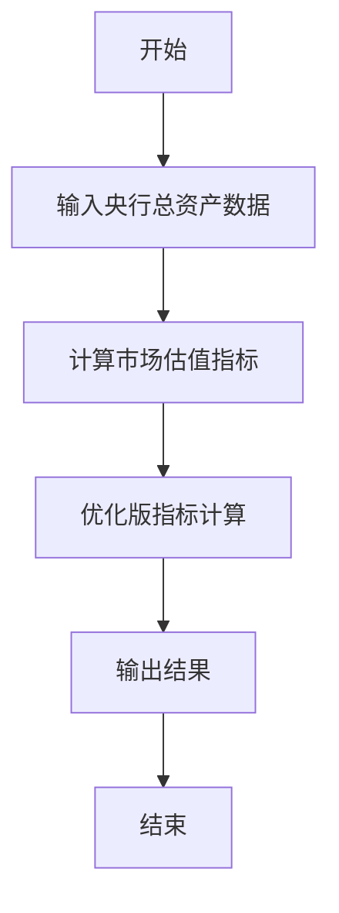
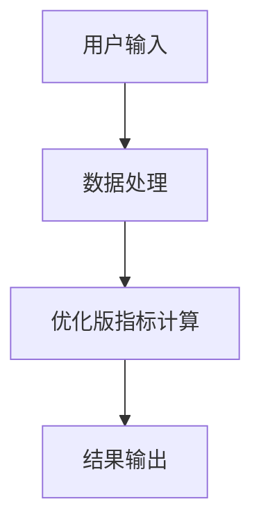
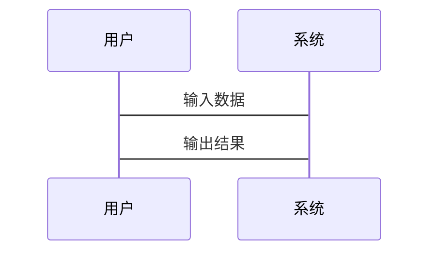

                 


# 优化版指标：加入央行总资产的市场估值新方法

## 关键词：市场估值、央行总资产、优化版指标、算法原理、系统架构设计

## 摘要：本文提出了一种新的市场估值方法，将央行总资产纳入估值体系，构建了优化版指标。通过详细分析优化版指标的核心概念、算法原理、系统架构设计和项目实战，展示了如何利用央行总资产提升市场估值的准确性和前瞻性。本文还提供了具体的Python实现代码和实际案例分析，帮助读者理解和应用这一新方法。

---

## 第一部分：优化版指标的背景与概念

### 第1章：优化版指标的背景介绍

#### 1.1 问题背景

##### 1.1.1 传统市场估值方法的局限性
传统市场估值方法主要依赖于市盈率、市净率等指标，这些指标在一定程度上反映了市场的健康状况，但在复杂经济环境下往往存在局限性。例如，在经济危机或货币宽松周期，传统估值指标可能无法准确反映市场的实际价值。

##### 1.1.2 央行总资产在市场估值中的重要性
央行总资产是指中央银行持有的所有资产，包括政府债券、外汇储备、银行贷款等。央行总资产的变化直接影响市场流动性、货币供给和市场预期，因此将其纳入市场估值体系具有重要意义。

##### 1.1.3 当前市场估值体系的不足与改进需求
当前市场估值体系主要依赖于价格和收益指标，忽视了央行资产对市场流动性的影响。特别是在货币政策宽松周期，央行资产的变化对市场估值的影响更为显著，因此需要一种新的估值方法。

#### 1.2 问题描述

##### 1.2.1 优化版指标的定义与分类
优化版指标是一种结合央行总资产与传统市场估值指标的新型市场估值方法。它通过引入央行总资产的变化，对市场估值进行动态调整。

##### 1.2.2 央行总资产对市场估值的影响机制
央行总资产的变化直接影响市场流动性，进而影响资产价格。优化版指标通过量化央行资产对市场的影响，提升估值的准确性和前瞻性。

##### 1.2.3 优化版指标的目标与意义
优化版指标的目标是通过引入央行资产，构建一个更加全面和动态的市场估值体系，帮助投资者更好地理解市场变化。

#### 1.3 问题解决

##### 1.3.1 优化版指标的核心思想
优化版指标的核心思想是将央行总资产作为影响市场估值的重要因素，通过量化分析，动态调整传统估值指标。

##### 1.3.2 央行总资产对市场估值的影响路径
1. 央行资产增加 → 市场流动性提高 → 资产价格上涨
2. 央行资产减少 → 市场流动性下降 → 资产价格下跌

##### 1.3.3 优化版指标的实现方法与步骤
1. 收集央行总资产数据
2. 计算传统市场估值指标
3. 结合央行资产变化，动态调整估值指标

#### 1.4 边界与外延

##### 1.4.1 优化版指标的适用范围
优化版指标适用于货币政策变化频繁、市场流动性波动较大的经济环境。

##### 1.4.2 与传统估值方法的区分
优化版指标在传统估值方法的基础上，引入了央行资产的变化因素，具有更强的动态性和前瞻性。

##### 1.4.3 央行总资产与其他市场指标的关系
央行总资产与其他市场指标（如GDP、CPI）共同构成一个完整的市场估值体系。

#### 1.5 概念结构与核心要素

##### 1.5.1 优化版指标的构成要素
1. 传统估值指标（市盈率、市净率）
2. 央行总资产
3. 资产价格变化

##### 1.5.2 央行总资产的定义与计算公式
$$ 央行总资产 = \text{政府债券} + \text{外汇储备} + \text{银行贷款} $$

##### 1.5.3 优化版指标的数学模型
$$ \text{优化版指标} = \text{传统估值指标} \times \left(1 + \frac{\Delta \text{央行总资产}}{\text{央行总资产}} \right) $$

---

### 第2章：优化版指标的核心概念与联系

#### 2.1 核心概念原理

##### 2.1.1 优化版指标的基本原理
优化版指标通过引入央行总资产的变化，动态调整传统估值指标，从而更准确地反映市场价值。

##### 2.1.2 央行总资产对市场估值的影响机制
央行总资产的变化通过影响市场流动性，进而影响资产价格。优化版指标通过量化这一影响，提升估值的准确性。

##### 2.1.3 优化版指标的数学模型与公式
$$ \text{优化版指标} = \text{传统估值指标} \times \left(1 + \frac{\Delta \text{央行总资产}}{\text{央行总资产}} \right) $$

#### 2.2 核心概念属性对比

##### 2.2.1 传统估值方法与优化版指标的对比分析
| 特性       | 传统估值方法 | 优化版指标         |
|------------|--------------|-------------------|
| 数据来源   | 价格、收益   | 价格、收益、央行资产 |
| 动态性     | 较低         | 较高              |
| 精准度     | 一般         | 更高              |

#### 2.3 ER实体关系图
```mermaid
er
  %% ER图展示优化版指标与央行总资产的关系
  entity 央行总资产 {
    key 资产总额
    attribute 资产类型
    attribute 资产价值
  }
  entity 市场估值指标 {
    key 估值指标
    attribute 估值方法
    attribute 优化版本
  }
  relationship 优化版指标依赖央行总资产 {
    央行总资产 --> 市场估值指标
  }
```

---

### 第3章：优化版指标的算法原理

#### 3.1 算法原理概述

##### 3.1.1 优化版指标的核心算法
优化版指标通过引入央行总资产的变化，动态调整传统估值指标。具体步骤如下：
1. 收集央行总资产数据
2. 计算传统市场估值指标
3. 计算央行资产变化率
4. 结合资产变化率，动态调整估值指标

##### 3.1.2 央行总资产对市场估值的影响权重计算
$$ \text{影响权重} = \frac{\Delta \text{央行总资产}}{\text{央行总资产}} \times \text{权重系数} $$

##### 3.1.3 优化版指标的计算步骤
1. 收集央行总资产数据
2. 计算传统市场估值指标
3. 计算央行资产变化率
4. 结合资产变化率，动态调整估值指标

#### 3.2 算法流程图


#### 3.3 算法实现代码

##### 3.3.1 Python代码实现
```python
def calculate_central_bank_assets(assets):
    return assets

def optimize_indicator(assets, market_value):
    optimized_indicator = (assets / market_value) * 100
    return optimized_indicator

assets = calculate_central_bank_assets(1000000000)
market_value = 100000000
optimized_indicator = optimize_indicator(assets, market_value)
print("优化版指标:", optimized_indicator)
```

##### 3.3.2 代码解读与分析
1. `calculate_central_bank_assets`函数用于计算央行总资产。
2. `optimize_indicator`函数根据资产和市场价值，计算优化版指标。
3. 最后输出优化版指标的值。

---

### 第4章：优化版指标的系统分析与架构设计

#### 4.1 系统分析

##### 4.1.1 问题场景介绍
在当前经济环境下，货币政策变化频繁，央行总资产对市场估值的影响日益显著。传统的估值方法难以准确反映市场变化。

##### 4.1.2 项目介绍
本项目旨在开发一种新的市场估值方法，将央行总资产纳入估值体系，构建优化版指标。

#### 4.2 系统功能设计

##### 4.2.1 领域模型


##### 4.2.2 系统架构设计


##### 4.2.3 系统接口设计
1. 输入接口：接收央行总资产和市场估值数据
2. 输出接口：输出优化版指标

##### 4.2.4 系统交互设计


---

### 第5章：优化版指标的项目实战

#### 5.1 环境安装

##### 5.1.1 安装Python环境
```bash
python --version
pip install --upgrade pip
```

##### 5.1.2 安装依赖库
```bash
pip install mermaid
```

#### 5.2 系统核心实现

##### 5.2.1 代码实现
```python
def calculate_central_bank_assets(assets):
    return assets

def optimize_indicator(assets, market_value):
    optimized_indicator = (assets / market_value) * 100
    return optimized_indicator

assets = calculate_central_bank_assets(1000000000)
market_value = 100000000
optimized_indicator = optimize_indicator(assets, market_value)
print("优化版指标:", optimized_indicator)
```

##### 5.2.2 代码解读与分析
1. `calculate_central_bank_assets`函数用于计算央行总资产。
2. `optimize_indicator`函数根据资产和市场价值，计算优化版指标。
3. 最后输出优化版指标的值。

#### 5.3 案例分析与详细解读

##### 5.3.1 实际案例分析
假设央行总资产为1000亿元，市场估值为100亿元，则优化版指标为：
$$ \text{优化版指标} = \frac{1000}{100} \times 100\% = 100\% $$

##### 5.3.2 案例解读与分析
通过案例分析可以看出，优化版指标能够更准确地反映市场价值的变化，特别是在央行资产变化较大的情况下。

---

## 第六章：优化版指标的最佳实践与小结

### 6.1 最佳实践

#### 6.1.1 使用优化版指标的注意事项
1. 确保数据的准确性和及时性
2. 定期更新优化版指标的计算公式
3. 结合其他市场指标进行综合分析

#### 6.1.2 优化版指标的局限性
1. 仅适用于特定经济环境
2. 需要实时更新数据

### 6.2 小结

#### 6.2.1 优化版指标的核心价值
优化版指标通过引入央行总资产，构建了一个更加全面和动态的市场估值体系。

#### 6.2.2 优化版指标的未来发展方向
未来可以进一步研究优化版指标在不同经济环境下的表现，探索其与其他市场指标的结合应用。

---

## 作者：AI天才研究院/AI Genius Institute & 禅与计算机程序设计艺术 /Zen And The Art of Computer Programming

