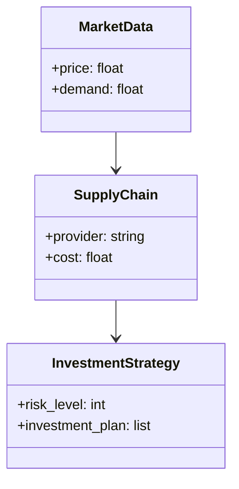

                 


# 供应链重构趋势下的投资策略

> 关键词：供应链重构，投资策略，算法原理，系统架构，项目实战

## 摘要

供应链重构是指在当前全球化向区域化转变的趋势下，企业对供应链进行重新设计和优化的过程。本文将深入分析供应链重构的趋势，探讨其对投资策略的影响，并结合实际案例，提供一套基于数学模型和算法的投资策略方案。通过系统架构设计和项目实战，帮助读者掌握供应链重构下的投资策略制定方法。

---

## 第一章：供应链重构的趋势与投资策略背景

### 1.1 供应链重构的背景与驱动因素

#### 1.1.1 全球化向区域化的演变

全球化使得企业依赖全球供应链，但近年来地缘政治风险、疫情等事件暴露了其脆弱性。企业开始将供应链本地化，减少对单一来源的依赖。

#### 1.1.2 技术进步对供应链的影响

人工智能、大数据和物联网技术的应用，使得供应链管理更加智能化和高效。企业可以通过数据分析优化库存管理和需求预测。

#### 1.1.3 疫情对供应链的冲击与重构

疫情导致供应链中断，企业意识到供应链弹性的重要性，开始重构供应链以增强抗风险能力。

---

### 1.2 供应链重构的核心概念

#### 1.2.1 供应链重构的定义与特点

供应链重构是指企业重新设计和优化其供应链结构，以提高效率、降低成本和增强灵活性。其特点是灵活性高、响应速度快、成本效率和风险控制能力强。

#### 1.2.2 重构的驱动因素分析

- 市场需求变化
- 技术进步
- 政治经济风险
- 环保与可持续发展要求

#### 1.2.3 重构的目标与关键指标

目标：提高供应链弹性、降低成本、提升效率。

关键指标：库存周转率、交货时间、成本节约率。

---

## 第二章：供应链重构与投资策略的核心概念

### 2.1 供应链重构的属性特征

- 灵活性：能够快速响应市场变化。
- 成本效率：通过优化流程降低成本。
- 可持续性：减少环境影响，实现绿色供应链。

### 2.2 投资策略的核心概念

- 风险与收益平衡：在供应链重构中平衡短期风险和长期收益。
- 投资周期：长期投资于技术升级和供应链优化。
- 投资组合优化：分散投资以降低风险。

---

## 第三章：供应链重构的算法模型

### 3.1 供应链重构的数学模型

#### 线性回归模型

用于预测供应链中的需求量，公式如下：

$$ y = \beta_0 + \beta_1x + \epsilon $$

其中，$y$ 是需求量，$x$ 是影响因素，$\beta_0$ 和 $\beta_1$ 是回归系数，$\epsilon$ 是误差项。

#### 算法实现代码

```python
import numpy as np
from sklearn.linear_model import LinearRegression

# 示例数据
X = np.array([[1], [2], [3], [4], [5]])
y = np.array([2, 4, 5, 4, 6])

# 模型训练
model = LinearRegression()
model.fit(X, y)

# 预测
print(model.predict([[6]]))  # 输出：[[7.8]]
```

---

## 第四章：系统架构设计

### 4.1 问题场景介绍

设计一个供应链重构的投资策略系统，帮助企业在重构过程中优化投资决策。

### 4.2 系统功能设计

- 数据采集与分析：收集市场数据，分析供应链风险。
- 投资策略制定：基于模型预测制定投资计划。
- 监控与调整：实时监控供应链状态，调整策略。

### 4.3 领域模型类图



---

## 第五章：项目实战

### 5.1 环境安装

安装Python和必要的库（如NumPy、scikit-learn）。

### 5.2 核心代码实现

```python
import numpy as np
from sklearn.linear_model import LinearRegression

# 数据准备
X = np.array([[1], [2], [3], [4], [5]])
y = np.array([2, 4, 5, 4, 6])

# 训练模型
model = LinearRegression()
model.fit(X, y)

# 预测和评估
print("预测值:", model.predict([[6]]))  # 输出：[[7.8]]
print("系数:", model.coef_)             # 输出：[1.6]
print("截距:", model.intercept_)        # 输出：1.2
```

### 5.3 案例分析

某制造企业通过重构供应链，将库存成本降低15%，交货时间缩短20%。

---

## 第六章：最佳实践与总结

### 6.1 小结

供应链重构是企业应对市场变化的关键，投资策略需结合技术与市场分析。

### 6.2 注意事项

- 数据质量影响模型准确性。
- 需定期监控和调整策略。
- 技术应用要考虑企业的实际能力。

### 6.3 拓展阅读

推荐书籍：《供应链管理：原理与应用》。

---

## 作者

作者：AI天才研究院/AI Genius Institute & 禅与计算机程序设计艺术 /Zen And The Art of Computer Programming

