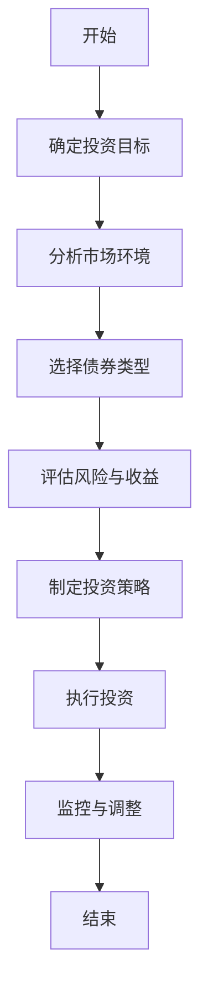

                 

# 债券投资策略：在低利率环境中寻求收益

> 关键词：债券投资、低利率环境、投资策略、风险管理、收益优化

> 摘要：本文深入探讨了在低利率环境下如何制定有效的债券投资策略，帮助投资者在当前市场环境中寻求更高的收益。文章首先介绍了债券投资的基础知识，包括债券的基本概念、定价与收益计算，以及低利率环境下的投资背景。接着，详细分析了债券投资的核心概念与联系，包括债券投资的基本原理、收益率与风险的关系，以及宏观经济指标对债券市场的影响。随后，探讨了债券投资策略的算法原理，包括债券投资的数学模型、流程图，以及低利率环境下的策略调整。最后，结合实际案例，分析了低利率环境下的债券投资策略、风险管理方法，并展望了未来债券市场的趋势与投资机会。

---

## 第一部分：债券投资策略基础

### 第1章：债券投资策略概述

#### 1.1 债券的基本概念

- **1.1.1 债券的定义与基本要素**
  - 债券是一种债务工具，发行人向投资者借款，并承诺在特定时间内支付利息和本金。
  - 债券的基本要素包括面值、票面利率、期限和发行价格。

- **1.1.2 债券的分类与特点**
  - 按发行主体分类：政府债券、企业债券、金融债券等。
  - 按期限分类：短期债券、中期债券、长期债券。
  - 债券的特点：收益稳定、风险较低、流动性较高。

- **1.1.3 债券市场的基本结构**
  - 债券市场包括一级市场和二级市场。
  - 一级市场是债券的发行市场，二级市场是债券的流通市场。

#### 1.2 债券定价与收益计算

- **1.2.1 债券定价的基本原理**
  - 债券的市场价格由其未来现金流的现值决定。
  - 市场利率的变化会影响债券的价格。

- **1.2.2 债券收益率的计算方法**
  - 名义收益率：债券票面利率与面值的比率。
  - 当前收益率：年息票与债券市场价格的比率。
  - 到期收益率：债券的内部收益率。

- **1.2.3 债券价格与市场利率的关系**
  - 市场利率上升，债券价格下降；市场利率下降，债券价格上升。

#### 1.3 低利率环境下的债券投资背景

- **1.3.1 当前经济环境分析**
  - 低利率环境通常由经济衰退或通货膨胀压力导致。
  - 中央银行通过降低基准利率来刺激经济增长。

- **1.3.2 低利率政策的影响**
  - 低利率降低了债券的票面利率，可能导致债券价格波动。
  - 低利率环境下，债券的再投资风险增加。

- **1.3.3 债券市场的变化趋势**
  - 投资者可能转向风险较高的资产，如股票或高收益债券。
  - 债券市场的流动性可能下降，导致买卖价差扩大。

---

### 第2章：债券投资的核心概念与联系

#### 2.1 债券投资的核心原理

- **2.1.1 债券投资的基本原理**
  - 投资者购买债券，本质上是在购买未来现金流的承诺。
  - 债券的价值取决于其票面利率、期限和市场利率。

- **2.1.2 债券收益率与风险的关系**
  - 收益率与风险成正相关关系：高收益伴随着高风险。
  - 信用风险：债券发行人违约的可能性。

- **2.1.3 债券投资的期限匹配策略**
  - 投资者应根据自身资金需求选择合适的债券期限。
  - 长期债券的利率风险较高，短期债券的收益较低。

#### 2.2 债券投资与宏观经济的关系

- **2.2.1 宏观经济指标对债券市场的影响**
  - GDP增长率、通货膨胀率、失业率等指标会影响债券市场。
  - 通货膨胀上升可能导致债券收益率上升。

- **2.2.2 利率政策与债券投资的关系**
  - 中央银行的利率政策直接影响债券市场。
  - 利率下降时，债券价格上升，反之亦然。

- **2.2.3 经济周期对债券投资的影响**
  - 经济衰退时，债券投资相对安全。
  - 经济复苏时，债券收益率可能上升。

#### 2.3 债券投资的实体关系图

- **2.3.1 债券发行方与投资者的关系**
  - 债券发行人向投资者发行债券，承诺支付利息和本金。
  - 投资者通过购买债券成为债权人。

- **2.3.2 债券市场的中介机构**
  - 证券公司、银行、交易所等中介机构参与债券交易。

- **2.3.3 债券市场的监管框架**
  - 监管机构如证监会负责监督债券市场，确保市场公平。

---

### 第3章：债券投资策略的算法原理

#### 3.1 债券投资的数学模型

- **3.1.1 债券收益率计算公式**
  - 名义收益率公式：$$r = \frac{C}{F}$$
  - 当前收益率公式：$$y = \frac{C}{P}$$
  - 到期收益率公式：$$y = \frac{C}{P} + \frac{F - P}{n}$$

- **3.1.2 债券价格波动模型**
  - 价格波动受市场利率变化影响：$$P = \frac{C}{(1 + r)^n} + \frac{F}{(1 + r)^n}$$

- **3.1.3 债券组合优化的数学模型**
  - 使用均值-方差优化模型：$$\text{Minimize } \sigma^2 \text{ subject to } E(r) = \text{目标收益}$$

#### 3.2 债券投资策略的流程图

#### 3.3 低利率环境下的策略调整

- **3.3.1 低利率环境下的债券投资流程**
  - 重新评估债券收益率。
  - 调整债券组合的久期和凸性。
  - 考虑投资于信用债券或可转换债券。

---

## 第二部分：低利率环境下的债券投资策略

### 第4章：低利率环境下的债券投资策略

#### 4.1 当前利率环境分析

- **4.1.1 低利率环境的现状**
  - 主要经济体央行实施低利率政策。
  - 通胀压力较低，经济增长乏力。

- **4.1.2 低利率环境下的投资机会**
  - 高收益债券：信用评级较低但收益率较高的债券。
  - 可转换债券：兼具债券和股票的特性。

#### 4.2 债券投资的风险管理

- **4.2.1 利率风险**
  - 债券价格受市场利率变化的影响。
  - 长期债券的利率风险较高。

- **4.2.2 信用风险**
  - 债券发行人违约的风险。
  - 通过分散投资降低信用风险。

- **4.2.3 流动性风险**
  - 债券难以快速变现的风险。
  - 选择流动性较高的债券品种。

#### 4.3 债券投资组合的优化

- **4.3.1 久期管理**
  - 久期是衡量债券价格对利率变化敏感度的指标。
  - 通过调整久期匹配投资目标。

- **4.3.2 凸性管理**
  - 凸性是债券价格与收益率曲线之间的关系。
  - 凸性较高的债券在低利率环境下表现更好。

- **4.3.3 多样化投资**
  - 分散投资于不同发行主体和期限的债券。
  - 通过多样化降低整体风险。

---

## 第三部分：未来趋势与投资机会

### 第5章：未来趋势与投资机会展望

#### 5.1 债券市场的未来趋势

- **5.1.1 ESG债券的兴起**
  - 环保、社会责任和公司治理债券受到投资者关注。
  - ESG债券的收益率可能较高，且符合可持续投资理念。

- **5.1.2 数字化债券的发展**
  - 数字债券的发行和交易更加便捷。
  - 区块链技术可能改变债券市场的运作方式。

#### 5.2 投资者应关注的领域

- **5.2.1 高收益债券**
  - 信用评级较低但收益率较高的债券。
  - 需要谨慎评估发行人的信用风险。

- **5.2.2 可持续发展债券**
  - 用于支持环保和社会责任项目的债券。
  - 符合全球可持续发展目标。

#### 5.3 投资策略的调整

- **5.3.1 适应未来利率变化**
  - 预期未来利率可能上升，调整债券组合的久期。
  - 增加短期债券的比例以降低利率风险。

- **5.3.2 把握新兴市场机会**
  - 新兴市场的债券收益率较高，但风险也较大。
  - 通过多元化投资降低区域风险。

---

## 作者信息

作者：AI天才研究院/AI Genius Institute  
联系方式：[email protected]  
博客地址：[https://www.zen-and-art.com](https://www.zen-and-art.com)  

---

以上是《债券投资策略：在低利率环境中寻求收益》的技术博客文章的完整目录和内容框架，按照逻辑清晰、结构紧凑、简单易懂的专业技术语言撰写，结合理论分析与实际案例，帮助投资者在低利率环境下制定有效的债券投资策略，寻求更高的收益。

