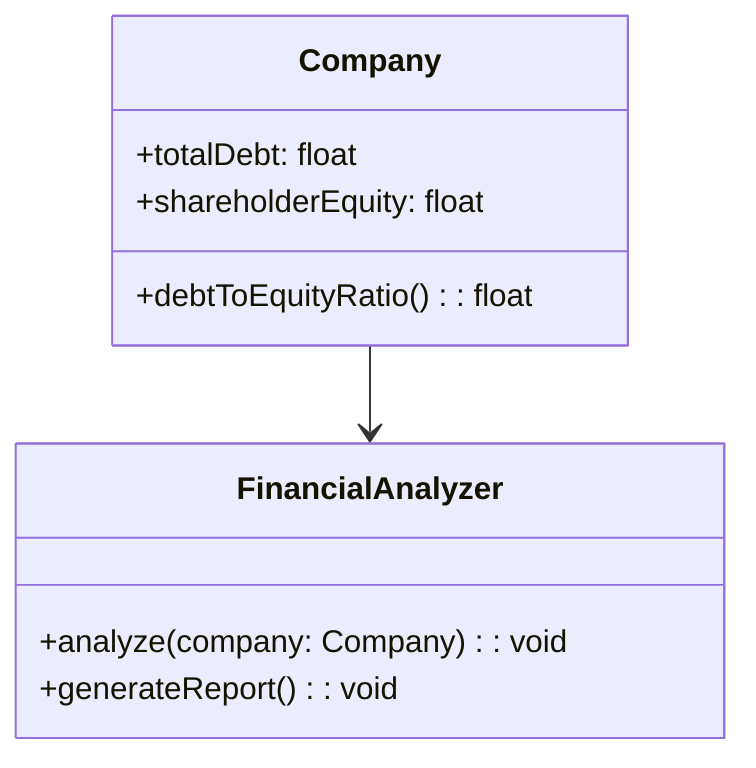
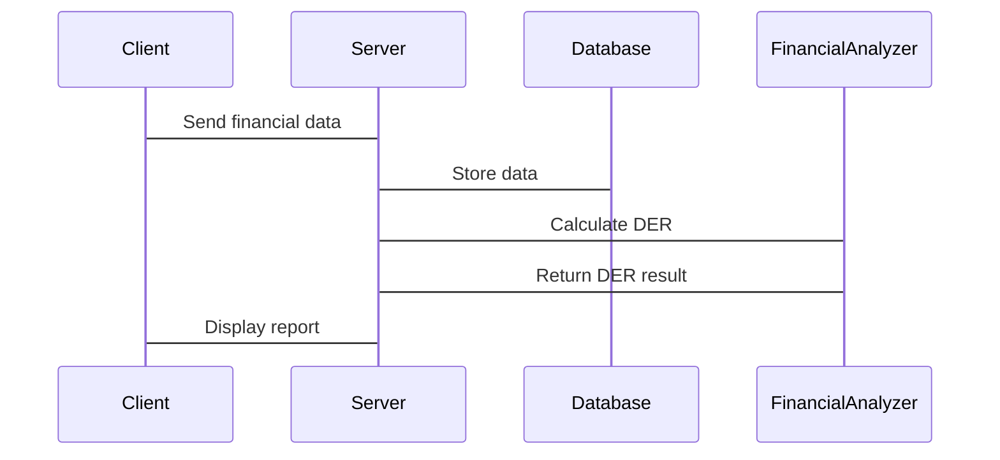

                 


# 债务股本比率：衡量公司健康度的关键

> 关键词：债务股本比率, 公司财务健康, 投资决策, 信用评级, 股东权益

> 摘要：债务股本比率（Debt-to-Equity Ratio，简称DER）是衡量公司财务健康度的关键指标，能够帮助投资者和管理层评估公司的财务风险和偿债能力。本文从背景介绍、核心概念、算法原理、系统架构、项目实战等多维度深入剖析债务股本比率的内涵和应用，通过实际案例分析和最佳实践分享，帮助读者全面理解这一重要财务指标的使用方法和意义。

---

## 第一部分: 债务股本比率的核心概念与背景

### 第1章: 债务股本比率的定义与重要性

#### 1.1 债务股本比率的基本概念

##### 1.1.1 什么是债务股本比率
债务股本比率（Debt-to-Equity Ratio，DER）是衡量公司财务杠杆的重要指标，计算公式为：

$$
\text{债务股本比率} = \frac{\text{总债务}}{\text{股东权益}}
$$

其中，总债务包括公司所有的短期和长期负债，股东权益则表示公司净资产的价值。

##### 1.1.2 债务股本比率的计算公式
债务股本比率的计算公式简洁明了，但其背后的意义却非常丰富。通过将总债务与股东权益进行对比，我们可以了解公司对债权人资金的依赖程度。一般而言，较高的债务股本比率意味着公司更多依赖债务融资，财务风险较大；较低的债务股本比率则表示公司更多依赖股东权益融资，财务风险较小。

##### 1.1.3 债务股本比率的用途
债务股本比率在投资决策、信用评级、公司估值等方面具有重要作用。投资者可以通过分析这一比率来评估公司的财务健康状况和偿债能力，从而做出更明智的投资决策。

#### 1.2 债务股本比率的重要性

##### 1.2.1 为什么债务股本比率是衡量公司健康度的关键
债务股本比率能够反映公司的财务杠杆和偿债能力。一个过高的债务股本比率可能意味着公司面临较高的财务风险，而一个过低的比率可能表明公司未能充分利用债务融资的优势。因此，债务股本比率是评估公司财务健康状况的重要工具。

##### 1.2.2 债务股本比率与公司信用评级的关系
公司信用评级机构通常会参考债务股本比率来评估公司的信用风险。较高的债务股本比率可能会导致信用评级下降，从而影响公司的融资成本和能力。

##### 1.2.3 债务股本比率在投资决策中的作用
投资者在进行股票投资时，往往会关注公司的债务股本比率。一个合理的债务股本比率能够表明公司具有较强的财务稳定性和抗风险能力，从而吸引更多投资者。

### 第2章: 债务股本比率的背景与应用领域

#### 2.1 债务股本比率的背景

##### 2.1.1 公司财务健康度的衡量标准
公司财务健康度是投资者和管理层关注的核心问题之一。通过分析公司的财务指标，可以评估其盈利能力、偿债能力、运营效率等方面的表现。

##### 2.1.2 债务与股本的基本概念
债务是指公司对外部债权人欠款的总和，包括短期负债和长期负债。股本则是公司股东持有的净资产价值，代表了股东对公司资产的所有权。

##### 2.1.3 债务股本比率的演变与发展趋势
随着经济环境的变化和公司战略的调整，债务股本比率也在不断演变。不同的行业和公司规模可能会有不同的标准，但其核心目的是评估公司的财务风险和偿债能力。

#### 2.2 债务股本比率的应用领域

##### 2.2.1 金融行业中的应用
在金融行业，债务股本比率是评估公司信用风险的重要指标。银行和金融机构通常会参考这一比率来决定是否批准贷款以及贷款利率。

##### 2.2.2 制造业中的应用
制造业公司通常需要大量的固定资产投资，债务融资是常见的融资方式。通过分析债务股本比率，可以评估公司的财务杠杆和偿债能力。

##### 2.2.3 零售业中的应用
零售业公司通常依赖于股东权益融资，因为其资产流动性较高，债务融资的风险较大。通过分析债务股本比率，可以评估公司的财务稳定性。

---

## 第二部分: 债务股本比率的核心概念与原理

### 第3章: 债务股本比率的核心概念

#### 3.1 债务与股本的基本概念

##### 3.1.1 债务的定义与分类
债务是指公司对外部债权人欠款的总和，包括短期负债和长期负债。短期负债包括应付账款、短期借款等，长期负债包括长期借款、债券等。

##### 3.1.2 股本的定义与分类
股本是指公司股东持有的净资产价值，包括普通股、优先股等。股本反映了股东对公司资产的所有权。

##### 3.1.3 债务与股本的主要区别
债务是公司对外部债权人的负债，需要按时偿还本金和利息；股本是公司股东的投资，不需要偿还，但可以通过股息分配获得收益。

#### 3.2 债务股本比率的核心原理

##### 3.2.1 债务股本比率的计算公式
$$
\text{债务股本比率} = \frac{\text{总债务}}{\text{股东权益}}
$$

##### 3.2.2 债务股本比率的数学模型
债务股本比率的数学模型可以表示为：

$$
\text{DER} = \frac{\text{D}}{\text{E}}
$$

其中，D代表总债务，E代表股东权益。

##### 3.2.3 债务股本比率的经济意义
债务股本比率反映了公司对债务融资的依赖程度。较高的比率表明公司依赖债务融资较多，财务风险较大；较低的比率则表明公司依赖股东权益融资较多，财务风险较小。

### 第4章: 债务股本比率的核心要素与属性

#### 4.1 债务股本比率的核心要素

##### 4.1.1 总债务
总债务包括公司所有的短期和长期负债，反映了公司对外部债权人的总负债金额。

##### 4.1.2 股东权益
股东权益包括公司股东持有的净资产价值，反映了股东对公司资产的所有权。

##### 4.1.3 其他相关因素
其他相关因素包括利息支出、资产流动性等，这些因素可能影响债务股本比率的计算和分析。

#### 4.2 债务股本比率的属性特征对比

##### 4.2.1 不同行业间的差异
不同行业的债务股本比率可能存在显著差异。例如，制造业通常需要大量的固定资产投资，债务股本比率较高；而零售业则通常依赖股东权益融资，债务股本比率较低。

##### 4.2.2 不同公司规模的差异
公司规模也会影响债务股本比率。一般来说，大型公司可以通过更多的债务融资来支持其业务扩展，而小型公司则更多依赖股东权益融资。

##### 4.2.3 不同财务周期的差异
在不同的财务周期，债务股本比率可能也会有所不同。例如，在公司扩张阶段，可能需要更多的债务融资，从而提高债务股本比率；而在收缩阶段，公司可能会减少债务融资，从而降低债务股本比率。

---

## 第三部分: 债务股本比率的算法原理与数学模型

### 第5章: 债务股本比率的算法原理

#### 5.1 债务股本比率的计算步骤

##### 5.1.1 确定总债务
首先，需要确定公司的总债务，包括短期负债和长期负债。

##### 5.1.2 确定股东权益
其次，需要确定公司的股东权益，包括普通股、优先股等。

##### 5.1.3 计算债务股本比率
最后，使用公式计算债务股本比率：

$$
\text{DER} = \frac{\text{总债务}}{\text{股东权益}}
$$

#### 5.2 债务股本比率的数学模型

##### 5.2.1 基本公式
$$
\text{DER} = \frac{\text{D}}{\text{E}}
$$

##### 5.2.2 扩展公式
$$
\text{DER} = \frac{\text{D}}{\text{E}} = \frac{\text{D}}{\text{E}} \times 100\%
$$

##### 5.2.3 示例计算
假设某公司总债务为 $500,000，股东权益为 $250,000，则债务股本比率为：

$$
\text{DER} = \frac{500,000}{250,000} = 2
$$

这意味着该公司每 1 元的股东权益对应 2 元的债务。

### 第6章: 债务股本比率的系统分析与架构设计

#### 6.1 系统分析

##### 6.1.1 问题场景介绍
公司财务部门需要定期计算债务股本比率，以便评估公司的财务健康状况。

##### 6.1.2 项目介绍
开发一个财务分析系统，能够自动计算债务股本比率，并生成相应的财务报告。

##### 6.1.3 系统功能设计
系统需要具备数据输入、计算、可视化、报告生成等功能。

##### 6.1.4 领域模型设计
使用 Mermaid 类图表示领域模型：



##### 6.1.5 系统架构设计
使用 Mermaid 架构图表示系统架构：

```mermaid
architectural
    title Financial Analysis System Architecture
    Client -> Server: HTTP Request
    Server -> Database: Query
    Server -> FinancialAnalyzer: Analyze
    FinancialAnalyzer -> ReportGenerator: Generate Report
    ReportGenerator -> Client: Send Report
```

##### 6.1.6 系统接口设计
系统接口包括数据输入接口、计算接口、报告生成接口等。

##### 6.1.7 系统交互设计
使用 Mermaid 序列图表示系统交互：



### 第7章: 债务股本比率的项目实战

#### 7.1 环境配置

##### 7.1.1 安装Python
需要安装Python 3.8及以上版本。

##### 7.1.2 安装必要的库
安装 `pandas`, `numpy`, `matplotlib` 等库：

```bash
pip install pandas numpy matplotlib
```

#### 7.2 核心代码实现

##### 7.2.1 计算债务股本比率的Python代码
```python
import pandas as pd
import numpy as np

# 假设我们有一个包含财务数据的DataFrame
financial_data = pd.DataFrame({
    'Company': ['Company A', 'Company B', 'Company C'],
    'Total Debt': [500000, 300000, 400000],
    'Shareholder Equity': [250000, 150000, 200000]
})

# 计算债务股本比率
financial_data['Debt-to-Equity Ratio'] = financial_data['Total Debt'] / financial_data['Shareholder Equity']

print(financial_data)
```

##### 7.2.2 可视化债务股本比率
```python
import matplotlib.pyplot as plt

# 绘制柱状图
plt.figure(figsize=(10, 6))
plt.bar(financial_data['Company'], financial_data['Debt-to-Equity Ratio'])
plt.title('Debt-to-Equity Ratio by Company')
plt.xlabel('Company')
plt.ylabel('Debt-to-Equity Ratio')
plt.show()
```

#### 7.3 项目小结

##### 7.3.1 实战总结
通过项目实战，我们了解了如何使用Python计算债务股本比率，并通过可视化工具展示结果。

##### 7.3.2 案例分析
以某公司为例，计算其债务股本比率，并分析其财务健康状况。

##### 7.3.3 经验分享
在实际项目中，需要注意数据的准确性和完整性，确保计算结果的可靠性。

---

## 第四部分: 债务股本比率的最佳实践与总结

### 第8章: 债务股本比率的最佳实践

#### 8.1 小结
债务股本比率是衡量公司财务健康度的关键指标，能够帮助投资者和管理层评估公司的财务风险和偿债能力。

#### 8.2 注意事项
在使用债务股本比率时，需要注意以下几点：
1. 不同行业和公司规模的债务股本比率标准不同。
2. 债务股本比率过高或过低都可能带来财务风险。
3. 应结合其他财务指标进行综合分析。

#### 8.3 拓展阅读
推荐阅读以下书籍和资源：
1. 《财务报表分析》
2. 《公司财务学》
3. 《投资学基础》

### 第9章: 总结

#### 9.1 总结内容
债务股本比率是衡量公司财务健康度的重要指标，能够反映公司的财务杠杆和偿债能力。通过分析债务股本比率，投资者和管理层可以更好地评估公司的财务风险和投资价值。

#### 9.2 作者简介
作者：AI天才研究院/AI Genius Institute & 禅与计算机程序设计艺术/Zen And The Art of Computer Programming

---

通过本文的详细分析和讲解，我们深入探讨了债务股本比率的核心概念、算法原理、系统架构以及实际应用。希望读者能够通过本文对债务股本比率有更全面的理解，并在实际工作中灵活运用这一重要指标。

