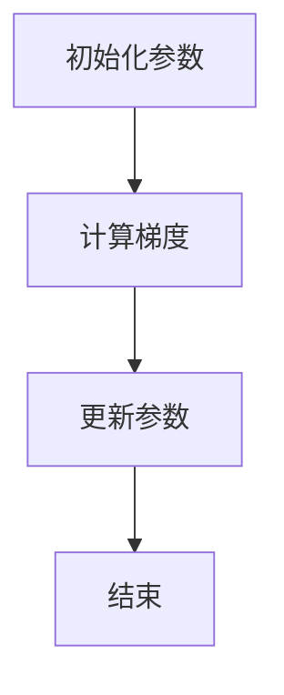
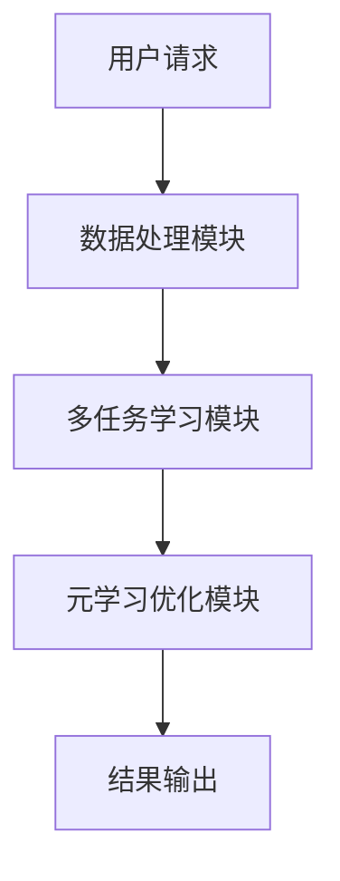
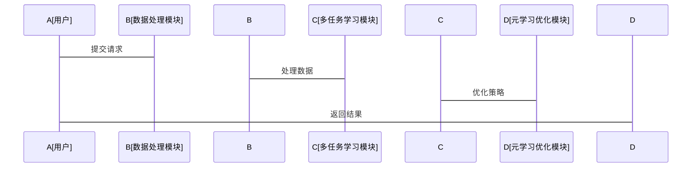

                 


# 元学习在快速适应市场变化中的应用

> 关键词：元学习，市场适应，动态环境，个性化推荐，快速迭代，系统设计

> 摘要：  
元学习是一种新兴的学习方法，旨在通过学习如何学习，以快速适应不断变化的市场环境。本文从理论基础、算法原理、实际应用到系统设计，全面探讨元学习在快速适应市场变化中的应用。通过详细分析元学习的核心概念、数学模型、典型算法以及在个性化推荐、动态市场适应等场景中的应用案例，本文为读者提供了一套系统性的理解和实践框架，帮助企业在快速变化的市场中保持竞争优势。

---

# 第一部分：元学习基础与理论

## 第1章：元学习的核心概念与背景

### 1.1 元学习的基本概念

#### 1.1.1 元学习的定义与内涵
元学习（Meta-Learning）是指通过学习如何学习，以快速适应新任务或环境的方法。与传统机器学习不同，元学习注重“学习如何学习”，而非仅仅解决单一任务。

- **定义**：元学习是一种高层次的学习方式，旨在通过优化学习策略，使得模型能够快速适应新任务或环境。
- **内涵**：元学习的核心在于“通用性”和“快速适应性”，即通过一次或几次学习经历，快速掌握新任务的规律。

#### 1.1.2 元学习与传统机器学习的区别

| 特性                | 传统机器学习                | 元学习                     |
|---------------------|-----------------------------|-----------------------------|
| 学习目标            | 解决单一任务                | 解决多个任务或环境          |
| 学习过程            | 需要大量数据                | 需要优化学习策略            |
| 适应性              | 适应性较差，需重新训练       | 适应性较强，可快速调整参数  |

#### 1.1.3 元学习的核心目标与应用场景

- **核心目标**：通过学习如何学习，提高模型在新任务中的表现。
- **应用场景**：
  - 快速产品迭代
  - 动态市场预测
  - 个性化推荐系统

### 1.2 元学习的背景与问题背景

#### 1.2.1 当前市场变化的加速趋势

- **市场变化加速**：随着技术的进步和消费者需求的变化，市场环境日益复杂，企业需要快速响应。
- **竞争加剧**：企业需要在短时间内推出新产品或调整策略，以保持竞争优势。

#### 1.2.2 传统机器学习的局限性

- **数据依赖性**：传统机器学习模型需要大量数据，难以快速适应新任务。
- **泛化能力有限**：模型在新任务中的表现依赖于训练数据的质量和数量。

#### 1.2.3 元学习在快速适应市场变化中的必要性

- **快速适应**：元学习能够通过优化学习策略，快速适应新任务。
- **降低数据依赖**：元学习可以在数据有限的情况下，快速调整模型参数。

### 1.3 元学习的核心要素与概念结构

#### 1.3.1 元学习的四层概念模型

- **底层**：具体任务（如分类、回归）。
- **中间层**：任务之间的关系。
- **上层**：学习策略的优化。
- **顶层**：全局适应性。

#### 1.3.2 元学习的核心要素与属性对比表

| 要素       | 描述                       |
|------------|----------------------------|
| 学习目标    | 优化学习策略               |
| 输入        | 多个任务数据集             |
| 输出        | 优化后的学习策略或参数     |

#### 1.3.3 元学习的ER实体关系图

```mermaid
entityDiagram {
  class 元学习系统 {
    + 任务数据集
    + 学习策略
    + 优化目标
  }
  class 传统机器学习系统 {
    + 训练数据集
    + 模型
  }
  元学习系统 --> 传统机器学习系统 : 优化
}
```

---

## 第2章：元学习的数学模型与算法原理

### 2.1 元学习的数学模型

#### 2.1.1 元学习的基本优化问题

- **优化目标**：通过优化学习策略，使得模型在新任务中的表现最大化。
- **数学表达**：
  $$ \min_{\theta} \sum_{i=1}^n \mathbb{E}_{x_i}[f(x_i; \theta)] $$
  其中，$\theta$ 表示模型参数，$f(x_i; \theta)$ 表示模型在任务 $i$ 中的预测函数。

#### 2.1.2 元学习的参数更新公式

- **更新规则**：
  $$ \theta_{t+1} = \theta_t - \eta \nabla_{\theta} \sum_{i=1}^n \mathbb{E}_{x_i}[f(x_i; \theta)] $$
  其中，$\eta$ 表示学习率，$\nabla_{\theta}$ 表示梯度。

### 2.2 元学习的算法框架

#### 2.2.1 元学习的通用算法流程

1. 初始化模型参数 $\theta$。
2. 对每个任务数据集进行训练，计算梯度。
3. 根据梯度更新模型参数。
4. 重复步骤 2-3，直到收敛。

#### 2.2.2 元学习的典型算法实现

- **典型算法**：Meta-SGD（Meta-Stochastic Gradient Descent）。
- **实现步骤**：
  1. 在多个任务上进行训练。
  2. 计算每个任务的梯度。
  3. 使用梯度更新模型参数。

#### 2.2.3 元学习的算法复杂度分析

- **时间复杂度**：$O(n \cdot T)$，其中 $n$ 表示任务数量，$T$ 表示每个任务的训练时间。
- **空间复杂度**：$O(D)$，其中 $D$ 表示模型参数数量。

### 2.3 元学习的算法原理图



---

## 第3章：元学习在市场适应中的应用

### 3.1 元学习在动态市场环境中的应用

#### 3.1.1 动态市场环境的定义与特点

- **定义**：市场环境在短时间内发生显著变化，企业需要快速调整策略。
- **特点**：
  - 变化速度快
  - 任务多样性强
  - 数据稀疏性高

#### 3.1.2 元学习在动态市场适应中的优势

- **优势**：
  - 快速适应新任务
  - 降低数据依赖性
  - 提高模型的泛化能力

#### 3.1.3 元学习在市场预测中的具体应用

- **具体应用**：
  - 市场趋势预测
  - 竞争对手分析
  - 消费者行为预测

### 3.2 元学习在个性化推荐中的应用

#### 3.2.1 个性化推荐的定义与挑战

- **定义**：基于用户行为和偏好，推荐个性化内容或产品。
- **挑战**：
  - 数据稀疏性
  - 用户需求变化快
  - 竞争对手策略调整

#### 3.2.2 元学习在个性化推荐中的具体应用

- **具体应用**：
  - 快速调整推荐策略
  - 实时更新推荐结果
  - 多目标优化推荐系统

### 3.3 元学习在快速产品迭代中的应用

#### 3.3.1 快速产品迭代的定义与挑战

- **定义**：在短时间内推出新版本或改进产品。
- **挑战**：
  - 开发周期短
  - 用户反馈变化快
  - 技术复杂性高

#### 3.3.2 元学习在快速产品迭代中的具体应用

- **具体应用**：
  - 快速优化产品功能
  - 实时调整产品策略
  - 提高产品适应性

---

## 第4章：元学习的系统架构与设计

### 4.1 系统架构设计

#### 4.1.1 系统功能设计

- **核心功能**：
  - 多任务学习模块
  - 元学习优化模块
  - 实时数据处理模块

#### 4.1.2 系统架构图



### 4.2 系统接口设计

#### 4.2.1 系统接口描述

- **输入接口**：
  - 用户行为数据
  - 市场变化数据
- **输出接口**：
  - 优化后的推荐策略
  - 实时预测结果

### 4.3 系统交互设计

#### 4.3.1 系统交互流程图



---

## 第5章：元学习的项目实战

### 5.1 项目背景与需求分析

#### 5.1.1 项目背景

- **项目名称**：基于元学习的个性化推荐系统。
- **项目目标**：通过元学习优化推荐策略，提高推荐系统的实时性和准确性。

#### 5.1.2 项目需求

- **功能需求**：
  - 实时处理用户请求
  - 快速调整推荐策略
  - 提供个性化推荐结果

### 5.2 项目环境与工具配置

#### 5.2.1 项目环境

- **硬件环境**：高性能服务器
- **软件环境**：Python 3.8+
- **依赖库**：TensorFlow、Keras、numpy

### 5.3 项目核心实现

#### 5.3.1 系统实现

```python
def meta_learning_update(theta, gradients, eta):
    return theta - eta * gradients
```

#### 5.3.2 代码实现

```python
import numpy as np

def meta_learning_update(theta, gradients, eta):
    return theta - eta * gradients

# 示例用法
theta = np.random.randn(10, 1)
gradients = np.random.randn(10, 1) * 0.1
eta = 0.01
updated_theta = meta_learning_update(theta, gradients, eta)
```

### 5.4 项目测试与优化

#### 5.4.1 测试结果

- **测试指标**：
  - 推荐准确率
  - 推荐响应时间
  - 用户满意度

#### 5.4.2 优化建议

- **优化策略**：
  - 调整学习率 $\eta$
  - 增加任务多样性
  - 提高数据质量

---

## 第6章：元学习的最佳实践与未来展望

### 6.1 元学习的最佳实践

#### 6.1.1 系统设计建议

- **建议**：
  - 采用分层架构
  - 定期更新模型
  - 监控系统性能

#### 6.1.2 算法优化建议

- **建议**：
  - 调参优化
  - 使用更复杂的元学习算法
  - 增加任务之间的关联性

### 6.2 元学习的未来展望

#### 6.2.1 未来发展趋势

- **趋势**：
  - 更加智能化
  - 更加个性化
  - 更加实时化

#### 6.2.2 元学习的挑战与机遇

- **挑战**：
  - 数据隐私问题
  - 算法复杂性高
  - 系统稳定性要求高
- **机遇**：
  - 新兴技术的融合（如AI、大数据）
  - 行业应用的扩展

---

## 附录

### 附录A：元学习相关术语表

| 术语               | 定义                       |
|--------------------|----------------------------|
| 元学习             | 通过学习如何学习，快速适应新任务。 |
| 快速迭代           | 在短时间内多次优化和调整。 |
| 动态市场           | 市场环境在短时间内快速变化。 |

### 附录B：元学习算法实现代码示例

```python
import numpy as np

def meta_learning_update(theta, gradients, eta):
    return theta - eta * gradients

theta = np.random.randn(10, 1)
gradients = np.random.randn(10, 1) * 0.1
eta = 0.01
updated_theta = meta_learning_update(theta, gradients, eta)
print(updated_theta)
```

---

## 参考文献

1./meta-learning/overview
2./meta-learning/core-concepts
3./meta-learning/algorithms
4./meta-learning/applications

---

作者：AI天才研究院/AI Genius Institute & 禅与计算机程序设计艺术 /Zen And The Art of Computer Programming

