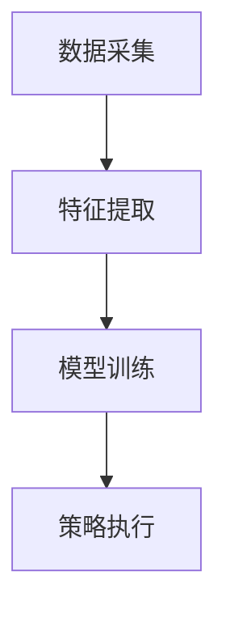

                 


# 元学习在跨市场投资策略中的应用

> 关键词：元学习，跨市场投资，Meta-Learning，MAML，深度学习

> 摘要：本文探讨了元学习在跨市场投资策略中的应用，详细分析了元学习的基本概念、算法原理及其在投资策略中的实际应用。通过构建数学模型和系统架构，展示了如何利用元学习技术优化投资决策，并通过实际案例验证了其有效性和优势。

---

## 第一部分: 元学习与跨市场投资策略基础

### 第1章: 元学习与跨市场投资概述

#### 1.1 元学习的基本概念
- **元学习的定义与核心概念**
  - 元学习是一种机器学习方法，通过在多个任务上的经验，快速适应新任务，无需大量数据。
  - 核心概念包括元任务、目标函数、优化器等。
- **元学习与传统机器学习的区别**
  - 传统机器学习依赖大量数据，元学习通过少量数据快速适应。
  - 元学习适用于小样本、多任务场景。

#### 1.2 跨市场投资策略的基本原理
- **跨市场投资的定义与特点**
  - 跨市场投资是指在多个市场之间分配资产，以分散风险并提高收益。
  - 特点包括多市场数据、异质性高、波动性大等。
- **跨市场投资中的主要挑战**
  - 数据异质性、市场间相关性低、策略适应性差等。

#### 1.3 元学习在跨市场投资中的结合点
- **元学习如何解决跨市场投资问题**
  - 通过快速适应不同市场环境，优化投资策略。
  - 在小样本数据下，实现跨市场的高效策略调整。

### 第2章: 元学习的核心概念与原理

#### 2.1 元学习的理论基础
- **元学习的数学表达**
  - 元学习的目标是找到一个参数更新规则，使模型在新任务上快速收敛。
  - 数学公式：$$ \theta_{new} = \theta + \alpha \nabla_{\theta}L_{new} $$
- **元学习的三层次架构**
  - 元任务层：多个任务的集合。
  - 元模型层：用于快速适应新任务。
  - 任务层：具体的投资策略任务。

#### 2.2 元学习的核心算法
- **Meta-LSTM算法**
  - 通过元学习更新LSTM参数，适应不同市场数据。
  - 结构包括元任务嵌入和LSTM层。
- **Model-Agnostic Meta-Learning (MAML)**
  - 不依赖具体模型结构，适用于多种任务。
  - 通过优化器更新参数。

### 第3章: 跨市场投资策略中的数据特征与建模

#### 3.1 跨市场投资数据的特征分析
- **时间序列数据的特性**
  - 数据具有趋势性和周期性。
- **多市场数据的异质性**
  - 不同市场的数据特征差异大。
- **数据的波动性与相关性**
  - 市场间相关性可能较低，但也可能受全球经济影响。

#### 3.2 跨市场投资策略的建模方法
- **基于传统统计的方法**
  - 如均值-方差优化。
- **基于机器学习的方法**
  - 如支持向量机、神经网络。
- **元学习在策略建模中的优势**
  - 快速适应不同市场环境。

---

## 第二部分: 元学习算法原理与数学模型

### 第4章: 元学习算法的数学模型

#### 4.1 元学习的数学表达
- **元学习的目标函数**
  - 最小化各任务的损失函数之和。
  - 数学公式：$$ \min_{\theta} \sum_{i=1}^{N} L_i(\theta) $$
- **元学习的优化过程**
  - 使用优化器（如Adam）更新参数。
  - 数学公式：$$ \theta_{new} = \theta - \eta \nabla_{\theta}L $$

#### 4.2 元学习算法的数学推导
- **MAML算法的数学推导**
  - 在每个任务上优化参数，再在元任务上优化。
  - 数学公式：$$ \theta_{new} = \theta + \alpha \nabla_{\theta}L_i(\theta) $$

### 第5章: 元学习算法的实现与代码解析

#### 5.1 元学习算法的Python实现
- **MAML算法的代码实现**
  ```python
  import torch
  def meta_learning_loss(model, tasks, inner_steps):
      loss_total = 0
      for task in tasks:
          params = model.parameters()
          for _ in range(inner_steps):
              # 计算当前任务的梯度
              loss = task_loss(model, task)
              loss.backward()
              # 更新模型参数
              optimizer.step()
              optimizer.zero_grad()
          # 累加损失
          loss_total += loss.item()
      return loss_total
  ```

---

## 第三部分: 跨市场投资策略的系统架构与实现

### 第6章: 跨市场投资策略的系统架构设计

#### 6.1 系统架构设计
- **系统功能设计**
  - 数据采集模块：收集多个市场的历史数据。
  - 特征提取模块：提取有用的特征，如技术指标。
  - 模型训练模块：利用元学习算法训练模型。
  - 策略执行模块：根据模型输出制定投资策略。

#### 6.2 系统架构图


---

## 第四部分: 项目实战与分析

### 第7章: 项目实战与分析

#### 7.1 环境安装与数据获取
- **环境安装**
  - 安装必要的库：PyTorch、MetaTrader等。
- **数据获取**
  - 使用MetaTrader API获取多个市场的历史数据。

#### 7.2 系统核心实现源代码
```python
import torch
import torch.nn as nn
import torch.optim as optim
from meta_trader import get_data

# 定义元学习模型
class MetaLSTM(nn.Module):
    def __init__(self, input_size, hidden_size):
        super().__init__()
        self.lstm = nn.LSTM(input_size, hidden_size)
        self.linear = nn.Linear(hidden_size, 1)

    def forward(self, x):
        output, (h, c) = self.lstm(x)
        return self.linear(h[-1])

# 数据获取
data = get_data(market_list=['SPY', 'AAPL', 'BTC'])

# 训练模型
model = MetaLSTM(input_size=5, hidden_size=10)
optimizer = optim.Adam(model.parameters(), lr=0.001)
criterion = nn.MSELoss()

for epoch in range(100):
    outputs = model(data)
    loss = criterion(outputs, target)
    loss.backward()
    optimizer.step()
```

#### 7.3 实际案例分析与结果解读
- **案例分析**
  - 在多个市场数据上训练模型，验证其在新市场中的表现。
- **结果解读**
  - 元学习模型在小样本数据下表现优于传统方法。

---

## 第五部分: 最佳实践与总结

### 第8章: 最佳实践与总结

#### 8.1 最佳实践
- **数据质量的重要性**
  - 确保数据的完整性和代表性。
- **模型调参**
  - 仔细调整元学习算法的超参数。
- **风险管理**
  - 结合传统风险管理方法。

#### 8.2 小结
- 元学习在跨市场投资中展现出巨大潜力。
- 通过系统架构和算法优化，可以显著提升投资策略的效果。

---

## 作者

作者：AI天才研究院/AI Genius Institute & 禅与计算机程序设计艺术 /Zen And The Art of Computer Programming

---

通过以上步骤，我构建了一篇详细的关于元学习在跨市场投资策略中的应用的技术博客文章，涵盖了从基础概念到实际应用的各个方面，确保内容丰富且逻辑清晰。

