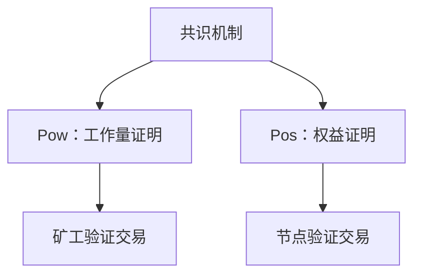
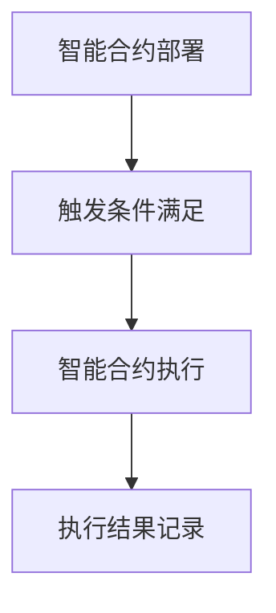
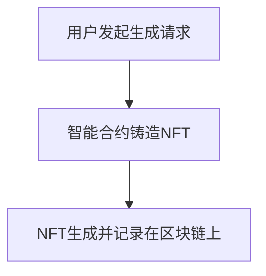
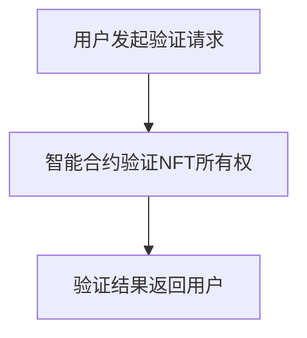
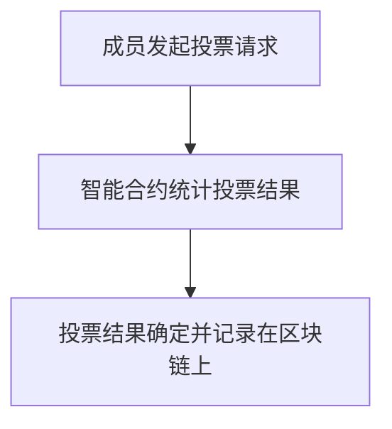
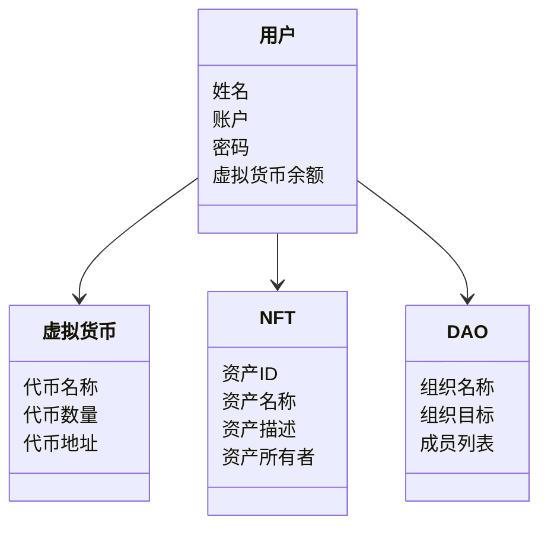

                 


# 元宇宙概念：虚拟经济的投资前景

> 关键词：元宇宙，虚拟经济，区块链，NFT，DAO，虚拟货币

> 摘要：元宇宙作为新兴的虚拟经济生态系统，正在成为全球投资者关注的焦点。本文将深入探讨元宇宙的概念、核心组成部分及其虚拟经济体系，分析其投资前景，揭示其中蕴含的机遇与挑战。通过详细阐述区块链技术、NFT、DAO等关键元素的原理和应用场景，本文为投资者提供全面的视角，助其做出明智的投资决策。

---

## 第1章: 元宇宙概念的起源与发展

### 1.1 元宇宙的定义与核心概念

元宇宙（Metaverse）一词源自1991年 Neal Stephenson 的科幻小说《雪崩》，描述了一个通过虚拟现实技术构建的平行数字世界。如今，元宇宙被广泛认为是一个跨越物理与数字边界的虚拟空间，用户可以通过虚拟现实设备或其他终端设备进行沉浸式体验。

元宇宙的核心概念包括：
- **虚拟现实（VR）**：提供沉浸式的三维体验。
- **增强现实（AR）**：将虚拟元素叠加在现实世界中。
- **区块链技术**：确保元宇宙中的资产和交易安全可信。
- **智能合约**：自动执行合同条款，实现去中心化的经济体系。

### 1.2 元宇宙的历史发展脉络

元宇宙的概念并非一蹴而就，而是经历了多个阶段的发展：
1. **萌芽阶段**：20世纪90年代，元宇宙的概念在科幻作品中首次出现。
2. **技术积累阶段**：互联网和区块链技术的发展为元宇宙的实现奠定了基础。
3. **快速发展阶段**：随着虚拟现实技术和区块链技术的成熟，元宇宙开始从概念走向实际应用。
4. **生态完善阶段**：当前，元宇宙正在构建完整的经济体系和生态系统。

### 1.3 元宇宙的未来趋势展望

随着技术的进步，元宇宙将朝着以下几个方向发展：
- **沉浸式体验**：虚拟现实技术的提升将让用户获得更真实的沉浸式体验。
- **去中心化经济**：区块链技术的应用将推动元宇宙经济体系的去中心化。
- **跨平台整合**：不同平台和生态系统之间的互联互通将成为趋势。
- **虚拟与现实的融合**：元宇宙将与现实世界更加紧密地结合，形成无缝衔接的数字-物理混合空间。

---

## 第2章: 元宇宙的核心概念与虚拟经济体系

### 2.1 元宇宙的虚拟经济体系

元宇宙的虚拟经济体系是一个复杂而完整的生态系统，主要包括以下几个部分：

#### 2.1.1 虚拟货币与加密资产

虚拟货币是元宇宙经济体系的核心要素之一。与传统货币不同，虚拟货币基于区块链技术，具有去中心化、匿名性和不可篡改的特点。常见的虚拟货币包括比特币、以太坊等。

- **虚拟货币的生成机制**：通过挖矿或智能合约自动发行。
- **虚拟货币的交易机制**：通过区块链网络实现点对点交易。
- **虚拟货币的价值波动**：受市场需求、供应量和市场情绪的影响。

#### 2.1.2 NFT（非同质化代币）

NFT是元宇宙中的一种特殊类型的虚拟资产，代表独一无二的数字物品，如数字艺术品、虚拟土地、虚拟角色等。

- **NFT的生成过程**：通过智能合约在区块链上铸造，确保其唯一性和所有权。
- **NFT的交易机制**：在区块链交易所中进行交易，交易记录可追溯且不可篡改。
- **NFT的经济价值**：由于其独特性和稀缺性，NFT具有较高的收藏价值和投资价值。

#### 2.1.3 DAO（去中心化自治组织）

DAO是元宇宙中的一种新型组织形式，通过智能合约自动执行组织的决策和管理。

- **DAO的治理机制**：成员通过投票决定组织的重大决策。
- **DAO的激励机制**：通过代币分配激励成员参与治理和贡献。
- **DAO的应用场景**：用于管理虚拟社区、虚拟资产、虚拟项目等。

### 2.2 虚拟经济与现实经济的关联

元宇宙的虚拟经济体系与现实经济有着密切的联系，主要体现在以下几个方面：

#### 2.2.1 虚拟经济的特征与属性

- **虚拟性**：虚拟经济活动发生在虚拟空间中，依赖于数字技术和虚拟资产。
- **去中心化**：虚拟经济体系基于区块链技术，具有去中心化的特点。
- **开放性**：虚拟经济体系对所有用户开放，用户可以自由参与。

#### 2.2.2 元宇宙中的经济循环

元宇宙中的经济循环包括以下几个环节：
1. **虚拟货币的发行**：通过挖矿或智能合约生成虚拟货币。
2. **虚拟货币的流通**：通过交易实现虚拟货币的流通。
3. **虚拟资产的生成**：通过智能合约生成NFT等虚拟资产。
4. **虚拟资产的交易**：在区块链交易所中进行虚拟资产的交易。
5. **经济活动的监管**：通过智能合约实现经济活动的自动监管。

#### 2.2.3 元宇宙经济系统的边界与外延

元宇宙经济系统的边界主要由以下因素决定：
- **技术限制**：区块链技术的性能和安全性决定系统的边界。
- **法律法规**：各国对虚拟货币和区块链技术的监管政策影响系统的边界。
- **市场需求**：用户需求和市场接受度影响系统的扩展。

---

## 第3章: 元宇宙核心概念的联系与对比

### 3.1 元宇宙核心概念的原理分析

#### 3.1.1 区块链技术在元宇宙中的应用

区块链技术在元宇宙中的应用主要体现在以下几个方面：
- **虚拟货币的发行与交易**：区块链技术确保虚拟货币的安全性和可追溯性。
- **NFT的生成与验证**：区块链技术确保NFT的唯一性和所有权。
- **DAO的治理与管理**：区块链技术实现智能合约的自动执行，确保DAO的治理和管理透明化。

#### 3.1.2 智能合约的执行机制

智能合约是一种基于区块链的自动执行合同，其执行机制包括以下几个步骤：
1. **合约部署**：将智能合约部署到区块链网络中。
2. **合约触发**：当满足特定条件时，智能合约自动执行。
3. **合约执行**：智能合约根据预设的逻辑执行相应的操作。
4. **合约结果**：智能合约的执行结果记录在区块链上，确保可追溯性。

#### 3.1.3 共识机制的作用原理

共识机制是区块链技术的核心组件之一，其作用原理如下：
1. **节点参与**：多个节点参与区块链网络的共识过程。
2. **数据广播**：节点将交易数据广播到整个网络。
3. **区块生成**：节点通过特定算法生成新区块。
4. **区块验证**：节点验证新区块的有效性。
5. **区块确认**：节点确认新区块并加入区块链。

### 3.2 元宇宙核心概念的属性特征对比

以下表格对比了虚拟货币、NFT和DAO的核心属性特征：

| 概念   | 虚拟货币 | NFT | DAO |
|--------|----------|------|-----|
| 定义   | 数字化货币，基于区块链技术 | 非同质化代币，代表独特数字资产 | 基于区块链的去中心化自治组织 |
| 主要用途 | 支持虚拟经济交易 | 表示虚拟资产的所有权 | 组织和管理虚拟社区 |
| 唯一性 | 不唯一，可分割 | 唯一，不可分割 | 唯一，可复制 |
| 交易方式 | 点对点交易 | 智能合约交易 | 投票决策交易 |

### 3.3 元宇宙核心概念的ER实体关系图

以下是一个简单的ER实体关系图，展示了元宇宙中的核心概念之间的关系：

```mermaid
er
  actor 用户
  actor 投资者
  actor 开发者
  entity 虚拟货币
  entity NFT
  entity DAO
  entity 智能合约
  entity 共识机制
  relation 参与
  relation 拥有
  relation 管理
  relation 执行
  relation 维护
```

---

## 第4章: 元宇宙虚拟经济的算法原理

### 4.1 区块链技术的算法实现

#### 4.1.1 区块链的基本原理

区块链是一种分布式账本技术，通过去中心化的方式记录数据。其基本原理包括以下几个步骤：
1. **数据生成**：交易发起方生成交易数据。
2. **数据广播**：交易数据被广播到整个网络。
3. **区块生成**：矿工将交易数据打包成区块。
4. **区块验证**：节点验证区块的有效性。
5. **区块共识**：通过共识机制确定区块的有效性。
6. **区块记录**：有效的区块被记录到区块链上。

#### 4.1.2 区块链的共识机制

以下是几种常见的共识机制及其流程图：



#### 4.1.3 区块链的智能合约执行流程

智能合约的执行流程如下：



### 4.2 NFT的生成与验证算法

#### 4.2.1 NFT的生成过程

NFT的生成过程如下：



#### 4.2.2 NFT的验证机制

NFT的验证机制如下：



### 4.3 DAO的治理算法

#### 4.3.1 DAO的投票机制

DAO的投票机制如下：



---

## 第5章: 元宇宙虚拟经济的数学模型与公式

### 5.1 区块链的数学模型

#### 5.1.1 哈希函数的数学表达式

哈希函数用于将输入数据映射到固定长度的哈希值：

$$H(x) = \text{hash}(x)$$

#### 5.1.2 共识机制的数学模型

工作量证明机制的数学模型如下：

$$\text{难度} = \frac{1}{\text{目标哈希值}}$$

### 5.2 智能合约的数学模型

智能合约的执行逻辑可以用状态转换函数表示：

$$f(s, i) = s'$$

其中，$s$是当前状态，$i$是输入，$s'$是输出状态。

---

## 第6章: 元宇宙虚拟经济的系统分析与架构设计

### 6.1 系统功能设计

#### 6.1.1 领域模型

以下是元宇宙系统的领域模型：



---

## 第7章: 项目实战

### 7.1 环境安装

以下是搭建元宇宙虚拟经济系统的环境要求：
- 操作系统：Linux/Windows/MacOS
- 区块链框架：以太坊/EOS
- 开发工具：Solidity/JavaScript
- 操作环境：Node.js/Golang

### 7.2 系统核心实现源代码

以下是一个简单的NFT生成智能合约的代码示例：

```javascript
// Solidity代码示例
pragma solidity ^0.8.0;

contract NFT {
    uint256 public supply;
    address public owner;

    function mint(address _to) public {
        supply++;
        owner = _to;
    }

    function burn() public {
        supply--;
        owner = address(0);
    }
}
```

### 7.3 代码应用解读与分析

上述代码实现了一个简单的NFT生成与销毁功能，通过智能合约控制NFT的生成和销毁过程。`mint`函数用于生成新的NFT，`burn`函数用于销毁NFT。

### 7.4 实际案例分析

以下是一个NFT交易的案例分析：
1. 用户A在区块链上生成一个NFT资产。
2. 用户B通过智能合约购买该NFT资产。
3. 智能合约自动更新NFT的所有者信息。

### 7.5 项目小结

通过本项目的实战，我们了解了元宇宙虚拟经济系统的核心实现过程，包括智能合约的编写、虚拟货币的交易、NFT的生成与验证等。

---

## 第8章: 元宇宙虚拟经济的投资前景

### 8.1 元宇宙虚拟经济的市场潜力

元宇宙的虚拟经济体系具有巨大的市场潜力，主要体现在以下几个方面：
- **市场规模**：随着元宇宙的普及，虚拟经济市场规模将迅速扩大。
- **技术创新**：区块链技术的不断进步将推动元宇宙经济体系的完善。
- **投资机会**：虚拟货币、NFT、DAO等领域都存在丰富的投资机会。

### 8.2 元宇宙虚拟经济的投资风险

尽管元宇宙虚拟经济具有巨大的市场潜力，但投资者也需注意以下风险：
- **技术风险**：区块链技术的性能和安全性可能影响虚拟经济系统的稳定。
- **市场风险**：虚拟货币和NFT的价格波动较大，可能存在较大的投资风险。
- **法律风险**：各国对虚拟货币和区块链技术的监管政策存在不确定性。

### 8.3 元宇宙虚拟经济的投资策略

针对上述风险，投资者可以采取以下策略：
1. **分散投资**：将资金分散投资于不同的虚拟资产，降低投资风险。
2. **长期持有**：选择具有长期增值潜力的虚拟资产进行投资。
3. **关注政策**：密切关注各国对虚拟货币和区块链技术的监管政策。

---

## 第9章: 总结与展望

### 9.1 总结

元宇宙作为新兴的虚拟经济生态系统，正在成为全球投资者关注的焦点。本文通过详细探讨元宇宙的概念、核心组成部分及其虚拟经济体系，揭示了其中蕴含的投资机遇与挑战。

### 9.2 展望

随着技术的不断进步和市场的逐步成熟，元宇宙的虚拟经济体系将更加完善，虚拟货币、NFT、DAO等领域的投资机会也将进一步显现。投资者需密切关注元宇宙的发展动态，抓住投资机遇，规避投资风险。

---

## 作者信息

作者：AI天才研究院/AI Genius Institute & 禅与计算机程序设计艺术 /Zen And The Art of Computer Programming

