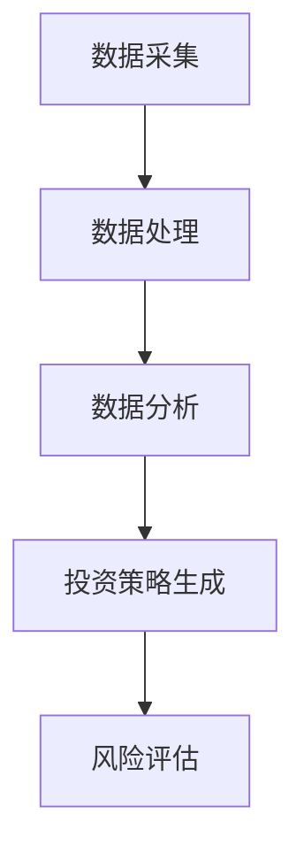

                 

# 克里斯托弗·布朗尼的小盘价值投资：发掘市场盲点

## 关键词：
- 价值投资
- 小盘股
- 市场盲点
- 投资策略
- 数据分析

## 摘要：
本文深入探讨了克里斯托弗·布朗尼的小盘价值投资策略，分析了小盘股市场的特点，揭示了如何通过技术分析和市场情绪分析发现市场盲点。文章结合系统架构设计和实际案例，详细讲解了小盘价值投资的理论与实践，为投资者提供了科学的投资方法。

---

# 第一部分: 小盘价值投资基础

## 第1章: 价值投资的基本概念

### 1.1 价值投资的定义与核心理念

#### 1.1.1 价值投资的定义
价值投资是一种投资策略，强调以低于其内在价值的价格购买优质资产。其核心在于识别市场中被低估的投资标的，长期持有，等待其价值回归。

#### 1.1.2 价值投资的核心理念
- **安全边际**：购买价格低于内在价值，确保投资的安全性。
- **长期视角**：关注企业的长期盈利能力，而非短期市场波动。
- **逆向思维**：在市场恐慌时寻找机会，在市场狂热时保持冷静。

#### 1.1.3 价值投资与小盘股的关系
小盘股因其市值小、流动性低，往往更容易被市场忽视，成为价值投资的潜在机会。小盘股的高成长性使其在长期可能带来超额收益。

---

## 第2章: 小盘股市场的特点

### 2.1 小盘股市场的流动性特点
小盘股的流动性较低，交易量小，买卖价差较大，容易受到市场情绪的影响。

### 2.2 小盘股市场的成长性优势
小盘股企业通常处于成长阶段，具有较高的增长潜力，尤其是在新兴行业或朝阳产业中。

### 2.3 小盘股市场的风险特征
小盘股波动性大，信息不透明，抗风险能力较弱，容易受到市场环境的影响。

---

# 第二部分: 小盘价值投资的策略与方法

## 第3章: 小盘股投资的基本策略

### 3.1 小盘股投资的核心原则

#### 3.1.1 买入低估的原则
通过分析市盈率、市净率等估值指标，寻找价格低于内在价值的小盘股。

#### 3.1.2 长期持有的原则
价值投资强调长期持有，避免频繁交易，减少交易成本，同时享受企业成长带来的收益。

#### 3.1.3 分散投资的原则
通过分散投资降低风险，避免将所有资金投入单一股票，从而降低整体投资组合的波动性。

### 3.2 小盘股投资的选股方法

#### 3.2.1 市盈率法
市盈率（P/E）= 股票价格 / 每股收益。选择市盈率低于行业平均水平的股票。

#### 3.2.2 市净率法
市净率（P/B）= 股票价格 / 每股净资产。选择市净率低于1的股票。

#### 3.2.3 资产负债表分析法
通过分析企业的资产负债表，关注应收账款、存货、负债等关键指标，评估企业的财务健康状况。

---

## 第4章: 发掘市场盲点的方法

### 4.1 市场盲点的定义与特征

#### 4.1.1 市场盲点的定义
市场盲点是指那些被市场忽视或低估的投资机会，通常存在于小盘股市场，因其流动性低、关注度小，容易被投资者忽视。

### 4.2 发掘市场盲点的具体方法

#### 4.2.1 通过技术分析发现市场盲点
- **K线图分析**：观察股票价格走势，寻找价格低于均线的股票。
- **成交量分析**：关注成交量异常放大或萎缩的情况，判断市场情绪。

#### 4.2.2 通过基本面分析发现市场盲点
- **财务报表分析**：关注收入增长稳定、利润改善的企业。
- **行业分析**：选择处于上升周期的行业中的小盘股。

#### 4.2.3 通过大数据分析发现市场盲点
利用大数据技术，分析市场情绪、新闻事件、社交媒体等，发现市场未充分反应的信息。

---

# 第三部分: 小盘价值投资的系统分析与架构设计

## 第5章: 小盘价值投资系统的架构设计

### 5.1 系统架构概述

#### 5.1.1 系统功能模块划分
- 数据采集模块：收集小盘股的市场数据、财务数据、新闻数据等。
- 数据分析模块：对数据进行清洗、处理和分析，识别市场盲点。
- 投资策略模块：根据分析结果生成投资策略。
- 风险评估模块：评估投资策略的风险，制定风险管理计划。

#### 5.1.2 系统功能流程图

### 5.2 系统架构设计

#### 5.2.1 系统架构图

#### 5.2.2 系统接口设计
- 数据接口：与数据源（如股票数据库、新闻网站）对接，获取实时数据。
- 用户接口：提供用户友好的界面，展示分析结果和投资建议。

---

## 第6章: 项目实战

### 6.1 项目背景与目标
以某小盘股公司为例，分析其财务数据和市场情绪，制定投资策略。

### 6.2 数据采集与处理
使用Python爬取公司财务数据和新闻数据，清洗数据并存储到数据库中。

### 6.3 数据分析与策略制定
通过市盈率、市净率等指标分析公司价值，结合技术分析判断买入时机。

### 6.4 投资策略与风险评估
制定买入和卖出策略，评估潜在风险并制定应对措施。

---

## 第7章: 总结与展望

### 7.1 总结
克里斯托弗·布朗尼的小盘价值投资策略强调通过深入分析和市场盲点发现，寻找被低估的小盘股投资机会，实现长期稳定收益。

### 7.2 展望
随着技术的进步，未来可以通过更先进的数据分析和人工智能技术，进一步提升小盘价值投资的效率和准确性。

---

## 作者：AI天才研究院/AI Genius Institute & 禅与计算机程序设计艺术 /Zen And The Art of Computer Programming

---

以上是文章的完整内容，涵盖了价值投资的基础、策略与方法，以及系统设计与实战案例，帮助投资者全面理解和掌握小盘价值投资的方法和技巧。

