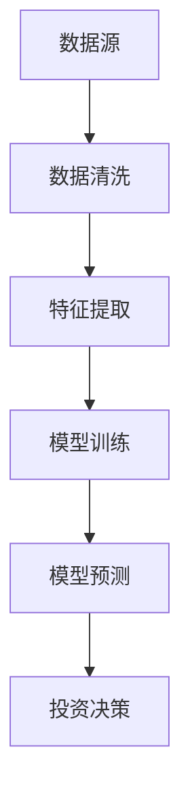
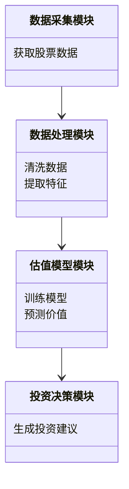

                 


# 克里斯托弗·布朗的全球价值投资机会识别

> 关键词：价值投资、机会识别、全球化、量化分析、投资策略

> 摘要：  
本文深入探讨了全球价值投资机会识别的核心方法和策略。从价值投资的基本原理到量化分析的算法设计，再到系统架构的实现，全面解析了如何在全球范围内识别具有潜力的投资机会。文章结合理论与实践，通过具体案例分析和系统设计，为投资者提供了科学的投资决策支持。

---

## 第一部分: 全球价值投资机会识别的背景与核心概念

### 第1章: 价值投资的基本原理

#### 1.1 价值投资的定义与核心理念
- **价值投资的定义**：价值投资是一种以低于公平价值的价格买入优质资产的投资策略，核心在于寻找市场低估的公司。
- **价值投资的核心理念**：  
  - 市场短期是投票器，长期是称重机。  
  - 购买股票等于购买企业的一部分，关注企业的内在价值而非市场价格波动。
- **价值投资与成长投资的区别**：  
  - 价值投资注重安全边际和低估价格，成长投资注重高增长潜力。

#### 1.2 全球化视角下的价值投资
- **全球市场的多样性与投资机会**：  
  - 不同国家和地区的市场具有不同的经济结构和增长潜力。
  - 全球化使得投资者可以跨越单一市场，寻找更具性价比的投资标的。
- **经济周期与价值投资的关系**：  
  - 在经济衰退期，价值投资机会往往更多，因为许多优质资产价格被低估。
  - 在经济繁荣期，价值投资者需要更加谨慎，避免追高。
- **全球化对投资策略的影响**：  
  - 需要关注全球宏观经济趋势和行业周期。
  - 考虑汇率、地缘政治等全球化因素对投资的影响。

### 第2章: 全球价值投资的机会识别框架

#### 2.1 价值投资的核心框架
- **投资机会的识别标准**：  
  - 公司基本面：盈利能力和财务健康。
  - 市场估值：市盈率、市净率等指标是否处于历史低位。
  - 行业地位：公司在行业中的竞争优势。
- **投资机会的筛选流程**：  
  - 数据收集：收集目标公司的财务数据和行业信息。
  - 估值分析：计算内在价值，判断是否低于市场价格。
  - 风险评估：分析公司的财务风险和行业风险。
- **投资机会的评估体系**：  
  - 量化指标：ROE、ROA等盈利能力指标。
  - 定性分析：管理层能力、公司治理结构。

#### 2.2 全球市场分析与行业研究
- **全球经济指标分析**：  
  - GDP增长率、通胀率、利率水平等宏观经济指标对投资的影响。
  - 不同国家的经济周期对资产价格的影响。
- **行业发展趋势研究**：  
  - 行业生命周期：朝阳行业 vs. 成熟行业。
  - 技术进步和政策变化对行业的影响。
- **区域市场特征分析**：  
  - 发达市场 vs. 新兴市场：风险和收益的权衡。
  - 地缘政治风险对投资的影响。

### 第3章: 价值投资的核心指标与估值方法

#### 3.1 估值指标的定义与分类
- **市盈率（P/E）**：股价与每股收益的比率，反映市场对收益的估值。
- **市净率（P/B）**：股价与每股净资产的比率，适合评估资产密集型行业。
- **市销率（P/S）**：股价与每股销售收入的比率，适合评估成长型企业。
- **股息率**：股息与股价的比率，反映分红能力。

#### 3.2 估值方法的比较与选择
- **绝对估值法**：  
  - 股权自由现金流模型：基于未来现金流的现值计算企业价值。
  - 内在价值法：通过DCF模型评估企业的真实价值。
- **相对估值法**：  
  - 可比公司分析：与同行业公司进行横向比较。
  - 市盈率、市净率等指标的行业平均水平比较。
- **股权自由现金流模型**：  
  - 公式：  
    $$ V = \sum_{t=1}^{n} \frac{FCF_t}{(1 + r)^t} + \frac{TV}{(1 + r)^n} $$
  - 其中，$FCF_t$ 是第t年的自由现金流，$r$ 是折现率，$TV$ 是终值。

### 第4章: 全球价值投资的策略与实践

#### 4.1 价值投资的策略分类
- **股票投资策略**：集中投资于少数优质企业，长期持有。
- **债券投资策略**：投资于高息债券，注重固定收益。
- **多元化投资策略**：通过分散投资降低风险。

#### 4.2 价值投资的实践案例
- **典型投资案例分析**：  
  - 例如，巴菲特投资可口可乐的案例：分析公司的竞争优势、财务健康和估值水平。
- **投资组合构建与优化**：  
  - 根据个人风险承受能力和收益目标，构建股票、债券、现金等资产的组合。
- **风险管理与投资组合调整**：  
  - 定期审视投资组合，调整持仓比例，应对市场变化。

---

## 第二部分: 全球价值投资机会识别的算法与系统设计

### 第5章: 价值投资机会识别的算法原理

#### 5.1 数据采集与处理
- **数据源的选择与获取**：  
  - 从金融数据提供商（如Yahoo Finance、Morningstar）获取数据。
  - 数据清洗：处理缺失值、异常值。
  - 数据特征提取：提取财务指标、市场指标等特征。

#### 5.2 估值模型的构建与优化
- **数据预处理**：  
  - 标准化或归一化处理。
  - 特征选择：使用相关性分析或Lasso回归筛选重要特征。
- **模型训练**：  
  - 使用回归模型（如线性回归、随机森林）预测股票的内在价值。
  - 调参优化：通过交叉验证选择最佳模型参数。

#### 5.3 算法流程图


#### 5.4 数学公式
- **线性回归模型**：  
  $$ y = \beta_0 + \beta_1x_1 + \beta_2x_2 + ... + \beta_nx_n + \epsilon $$
  其中，$y$ 是目标变量（如股票价格），$x_i$ 是特征变量，$\beta_i$ 是回归系数。

### 第6章: 系统架构设计与实现

#### 6.1 系统功能设计
- **功能模块**：  
  - 数据采集模块：从多个数据源获取股票数据。
  - 数据处理模块：清洗和特征提取。
  - 估值模型模块：构建并训练机器学习模型。
  - 投资决策模块：根据模型输出生成投资建议。

#### 6.2 系统架构图


#### 6.3 项目实战
- **环境安装**：  
  - 安装Python、Pandas、Scikit-learn等库。
- **核心代码实现**：  
  ```python
  import pandas as pd
  from sklearn.linear_model import LinearRegression

  # 数据加载
  df = pd.read_csv('stock_data.csv')

  # 特征提取
  features = df[['PE', 'PB', 'ROE']]
  target = df['Price']

  # 模型训练
  model = LinearRegression()
  model.fit(features, target)

  # 预测
  predicted_price = model.predict(features)
  ```

---

## 总结

通过本文的分析，我们从价值投资的基本原理到量化分析的算法设计，再到系统架构的实现，全面解析了如何在全球范围内识别投资机会。投资者可以通过本文提供的方法和工具，结合市场趋势和公司基本面，制定科学的投资策略，实现长期稳健的收益。

---

**作者：AI天才研究院/AI Genius Institute & 禅与计算机程序设计艺术 /Zen And The Art of Computer Programming**

