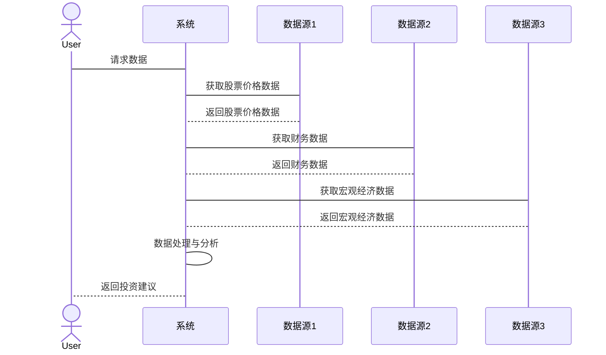
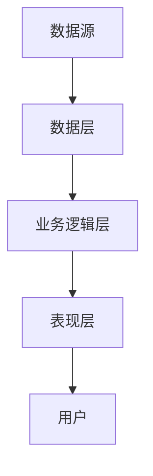

                 

# 深度价值投资的系统分析与架构设计

## 第四章：深度价值投资的系统分析与架构设计

### 4.1 投资分析系统概述

在当前的金融市场中，深度价值投资需要一个高效、准确的系统来支持投资决策。投资分析系统通过整合多源数据、应用先进算法，帮助投资者识别严重低估的股票。该系统不仅能够处理大量数据，还能进行复杂的数据分析，为投资者提供可靠的决策支持。

#### 4.1.1 系统功能模块

投资分析系统主要包含以下几个功能模块：
1. 数据采集模块：从多个数据源获取实时的股票数据、财务报表数据和宏观经济指标。
2. 数据处理模块：对获取的数据进行清洗、转换和预处理，确保数据的准确性和一致性。
3. 分析模块：包括财务分析、估值分析和市场分析，使用多种算法对数据进行深入分析。
4. 决策模块：根据分析结果生成投资建议，包括买入、卖出或持有信号。

#### 4.1.2 系统架构设计

系统的架构采用分层设计，包括数据层、业务逻辑层和表现层：

1. **数据层**：负责数据的存储和管理，使用数据库和数据仓库进行存储。
2. **业务逻辑层**：处理数据的分析和计算，包括财务分析、估值分析和市场分析。
3. **表现层**：提供用户友好的界面，展示分析结果和投资建议。

#### 4.1.3 系统接口设计

系统需要与多个数据源进行接口对接，包括股票交易API、财务数据API和宏观经济数据API。通过Restful API进行数据获取和传输，使用JSON格式进行数据交换。

### 4.2 投资分析系统的功能设计

#### 4.2.1 数据采集模块

数据采集模块负责从多个数据源获取实时数据，包括：
- 股票价格数据：从Yahoo Finance或Alpha Vantage获取。
- 财务报表数据：从公司财报或财务数据API获取。
- 宏观经济指标：从央行网站或宏观经济数据API获取。

#### 4.2.2 数据处理模块

数据处理模块对获取的数据进行清洗和预处理，包括：
- 处理缺失值：使用填充、删除或插值方法处理缺失数据。
- 处理异常值：识别并处理异常值，确保数据的准确性。
- 数据转换：将数据转换为适合分析的形式，如标准化或归一化。

#### 4.2.3 分析模块

分析模块包括财务分析、估值分析和市场分析：
- **财务分析**：评估企业的盈利能力、成长性和财务健康状况。
- **估值分析**：使用DCF模型计算股票的内在价值，并与市场价格进行比较。
- **市场分析**：分析市场的整体走势和情绪，识别市场的波动性。

#### 4.2.4 决策模块

决策模块根据分析结果生成投资建议：
- **买入信号**：当股票的内在价值显著高于市场价格时，发出买入信号。
- **卖出信号**：当股票的内在价值显著低于市场价格时，发出卖出信号。
- **持有信号**：当股票的内在价值与市场价格接近时，建议持有。

### 4.3 系统接口设计与交互流程

#### 4.3.1 系统接口设计

系统需要与多个数据源进行接口对接，包括：
- **股票交易API**：用于获取实时股票价格数据。
- **财务数据API**：用于获取公司的财务报表数据。
- **宏观经济数据API**：用于获取宏观经济指标，如GDP、利率等。

#### 4.3.2 系统交互流程

系统交互流程包括以下几个步骤：
1. **用户登录**：用户登录系统，选择需要分析的股票。
2. **数据请求**：系统向数据源发送数据请求，获取相关的股票数据、财务数据和宏观经济数据。
3. **数据处理**：系统对获取的数据进行清洗和预处理，确保数据的准确性和一致性。
4. **数据分析**：系统对处理后的数据进行深入分析，包括财务分析、估值分析和市场分析。
5. **投资建议生成**：系统根据分析结果生成投资建议，包括买入、卖出或持有信号。
6. **结果展示**：系统将分析结果和投资建议展示给用户，用户可以根据建议进行投资决策。

#### 4.3.3 系统交互流程图

### 4.4 投资分析系统的架构设计

#### 4.4.1 系统架构图

#### 4.4.2 数据流图

通过以上系统分析与架构设计，我们可以构建一个高效、可靠的深度价值投资分析系统，帮助投资者识别严重低估的股票，提高投资决策的准确性和效率。

---

接下来，我将根据用户的要求，继续撰写后续章节的内容，确保每部分内容详细具体，逻辑清晰，符合用户的要求。

