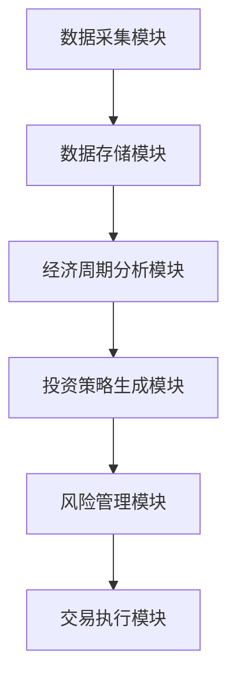
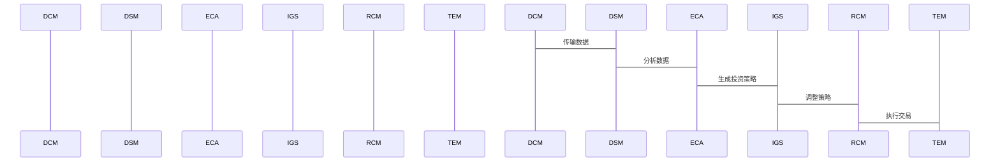

                 


# 全球宏观策略：利用经济周期差异进行投资

## 关键词：全球宏观策略、经济周期、投资、风险管理、量化分析、资产配置、系统架构

## 摘要：  
本文系统地探讨了如何利用全球宏观经济周期的差异进行投资策略的制定和优化。通过分析不同国家和地区的经济周期波动，结合量化分析方法和系统架构设计，提出了一套基于经济周期差异的投资策略框架。文章详细介绍了经济周期的核心概念、波动特征、量化分析方法、系统架构设计、实际案例分析以及风险管理策略，为投资者提供了从理论到实践的完整指导。

---

# 第一部分: 全球宏观策略的背景与基础

## 第1章: 经济周期的基本概念

### 1.1 经济周期的定义与类型

#### 1.1.1 经济周期的定义  
经济周期是指经济活动在时间上的波动，通常包括繁荣、衰退、萧条和复苏四个阶段。经济周期的变化会影响资产价格、利率和市场参与者的投资行为。

#### 1.1.2 经济周期的主要类型  
经济周期可以分为以下几种类型：
1. **扩张周期**：经济增长迅速，企业盈利增加，股价上涨。
2. **收缩周期**：经济增长放缓，企业盈利下降，股价下跌。
3. **通货膨胀周期**：物价水平持续上升，央行可能加息以控制通胀。
4. **通货紧缩周期**：物价水平持续下降，央行可能降息以刺激经济。

#### 1.1.3 经济周期的驱动因素  
经济周期的波动受到多种因素的影响，包括货币政策、财政政策、国际贸易、技术创新和市场预期等。

### 1.2 全球宏观策略的定义与特点

#### 1.2.1 全球宏观策略的定义  
全球宏观策略是一种基于对全球经济和金融市场趋势的分析，通过跨市场、跨资产的投资组合配置，捕捉不同地区经济周期差异的投资方法。

#### 1.2.2 全球宏观策略的核心特点  
1. **跨市场投资**：关注全球主要经济体的宏观经济走势，寻找市场间的机会。
2. **资产配置灵活**：根据经济周期的不同阶段调整股票、债券、商品等资产的配置比例。
3. **量化驱动**：利用量化模型和数据分析技术捕捉市场趋势和套利机会。

#### 1.2.3 全球宏观策略与其他投资策略的区别  
全球宏观策略与传统股票投资或固定收益投资的区别在于其全球化视角和对宏观经济周期的敏感性。它更注重宏观层面的分析，而非单一资产的分析。

### 1.3 经济周期与投资的关系

#### 1.3.1 经济周期对资产价格的影响  
在经济繁荣阶段，股票和房地产价格上涨；在经济衰退阶段，债券和防御性资产的表现较好。

#### 1.3.2 不同经济周期阶段的投资策略  
1. **经济衰退阶段**：增加债券和防御性资产的配置。
2. **经济复苏阶段**：逐步增加股票和周期性资产的配置。
3. **经济繁荣阶段**：减少防御性资产，增加高风险资产的配置。

#### 1.3.3 经济周期预测在投资中的作用  
准确的经济周期预测可以帮助投资者提前布局，规避风险，抓住市场机会。

### 1.4 全球宏观策略的成功关键

#### 1.4.1 全球宏观策略的核心要素  
1. **宏观经济分析能力**：能够准确识别不同国家和地区的经济周期特征。
2. **量化分析能力**：利用大数据和机器学习技术预测经济周期。
3. **风险管理能力**：制定有效的风险控制策略，避免重大损失。

#### 1.4.2 数据分析能力的重要性  
通过分析历史经济数据和市场数据，可以发现经济周期的规律和资产价格的波动特征。

#### 1.4.3 风险管理在投资中的地位  
风险管理是全球宏观策略成功的关键，通过分散投资、设置止损等方法可以有效控制风险。

### 1.5 本章小结  
本章介绍了经济周期的基本概念和全球宏观策略的核心特点，强调了宏观经济分析和风险管理在投资中的重要性。

---

## 第2章: 经济周期的波动与差异

### 2.1 不同国家和地区的经济周期差异

#### 2.1.1 美国、欧洲和亚洲主要经济体的经济周期特点  
1. **美国**：经济周期波动较为明显，受美联储政策影响较大。
2. **欧洲**：经济周期相对平稳，受欧盟政策和德国经济的影响较大。
3. **亚洲**：新兴市场国家的经济周期波动较大，受外部冲击影响显著。

#### 2.1.2 经济周期差异的成因分析  
1. **政策差异**：不同国家的货币政策和财政政策差异导致经济周期波动不同。
2. **产业结构差异**：不同国家的主导产业不同，导致经济周期敏感性不同。
3. **外部冲击**：全球性经济危机或地缘政治事件对不同国家的影响不同。

#### 2.1.3 经济周期差异对投资策略的影响  
投资者可以通过配置不同地区的资产来分散风险，同时捕捉不同地区经济周期差异带来的投资机会。

### 2.2 经济周期波动对资产价格的影响

#### 2.2.1 股票市场的周期性波动  
在经济繁荣阶段，股票市场表现较好；在经济衰退阶段，股票市场表现较差。

#### 2.2.2 债券市场的周期性波动  
在经济衰退阶段，债券市场表现较好；在经济繁荣阶段，债券市场表现相对较弱。

#### 2.2.3 商品市场的周期性波动  
大宗商品价格受经济周期影响较大，经济繁荣阶段需求增加，价格上涨；经济衰退阶段需求减少，价格下跌。

### 2.3 全球经济周期的量化分析方法

#### 2.3.1 经济周期指标的选取  
常用的经济周期指标包括GDP增长率、失业率、通胀率、工业生产指数等。

#### 2.3.2 经济周期阶段的划分  
通过量化指标和模型分析，可以将经济周期分为不同的阶段，并制定相应的投资策略。

### 2.4 本章小结  
本章分析了不同国家和地区的经济周期差异，探讨了经济周期波动对资产价格的影响，并提出了全球经济周期的量化分析方法。

---

## 第3章: 全球宏观策略的量化分析

### 3.1 经济周期量化分析的核心算法

#### 3.1.1 经济周期的数学模型  
通过构建宏观经济模型，可以预测不同经济指标的变化趋势。

#### 3.1.2 经济周期阶段的划分算法  
1. **基于GDP增长率的划分**：通过计算GDP增长率的移动平均线和标准差，判断经济周期阶段。
2. **基于通胀率的划分**：通过通胀率的变化趋势，判断经济周期阶段。

#### 3.1.3 经济周期预测的机器学习方法  
1. **时间序列分析**：使用ARIMA模型预测经济指标的变化趋势。
2. **神经网络模型**：通过构建RNN或LSTM模型，预测经济周期阶段。

### 3.2 经济周期量化分析的Python实现

#### 3.2.1 环境安装与数据获取  
1. 安装Python和相关库（numpy、pandas、scikit-learn等）。
2. 获取全球主要经济体的经济数据（GDP、通胀率、失业率等）。

#### 3.2.2 经济周期阶段的划分代码  
```python
import numpy as np
import pandas as pd

# 数据预处理
data = pd.read_csv('economic_data.csv')
data['GDP_growth'] = data['GDP'].pct_change()

# 基于GDP增长率的经济周期阶段划分
data['GDP_growth_ma'] = data['GDP_growth'].rolling(window=12).mean()
data['GDP_growth_std'] = data['GDP_growth'].rolling(window=12).std()

# 划分经济周期阶段
data['economic_phase'] = np.where(data['GDP_growth_ma'] > 0.5, 'expansion', 
                                   np.where(data['GDP_growth_ma'] < -0.3, 'recession', 
                                            'unknown'))
```

#### 3.2.3 经济周期预测的机器学习实现  
```python
from sklearn.model import ARIMA
import warnings

warnings.filterwarnings('ignore')

# 基于ARIMA模型的经济周期预测
model = ARIMA(data['GDP'], order=(1, 1, 0))
model_fit = model.fit(disp=-1)

# 预测未来经济周期阶段
future_forecast = model_fit.forecast(steps=24)
future_phase = np.where(future_forecast.mean() > 0.5, 'expansion', 'recession')
```

### 3.3 经济周期量化分析的优缺点

#### 3.3.1 优点  
1. **客观性**：量化分析基于数据，减少了主观判断的影响。
2. **可重复性**：量化模型可以重复应用，便于验证和优化。

#### 3.3.2 缺点  
1. **模型假设的限制**：量化模型依赖于假设和数据质量，可能存在偏差。
2. **市场不可预测性**：经济周期受多种因素影响，模型预测可能不准确。

### 3.4 本章小结  
本章介绍了经济周期量化分析的核心算法，包括数学模型和机器学习方法，并提供了Python实现的代码示例。

---

## 第4章: 全球宏观策略的系统架构设计

### 4.1 系统功能设计

#### 4.1.1 数据采集模块  
1. 数据源：全球主要经济体的经济指标数据（GDP、通胀率、失业率等）。
2. 数据预处理：清洗和标准化数据。

#### 4.1.2 经济周期分析模块  
1. 数据分析：基于量化模型划分经济周期阶段。
2. 经济周期预测：使用机器学习模型预测未来经济周期阶段。

#### 4.1.3 投资策略生成模块  
1. 资产配置：根据经济周期阶段调整股票、债券、商品等资产的配置比例。
2. 交易信号生成：根据经济周期预测结果生成买入或卖出信号。

#### 4.1.4 风险管理模块  
1. 风险评估：计算投资组合的风险敞口。
2. 风险控制：设置止损点和止盈点，控制投资组合的风险。

### 4.2 系统架构设计

#### 4.2.1 系统架构图  


#### 4.2.2 数据流设计  
1. 数据采集模块将数据传输到数据存储模块。
2. 数据存储模块将数据传输到经济周期分析模块。
3. 经济周期分析模块将分析结果传输到投资策略生成模块。
4. 投资策略生成模块将策略传输到风险管理模块。
5. 风险管理模块将调整后的策略传输到交易执行模块。

### 4.3 系统接口设计

#### 4.3.1 数据接口  
1. 数据采集模块与数据存储模块之间的接口。
2. 数据存储模块与经济周期分析模块之间的接口。

#### 4.3.2 交易接口  
1. 投资策略生成模块与交易执行模块之间的接口。

### 4.4 系统交互流程图



### 4.5 本章小结  
本章设计了全球宏观策略系统的整体架构，包括数据采集、经济周期分析、投资策略生成和风险管理模块，并提供了系统的交互流程图。

---

## 第5章: 全球宏观策略的项目实战

### 5.1 项目背景与目标

#### 5.1.1 项目背景  
基于全球经济周期差异，制定一个跨市场、跨资产的投资策略。

#### 5.1.2 项目目标  
1. 分析全球主要经济体的经济周期阶段。
2. 制定相应的资产配置策略。
3. 实现交易信号生成和风险管理。

### 5.2 项目环境安装

#### 5.2.1 安装Python和相关库  
1. Python 3.8或更高版本。
2. 安装numpy、pandas、scikit-learn、statsmodels等库。

#### 5.2.2 数据获取  
1. 从公开数据源获取全球主要经济体的经济指标数据。

### 5.3 核心代码实现

#### 5.3.1 数据预处理  
```python
import pandas as pd

# 读取数据
data = pd.read_csv('economic_data.csv')

# 数据清洗
data = data.dropna()
data = data[['country', 'year', 'GDP', 'inflation', 'unemployment']]
```

#### 5.3.2 经济周期阶段划分  
```python
from sklearn.model import KMeans

# 数据标准化
data_normal = (data - data.mean()) / data.std()

# K-means聚类分析
model = KMeans(n_clusters=4, random_state=42)
model.fit(data_normal[['GDP', 'inflation', 'unemployment']])

# 分配聚类结果
data['economic_phase'] = model.labels_
```

#### 5.3.3 投资策略生成  
```python
# 根据经济周期阶段生成资产配置策略
data['asset_allocation'] = np.where(data['economic_phase'] == 0, 'high_equity', 
                                     np.where(data['economic_phase'] == 1, 'moderate_equity', 
                                              'low_equity'))
```

#### 5.3.4 风险管理  
```python
# 设置止损点和止盈点
stop_loss = 0.05
stop_profit = 0.10

# 计算风险敞口
risk_exposure = data['asset_allocation'].value_counts(normalize=True)
```

### 5.4 实际案例分析

#### 5.4.1 数据回测  
1. 使用历史数据进行回测，验证投资策略的有效性。
2. 计算投资组合的收益率和风险指标（夏普比率、最大回撤等）。

#### 5.4.2 策略优化  
1. 根据回测结果优化资产配置策略。
2. 调整风险管理参数，降低投资组合的风险。

### 5.5 本章小结  
本章通过一个实际案例分析，展示了如何利用经济周期差异制定投资策略，并提供了系统的代码实现。

---

## 第6章: 全球宏观策略的最佳实践

### 6.1 风险管理与控制

#### 6.1.1 风险管理的核心原则  
1. **分散投资**：通过配置不同资产和市场分散风险。
2. **止损策略**：设置止损点，避免重大损失。
3. **动态调整**：根据市场变化动态调整投资组合。

#### 6.1.2 风险控制的具体措施  
1. 定期评估投资组合的风险敞口。
2. 根据经济周期变化调整风险承受能力。

### 6.2 策略优化与改进

#### 6.2.1 策略优化的方向  
1. 提高经济周期预测的准确性。
2. 优化资产配置模型，提高收益风险比。

#### 6.2.2 持续改进的措施  
1. 定期回顾投资策略的表现。
2. 根据市场变化及时调整策略。

### 6.3 投资者注意事项

#### 6.3.1 理性投资  
投资者需要保持理性，避免盲目跟风。

#### 6.3.2 持续学习  
投资市场不断变化，投资者需要持续学习和更新知识。

#### 6.3.3 灵活应对  
根据市场变化灵活调整投资策略，及时应对突发事件。

### 6.4 本章小结  
本章总结了全球宏观策略的最佳实践，包括风险管理、策略优化和投资者注意事项。

---

## 作者：AI天才研究院/AI Genius Institute & 禅与计算机程序设计艺术 /Zen And The Art of Computer Programming

---

**全文小结**  
本文系统地探讨了如何利用全球经济周期差异进行投资策略的制定和优化。通过分析不同国家和地区的经济周期波动，结合量化分析方法和系统架构设计，提出了一套基于经济周期差异的投资策略框架。文章详细介绍了经济周期的核心概念、波动特征、量化分析方法、系统架构设计、实际案例分析以及风险管理策略，为投资者提供了从理论到实践的完整指导。

