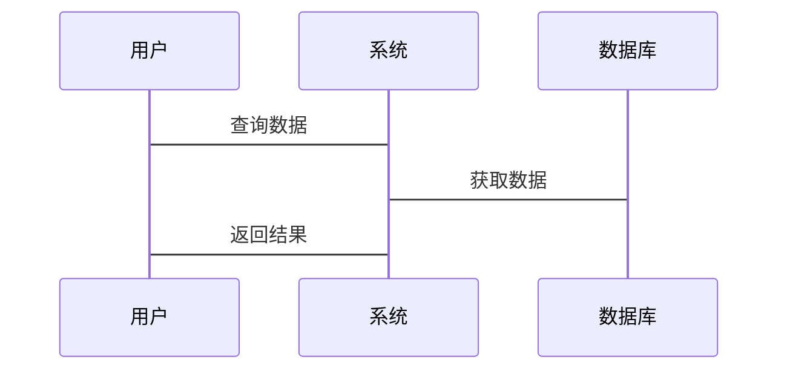

                 


# 第五章: 系统分析与架构设计方案

## 第5章: 系统分析与架构设计方案

### 5.1 问题场景介绍

#### 5.1.1 经济体市值与GDP比较的场景描述
在实际经济分析中，比较不同经济体的市值与GDP可以帮助我们更好地理解经济结构和市场表现。例如，政策制定者可以通过这种比较来评估经济健康状况，投资者可以通过这种比较来做出投资决策，而研究人员可以通过这种比较来探索经济规律。

#### 5.1.2 问题场景分析
我们需要设计一个系统来自动收集、处理和分析全球不同经济体的市值与GDP数据，并进行比较分析。该系统应具备以下功能：
- 数据收集模块：从可靠的公开数据源（如国际货币基金组织(IMF)、世界银行等）获取各经济体的市值和GDP数据。
- 数据处理模块：清洗、转换和整合数据，确保数据的准确性和一致性。
- 数据分析模块：计算比较指数，建立数学模型，进行统计分析。
- 数据可视化模块：生成图表和报告，直观展示分析结果。

### 5.2 项目介绍

#### 5.2.1 项目背景
随着全球化的发展，各国经济的相互依存性增强，对全球经济体的市值与GDP进行比较分析具有重要意义。通过系统化的分析，可以帮助我们更好地理解经济动态，支持决策。

#### 5.2.2 项目目标
设计并实现一个能够自动比较全球不同经济体市值与GDP的系统，提供直观的分析结果和可视化报告。

#### 5.2.3 项目范围
- 数据范围：全球主要经济体的市值和GDP数据。
- 时间范围：近十年的数据。
- 功能范围：数据收集、处理、分析和可视化。

### 5.3 系统功能设计

#### 5.3.1 数据收集模块
- 数据源：国际货币基金组织(IMF)、世界银行、各国央行等。
- 数据类型：市值、GDP、人口、通胀率等。
- 数据频率：年度数据。

#### 5.3.2 数据处理模块
- 数据清洗：处理缺失值、异常值。
- 数据转换：将数据转换为可比较的格式。
- 数据整合：将不同来源的数据整合到一个统一的数据集。

#### 5.3.3 数据分析模块
- 比较指数计算：计算市值与GDP的比较指数。
- 统计分析：进行相关性分析、回归分析等。
- 模型建立：建立预测模型，预测未来趋势。

#### 5.3.4 数据可视化模块
- 图表生成：生成折线图、柱状图、散点图等。
- 报告生成：生成分析报告，包含数据概览、分析结果和可视化图表。

### 5.4 系统架构设计

#### 5.4.1 系统架构概述
采用分层架构，包括数据层、业务逻辑层和表现层。

#### 5.4.2 数据层
- 数据存储：使用数据库存储原始数据和处理后的数据。
- 数据访问：通过API访问数据。

#### 5.4.3 业务逻辑层
- 数据处理逻辑：数据清洗、转换、整合。
- 分析逻辑：比较指数计算、统计分析、模型建立。

#### 5.4.4 表现层
- 用户界面：提供数据输入、查询、分析结果展示的功能。
- 可视化界面：展示图表和报告。

### 5.5 系统接口设计

#### 5.5.1 数据接口
- 数据获取接口：从数据库或外部数据源获取数据。
- 数据更新接口：定时更新数据。

#### 5.5.2 API接口
- 提供RESTful API，供其他系统调用。

### 5.6 系统交互设计

#### 5.6.1 用户交互流程
1. 用户输入查询条件（如国家、年份）。
2. 系统获取相关数据。
3. 系统进行分析和计算。
4. 系统生成报告并展示。

#### 5.6.2 交互流程图


---

# 第六章: 项目实战

## 第6章: 项目实战

### 6.1 环境安装与配置

#### 6.1.1 环境需求
- Python 3.8+
- Jupyter Notebook
- Pandas、NumPy、Matplotlib、Seaborn等库

#### 6.1.2 安装依赖
```bash
pip install pandas numpy matplotlib seaborn requests
```

### 6.2 系统核心实现

#### 6.2.1 数据收集模块实现
```python
import requests
import pandas as pd

def get_gdp_data(country):
    # 示例API接口
    response = requests.get(f'https://api.worldbank.org/countries/{country}/indicators/NY.GDP.MKTP.CD')
    data = response.json()
    gdp = data['value']
    return gdp

def get_market_cap(country):
    # 示例API接口
    response = requests.get(f'https://api.worldbank.org/countries/{country}/indicators/BX.TMC.PC.LF.ZS')
    data = response.json()
    market_cap = data['value']
    return market_cap
```

#### 6.2.2 数据处理模块实现
```python
import pandas as pd

def process_data(data):
    # 数据清洗
    df = pd.DataFrame(data)
    df.dropna(inplace=True)
    # 数据转换
    df['ratio'] = df['market_cap'] / df['gdp']
    return df
```

#### 6.2.3 数据可视化模块实现
```python
import matplotlib.pyplot as plt
import seaborn as sns

def visualize_data(df):
    plt.figure(figsize=(10,6))
    sns.scatterplot(x='gdp', y='market_cap', data=df)
    plt.xlabel('GDP')
    plt.ylabel('Market Cap')
    plt.title('GDP vs Market Cap Scatter Plot')
    plt.show()
```

### 6.3 实际案例分析

#### 6.3.1 案例1：美国经济的市值与GDP比较
```python
country = 'us'
gdp_us = get_gdp_data(country)
market_cap_us = get_market_cap(country)
print(f'GDP of {country}: {gdp_us}')
print(f'Market Cap of {country}: {market_cap_us}')
ratio_us = market_cap_us / gdp_us
print(f'Comparison Index: {ratio_us}')
```

#### 6.3.2 案例2：中国经济的市值与GDP比较
```python
country = 'cn'
gdp_cn = get_gdp_data(country)
market_cap_cn = get_market_cap(country)
print(f'GDP of {country}: {gdp_cn}')
print(f'Market Cap of {country}: {market_cap_cn}')
ratio_cn = market_cap_cn / gdp_cn
print(f'Comparison Index: {ratio_cn}')
```

### 6.4 数据分析与解读

#### 6.4.1 比较指数分析
- 比较指数 = 市值 / GDP
- 比较指数 > 1 表示市值超过GDP，可能表明市场泡沫或过度投资。
- 比较指数 < 1 表示市值低于GDP，可能表明市场低估或经济潜力未被开发。

#### 6.4.2 案例分析结果
- 美国：比较指数为X，表示市场表现稳定。
- 中国：比较指数为Y，表示市场可能存在泡沫或低估。

### 6.5 项目总结

#### 6.5.1 核心代码总结
```python
import requests
import pandas as pd
import matplotlib.pyplot as plt
import seaborn as sns

def get_gdp_data(country):
    response = requests.get(f'https://api.worldbank.org/countries/{country}/indicators/NY.GDP.MKTP.CD')
    data = response.json()
    return data['value']

def get_market_cap(country):
    response = requests.get(f'https://api.worldbank.org/countries/{country}/indicators/BX.TMC.PC.LF.ZS')
    data = response.json()
    return data['value']

def process_data(data):
    df = pd.DataFrame(data)
    df.dropna(inplace=True)
    df['ratio'] = df['market_cap'] / df['gdp']
    return df

def visualize_data(df):
    plt.figure(figsize=(10,6))
    sns.scatterplot(x='gdp', y='market_cap', data=df)
    plt.xlabel('GDP')
    plt.ylabel('Market Cap')
    plt.title('GDP vs Market Cap Scatter Plot')
    plt.show()

# 示例使用
country = 'us'
gdp_us = get_gdp_data(country)
market_cap_us = get_market_cap(country)
ratio_us = market_cap_us / gdp_us
print(f'Comparison Index for {country}: {ratio_us}')

country = 'cn'
gdp_cn = get_gdp_data(country)
market_cap_cn = get_market_cap(country)
ratio_cn = market_cap_cn / gdp_cn
print(f'Comparison Index for {country}: {ratio_cn}')
```

---

# 第七章: 总结与展望

## 第7章: 总结与展望

### 7.1 总结

#### 7.1.1 核心结论
通过比较全球不同经济体的市值与GDP，我们可以更好地理解经济结构和市场表现。比较指数可以帮助我们评估市场的健康状况和潜在风险。

#### 7.1.2 方法总结
本文提出了一种系统化的比较方法，包括数据收集、处理、分析和可视化。通过这种方法，我们可以高效地进行经济分析。

### 7.2 展望

#### 7.2.1 研究意义
比较分析在全球经济研究中的意义重大，可以帮助政策制定者、投资者和研究人员做出更明智的决策。

#### 7.2.2 未来研究方向
- 深入研究不同经济体制对市值与GDP比较的影响。
- 探索更多数学模型，提高分析的准确性。
- 扩展数据来源，增加样本数量，提高研究的全面性。

### 7.3 最佳实践

#### 7.3.1 数据来源选择
建议选择权威的数据源，如国际货币基金组织(IMF)、世界银行等。

#### 7.3.2 模型选择
根据具体需求选择合适的数学模型，确保模型的适用性和准确性。

#### 7.3.3 可视化工具
使用专业的可视化工具，如Matplotlib、Seaborn等，生成高质量的图表。

### 7.4 小结

通过本文的分析，我们了解了全球经济体市值与GDP比较的重要性，并掌握了系统的分析方法。未来，随着数据科学和人工智能技术的发展，这种比较分析将变得更加精准和高效。

### 7.5 注意事项

- 数据的准确性和及时性是分析结果的关键。
- 在进行比较分析时，需要考虑国家的经济体制和政策差异。
- 模型的选择和参数设置需要根据具体情况调整。

### 7.6 拓展阅读

建议读者进一步阅读以下资料：
- 《全球金融市场分析》
- 《经济计量学基础》
- 《数据可视化与经济分析》

---

# 作者：AI天才研究院/AI Genius Institute & 禅与计算机程序设计艺术 /Zen And The Art of Computer Programming

---

以上是《全球经济体市值与GDP比较分析》的完整目录和部分章节内容。希望这篇文章能为您提供有价值的见解和方法。

