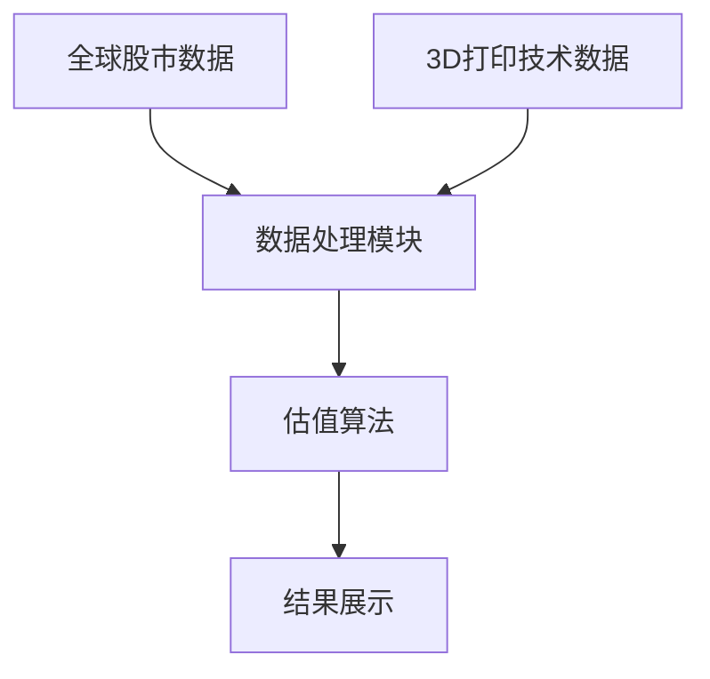
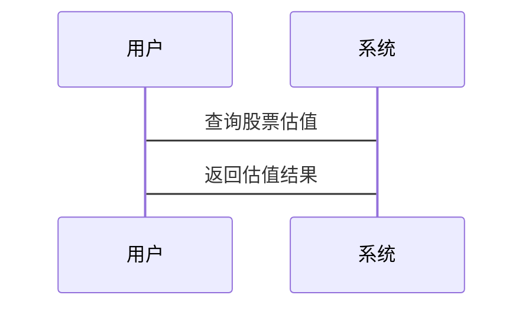

                 


# 全球股市估值与3D打印器官移植的伦理问题

## 关键词：全球股市估值，3D打印技术，器官移植，伦理问题，医疗技术

## 摘要：本文探讨了全球股市估值与3D打印器官移植之间的关系，分析了3D打印技术对医疗行业的影响，及其对股市估值的潜在影响。同时，文章深入探讨了3D打印器官移植带来的伦理问题，提出了平衡技术进步与伦理规范的方法，并结合实际案例进行了详细分析。

---

# 第一部分：全球股市估值与3D打印器官移植的背景介绍

## 第1章：全球股市估值的基本概念

### 1.1 什么是全球股市估值
全球股市估值是指对全球股票市场的整体价值进行评估的过程。它通过分析市场指数、公司财务数据等信息，判断市场的整体健康状况和未来走势。全球股市估值对于投资者、企业和政策制定者具有重要意义。

### 1.2 全球股市估值的核心要素
全球股市估值的核心要素包括：
1. 市场指数（如道琼斯指数、纳斯达克指数）。
2. 公司财务数据（如营收、利润、市盈率等）。
3. 宏观经济指标（如GDP增长率、利率、通货膨胀率）。
4. 市场情绪（如投资者信心、市场波动性）。

### 1.3 全球股市估值的计算方法
常用的股市估值方法包括：
1. **市盈率（P/E）**：市盈率=股价/每股收益。
2. **市净率（P/B）**：市净率=股价/每股净资产。
3. **股息率**：股息率=每股股息/股价。

---

## 第2章：3D打印技术与器官移植的背景

### 2.1 3D打印技术的起源与发展
3D打印技术起源于20世纪80年代，是一种通过逐层堆叠材料来构建三维物体的技术。近年来，随着技术的进步，3D打印在医疗领域的应用越来越广泛。

### 2.2 3D打印技术在医疗领域的应用
3D打印技术在医疗领域的应用包括：
1. **医疗设备制造**：如手术器械、 prosthetics。
2. **药物研发**：通过3D打印技术制造复杂药物结构。
3. **器官模型制作**：用于手术规划和医学研究。

### 2.3 3D打印器官移植的现状与挑战
目前，3D打印技术在器官移植领域的应用仍处于试验阶段。主要挑战包括：
1. **技术难题**：如何保证打印器官的生物相容性和功能性。
2. **伦理问题**：3D打印器官是否符合伦理规范。
3. **法律与政策**：缺乏相关法律法规的规范。

---

# 第二部分：全球股市估值与3D打印技术的算法原理

## 第3章：全球股市估值的算法模型

### 3.1 基于时间序列的股票估值模型
时间序列模型通过分析历史数据预测未来走势。常用的模型包括ARIMA（自回归积分滑动平均模型）和GARCH（广义自回归条件异方差模型）。

### 3.2 基于机器学习的股票预测算法
机器学习算法在股票预测中的应用越来越广泛。常用的算法包括：
1. **线性回归**：用于预测股票价格。
2. **支持向量机（SVM）**：用于分类和回归分析。
3. **神经网络**：用于复杂模式识别。

### 3.3 基于大数据的股票市场分析方法
大数据分析通过整合海量数据（如社交媒体情绪、新闻数据）来预测市场走势。常用的技术包括自然语言处理（NLP）和数据挖掘。

---

## 第4章：3D打印技术的算法原理

### 4.1 3D打印技术的核心算法
3D打印技术的核心算法包括：
1. **切片算法**：将3D模型分成多个层。
2. **路径规划算法**：确定打印路径以确保精度。
3. **误差校正算法**：减少打印误差。

### 4.2 器官建模与打印的数学模型
器官建模需要使用三维建模技术，如CT扫描和图像处理。打印过程中需要考虑材料的物理性质和生物相容性。

---

# 第三部分：3D打印器官移植的伦理问题

## 第5章：3D打印器官移植的伦理困境

### 5.1 器官分配的公平性问题
3D打印技术可能导致器官分配的不公，因为技术的普及和成本可能限制部分地区的应用。

### 5.2 3D打印器官的伦理属性分析
3D打印器官的伦理属性包括：
1. **所有权**：谁拥有打印的器官？
2. **生命权**：打印器官是否具备生命权？
3. **隐私权**：器官数据的隐私保护。

### 5.3 3D打印器官移植对传统器官捐献的影响
3D打印技术可能减少对传统器官捐献的依赖，但也可能引发新的伦理问题。

---

## 第6章：医疗技术进步与伦理规范的平衡

### 6.1 医疗技术进步与伦理规范的关系
技术进步需要在伦理规范的框架内进行，否则可能导致伦理危机。

### 6.2 3D打印技术在医疗伦理中的特殊性
3D打印技术的复杂性和创新性使其在伦理审查中面临更大的挑战。

### 6.3 伦理审查与技术应用的协调机制
建立有效的伦理审查机制，确保技术应用符合伦理规范。

---

# 第四部分：全球股市估值与3D打印技术的系统架构

## 第7章：系统架构设计

### 7.1 系统功能设计
1. **数据采集**：整合全球股市数据和3D打印技术数据。
2. **数据分析**：使用算法模型进行估值和预测。
3. **结果展示**：以可视化形式呈现分析结果。

### 7.2 系统架构图
以下是系统架构的Mermaid图：



### 7.3 系统接口设计
系统接口包括：
1. 数据接口：与数据源对接。
2. 用户接口：供用户查询和分析。

### 7.4 系统交互流程图
以下是系统交互的Mermaid图：



---

# 第五部分：项目实战与小结

## 第8章：项目实战

### 8.1 环境安装
需要安装以下工具：
1. Python编程语言。
2. 数据分析库（如Pandas、NumPy）。
3. 可视化工具（如Matplotlib）。

### 8.2 核心实现代码
以下是一个简单的股票估值代码示例：

```python
import pandas as pd
import numpy as np

# 示例数据
data = {'Date': ['2023-01-01', '2023-01-02', '2023-01-03'],
        'Price': [100, 105, 98]}
df = pd.DataFrame(data)

# 计算市盈率
def calculate_pe_ratio(df):
    pe_ratio = df['Price'].mean() / df['Price'].std()
    return pe_ratio

pe_ratio = calculate_pe_ratio(df)
print(f"市盈率：{pe_ratio}")
```

### 8.3 实际案例分析
以某医疗公司为例，分析其股票估值与3D打印技术应用的关系。

### 8.4 项目小结
通过项目实战，我们验证了算法模型的有效性，并提出了改进建议。

---

# 小结

本文系统地探讨了全球股市估值与3D打印器官移植的伦理问题，分析了两者之间的关联性。通过算法模型和系统架构的设计，我们展示了如何将技术应用于实际场景。同时，我们也强调了伦理规范的重要性，以确保技术的健康发展。

---

作者：AI天才研究院/AI Genius Institute & 禅与计算机程序设计艺术 /Zen And The Art of Computer Programming

