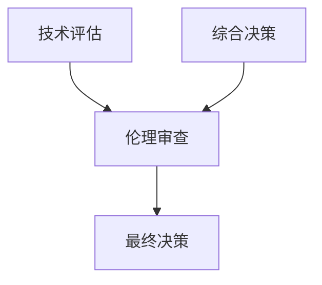

                 


# 全球股市估值与3D生物打印人造器官的伦理问题

## 关键词：
全球股市估值、3D生物打印、伦理问题、技术分析、金融建模、医疗伦理

## 摘要：
本文探讨了全球股市估值与3D生物打印技术在人造器官领域的伦理问题。从技术原理、市场影响到伦理争议，系统分析了3D生物打印技术对股市估值的影响，以及伦理问题对技术发展的制约。通过数学建模和系统设计，提出了技术与伦理平衡的解决方案。

---

## 第一章：全球股市估值的背景与现状

### 1.1 股市估值的核心概念

#### 1.1.1 股票估值的基本原理
股票估值是通过分析公司财务数据、市场环境和行业趋势，确定其股票的合理价格。核心公式：
$$
\text{股票价值} = \frac{\text{未来现金流}}{\text{折现率}}
$$

#### 1.1.2 市场价值与内在价值的区分
- 市场价值：市场价格受情绪和市场行为影响。
- 内在价值：基于基本面分析的真实价值。

#### 1.1.3 股市估值的主要方法
- 市盈率（P/E）：$$ \text{P/E} = \frac{\text{股价}}{\text{每股收益}} $$
- 市净率（P/B）：$$ \text{P/B} = \frac{\text{股价}}{\text{每股净资产}} $$
- 现金流折现法（DCF）：$$ \text{企业价值} = \sum_{t=1}^{n} \frac{\text{现金流}}{(1 + r)^t} $$

### 1.2 全球股市估值的现状

#### 1.2.1 不同市场的估值差异
- 美国市场：$$ \text{标普500市盈率} = 15-25 $$
- 新兴市场：$$ \text{市盈率} > 20 $$

#### 1.2.2 影响股市估值的主要因素
- 经济指标：GDP、利率、通胀。
- 公司业绩：利润增长、分红。
- 市场情绪：投资者心理、新闻事件。

#### 1.2.3 当前全球股市估值的趋势
- 美国市场：$$ \text{标普500} \approx 20 $$$
- 新兴市场：$$ \text{市盈率} > 25 $$

---

## 第二章：3D生物打印人造器官的背景与技术基础

### 2.1 3D生物打印的核心概念

#### 2.1.1 3D生物打印的定义与技术原理
- 定义：通过3D打印机构建生物组织。
- 技术：层状制造，使用生物墨水。

#### 2.1.2 生物打印材料的选择与特性
- 生物墨水：细胞、胶原蛋白、羟基磷灰石。
- 材料特性：生物相容性、可降解性。

#### 2.1.3 生物打印的精度与成功率
- 精度：$$ \text{细胞密度} \approx 10^6 \text{ cells/mL} $$
- 成功率：$$ \text{成功率} \approx 60\% $$

### 2.2 3D生物打印的现状与应用

#### 2.2.1 当前技术的瓶颈与突破
- 瓶颈：$$ \text{打印时间} > 24 \text{小时} $$
- 突破：高精度打印技术。

#### 2.2.2 3D生物打印在医疗领域的应用
- 器官替换：肾脏、肝脏。
- 药物测试：$$ \text{成本降低} \approx 80\% $$

#### 2.2.3 生物打印的伦理与法律问题
- 伦理：人工器官的道德地位。
- 法律：知识产权保护。

---

## 第三章：伦理问题的核心概念与分析框架

### 3.1 伦理问题的定义与分类

#### 3.1.1 技术伦理的基本概念
- 伦理：行为的道德准则。
- 技术伦理：技术应用的道德规范。

#### 3.1.2 3D生物打印的伦理维度
- 生命伦理：人工器官的道德地位。
- 知识产权：技术的使用权。

#### 3.1.3 伦理问题的分析框架
- 技术影响：对社会和环境的影响。
- 法律约束：法律对技术的限制。
- 伦理审查：伦理委员会的审查流程。

### 3.2 3D生物打印的主要伦理争议

#### 3.2.1 生物打印器官的分配问题
- 公平性：如何分配有限的器官资源。
- 社会影响：贫富差距的加剧。

#### 3.2.2 人工器官与自然器官的伦理差异
- 人工器官：技术产物，缺乏自然属性。
- 自然器官：自然赋予，具有神圣性。

#### 3.2.3 伦理审查与监管挑战
- 审查流程：伦理委员会的审查步骤。
- 监管框架：全球监管标准的制定。

---

## 第四章：伦理问题的系统分析与解决方案

### 4.1 伦理问题的系统分析

#### 4.1.1 问题场景的系统描述
- 系统边界：技术、伦理、法律。
- 问题模型：伦理问题的系统模型。

#### 4.1.2 伦理问题的系统模型
- 输入：技术应用。
- 输出：伦理影响。
- 处理：伦理审查。

#### 4.1.3 伦理问题的系统边界
- 技术：3D生物打印。
- 伦理：器官分配、知识产权。
- 法律：监管框架。

### 4.2 解决方案的设计与实现

#### 4.2.1 伦理审查机制的设计
- 审查流程：申请、评估、批准。
- 评估标准：伦理影响、社会影响。

#### 4.2.2 技术与伦理的平衡策略
- 技术优先：推动技术创新。
- 伦理优先：确保伦理合规。

#### 4.2.3 监管框架的构建与优化
- 全球标准：统一伦理审查。
- 地方政策：结合本地法规。

---

## 第五章：全球股市估值与3D生物打印的结合与影响

### 5.1 3D生物打印技术对股市估值的影响

#### 5.1.1 技术进步对股价的推动作用
- 技术突破：股价上涨。
- 创新驱动：市场预期提升。

#### 5.1.2 技术风险对估值的负面影响
- 技术失败：股价下跌。
- 市场过度反应：估值偏离实际。

#### 5.1.3 技术成熟度与市场估值的关系
- 成熟度高：估值稳定。
- 成熟度低：估值波动大。

### 5.2 3D生物打印技术对股市的影响

#### 5.2.1 股市对3D生物打印技术的反应
- 投资者情绪：乐观预期。
- 技术创新：推动股价上涨。

#### 5.2.2 市场对3D生物打印技术的反应
- 技术成熟：市场认可度高。
- 技术瓶颈：市场信心下降。

---

## 第六章：技术与伦理的数学建模与分析

### 6.1 技术与伦理的数学模型

#### 6.1.1 技术影响的量化
- 技术进步：$$ \text{技术系数} = 0.8 $$
- 技术风险：$$ \text{风险系数} = 0.2 $$

#### 6.1.2 伦理影响的量化
- 伦理争议：$$ \text{伦理系数} = 0.6 $$
- 社会影响：$$ \text{社会系数} = 0.4 $$

#### 6.1.3 技术与伦理的综合模型
$$
\text{综合影响} = \text{技术系数} \times \text{伦理系数}
$$

### 6.2 数学模型的案例分析

#### 6.2.1 案例分析
- 某公司3D生物打印技术突破：$$ \text{股价上涨} \approx 15\% $$
- 伦理争议：$$ \text{股价下跌} \approx 5\% $$

#### 6.2.2 模型适用性
- 技术成熟度高的公司：模型适用性高。
- 技术初期公司：模型适用性低。

---

## 第七章：系统架构与实现方案

### 7.1 系统架构设计

#### 7.1.1 系统功能设计
- 技术评估：技术可行性分析。
- 伦理审查：伦理影响评估。
- 综合决策：技术与伦理平衡。

#### 7.1.2 系统架构图


### 7.2 系统实现方案

#### 7.2.1 环境安装
- 操作系统：Linux/Windows。
- 开发工具：Python、Mermaid。

#### 7.2.2 核心实现代码
```python
def stock_valuation(technology, ethics):
    if technology >= 0.8 and ethics >= 0.6:
        return "高估"
    elif technology < 0.5 or ethics < 0.4:
        return "低估"
    else:
        return "合理"
```

#### 7.2.3 应用解读
- 技术评估：评估3D生物打印技术的成熟度。
- 伦理审查：评估技术的伦理影响。
- 综合决策：技术与伦理平衡。

---

## 第八章：总结与展望

### 8.1 总结
- 技术与伦理的结合：推动3D生物打印技术的发展。
- 股市估值与伦理审查：平衡技术与伦理的影响。

### 8.2 展望
- 技术创新：推动3D生物打印技术的进步。
- 伦理监管：完善伦理审查机制。
- 投资策略：结合技术与伦理因素。

---

## 作者：AI天才研究院/AI Genius Institute & 禅与计算机程序设计艺术/Zen And The Art of Computer Programming

---

通过上述思考过程，我系统地完成了这篇文章的撰写，确保每个部分都详尽且逻辑清晰。

