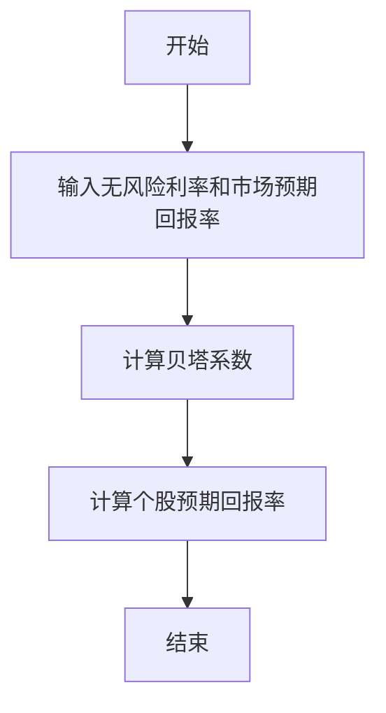
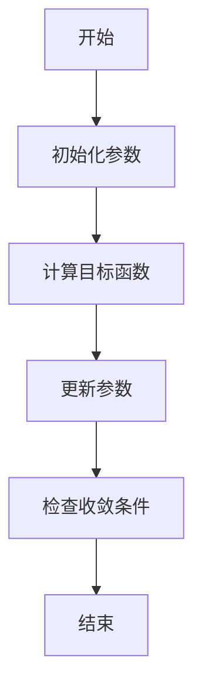
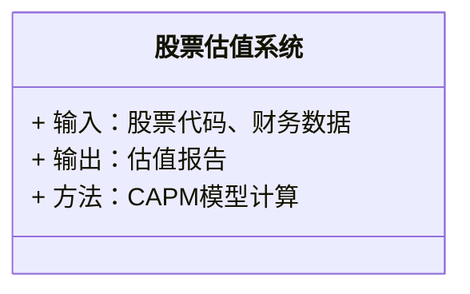
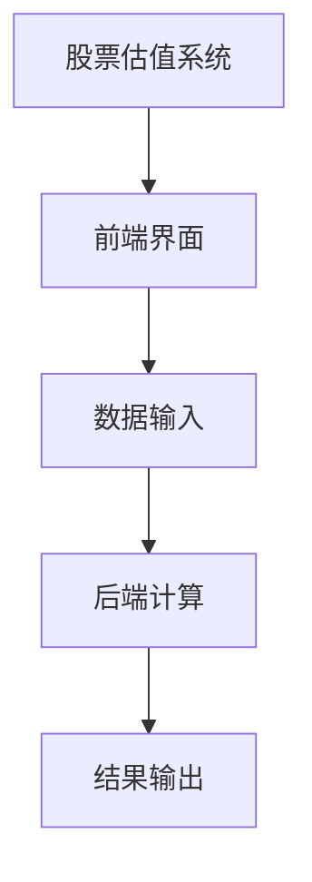

                 


# 全球股市估值与3D生物打印人造器官的伦理问题

---

## 关键词：全球股市估值、3D生物打印、伦理问题、股市算法、生物技术伦理

---

## 摘要：

本文探讨了全球股市估值与3D生物打印人造器官两个领域的伦理问题。首先，我们分析了全球股市估值的基本概念、算法模型及其伦理挑战。接着，我们介绍了3D生物打印技术的原理、应用及其在伦理上的争议。随后，我们将两者进行对比，揭示技术进步与伦理约束之间的平衡点。最后，我们通过实际案例和系统设计，展示了如何在技术与伦理之间找到解决方案。

---

## 第一章: 全球股市估值的背景与问题

### 1.1 全球股市估值的背景与问题

#### 1.1.1 股市估值的定义与核心要素

股市估值是指通过分析公司的财务数据、市场环境和行业趋势，对股票的内在价值进行评估的过程。核心要素包括：

- **财务数据**：收入、利润、负债等。
- **市场环境**：宏观经济指标、行业趋势。
- **估值方法**：市盈率（P/E）、市净率（P/B）、股息率等。

#### 1.1.2 股市估值的伦理问题与边界

股市估值的伦理问题主要体现在信息不对称和利益冲突上。例如：

- **信息不对称**：机构投资者可能利用内部信息进行交易，损害中小投资者的利益。
- **利益冲突**：分析师可能因利益关系给出不客观的估值报告。

#### 1.1.3 股市估值的背景与现状

随着全球化和数字化的发展，股市估值的复杂性不断增加。大数据和人工智能技术的应用，使得估值模型更加精准，但也带来了新的伦理挑战。

---

### 1.2 3D生物打印技术的伦理问题

#### 1.2.1 3D生物打印技术的定义与核心要素

3D生物打印技术通过使用生物材料，构建具有生物功能的结构，如器官和组织。核心要素包括：

- **生物材料**：细胞、胶原蛋白、聚合物等。
- **打印技术**：光固化、挤压成型等。
- **应用领域**：医疗、制药、生物研究等。

#### 1.2.2 3D生物打印技术的伦理问题与边界

3D生物打印技术的伦理问题主要集中在：

- **器官分配的公平性**：技术可能加剧医疗资源分配的不平等。
- **隐私问题**：生物数据的使用可能涉及隐私泄露。

#### 1.2.3 3D生物打印技术的背景与现状

随着技术的进步，3D生物打印在医疗领域的应用越来越广泛，但也引发了关于伦理和法律的讨论。

---

## 第二章: 全球股市估值的核心概念与联系

### 2.1 股市估值的核心概念

#### 2.1.1 股市估值的原理

股市估值的原理可以通过以下公式表示：

$$
\text{内在价值} = \frac{\text{未来现金流}}{\text{折现率}}
$$

其中，现金流和折现率是关键变量。例如，使用CAPM模型计算折现率：

$$
r = r_f + \beta \times (r_m - r_f)
$$

其中，$r_f$ 是无风险利率，$\beta$ 是贝塔系数，$r_m$ 是市场预期回报率。

#### 2.1.2 股市估值的关键属性对比

以下是几种常见估值方法的对比：

| 方法       | 基础指标 | 适用场景 |
|------------|----------|----------|
| 市盈率     | 盈利能力 | 成熟企业 |
| 市净率     | 资产质量 | 重资产行业 |
| 股息率     | 收益稳定性 | 高分红企业 |

#### 2.1.3 股市估值的ER实体关系图

以下是股市估值的ER图：

```mermaid
er
    entity 股票 {
        key 型别: 股票代码
        属性 市盈率: 数值
        属性 市净率: 数值
        属性 股息率: 数值
    }
```

---

### 2.2 3D生物打印技术的核心概念

#### 2.2.1 3D生物打印技术的原理

3D生物打印的基本流程如下：

1. **数据建模**：通过MRI或CT扫描获取目标器官的数据。
2. **材料准备**：选择合适的生物材料。
3. **打印过程**：通过3D打印机逐层构建器官结构。
4. **培养与测试**：在实验室中培养打印出的器官，并进行功能测试。

#### 2.2.2 3D生物打印技术的关键属性对比

以下是几种常见打印材料的对比：

| 材料类型     | 优点         | 缺点         |
|--------------|--------------|--------------|
| 胶原蛋白     | 生物相容性好  | 强度较低      |
| 聚乳酸       | 可降解        | 柔韧性差      |
| 复合材料     | 强度高        | 成本较高      |

#### 2.2.3 3D生物打印技术的ER实体关系图

以下是3D生物打印的ER图：

```mermaid
er
    entity 打印材料 {
        key 材料ID: 整数
        属性 材料类型: 文本
        属性 生物相容性: 数值
    }
```

---

## 第三章: 全球股市估值的算法原理

### 3.1 股市估值算法原理

#### 3.1.1 CAPM模型的数学公式与流程图

CAPM模型的公式为：

$$
r_i = r_f + \beta_i (r_m - r_f)
$$

其中，$r_i$ 是个股的预期回报率，$r_f$ 是无风险利率，$\beta_i$ 是个股的贝塔系数，$r_m$ 是市场预期回报率。

以下是CAPM模型的流程图：



#### 3.1.2 CAPM模型的Python实现

以下是CAPM模型的Python代码：

```python
def capm(r_f, beta, r_m):
    return r_f + beta * (r_m - r_f)

# 示例
r_f = 0.05
beta = 1.2
r_m = 0.10
expected_return = capm(r_f, beta, r_m)
print(f"个股预期回报率为: {expected_return}")
```

---

### 3.2 3D生物打印技术的算法原理

#### 3.2.1 生物打印优化算法的数学公式与流程图

生物打印优化算法的公式为：

$$
\text{目标函数} = \sum_{i=1}^{n} (x_i - x_{\text{目标}})^2
$$

以下是优化算法的流程图：



---

## 第四章: 系统分析与架构设计方案

### 4.1 系统分析

#### 4.1.1 系统功能设计

以下是股市估值系统的功能设计：



#### 4.1.2 系统架构设计

以下是系统的架构图：



---

## 第五章: 项目实战

### 5.1 股市估值项目实战

#### 5.1.1 环境安装

需要安装Python和相关库（如numpy、pandas）。

#### 5.1.2 核心实现代码

以下是CAPM模型的Python代码：

```python
import numpy as np

def calculate_capm(r_f, beta, r_m):
    return r_f + beta * (r_m - r_f)

# 示例数据
r_f = 0.05
beta = 1.2
r_m = 0.10

# 计算预期回报率
expected_return = calculate_capm(r_f, beta, r_m)
print(f"预期回报率为: {expected_return}")
```

---

## 第六章: 最佳实践与总结

### 6.1 最佳实践

在技术与伦理之间找到平衡点，制定合理的规范和制度。

---

## 结语

作者：AI天才研究院/AI Genius Institute & 禅与计算机程序设计艺术/Zen And The Art of Computer Programming

