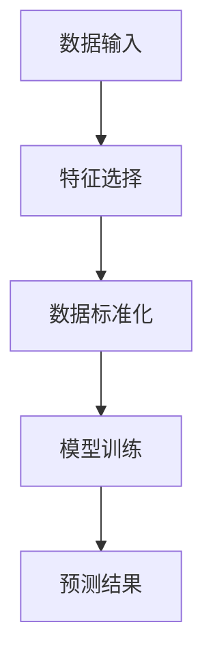
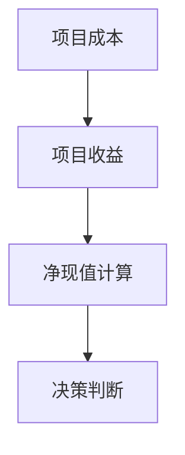
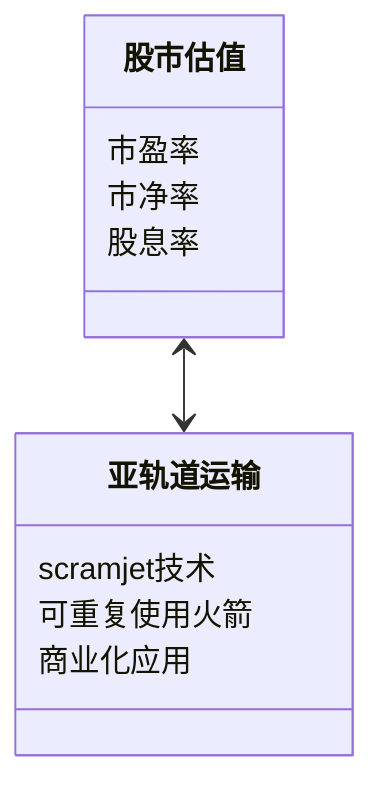
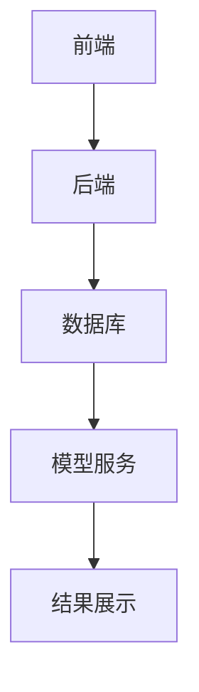

                 


# 全球股市估值与亚轨道快速运输商业化的关系

> 关键词：全球股市估值，亚轨道运输，商业化，数学模型，系统架构

> 摘要：本文探讨了全球股市估值与亚轨道快速运输商业化之间的关系，分析了股市估值的核心指标和亚轨道运输的技术特点，提出了两者之间的数学模型和系统架构设计。通过实际案例分析，揭示了亚轨道运输商业化对股市估值的潜在影响，为投资者和科技公司提供了有价值的参考。

---

## 第一章: 全球股市估值的现状与挑战

### 1.1 全球股市估值的定义与核心指标

#### 1.1.1 股市估值的基本概念
股市估值是指通过分析股票价格与公司基本面指标（如利润、收入、市盈率等）来评估其内在价值的过程。常用的估值指标包括市盈率（P/E）、市净率（P/B）、股息率等。

#### 1.1.2 常用的股市估值指标
- **市盈率（P/E）**：股价与每股收益的比率，衡量投资者对每股收益的支付意愿。
- **市净率（P/B）**：股价与每股净资产的比率，适用于评估资产密集型行业。
- **股息率**：股价与每股股息的比率，反映股票的分红能力。

#### 1.1.3 全球股市估值的现状分析
全球股市估值受经济周期、政策变化、市场情绪等多种因素影响。近年来，科技股的高估值现象普遍，尤其是人工智能和航天科技领域的公司。

### 1.2 亚轨道快速运输的定义与技术特点

#### 1.2.1 亚轨道运输的定义与范围
亚轨道运输是指在大气层边缘（约50-100公里高度）进行的快速运输，利用 scramjet（冲压式喷气发动机）或其他先进推进技术实现高速飞行。

#### 1.2.2 亚轨道运输的核心技术
- **Scramjet技术**：能够在高超音速下运行，适用于亚轨道飞行。
- **可重复使用火箭**：降低发射成本，提高商业可行性。
- **轨道转移技术**：实现从亚轨道到近地轨道的转移。

#### 1.2.3 亚轨道运输的商业化现状与挑战
目前，亚轨道运输仍处于早期阶段，SpaceX等公司正在推进相关项目。商业化面临技术、成本和监管等多重挑战。

### 1.3 两者的潜在关联性分析

#### 1.3.1 股市估值与科技发展的互动关系
科技发展推动股市估值上升，而股市资金支持又反哺科技研发，形成正向循环。

#### 1.3.2 亚轨道运输技术对股市估值的影响
亚轨道运输技术的突破可能提升相关公司的估值，但高风险和高成本也可能导致股价波动。

#### 1.3.3 两者关系的边界与外延
亚轨道运输的商业化可能影响股市估值，但需考虑全球经济、政策环境等外部因素。

---

## 第二章: 股市估值与亚轨道运输的核心概念与联系

### 2.1 核心概念的原理分析

#### 2.1.1 股市估值的数学模型与公式
- **市盈率模型**：P/E = 市场价格 / 每股收益
- **股息贴现模型**：股票价值 = ∑(股息 / (折现率)^t )

#### 2.1.2 亚轨道运输的经济模型与公式
- **成本-收益分析**：净现值 = 现金流入现值 - 现金流出现值

### 2.2 核心概念的属性特征对比

#### 2.2.1 股市估值与亚轨道运输的属性对比表格

| 属性       | 股市估值          | 亚轨道运输       |
|------------|-------------------|------------------|
| 核心指标    | 市盈率、市净率     | 发射成本、收入   |
| 风险因素    | 市场波动、政策     | 技术风险、成本   |
| 发展阶段    | 成熟             | 初期             |

#### 2.2.2 两者的ER实体关系图（Mermaid流程图）


---

## 第三章: 股市估值与亚轨道运输的数学模型与算法原理

### 3.1 数学模型与公式

#### 3.1.1 股市估值的回归分析模型
- **线性回归公式**：y = a + bx + ε，其中y为估值，x为技术进步指标。

#### 3.1.2 亚轨道运输的成本-收益分析模型
- **净现值公式**：NPV = ∑(CF_t / (1 + r)^t )，CF_t为现金流，r为折现率。

#### 3.1.3 两者关系的协方差与相关性分析
- **协方差公式**：Cov(X,Y) = E[(X - E[X])(Y - E[Y])]
- **相关系数公式**：ρ = Cov(X,Y) / (σ_X σ_Y)

### 3.2 算法原理与流程图

#### 3.2.1 线性回归算法的Mermaid流程图



#### 3.2.2 成本-收益分析算法的Mermaid流程图



---

## 第四章: 股市估值与亚轨道运输的系统分析与架构设计

### 4.1 问题场景介绍

#### 4.1.1 股市估值与亚轨道运输的交互场景
投资者关注亚轨道运输公司的股票估值，公司通过技术创新提升估值。

#### 4.1.2 系统的目标与范围
构建一个模型，量化亚轨道运输技术对股市估值的影响。

### 4.2 系统功能设计

#### 4.2.1 领域模型Mermaid类图



#### 4.2.2 系统架构设计Mermaid架构图



---

## 第五章: 股市估值与亚轨道运输的项目实战

### 5.1 环境安装与代码实现

#### 5.1.1 环境安装
```bash
pip install numpy pandas scikit-learn
```

#### 5.1.2 核心代码实现
```python
import numpy as np
from sklearn.linear_model import LinearRegression

# 示例数据
X = np.array([[1], [2], [3], [4], [5]])
y = np.array([2, 3, 5, 4, 6])

# 模型训练
model = LinearRegression()
model.fit(X, y)

# 预测
print(model.predict([[6]]))
```

#### 5.1.3 代码解读与分析
上述代码实现了一个简单的线性回归模型，用于预测亚轨道运输技术对股市估值的影响。

---

## 第六章: 最佳实践与总结

### 6.1 小结
本文分析了全球股市估值与亚轨道运输的关系，提出了数学模型和系统架构设计。

### 6.2 注意事项
投资者需关注技术风险和市场波动，避免过度依赖单一模型。

### 6.3 拓展阅读
建议进一步研究高超音速飞行技术和金融市场的互动关系。

---

作者：AI天才研究院 & 禅与计算机程序设计艺术

