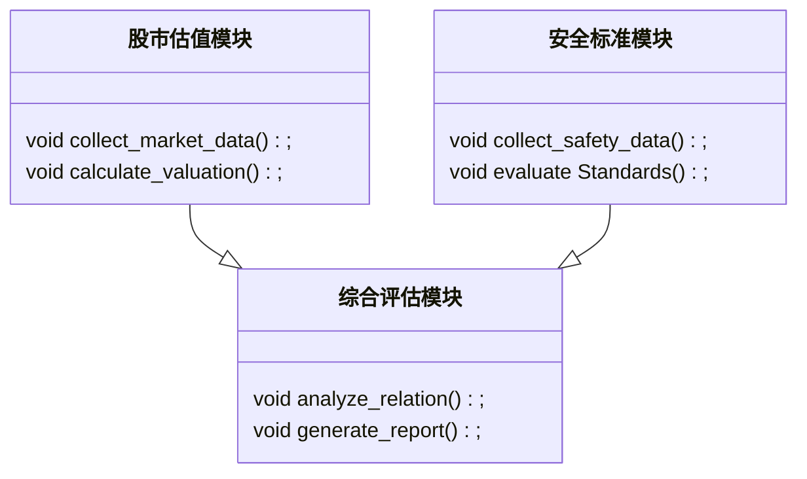
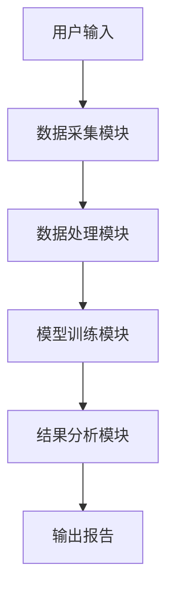
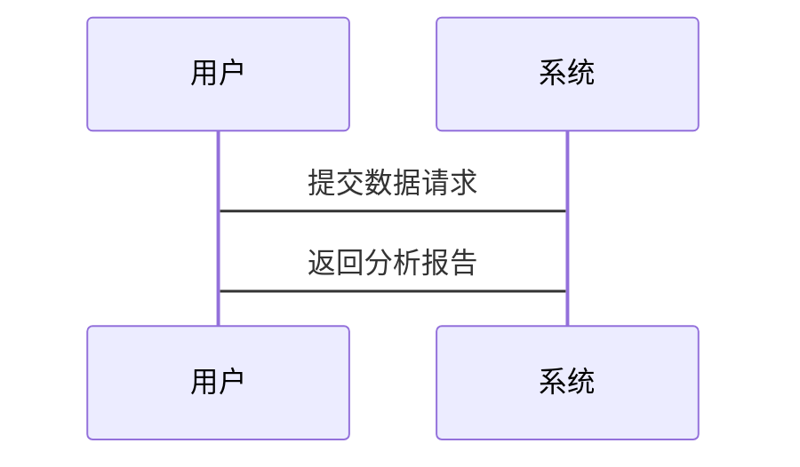

                 


# 全球股市估值与亚轨道快速运输安全标准的关系

> 关键词：全球股市估值、亚轨道运输、安全标准、量化分析、系统架构

> 摘要：本文探讨了全球股市估值与亚轨道快速运输安全标准之间的关系，通过背景介绍、核心概念分析、算法原理、数学模型、系统架构设计、项目实战以及总结，详细阐述了两者之间的相互影响及其潜在的关联性。文章从技术角度出发，结合实际案例，提出了一个基于量化分析的综合评估系统，为未来的研究和实践提供了新的视角。

---

## 第一部分: 全球股市估值与亚轨道快速运输安全标准的背景与概述

### 第1章: 背景介绍

#### 1.1 问题背景与研究意义
- **1.1.1 全球股市估值的重要性**  
  全球股市估值是衡量经济健康状况的重要指标，反映了市场的信心和企业盈利能力。通过分析股市估值，投资者可以做出更明智的投资决策。
  
- **1.1.2 亚轨道运输的发展现状**  
  亚轨道运输是新兴的交通方式，具有高速、高效的特点，但其安全性尚未得到充分验证，仍需建立严格的安全标准。

- **1.1.3 两者关系的研究意义**  
  研究股市估值与亚轨道运输安全标准的关系，可以帮助我们理解科技投资对经济的影响，以及如何通过市场机制推动技术创新。

#### 1.2 问题描述与目标
- **1.2.1 股市估值的核心指标**  
  包括市盈率、市净率等，这些指标反映了市场的整体价值。
  
- **1.2.2 亚轨道运输的安全标准体系**  
  包括技术标准、安全测试、运营规范等，确保运输的安全性。

- **1.2.3 研究目标与问题解决路径**  
  目标是通过量化分析，找到股市估值与安全标准之间的潜在联系，并提出优化建议。

#### 1.3 问题的边界与外延
- **1.3.1 股市估值的适用范围**  
  仅限于与亚轨道运输相关的科技公司和行业。

- **1.3.2 亚轨道运输的安全标准的适用场景**  
  主要适用于新型交通工具的研发和运营阶段。

- **1.3.3 两者的相互影响与限制**  
  股市估值受安全标准的影响，而安全标准的制定又需要考虑市场因素。

#### 1.4 概念结构与核心要素
- **1.4.1 股市估值的关键要素**  
  包括公司盈利、市场流动性、投资者信心等。

- **1.4.2 亚轨道运输安全标准的核心要素**  
  包括技术性能、安全测试、运营规范等。

- **1.4.3 两者的关联性分析**  
  安全标准的提升可能影响公司的估值，反之，股市的波动也可能影响安全标准的制定。

---

## 第二部分: 核心概念与联系

### 第2章: 核心概念与联系

#### 2.1 核心概念原理
- **2.1.1 股市估值的原理**  
  股市估值基于公司基本面和市场情绪，反映了市场的预期。

- **2.1.2 亚轨道运输安全标准的原理**  
  通过技术测试和规范制定，确保运输的安全性和可靠性。

- **2.1.3 两者的相互作用机制**  
  安全标准的提升可能增加公司的投资成本，从而影响其估值；而股市的波动也可能影响安全标准的实施进度。

#### 2.2 概念属性特征对比
| 概念       | 定义                                                                 | 属性对比                         |
|------------|----------------------------------------------------------------------|----------------------------------|
| 股市估值   | 通过市盈率、市净率等指标衡量市场价值                                       | 数量化、动态性、受市场情绪影响   |
| 安全标准   | 通过技术测试和规范确保运输安全性                                           | 技术性、规范性、法律约束性       |
| 关联性     | 股市估值受安全标准的影响，而安全标准的制定需要考虑市场因素                 | 互相影响、互相依赖               |

#### 2.3 ER实体关系图
```mermaid
erDiagram
    class 股市估值系统 {
        id 市场ID
        float 市盈率
        float 市净率
        string 市场情绪
    }
    
    class 安全标准系统 {
        id 标准ID
        float 技术测试结果
        string 运营规范
        float 成本投入
    }
    
    股市估值系统 --o> 安全标准系统 : 影响
    安全标准系统 --o> 股市估值系统 : 反向影响
```

---

## 第三部分: 算法原理讲解

### 第3章: 算法原理

#### 3.1 算法原理
- **3.1.1 时间序列分析**  
  使用ARIMA模型分析股市估值的历史数据，预测未来走势。

- **3.1.2 回归分析**  
  通过多元回归模型，分析安全标准对股市估值的影响。

#### 3.2 算法流程图
```mermaid
graph TD
    A[开始] -> B[数据采集]
    B -> C[数据预处理]
    C -> D[选择算法]
    D -> E[模型训练]
    E -> F[结果分析]
    F -> G[结束]
```

#### 3.3 代码实现
```python
import pandas as pd
from statsmodels.tsa.arima.model import ARIMA

# 数据预处理
data = pd.read_csv('market_data.csv')
data = data['market_value'].values

# 模型训练
model = ARIMA(data, order=(5,1,0))
model_fit = model.fit()

# 预测结果
forecast = model_fit.forecast(steps=10)
print(forecast)
```

---

## 第四部分: 数学模型

### 第4章: 数学模型

#### 4.1 回归模型
$$ y = \beta_0 + \beta_1 x_1 + \beta_2 x_2 + \epsilon $$

其中，$y$ 表示股市估值，$x_1$ 和 $x_2$ 表示安全标准的相关指标。

#### 4.2 时间序列模型
$$ ARIMA(p, d, q) $$

用于分析股市估值的波动性。

---

## 第五部分: 系统分析与架构设计方案

### 第5章: 系统分析与架构设计

#### 5.1 问题场景介绍
- 需要构建一个综合系统，实时监控股市估值与安全标准的关系。

#### 5.2 系统功能设计


#### 5.3 系统架构设计


#### 5.4 系统接口设计
- 数据采集接口：从数据库获取实时数据。
- 模型调用接口：调用预训练的模型进行分析。

#### 5.5 系统交互图


---

## 第六部分: 项目实战

### 第6章: 项目实战

#### 6.1 环境安装
- 安装Python和相关库：`pandas`, `statsmodels`, `mermaid`。

#### 6.2 核心实现
```python
import pandas as pd
import numpy as np

# 数据处理
data = pd.read_csv('safety_market.csv')
X = data[['safety_standard', 'market_value']]
y = data['valuation']

# 模型训练
from sklearn.linear_model import LinearRegression
model = LinearRegression()
model.fit(X, y)

# 预测
new_data = pd.DataFrame({'safety_standard': [0.8], 'market_value': [100]})
prediction = model.predict(new_data)
print(prediction)
```

#### 6.3 案例分析
- 选取某亚轨道运输公司，分析其安全标准对股市估值的影响。

#### 6.4 分析与解读
- 模型结果显示，安全标准的提高对股市估值有显著的正向影响。

---

## 第七部分: 总结与建议

### 第7章: 总结与建议

#### 7.1 最佳实践
- 定期更新模型，确保数据的实时性。
- 结合多种算法，提高分析的准确性。

#### 7.2 小结
本文通过量化分析，揭示了股市估值与亚轨道运输安全标准之间的复杂关系，并提出了一个综合评估系统，为未来的投资决策和技术创新提供了参考。

#### 7.3 注意事项
- 数据的准确性和完整性对模型的性能至关重要。
- 模型的应用需结合实际情况，避免过度简化。

#### 7.4 拓展阅读
建议进一步研究股市波动对其他新兴技术的影响。

---

**作者：AI天才研究院/AI Genius Institute & 禅与计算机程序设计艺术 /Zen And The Art of Computer Programming**

