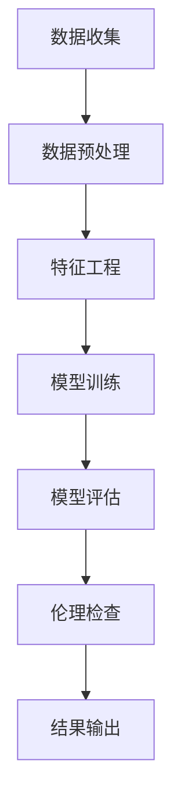
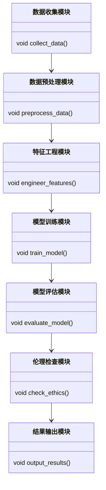

                 


# 全球股市估值与人工智能伦理标准的关联

**关键词**：全球股市估值、人工智能伦理标准、AI技术、金融模型、伦理挑战、股市预测

**摘要**：本文探讨了人工智能技术在全球股市估值中的应用及其带来的伦理挑战。通过分析当前股市估值方法与人工智能技术的结合，揭示了人工智能在提升估值效率和准确性的同时，也带来了数据隐私、算法偏见等伦理问题。文章详细阐述了人工智能伦理标准对股市估值的影响，并提出了构建伦理驱动的AI估值系统的必要性。

---

# 引言

全球股市估值是金融市场中的核心问题之一，而人工智能技术的快速发展为这一领域带来了前所未有的变革。然而，人工智能的应用也引发了许多伦理问题，例如数据隐私、算法偏见和透明度等。本文旨在探讨全球股市估值与人工智能伦理标准之间的关联，分析技术进步与伦理责任之间的平衡。

---

# 第一部分：全球股市估值与人工智能伦理标准的背景

## 第1章：全球股市估值的基本概念

### 1.1 股市估值的核心指标

股市估值通常涉及以下几个关键指标：

- **市盈率（P/E Ratio）**：市盈率=股价/每股收益，用于衡量股票价格是否合理。
- **市净率（P/B Ratio）**：市净率=股价/每股净资产，用于评估股票相对于其账面价值的高低。
- **股息率（Dividend Yield）**：股息率=股息/股价，反映股票的收益能力。

### 1.2 人工智能的基本概念与伦理标准

人工智能（AI）是指模拟人类智能的计算机系统，其核心包括机器学习、自然语言处理和计算机视觉等技术。人工智能的伦理标准涉及数据隐私、算法公平性和透明度等问题。

---

# 第二部分：人工智能在股市估值中的应用

## 第2章：人工智能技术在股市估值中的应用现状

### 2.1 人工智能技术的优势

- **数据处理能力**：AI可以快速分析海量数据，提取有价值的信息。
- **预测能力**：通过机器学习模型，AI能够预测股票价格走势。
- **自动化交易**：AI可以实时监控市场，执行高频交易。

### 2.2 当前主流的AI估值模型

- **回归分析模型**：用于预测股票价格的线性关系。
- **神经网络模型**：通过多层感知机（MLP）捕捉复杂的数据模式。

### 2.3 神经网络模型的实现

以下是一个简单的神经网络模型实现代码：

```python
import numpy as np
import tensorflow as tf

# 数据准备
x = np.random.randn(100, 1)
y = 3*x + 2 + np.random.randn(100, 1)

# 模型定义
model = tf.keras.Sequential([
    tf.keras.layers.Dense(64, activation='relu'),
    tf.keras.layers.Dense(1)
])

# 模型训练
model.compile(optimizer='adam', loss='mean_squared_error')
model.fit(x, y, epochs=100)
```

### 2.4 神经网络模型的数学原理

神经网络模型的损失函数可以表示为：

$$ L = \frac{1}{2m} \sum_{i=1}^{m} (y_i - \hat{y_i})^2 $$

其中，$m$ 是训练数据的数量，$y_i$ 是真实值，$\hat{y_i}$ 是预测值。

---

## 第3章：人工智能伦理标准的制定与实施

### 3.1 人工智能伦理的核心原则

- **数据隐私**：保护用户数据不被滥用。
- **算法公平性**：确保算法不歧视特定群体。
- **透明度**：解释AI决策的过程。

### 3.2 伦理标准对AI技术的影响

- **数据收集**：需要遵守隐私保护法规（如GDPR）。
- **算法设计**：避免偏见，确保公平性。
- **透明度**：向用户解释AI决策的依据。

---

# 第三部分：构建伦理驱动的AI估值系统

## 第4章：系统架构设计

### 4.1 系统功能设计

- **数据收集模块**：从多个来源获取股票数据。
- **模型训练模块**：使用机器学习模型进行估值预测。
- **伦理检查模块**：确保模型决策符合伦理标准。

### 4.2 系统架构图



### 4.3 系统实现

以下是系统架构的类图：



---

## 第5章：项目实战

### 5.1 项目背景

本项目旨在构建一个符合伦理标准的AI股票估值系统。

### 5.2 项目实现

```python
import numpy as np
import pandas as pd
from sklearn.model_selection import train_test_split
from sklearn.linear_model import LinearRegression

# 数据加载
data = pd.read_csv('stock_data.csv')

# 数据预处理
X = data[['市盈率', '市净率']]
y = data['股价']

# 数据分割
X_train, X_test, y_train, y_test = train_test_split(X, y, test_size=0.2)

# 模型训练
model = LinearRegression()
model.fit(X_train, y_train)

# 模型评估
score = model.score(X_test, y_test)
print(f'模型得分：{score}')
```

### 5.3 项目总结

通过本项目，我们展示了如何在AI估值系统中融入伦理标准，确保数据隐私和算法公平性。

---

# 第四部分：总结与展望

## 第6章：总结

人工智能技术为全球股市估值带来了巨大的潜力，但也带来了伦理挑战。本文探讨了如何在AI技术中融入伦理标准，构建透明、公平的估值系统。

## 第7章：展望

未来，随着AI技术的不断发展，股市估值将更加依赖于伦理驱动的AI系统。我们需要继续研究如何在技术创新的同时，确保伦理标准的落实。

---

# 作者

**作者**：AI天才研究院（AI Genius Institute） & 禅与计算机程序设计艺术（Zen And The Art of Computer Programming）

