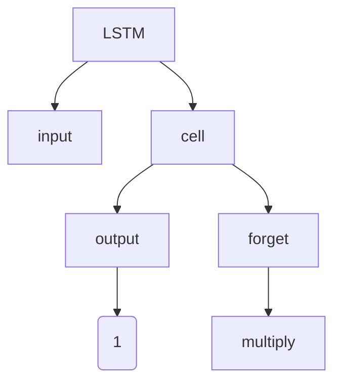
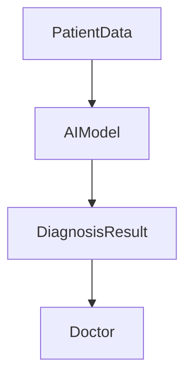
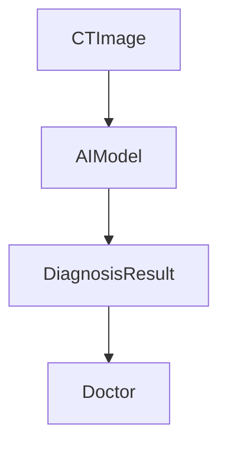

                 

# 全球股市估值与人工智能在个性化医疗中的应用

> 关键词：全球股市估值，人工智能，个性化医疗，机器学习，深度学习，LSTM网络，医疗数据分析

> 摘要：本文探讨了人工智能在全球股市估值和个性化医疗中的应用。首先，从股市估值的基本概念出发，分析了AI技术如何提升股市预测的准确性，重点介绍了机器学习和深度学习算法的应用，特别是LSTM网络在时间序列预测中的优势。随后，文章转向个性化医疗领域，探讨了AI在医疗数据分析、疾病诊断和治疗方案优化中的潜力，通过具体案例展示了AI如何助力个性化医疗的发展。最后，文章总结了AI在金融和医疗领域的应用前景，并提出了未来研究的方向。

---

## 第一部分：全球股市估值与人工智能的结合

### 第1章：全球股市估值概述

#### 1.1 股市估值的基本概念

股票估值是通过对公司财务数据、市场环境和行业趋势等多方面因素进行分析，估算出股票的内在价值。股市估值的准确性直接影响投资者的决策，是金融领域的重要研究方向。

#### 1.2 人工智能在股市估值中的作用

人工智能技术，尤其是机器学习和深度学习算法，能够处理海量的非结构化数据（如新闻、社交媒体评论等），提取隐含的市场情绪和趋势，从而提升股市估值的准确性。

---

### 第2章：人工智能技术基础

#### 2.1 机器学习与深度学习简介

机器学习是一种通过数据训练模型的技术，而深度学习则是机器学习的一种高级形式，通过多层神经网络模拟人类的思维方式。以下是几种常用的机器学习算法：

- **线性回归**：用于预测连续型变量，例如股票价格。
- **决策树**：用于分类和回归问题，能够处理复杂的非线性关系。
- **支持向量机（SVM）**：适用于分类问题，能够处理高维数据。

---

#### 2.2 数据预处理与特征工程

数据预处理是机器学习模型训练的关键步骤，主要包括数据清洗、标准化、特征选择等。以下是数据预处理的主要步骤：

1. **数据清洗**：去除噪声数据和缺失值。
2. **特征选择**：通过相关性分析选择重要的特征。
3. **数据增强**：通过技术手段增加数据的多样性。

---

### 第3章：基于AI的股市预测模型

#### 3.1 时间序列分析与预测

时间序列分析是研究数据随时间变化的模式和趋势，常用于股票价格预测。以下是几种常用的时间序列预测方法：

- **ARIMA模型**：基于历史数据的自回归和滑动平均模型。
- **Prophet模型**：由Facebook开源的时间序列预测工具，适用于非专业的用户。

#### 3.2 LSTM网络在股市预测中的应用

长短时记忆网络（LSTM）是一种特殊的循环神经网络，能够有效地捕捉时间序列中的长-term依赖关系。以下是LSTM网络的结构图：

---

## 第二部分：人工智能在个性化医疗中的应用

### 第4章：个性化医疗概述

#### 4.1 个性化医疗的定义与特点

个性化医疗是根据患者的基因、生活方式和环境因素量身定制的治疗方案，能够显著提高治疗效果和患者生活质量。

#### 4.2 人工智能在医疗领域的潜力

人工智能技术能够帮助医生快速分析大量的医疗数据，辅助诊断和治疗方案的制定。以下是几种常见的AI医疗应用场景：

- **疾病诊断**：通过医学影像和症状分析辅助医生诊断。
- **药物研发**：利用AI技术加速新药的研发过程。
- **治疗方案优化**：根据患者的个体特征制定最佳治疗方案。

---

### 第5章：基于AI的医疗数据分析

#### 5.1 医疗数据的采集与处理

医疗数据的采集和处理是个性化医疗的关键步骤，主要包括以下内容：

- **数据采集**：通过电子健康记录（EHR）和可穿戴设备获取患者的医疗数据。
- **数据处理**：对数据进行清洗、标注和分类。

---

#### 5.2 基于AI的疾病诊断系统

以下是基于AI的疾病诊断系统的架构图：

---

### 第6章：AI在个性化医疗中的应用案例

#### 6.1 肿瘤诊断中的AI应用

以肺癌诊断为例，AI可以通过分析CT图像中的病灶特征，辅助医生快速识别早期肺癌病变。以下是肺癌诊断的流程图：

---

## 总结与展望

人工智能技术正在深刻改变金融和医疗行业的面貌。通过本文的探讨，我们可以看到AI在股市估值和个性化医疗中的巨大潜力。未来，随着技术的不断进步，AI将在更多领域发挥重要作用，为人类带来更大的福祉。

---

作者：AI天才研究院/AI Genius Institute & 禅与计算机程序设计艺术 /Zen And The Art of Computer Programming

