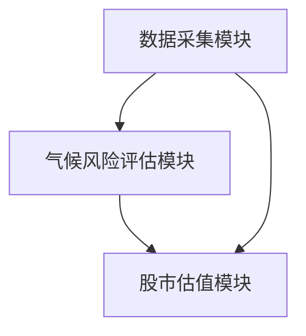
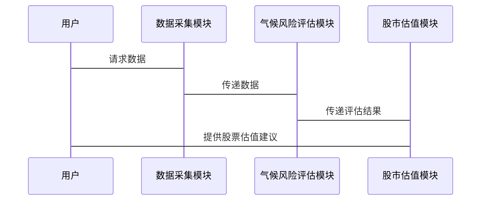

                 

---

# 全球股市估值与人工智能在气候变化适应中的应用

> 关键词：全球股市估值，人工智能，气候变化适应，机器学习，时间序列分析

> 摘要：本文探讨了全球股市估值的现状与挑战，以及人工智能在应对气候变化适应中的应用前景。通过详细分析股市估值的核心概念、气候变化对金融市场的冲击，以及人工智能在气候预测和风险管理中的算法原理，本文旨在为读者提供一个全面的视角，展示如何利用技术手段应对气候变化带来的挑战，并优化股市估值模型。文章还结合实际案例，展示了如何通过系统架构设计和项目实战，将理论应用于实践，为未来的气候变化适应和股市估值提供参考。

---

# 第一部分: 全球股市估值与气候变化适应的背景与挑战

## 第1章: 全球股市估值的现状与挑战

### 1.1 全球股市估值的核心概念

#### 1.1.1 股市估值的基本原理
股市估值是通过对公司财务数据、市场环境和经济指标的分析，确定公司股票的合理价格。常用的方法包括市盈率（P/E）、市净率（P/B）和现金流折现模型（DCF）。这些方法帮助投资者评估股票的价值，从而做出投资决策。

#### 1.1.2 全球化背景下的股市特点
全球化促进了跨国投资和资本流动，使得股市估值更加复杂。不同国家和地区的经济政策、市场结构和文化差异影响着股市的表现。此外，全球化还带来了更高的市场波动性和不确定性，尤其是在气候变化等外部因素的影响下，股市估值面临新的挑战。

#### 1.1.3 股市估值的边界与外延
股市估值不仅仅是对单个公司的评估，还包括对整个市场的分析。随着气候变化、技术进步和社会变革的影响，股市估值的边界不断扩大，涉及可持续发展、绿色金融和ESG（环境、社会、治理）投资等因素。

### 1.2 气候变化对金融市场的冲击

#### 1.2.1 气候风险的定义与分类
气候风险是指由于气候变化引起的物理风险和转型风险。物理风险包括极端天气事件对资产的破坏，而转型风险则涉及政策变化、技术进步和市场偏好变化对企业的影响。

#### 1.2.2 气候变化对股市估值的影响
气候变化可能导致企业利润下降、资产贬值和市场信心下降。此外，气候变化还可能通过政策变化和市场预期影响股市的整体表现。例如，碳排放成本的增加可能会降低企业的净利润，从而影响股票的估值。

#### 1.2.3 气候风险的量化与评估
量化气候风险需要结合气候模型和金融模型。常用的方法包括情景分析、蒙特卡罗模拟和压力测试。这些方法帮助投资者评估气候变化对企业财务状况和股票价值的影响。

## 第2章: 人工智能在气候变化适应中的应用前景

### 2.1 人工智能与气候变化适应的核心联系

#### 2.1.1 人工智能在气候预测中的作用
人工智能可以通过分析大量的气候数据，预测极端天气事件的发生概率和影响范围。例如，使用机器学习模型分析历史气候数据，预测未来几年的气候变化趋势。

#### 2.1.2 人工智能在气候风险管理中的应用
人工智能可以帮助企业识别和评估气候风险，并制定相应的风险管理策略。例如，使用自然语言处理技术分析新闻报道和政策文件，识别可能影响企业的气候相关风险。

#### 2.1.3 人工智能与可持续发展
人工智能在推动可持续发展方面发挥着重要作用。例如，通过优化能源使用、减少碳排放和提高资源利用效率，人工智能可以帮助企业实现可持续发展目标。

### 2.2 人工智能在气候变化适应中的核心概念

#### 2.2.1 数据驱动的气候模型
人工智能依赖于大量的数据来建立气候模型。这些数据包括历史气候数据、卫星图像、地理数据和社会经济数据。通过分析这些数据，人工智能可以预测气候变化的趋势和影响。

#### 2.2.2 气候适应性分析的算法原理
人工智能算法，如支持向量机（SVM）和随机森林（Random Forest），可以用于分析气候适应性。这些算法通过学习历史数据，识别气候适应性模式，并预测未来的气候变化情景。

#### 2.2.3 气候适应性评估的系统架构
气候适应性评估系统通常包括数据采集、数据分析和结果展示三个模块。数据采集模块收集气候数据和相关社会经济数据；数据分析模块使用机器学习算法进行气候适应性分析；结果展示模块将分析结果以可视化形式呈现给用户。

---

# 第二部分: 股市估值与气候变化适应的核心概念与联系

## 第3章: 股市估值的核心概念与模型

### 3.1 股市估值的数学模型

#### 3.1.1 市盈率模型
市盈率（P/E）是衡量股票价值的重要指标之一。市盈率 = 股票价格 / 每股净利润。市盈率越低，通常意味着股票的投资价值越高。

#### 3.1.2 市净率模型
市净率（P/B）是另一种常用的估值指标。市净率 = 股票价格 / 每股净资产。市净率较低的股票通常被认为具有较高的投资价值。

#### 3.1.3 现金流折现模型
现金流折现模型（DCF）通过预测未来现金流，将其折现为当前价值，以评估股票的内在价值。DCF模型通常用于评估具有稳定现金流和较高成长性的公司。

### 3.2 气候变化对股市估值的影响路径

#### 3.2.1 碳排放成本的量化
碳排放成本是气候变化对股市估值的重要影响因素。随着碳排放政策的收紧，企业的碳排放成本可能会增加，从而影响其净利润和股票价值。

#### 3.2.2 可再生能源投资的影响
可再生能源的投资热潮可能影响传统能源企业的估值。随着可再生能源技术的进步和成本的降低，传统能源企业可能面临转型压力，影响其股票价值。

#### 3.2.3 气候政策对股市估值的调节作用
气候政策，如碳税和可再生能源补贴，可能通过影响企业的成本结构和市场竞争力，进而影响股市估值。例如，碳税的实施可能会增加企业的运营成本，降低其净利润，从而影响股票价格。

## 第4章: 人工智能在气候变化适应中的核心算法

### 4.1 机器学习在气候预测中的应用

#### 4.1.1 线性回归模型
线性回归是一种简单而有效的机器学习算法，适用于预测连续型变量。例如，可以使用线性回归模型预测气温变化的趋势。

#### 4.1.2 支持向量机模型
支持向量机（SVM）是一种强大的监督学习算法，适用于分类和回归问题。SVM可以用于分类不同的气候事件类型，例如将气候事件分为极端天气事件和非极端天气事件。

#### 4.1.3 随机森林模型
随机森林是一种基于决策树的集成学习算法，具有较高的准确性和鲁棒性。随机森林可以用于分析复杂的气候数据，预测气候变化情景。

### 4.2 时间序列分析在气候风险管理中的应用

#### 4.2.1 ARIMA模型
ARIMA（自回归积分滑动平均模型）是一种常用的时间序列分析模型，适用于预测具有趋势和季节性的数据。例如，可以使用ARIMA模型预测未来几年的气温变化。

#### 4.2.2 LSTM模型
LSTM（长短期记忆网络）是一种特殊的循环神经网络，适用于处理长序列数据。LSTM模型可以用于预测气候时间序列数据，如降雨量和气温变化。

#### 4.2.3 GARCH模型
GARCH（广义自回归条件异方差模型）用于预测金融时间序列的波动性。GARCH模型可以用于预测气候数据的波动性，例如预测极端天气事件的发生频率。

---

# 第三部分: 股市估值与气候变化适应的系统架构与算法实现

## 第5章: 股市估值与气候变化适应的系统架构设计

### 5.1 系统功能设计

#### 5.1.1 数据采集模块
数据采集模块负责收集与股市估值和气候变化相关的数据，包括历史股价数据、气候数据、政策文件和市场新闻。

#### 5.1.2 气候风险评估模块
气候风险评估模块通过分析气候数据和企业财务数据，评估气候变化对企业财务状况和股市估值的影响。

#### 5.1.3 股市估值模块
股市估值模块结合气候风险评估结果和传统估值模型，预测股票的合理价格，并提供建议。

### 5.2 系统架构设计

#### 5.2.1 模块化设计
系统采用模块化设计，包括数据采集模块、气候风险评估模块和股市估值模块。每个模块独立开发，便于维护和扩展。

#### 5.2.2 系统架构图
以下是系统架构的Mermaid图：

#### 5.2.3 接口设计
系统通过API接口与外部数据源和用户交互。数据采集模块通过API接口获取外部数据，气候风险评估模块通过API接口向用户展示评估结果，股市估值模块通过API接口向用户提供股票估值建议。

#### 5.2.4 交互流程图
以下是系统交互的Mermaid图：

## 第6章: 项目实战

### 6.1 环境安装

#### 6.1.1 安装Python
安装Python 3.8及以上版本，确保支持数据分析和机器学习库的安装。

#### 6.1.2 安装必要的库
安装numpy、pandas、scikit-learn、xgboost和lightgbm等库。

### 6.2 核心功能实现

#### 6.2.1 数据采集模块实现
编写代码从外部数据源获取气候数据和股价数据。

#### 6.2.2 气候风险评估模块实现
使用机器学习算法对气候风险进行评估。

#### 6.2.3 股市估值模块实现
结合气候风险评估结果和传统估值模型，预测股票的合理价格。

### 6.3 实际案例分析

#### 6.3.1 数据分析与清洗
对收集到的数据进行清洗和预处理，确保数据的完整性和准确性。

#### 6.3.2 模型训练与评估
使用训练好的模型对数据进行训练和评估，验证模型的准确性和稳定性。

#### 6.3.3 结果展示与解读
将模型的输出结果以可视化形式展示，帮助用户更好地理解和应用。

### 6.4 项目总结

#### 6.4.1 项目实现的关键点
总结项目实现中的关键点，如数据采集、模型选择和结果展示。

#### 6.4.2 项目经验与教训
分享项目实施过程中的经验教训，为未来的项目提供参考。

#### 6.4.3 未来改进方向
提出未来可能的改进方向，如引入更多的数据源、优化算法性能和提升结果的可视化效果。

---

# 第四部分: 总结与展望

## 第7章: 总结与展望

### 7.1 最佳实践

#### 7.1.1 数据质量管理
确保数据的准确性和完整性，是实现高质量股市估值和气候风险评估的基础。

#### 7.1.2 算法优化
不断优化算法，提高模型的准确性和稳定性，是应对复杂市场环境的关键。

#### 7.1.3 结果可视化
通过直观的可视化工具，帮助用户更好地理解和应用模型的输出结果。

### 7.2 小结

本文详细探讨了全球股市估值与人工智能在气候变化适应中的应用，结合理论分析和项目实战，展示了如何利用人工智能技术优化股市估值模型，并应对气候变化带来的挑战。

### 7.3 注意事项

在实际应用中，需要注意数据隐私、模型鲁棒性和算法可解释性等问题，确保模型的可靠性和实用性。

### 7.4 拓展阅读

建议读者进一步阅读相关领域的最新研究，如气候变化经济学、人工智能在金融领域的应用和可持续投资等。

---

# 作者：AI天才研究院/AI Genius Institute & 禅与计算机程序设计艺术 /Zen And The Art of Computer Programming

---

**注意**：以上目录大纲仅为示例，具体内容需根据实际需求进行补充和调整。

