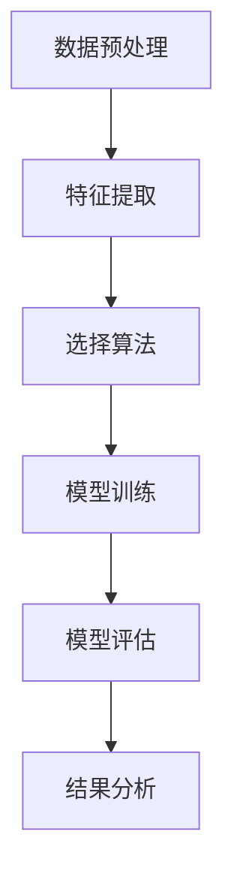

                 


# 全球股市估值与人工智能在法律合规中的应用

> 关键词：全球股市估值、人工智能、法律合规、股票价格预测、自然语言处理、合规管理、机器学习

> 摘要：本文探讨了全球股市估值与人工智能在法律合规中的应用。首先，介绍了全球股市估值的基本概念、方法及其挑战；其次，详细分析了人工智能在法律合规中的核心作用，包括法律文本分析、合同审查和合规监控；最后，结合具体案例，阐述了人工智能技术在股市估值中的实际应用，包括机器学习算法、自然语言处理和大数据分析。本文旨在通过技术与金融的结合，为读者提供全面的视角，帮助理解如何利用人工智能提升股市估值和法律合规效率。

---

## 正文

### 第一部分：背景介绍

#### 第1章：全球股市估值的背景与现状

##### 1.1 股市估值的基本概念

股市估值是通过对公司财务数据、市场趋势和宏观经济指标的分析，评估公司股票的合理价格范围。其核心在于帮助企业、投资者和监管机构做出更明智的决策。

- **定义与意义**：股市估值是衡量公司价值的重要工具，能够帮助投资者判断股票是否被高估或低估。  
- **特点**：  
  - 数据驱动性：依赖财务报表、市场情绪和宏观经济指标。  
  - 不确定性：受多种因素影响，如政策变化、市场波动和公司业绩。  
  - 动态性：需要实时更新以反映市场变化。

##### 1.2 全球股市估值的主要方法

- **市盈率法（P/E Ratio）**：通过公司股价与每股收益的比值，评估股票的估值水平。  
- **市净率法（P/B Ratio）**：通过公司股价与每股净资产的比值，适用于金融和房地产等行业。  
- **现金流折现法（DCF）**：通过预测公司未来现金流，折现至当前价值，评估公司整体价值。

##### 1.3 全球股市估值的现状与挑战

- **现状**：全球股市估值呈现多样化特点，不同市场的估值方法和标准存在差异。  
- **挑战**：  
  - 数据复杂性：需要整合来自不同市场、语言和文化的数据。  
  - 不确定性：全球经济波动和地缘政治风险对股市估值的影响。  
  - 传统方法的局限性：难以应对高频交易和大数据环境下的实时估值需求。

---

#### 第2章：人工智能在法律合规中的应用

##### 2.1 人工智能与法律合规的结合

- **法律文本分析**：通过自然语言处理技术，提取法律文本中的关键信息，如合同条款和法规要求。  
- **合同审查与合规性分析**：利用机器学习模型，自动识别合同中的潜在风险和合规问题。  
- **法律案例检索**：通过AI技术快速检索和分析类似案例，辅助法律决策。

##### 2.2 人工智能在合规管理中的作用

- **合规风险识别**：通过实时数据分析，识别潜在的合规风险。  
- **合规监控与预警**：利用AI技术，实时监控市场动态和企业行为，提前发出预警。  
- **合规报告与数据分析**：通过自动化工具生成合规报告，提高效率和准确性。

---

### 第二部分：人工智能在股市估值中的应用

#### 第3章：人工智能技术在股市分析中的应用

##### 3.1 机器学习在股市预测中的应用

- **监督学习与非监督学习**：  
  - 监督学习（如线性回归、随机森林）：用于预测股票价格。  
  - 非监督学习（如聚类分析）：用于识别市场趋势和模式。  
- **深度学习模型**：如LSTM（长短期记忆网络）用于时间序列分析，预测股票价格波动。  

##### 3.2 自然语言处理在股市新闻分析中的应用

- **文本情感分析**：通过分析新闻文本的情感倾向，预测市场情绪对股价的影响。  
- **新闻事件对股价的影响分析**：利用NLP技术，识别新闻中的关键词和事件，评估其对股价的潜在影响。  
- **多语言文本分析**：分析全球多语言新闻，评估其对全球股市的联动效应。

##### 3.3 数据挖掘与大数据分析在股市估值中的应用

- **数据分析在市场趋势预测中的作用**：通过大数据分析，识别市场周期和趋势。  
- **股票筛选与投资组合优化**：利用数据挖掘技术，筛选具有投资价值的股票，优化投资组合。  
- **高频交易与算法交易的实现**：通过AI技术实现高频交易策略，提升交易效率和收益。

---

#### 第4章：基于机器学习的股市估值算法设计

##### 4.1 机器学习算法的选择与优化

- **线性回归模型**：用于简单线性关系的预测。  
- **支持向量机（SVM）**：用于分类问题，如判断股票是否被高估或低估。  
- **随机森林**：用于特征重要性分析和非线性关系的预测。  

##### 4.2 机器学习算法的实现流程



##### 4.3 机器学习算法的数学模型

- **线性回归模型**：  
  $$ y = \beta_0 + \beta_1x + \epsilon $$
  其中，$y$ 是目标变量（股票价格），$x$ 是自变量（如市盈率），$\beta_0$ 和 $\beta_1$ 是模型参数，$\epsilon$ 是误差项。

- **随机森林模型**：  
  通过集成学习，将多个决策树的结果进行投票或平均，提高模型的准确性和鲁棒性。

---

### 第三部分：系统分析与架构设计

#### 第5章：系统功能设计与架构

##### 5.1 系统功能设计

- **领域模型**：  
  ```mermaid
  classDiagram
      class 股票数据 {
          收盘价, 开盘价, 最高价, 最低价, 成交量
      }
      class 财务数据 {
          收入, 利润, 资产, 负债
      }
      class 市场数据 {
          市场指数, 汇率, 利率
      }
      股票数据 --> 财务数据
      股票数据 --> 市场数据
  ```

##### 5.2 系统架构设计

- **系统架构图**：  
  ```mermaid
  architecture
      股票数据处理模块 --> 数据存储模块
      数据存储模块 --> 数据分析模块
      数据分析模块 --> 结果展示模块
  ```

##### 5.3 系统接口设计

- **API接口**：  
  - 数据接口：提供实时股票数据和市场数据的API。  
  - 分析接口：提供基于机器学习的股市估值和预测服务。  

---

### 第四部分：项目实战

#### 第6章：基于AI的股市估值系统实现

##### 6.1 环境安装

- **Python环境**：安装Python 3.x，安装必要的库，如Pandas、NumPy、Scikit-learn、XGBoost。  
- **数据源**：获取股票数据，如通过Yahoo Finance API或本地数据库。

##### 6.2 核心代码实现

```python
import pandas as pd
from sklearn.linear_model import LinearRegression
from sklearn.metrics import mean_squared_error

# 数据加载
data = pd.read_csv('stock_data.csv')

# 特征与目标变量分离
X = data[['PE_ratio', 'PB_ratio', 'market_cap']]
y = data['stock_price']

# 模型训练
model = LinearRegression()
model.fit(X, y)

# 模型预测
y_pred = model.predict(X)

# 模型评估
mse = mean_squared_error(y, y_pred)
print(f'均方误差：{mse}')
```

##### 6.3 项目小结

通过上述代码，我们实现了基于机器学习的股市估值系统。模型能够根据公司基本面数据和市场数据，预测股票价格，并评估预测的准确性。通过不断优化算法和数据源，可以进一步提升模型的预测精度。

---

### 第五部分：最佳实践

#### 第7章：总结与展望

##### 7.1 小结

本文详细探讨了全球股市估值与人工智能在法律合规中的应用，通过理论分析和实践案例，展示了人工智能技术在金融和法律领域的巨大潜力。

##### 7.2 注意事项

- 数据质量是模型准确性的关键，需确保数据的完整性和准确性。  
- 模型的可解释性是实际应用中的重要考量，特别是在金融和法律领域。  
- 需遵守相关法律法规，确保数据使用和模型部署的合规性。

##### 7.3 拓展阅读

- 推荐阅读《机器学习实战》（《Machine Learning in Action》），深入理解机器学习算法的实现。  
- 推荐阅读《法律科技与人工智能》（《Legal Technology and AI》），了解AI在法律领域的最新进展。

---

作者：AI天才研究院/AI Genius Institute & 禅与计算机程序设计艺术/Zen And The Art of Computer Programming

