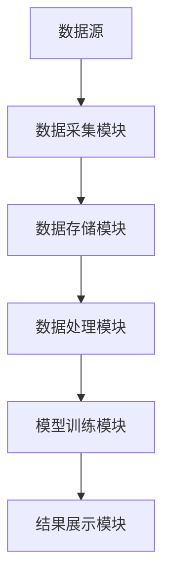
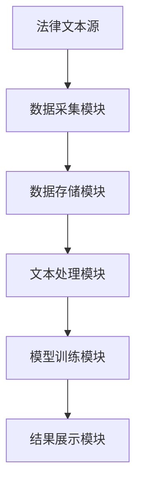

                 


# 全球股市估值与人工智能在法律合规中的应用

> 关键词：全球股市估值，人工智能，法律合规，算法，系统架构，项目实战

> 摘要：本文探讨了全球股市估值与人工智能在法律合规中的应用。从背景介绍、核心概念、算法原理到系统架构和项目实战，详细分析了人工智能如何提升股市估值的准确性和法律合规的效率，结合实际案例，总结了最佳实践和未来发展趋势。

## 第一部分: 全球股市估值的背景与现状

### 第1章: 全球股市估值的背景与现状

#### 1.1 股市估值的基本概念
- 1.1.1 股市估值的定义
  股市估值是指对股票内在价值的评估，旨在确定其合理的价格区间。
  
- 1.1.2 传统股市估值方法
  - 市盈率（P/E）：市盈率=股价/每股收益，衡量股票价格是否合理。
  - 市净率（P/B）：市净率=股价/每股净资产，用于评估股价与资产价值的关系。
  - 现金流折现模型（DCF）：通过将未来现金流折现，计算出股票的内在价值。

- 1.1.3 人工智能技术在股市估值中的应用前景
  人工智能可以通过分析海量数据，预测市场趋势，优化估值模型。

#### 1.2 全球股市的现状与挑战
- 1.2.1 全球股市的多样性与复杂性
  不同国家和地区的股市受到经济、政治等多种因素影响，增加了估值的复杂性。

- 1.2.2 股市波动性对估值的影响
  股市波动可能导致估值模型失效，需要动态调整模型参数。

- 1.2.3 人工智能技术如何应对这些挑战
  通过机器学习算法，实时捕捉市场变化，提高估值模型的适应性。

#### 1.3 人工智能在股市估值中的变革
- 1.3.1 从传统估值到智能估值的转变
  传统方法依赖经验，智能估值利用大数据和机器学习，提升准确性。

- 1.3.2 人工智能技术的核心优势
  - 高效的数据处理能力
  - 精准的预测能力
  - 自适应的模型优化能力

- 1.3.3 未来股市估值的发展趋势
  结合AI和大数据技术，向智能化、个性化方向发展。

## 第二部分: 人工智能与法律合规的结合

### 第2章: 人工智能在法律合规中的应用

#### 2.1 人工智能在法律领域的应用
- 2.1.1 法律文本分析的基本原理
  通过自然语言处理技术，识别法律文本中的关键词和条款。

- 2.1.2 人工智能在合同审查中的应用
  利用AI自动识别合同中的风险点，提高合规性。

- 2.1.3 人工智能在法律合规中的优势
  - 高效性：快速处理大量法律文档。
  - 准确性：减少人为错误，提高合规性。

#### 2.2 法律合规中的挑战与机遇
- 2.2.1 合规性检查的复杂性
  法律法规复杂多变，合规性检查需要细致分析。

- 2.2.2 人工智能在合规性检查中的应用
  通过AI技术实时监控企业行为，确保符合法规要求。

- 2.2.3 未来法律合规的发展方向
  结合AI和区块链技术，构建智能化的合规管理系统。

#### 2.3 人工智能在法律合规中的核心作用
- 2.3.1 自然语言处理在法律文本分析中的应用
  使用NLP技术，提取法律文本中的关键信息，辅助合规审查。

- 2.3.2 机器学习在合规预测中的应用
  通过训练模型，预测企业可能存在的合规风险。

- 2.3.3 数据挖掘在合规监控中的应用
  分析历史数据，识别潜在的合规问题，提前采取措施。

## 第三部分: 核心概念与算法原理

### 第3章: 全球股市估值的核心模型

#### 3.1 常见的股市估值模型
- 3.1.1 市盈率模型
  $$市盈率 = \frac{股价}{每股收益}$$
  
- 3.1.2 市净率模型
  $$市净率 = \frac{股价}{每股净资产}$$

- 3.1.3 现金流折现模型（DCF）
  $$DCF = \sum_{t=1}^{n} \frac{CF_t}{(1 + r)^t} + \frac{TV}{(1 + r)^n}$$
  其中，CF_t为第t年的现金流，r为折现率，TV为终值。

#### 3.2 AI算法在股市估值中的应用
- 3.2.1 线性回归分析
  $$y = a x + b$$
  其中，y为预测的股票价格，x为自变量，a为斜率，b为截距。

- 3.2.2 时间序列分析
  使用ARIMA模型预测股票价格：
  $$ARIMA(p, d, q)$$
  其中，p为自回归阶数，d为差分阶数，q为移动平均阶数。

- 3.2.3 支持向量机（SVM）
  使用SVM进行股票价格分类：
  $$SVM分类器$$

### 第4章: 法律合规中的关键算法

#### 4.1 自然语言处理（NLP）在法律文本分析中的应用
- 4.1.1 分词
  使用jieba库对中文法律文本进行分词：
  ```python
  import jieba
  text = "中华人民共和国合同法"
  words = jieba.lcut(text)
  print(words)  # 输出：['中华人民共和国', '合同法']
  ```

- 4.1.2 实体识别
  使用spaCy库识别法律文本中的实体：
  ```python
  import spacy
  nlp = spacy.load("en_core_web_sm")
  doc = nlp("The contract was signed on October 10, 2020.")
  for ent in doc.ents:
      print(ent.text, ent.label_)
  ```

- 4.1.3 情感分析
  使用VADER进行法律文本的情感分析：
  ```python
  from nltk.sentiment import VaderSentiment
  vs = VaderSentiment()
  sentiment = vs.polarity_scores("The terms are favorable.")
  print(sentiment)
  ```

#### 4.2 机器学习在法律合规中的应用
- 4.2.1 垃圾邮件分类
  使用Naive Bayes算法进行合同分类：
  ```python
  from sklearn.naive_bayes import MultinomialNB
  model = MultinomialNB()
  model.fit(X_train, y_train)
  ```

- 4.2.2 风险评估
  使用随机森林模型评估合同风险：
  ```python
  from sklearn.ensemble import RandomForestClassifier
  model = RandomForestClassifier()
  model.fit(X_train, y_train)
  ```

- 4.2.3 合规性预测
  使用XGBoost进行合规性预测：
  ```python
  import xgboost as xgb
  model = xgb.XGBClassifier()
  model.fit(X_train, y_train)
  ```

## 第四部分: 系统架构与设计

### 第5章: 股市估值系统的架构设计

#### 5.1 系统功能模块
- 5.1.1 数据采集模块
  - 采集股票数据，包括价格、交易量等。

- 5.1.2 数据处理模块
  - 清洗数据，处理缺失值和异常值。

- 5.1.3 模型训练模块
  - 使用AI算法训练估值模型。

- 5.1.4 结果展示模块
  - 可视化股票估值结果。

#### 5.2 系统架构图


#### 5.3 接口设计
- API接口：
  - GET /stock_data 获取股票数据
  - POST /train 训练模型
  - GET /valuation 获取估值结果

### 第6章: 法律合规AI系统的架构设计

#### 6.1 系统功能模块
- 6.1.1 数据采集模块
  - 采集法律文本数据，包括合同、法规等。

- 6.1.2 文本处理模块
  - 分词、实体识别、情感分析。

- 6.1.3 模型训练模块
  - 训练机器学习模型进行合规性预测。

- 6.1.4 结果展示模块
  - 可视化合规性结果。

#### 6.2 系统架构图


#### 6.3 接口设计
- API接口：
  - GET /legal_text 获取法律文本
  - POST /analyze 分析文本
  - GET /compliance 获取合规结果

## 第五部分: 项目实战

### 第7章: 股市估值项目实战

#### 7.1 环境安装
- 安装必要的库：
  ```bash
  pip install pandas numpy scikit-learn matplotlib
  ```

#### 7.2 核心实现
- 数据采集：
  ```python
  import pandas as pd
  df = pd.read_csv('stock_data.csv')
  ```

- 数据处理：
  ```python
  from sklearn.impute import SimpleImputer
  imputer = SimpleImputer(missing_values=np.nan, strategy='mean')
  df_imputed = imputer.fit_transform(df)
  ```

- 模型训练：
  ```python
  from sklearn.linear_model import LinearRegression
  model = LinearRegression()
  model.fit(X_train, y_train)
  ```

- 结果展示：
  ```python
  import matplotlib.pyplot as plt
  plt.scatter(y_test, y_pred)
  plt.xlabel('真实值')
  plt.ylabel('预测值')
  plt.show()
  ```

#### 7.3 项目小结
- 总结项目实现的关键步骤和遇到的问题。
- 强调AI在股市估值中的优势和应用场景。

### 第8章: 法律合规项目实战

#### 8.1 环境安装
- 安装必要的库：
  ```bash
  pip install nltk spacy xgboost
  ```

#### 8.2 核心实现
- 文本分词：
  ```python
  import jieba
  text = "中华人民共和国合同法"
  words = jieba.lcut(text)
  ```

- 实体识别：
  ```python
  import spacy
  nlp = spacy.load("en_core_web_sm")
  doc = nlp("The contract was signed on October 10, 2020.")
  for ent in doc.ents:
      print(ent.text, ent.label_)
  ```

- 合规性预测：
  ```python
  import xgboost as xgb
  model = xgb.XGBClassifier()
  model.fit(X_train, y_train)
  ```

#### 8.3 项目小结
- 总结项目实现的关键步骤和遇到的问题。
- 强调AI在法律合规中的优势和应用场景。

## 第六部分: 最佳实践与小结

### 第9章: 最佳实践与小结

#### 9.1 最佳实践
- 数据预处理的重要性
- 模型选择与调优
- 结果解释与可视化

#### 9.2 项目小结
- 回顾整书内容，总结关键点。
- 强调AI在股市估值和法律合规中的重要性。

#### 9.3 未来展望
- 结合AI与大数据技术，进一步提升估值和合规效率。
- 探索更多AI在金融和法律领域的应用。

## 作者信息

作者：AI天才研究院/AI Genius Institute & 禅与计算机程序设计艺术 /Zen And The Art of Computer Programming

---

以上是《全球股市估值与人工智能在法律合规中的应用》的详细目录大纲，涵盖了从背景到实战的各个方面，帮助读者系统地理解和应用相关知识。

