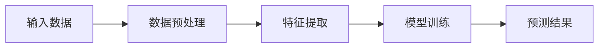
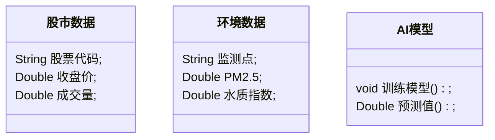
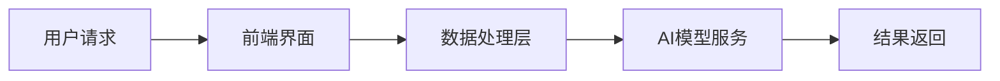

                 


# 全球股市估值与人工智能在环境保护中的应用

---

## 关键词：
全球股市估值，人工智能，环境保护，机器学习，深度学习，自然语言处理

---

## 摘要：
本文深入探讨了全球股市估值的核心概念与人工智能在环境保护中的应用，结合背景介绍、核心概念、算法原理、系统架构设计、项目实战和小结等部分，详细分析了人工智能如何助力股市估值与环境保护。通过机器学习、深度学习和自然语言处理等技术，本文展示了如何利用AI优化股市预测和环境监测，为绿色投资和可持续发展提供了新的思路。

---

## 第1章：全球股市估值的背景与概念

### 1.1 股市估值的基本概念
股市估值是通过对公司基本面、宏观经济指标和市场情绪等多方面因素的综合分析，对股票的内在价值进行评估的过程。其核心在于帮助投资者做出理性决策，降低投资风险。

#### 核心概念对比
| 概念 | 定义 | 特性 |
|------|------|------|
| 市盈率（PE） | 每股价格与每股收益的比值 | 反映市场对公司的未来盈利预期 |
| 市净率（PB） | 每股价格与每股净资产的比值 | 更适合评估资产密集型行业 |
| 现金流折现法（DCF） | 通过未来现金流折现计算企业价值 | 常用于评估成长型企业 |

### 1.2 股市估值的主要方法
#### 1.2.1 市盈率（PE）法
$$ PE = \frac{\text{股价}}{\text{每股收益}} $$
市盈率反映了市场对公司未来盈利的预期，但需结合行业和市场环境分析。

#### 1.2.2 市净率（PB）法
$$ PB = \frac{\text{股价}}{\text{每股净资产}} $$
市净率适用于评估资产密集型行业，如银行和房地产。

#### 1.2.3 现金流折现法（DCF）
$$ V = \sum_{t=1}^{n} \frac{CF_t}{(1 + r)^t} + \frac{TV}{(1 + r)^n} $$
DCF方法通过将未来现金流折现至现值，评估企业的真实价值。

---

## 第2章：人工智能在股市估值中的应用

### 2.1 人工智能的基本概念与技术
人工智能（AI）是模拟人类智能的技术，涵盖机器学习、深度学习和自然语言处理等领域。AI在股市估值中的应用主要体现在数据处理、模式识别和预测模型构建。

#### 机器学习与深度学习的对比
| 特性 | 机器学习 | 深度学习 |
|------|----------|----------|
| 数据需求 | 中等 | 高 |
| 模型复杂度 | 低 | 高 |
| 应用场景 | 分类、回归 | 图像识别、NLP |

### 2.2 基于AI的股市预测模型
#### LSTM模型
LSTM（长短期记忆网络）通过记忆单元和控制门，有效捕捉时间序列数据中的长期依赖关系。

#### 模型流程


### 2.3 AI在股市情绪分析中的应用
#### 情绪分类流程
1. 数据采集：抓取新闻、社交媒体数据。
2. 数据清洗：去除噪音，提取情感关键词。
3. 模型训练：使用词袋模型或TF-IDF进行特征提取。
4. 情感分类：训练二分类模型（正面/负面）。

---

## 第3章：人工智能在环境保护中的应用

### 3.1 环境保护的基本概念
环境保护是通过技术手段减少污染、保护生态的过程。AI在环境保护中的应用主要体现在环境监测、污染治理和资源优化。

#### 环境监测的主要技术
| 技术 | 应用场景 | 优势 |
|------|----------|-------|
| 传感器网络 | 实时监测空气质量 | 高频、精准 |
| 图像识别 | 监测水体污染 | 快速、直观 |

### 3.2 AI在环境监测中的应用
#### 传感器数据处理
通过AI算法对传感器数据进行去噪和特征提取，提升监测精度。

#### 图像识别应用
利用CNN模型识别卫星图像中的污染区域，辅助环境执法。

---

## 第4章：系统架构设计

### 4.1 系统功能设计
#### 领域模型


### 4.2 系统架构设计


---

## 第5章：项目实战

### 5.1 环境数据监测系统开发
#### 环境安装
1. 安装Python、TensorFlow、Keras。
2. 配置数据接口（如API）。

#### 核心代码实现
```python
import pandas as pd
from sklearn.model_selection import train_test_split
from tensorflow.keras.models import Sequential
from tensorflow.keras.layers import LSTM, Dense

# 数据预处理
data = pd.read_csv('environment_data.csv')
X = data[['PM2.5', '温度', '湿度']]
y = data['污染指数']

X_train, X_test, y_train, y_test = train_test_split(X, y, test_size=0.2)

# LSTM模型构建
model = Sequential()
model.add(LSTM(50, input_shape=(X_train.shape[1], 1)))
model.add(Dense(1))
model.compile(loss='mean_squared_error', optimizer='adam')
model.fit(X_train, y_train, epochs=10, batch_size=32)
```

---

## 第6章：小结与展望

### 6.1 最佳实践
1. 数据清洗是关键，确保数据质量。
2. 模型调参需结合实际业务需求。
3. 结合领域知识，优化模型性能。

### 6.2 注意事项
- 数据隐私问题需重视。
- 模型解释性需提升，便于业务理解。

### 6.3 未来展望
随着AI技术进步，股市估值与环境保护的结合将更加紧密，推动绿色投资和可持续发展。

---

## 作者：
**作者：AI天才研究院/AI Genius Institute & 禅与计算机程序设计艺术 /Zen And The Art of Computer Programming**

