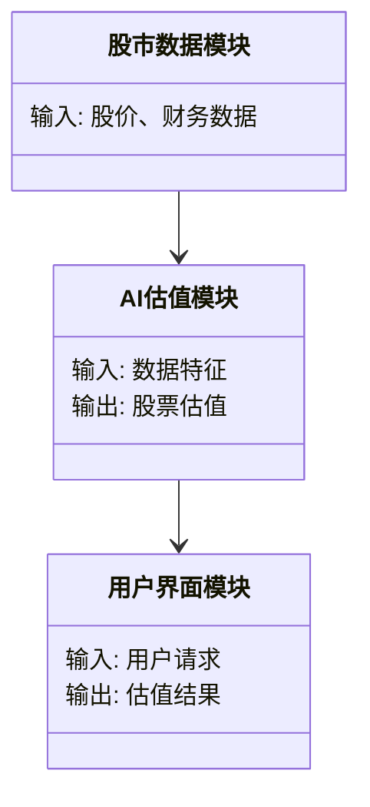
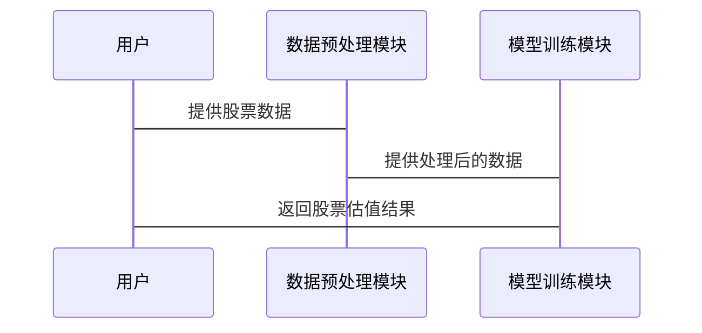

                 


# 全球股市估值与人工智能在精准医疗中的应用

> 关键词：全球股市估值，人工智能，精准医疗，机器学习，深度学习，系统架构

> 摘要：本文探讨了全球股市估值与人工智能在精准医疗中的应用。通过分析股市估值的传统方法与现代技术，结合人工智能在精准医疗中的应用潜力，展示如何利用AI技术提升投资决策和医疗诊断的准确性。

---

# 第1章：全球股市估值与人工智能概述

## 1.1 股市估值的背景与意义

### 1.1.1 股市估值的基本概念
股市估值是通过对公司财务数据和市场因素的分析，评估其股票的合理价格。传统方法包括市盈率、市净率和股息率等。这些方法依赖于历史数据和市场情绪，存在一定的局限性。

### 1.1.2 全球化视角下的股市估值挑战
随着全球市场的复杂化，单一市场的分析需要考虑全球经济指标、政策变化和地缘政治因素。这些因素增加了估值的难度，传统方法难以应对动态变化的市场环境。

### 1.1.3 人工智能在股市估值中的作用
人工智能通过分析海量数据，识别复杂模式，提供更精准的估值。机器学习和深度学习模型能够捕捉传统方法难以察觉的市场信号，提升估值的准确性和及时性。

---

## 1.2 人工智能与精准医疗的结合

### 1.2.1 人工智能技术的快速发展
近年来，人工智能技术在各个领域取得了显著进展，特别是在医疗领域。精准医疗的目标是根据患者个体特征制定个性化治疗方案，而人工智能在疾病预测、药物研发等方面发挥了重要作用。

### 1.2.2 精准医疗的核心理念
精准医疗强调个体化治疗，利用基因组学、蛋白质组学等多组学数据，结合临床数据，制定最佳治疗方案。这需要大量数据的处理和分析，人工智能成为实现这一目标的关键技术。

### 1.2.3 人工智能在精准医疗中的应用潜力
通过机器学习模型，人工智能可以预测疾病风险、辅助诊断，并优化治疗方案。这些应用能够提高医疗效率和准确性，降低治疗成本。

---

## 1.3 本书的核心目标与结构

### 1.3.1 股市估值与人工智能的结合
本书将探讨如何利用人工智能技术提升股市估值的准确性和效率，分析不同算法在估值中的应用。

### 1.3.2 精准医疗与投资决策的关联
通过分析医疗数据，投资者可以更好地评估公司的未来表现，从而做出更明智的投资决策。

### 1.3.3 本书的章节安排与学习路径
本书分为六章，从理论到实践，逐步深入探讨全球股市估值和人工智能在精准医疗中的应用。

---

# 第2章：全球股市估值方法论

## 2.1 传统股市估值方法

### 2.1.1 市盈率法
市盈率（P/E）是股价与每股收益的比率，用于评估股票的相对价值。公式为：
$$ P/E = \frac{\text{股价}}{\text{每股收益}} $$

### 2.1.2 市净率法
市净率（P/B）是股价与每股净资产的比率，适用于评估银行等资产密集型行业。公式为：
$$ P/B = \frac{\text{股价}}{\text{每股净资产}} $$

### 2.1.3 股息率法
股息率是每年派发的股息与股价的比率，反映投资回报率。公式为：
$$ 股息率 = \frac{\text{股息}}{\text{股价}} \times 100\% $$

---

## 2.2 现代金融模型与算法

### 2.2.1 CAPM模型
资本资产定价模型（CAPM）用于评估资产的预期回报率。公式为：
$$ E(R_i) = R_f + \beta_i (E(R_m) - R_f) $$

### 2.2.2 Fama-French三因子模型
该模型在CAPM的基础上增加了规模溢价和价值溢价。公式为：
$$ E(R_i) = R_f + \beta_i (E(R_m) - R_f) + 0.3 \times SMB + 0.3 \times HML $$

### 2.2.3 时间序列分析
时间序列分析用于预测股票价格的变化趋势，常用ARIMA模型。

---

## 2.3 人工智能在股市估值中的应用

### 2.3.1 机器学习算法在估值中的应用
机器学习算法如线性回归、支持向量机和随机森林可用于预测股票价格和评估公司价值。

### 2.3.2 深度学习模型在股价预测中的应用
深度学习模型如LSTM（长短期记忆网络）能够捕捉时间序列数据中的长期依赖关系，提升预测准确性。

### 2.3.3 联合分析：传统方法与AI的结合
通过结合传统估值方法和人工智能技术，可以提高估值的准确性和鲁棒性。

---

# 第3章：人工智能的基本原理与技术

## 3.1 人工智能的核心概念

### 3.1.1 机器学习
机器学习是通过数据训练模型，使其能够从经验中学习并做出预测或决策。

### 3.1.2 深度学习
深度学习是机器学习的一种，通过多层神经网络模拟人脑的处理方式，能够处理复杂的非线性数据。

### 3.1.3 自然语言处理
自然语言处理技术用于理解和生成人类语言，广泛应用于文本数据分析和医疗文献挖掘。

---

## 3.2 人工智能在金融领域的应用

### 3.2.1 股票价格预测
通过机器学习模型分析历史价格数据，预测未来走势。

### 3.2.2 风险评估
利用AI技术评估投资组合的风险，优化资产配置。

### 3.2.3 投资组合优化
基于AI算法，构建最优投资组合，最大化收益并最小化风险。

---

## 3.3 人工智能在医疗领域的应用

### 3.3.1 疾病预测与诊断
通过机器学习模型分析医学影像和病历数据，辅助医生进行疾病诊断。

### 3.3.2 药物研发
利用AI技术加速药物研发过程，降低研发成本。

### 3.3.3 精准治疗方案
根据患者基因信息和病情特征，制定个性化治疗方案。

---

# 第4章：人工智能在精准医疗中的应用

## 4.1 疾病预测与诊断

### 4.1.1 机器学习模型在疾病预测中的应用
通过分析基因数据和临床数据，预测疾病的发生风险。

### 4.1.2 医学影像分析
利用深度学习模型分析医学影像，辅助诊断疾病如癌症和心脏病。

---

## 4.2 药物研发

### 4.2.1 药物筛选
通过AI技术快速筛选潜在药物分子，提高研发效率。

### 4.2.2 药物设计
利用AI技术设计新型药物分子，降低研发成本。

---

## 4.3 精准治疗方案

### 4.3.1 个性化治疗
根据患者基因组信息和病情特征，制定个性化治疗方案。

### 4.3.2 治疗效果预测
通过AI模型预测治疗效果，优化治疗方案。

---

# 第5章：系统架构与设计

## 5.1 问题场景介绍

### 5.1.1 股市估值系统
构建一个基于AI的股市估值系统，提供实时估值和预测服务。

### 5.1.2 精准医疗系统
构建一个基于AI的精准医疗系统，支持疾病预测、诊断和治疗方案制定。

---

## 5.2 系统功能设计

### 5.2.1 领域模型设计
使用Mermaid类图描述系统的功能模块及其关系。



---

## 5.3 系统架构设计

### 5.3.1 分层架构
系统的架构分为数据层、算法层和应用层，各层之间通过接口进行交互。

### 5.3.2 模块化设计
将系统划分为数据预处理模块、模型训练模块和结果展示模块，便于开发和维护。

---

## 5.4 系统接口设计

### 5.4.1 数据接口
定义数据输入和输出的格式，确保系统能够处理多种数据源。

### 5.4.2 模型接口
定义模型训练和预测的接口，支持多种算法的集成。

---

## 5.5 系统交互设计

### 5.5.1 序列图
使用Mermaid序列图描述系统的主要交互流程。



---

# 第6章：项目实战与总结

## 6.1 环境安装

### 6.1.1 安装Python
安装Python 3.8及以上版本，并配置环境变量。

### 6.1.2 安装必要的库
安装NumPy、Pandas、Scikit-learn和Keras等库。

---

## 6.2 系统核心实现源代码

### 6.2.1 数据预处理代码
```python
import pandas as pd
import numpy as np

# 读取数据
data = pd.read_csv('stock_data.csv')

# 数据清洗
data.dropna(inplace=True)
data = data[['Close', 'Volume', 'Adj Close']]
```

### 6.2.2 模型训练代码
```python
from sklearn.model_selection import train_test_split
from sklearn.ensemble import RandomForestRegressor

# 划分数据集
X = data[['Close', 'Volume']]
y = data['Adj Close']
X_train, X_test, y_train, y_test = train_test_split(X, y, test_size=0.2)

# 训练模型
model = RandomForestRegressor()
model.fit(X_train, y_train)
```

---

## 6.3 实际案例分析

### 6.3.1 股票估值案例
使用训练好的模型对某股票进行估值，输出预测结果。

### 6.3.2 疾病预测案例
分析患者的数据，预测其患病风险，并制定个性化治疗方案。

---

## 6.4 总结与展望

### 6.4.1 总结
通过本项目，我们展示了人工智能在股市估值和精准医疗中的应用潜力，证明了AI技术能够显著提升投资决策和医疗诊断的准确性。

### 6.4.2 展望
未来，随着AI技术的不断发展，其在金融和医疗领域的应用将更加广泛，推动社会的进步和发展。

---

# 作者

作者：AI天才研究院/AI Genius Institute & 禅与计算机程序设计艺术/Zen And The Art of Computer Programming

---

以上是《全球股市估值与人工智能在精准医疗中的应用》的技术博客文章的详细目录和部分章节内容。整篇文章将按照上述结构展开，确保每一部分都详细具体，并融入实际案例和代码示例，帮助读者深入理解和掌握相关知识。

