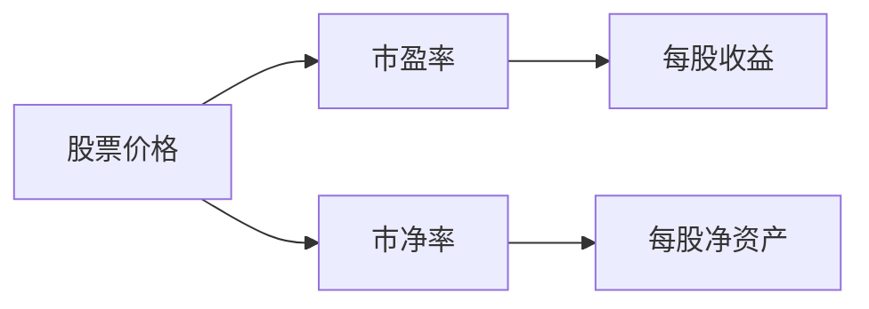
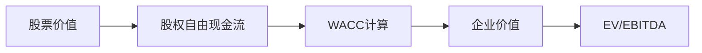

                 


# 全球股市估值与人工智能在药物研发中的应用

> 关键词：全球股市估值，人工智能，药物研发，股票预测，药物发现，风险管理

> 摘要：本文探讨了全球股市估值的传统方法与现代技术，特别是人工智能在其中的应用，以及人工智能如何 revolutionize 药物研发过程。通过分析股市估值的核心概念、AI算法的实现、药物研发的传统流程与AI技术的创新结合，本文旨在展示AI在金融与医疗领域的重要作用，并通过实际案例分析，为读者提供深入的见解。

---

# 第一部分：全球股市估值

## 第1章：股市估值的背景与基础

### 1.1 股市估值的基本概念

#### 1.1.1 股票与股市的定义
股票是公司所有权的象征，投资者通过购买股票成为公司股东，享有分红和投票权。股市是交易股票的市场，反映了市场的供需关系和经济状况。

#### 1.1.2 股市估值的定义与作用
股市估值是评估公司股票内在价值的过程，帮助投资者确定股票是否被高估或低估。其作用包括指导投资决策、评估公司表现和预测市场趋势。

#### 1.1.3 股市估值的核心要素
核心要素包括公司财务状况、行业地位、管理团队、市场环境和宏观经济因素。这些因素共同影响股票的内在价值。

### 1.2 股市估值的理论基础

#### 1.2.1 资本资产定价模型（CAPM）
CAPM用于确定资产的预期收益，公式为：$E(R_i) = R_f + β_i (E(R_m) - R_f)$。其中，$R_f$是无风险利率，$\beta_i$是股票的贝塔系数，$E(R_m)$是市场预期收益率。

#### 1.2.2 市盈率与市净率
市盈率（P/E）=股价/每股收益；市净率（P/B）=股价/每股净资产。两者用于评估股票的相对价值。

#### 1.2.3 股息率与股息贴现模型（DDM）
股息率=（年股息/股价）×100%；DDM基于股息现金流，用于估算股票的内在价值。

### 1.3 股市估值的数学模型



## 第2章：全球股市估值方法

### 2.1 传统估值方法

#### 2.1.1 市盈率法
通过比较公司市盈率与行业平均值，判断股票是否被高估或低估。例如，若行业平均市盈率为15，而某公司市盈率为20，则可能被高估。

#### 2.1.2 市净率法
适用于银行和房地产等资产密集型行业，通过比较公司市净率与行业平均值，评估股票价值。

#### 2.1.3 股息贴现模型
基于股息现金流，计算股票的内在价值。公式：$P = \sum_{t=1}^{n} \frac{D_t}{(1+r)^t}$，其中$D_t$是第$t$年的股息，$r$是折现率。

### 2.2 现代估值方法

#### 2.2.1 股权自由现金流模型
通过预测公司未来现金流，折现计算企业价值。公式：$V = \sum_{t=1}^{n} \frac{FCF_t}{(1+WACC)^t}$。

#### 2.2.2 加权平均资本成本（WACC）
计算公式：$WACC = w_d \times k_d \times (1-t) + w_e \times k_e$，其中$w_d$和$w_e$是债务和股权的权重，$k_d$和$k_e$是债务和股权的成本，$t$是税率。

#### 2.2.3 企业价值倍数（EV/EBITDA）
企业价值=EV=市价+债务-现金，EBITDA=息税折旧及摊销前利润。EV/EBITDA用于比较不同公司的估值。

### 2.3 现代估值方法的数学模型



## 第3章：AI在股市估值中的应用

### 3.1 AI技术在股市分析中的优势

#### 3.1.1 数据处理能力
AI能够处理海量数据，识别复杂模式，提高预测准确性。

#### 3.1.2 模式识别能力
通过机器学习识别价格走势和市场情绪，帮助投资者做出决策。

#### 3.1.3 预测准确性
AI模型能够分析历史数据，预测未来价格走势。

### 3.2 基于机器学习的股票预测模型

#### 3.2.1 数据预处理与特征提取
包括数据清洗、标准化和特征选择。例如，使用历史价格、成交量和宏观经济指标作为特征。

#### 3.2.2 神经网络模型构建
使用深度学习模型，如LSTM，捕捉时间序列数据中的模式。

#### 3.2.3 模型训练与优化
通过训练数据调整模型参数，优化预测准确性。

### 3.3 项目实战

#### 3.3.1 数据采集
使用Yahoo Finance API获取股票数据，清洗数据并提取特征。

#### 3.3.2 模型实现
代码示例：
```python
import numpy as np
import pandas as pd
from sklearn.model_selection import train_test_split
from tensorflow.keras.models import Sequential
from tensorflow.keras.layers import LSTM, Dense

# 数据准备
data = pd.read_csv('stock_data.csv')
features = data[['open', 'high', 'low', 'close', 'volume']]
labels = data['next_day_price']

# 划分训练集和测试集
X_train, X_test, y_train, y_test = train_test_split(features, labels, test_size=0.2)

# 模型构建
model = Sequential()
model.add(LSTM(64, input_shape=(None, 5)))
model.add(Dense(1))
model.compile(loss='mean_squared_error', optimizer='adam')

# 训练模型
model.fit(X_train, y_train, epochs=10, batch_size=32, validation_data=(X_test, y_test))
```

### 3.4 AI在股市风险管理中的应用

#### 3.4.1 风险评估模型
使用AI识别市场风险，评估投资组合的风险。

#### 3.4.2 风险对冲策略
通过算法交易对冲风险，优化投资组合。

---

# 第二部分：人工智能在药物研发中的应用

## 第4章：药物研发的传统方法

### 4.1 药物研发的流程

#### 4.1.1 分子发现与筛选
通过实验室实验筛选潜在药物分子。

#### 4.1.2 药物优化与合成
优化分子结构，进行实验室合成。

#### 4.1.3 临床试验
分阶段进行临床试验，评估药物的安全性和有效性。

### 4.2 药物研发的挑战

#### 4.2.1 成本高昂
平均研发成本超过20亿美元，周期长达10-15年。

#### 4.2.2 成功率低
新药研发的成功率不到1%。

## 第5章：AI在药物研发中的应用

### 5.1 药物发现的AI技术

#### 5.1.1 分子筛选
使用机器学习算法筛选潜在药物分子，提高效率。

#### 5.1.2 药物优化
通过AI优化分子结构，提高药物疗效和安全性。

### 5.2 药物研发的AI工具

#### 5.2.1 药物设计
使用深度学习生成新的药物分子。

#### 5.2.2 临床试验预测
通过AI预测药物的临床表现，优化试验设计。

### 5.3 项目实战

#### 5.3.1 数据准备
使用公开的药物数据库，提取分子结构和活性数据。

#### 5.3.2 模型实现
代码示例：
```python
import numpy as np
import pandas as pd
from sklearn.model_selection import train_test_split
from sklearn.ensemble import RandomForestClassifier

# 数据准备
data = pd.read_csv('drug_data.csv')
features = data[['feature1', 'feature2', 'feature3']]
labels = data['label']

# 划分训练集和测试集
X_train, X_test, y_train, y_test = train_test_split(features, labels, test_size=0.2)

# 模型构建
model = RandomForestClassifier(n_estimators=100)
model.fit(X_train, y_train)

# 预测与评估
print("Accuracy:", model.score(X_test, y_test))
```

### 5.4 AI在药物研发中的优势

#### 5.4.1 提高效率
AI加速分子筛选和优化过程，缩短研发周期。

#### 5.4.2 降低成本
通过虚拟筛选和预测模型，减少实验成本。

## 第6章：AI在药物研发中的挑战与未来趋势

### 6.1 监管与伦理问题
AI药物研发需要符合监管要求，确保数据隐私和伦理合规。

### 6.2 未来趋势
AI与传统方法结合，推动药物研发进入新纪元。

---

# 第三部分：结合股市估值与AI药物研发的跨领域应用

## 第7章：AI在股市估值与药物研发中的协同效应

### 7.1 数据驱动的决策
AI帮助投资者和药企利用大数据做出更明智的决策。

### 7.2 风险管理与优化
AI技术在股市和药物研发中的风险管理具有协同作用，优化投资组合和研发策略。

## 第8章：未来展望

### 8.1 跨领域应用的潜力
AI在金融和医疗领域的结合，将推动跨领域创新。

### 8.2 技术进步与挑战
技术进步将带来新的机遇，但也需要应对数据隐私和伦理挑战。

---

# 作者：AI天才研究院 & 禅与计算机程序设计艺术

---

这篇文章系统地探讨了全球股市估值与人工智能在药物研发中的应用，通过理论分析、算法实现和实际案例，展示了AI技术在金融和医疗领域的巨大潜力。

