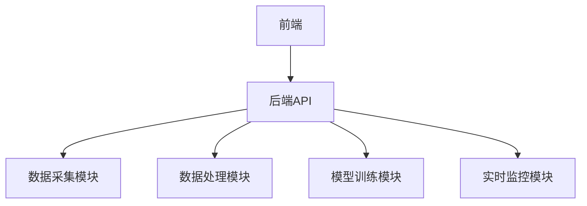
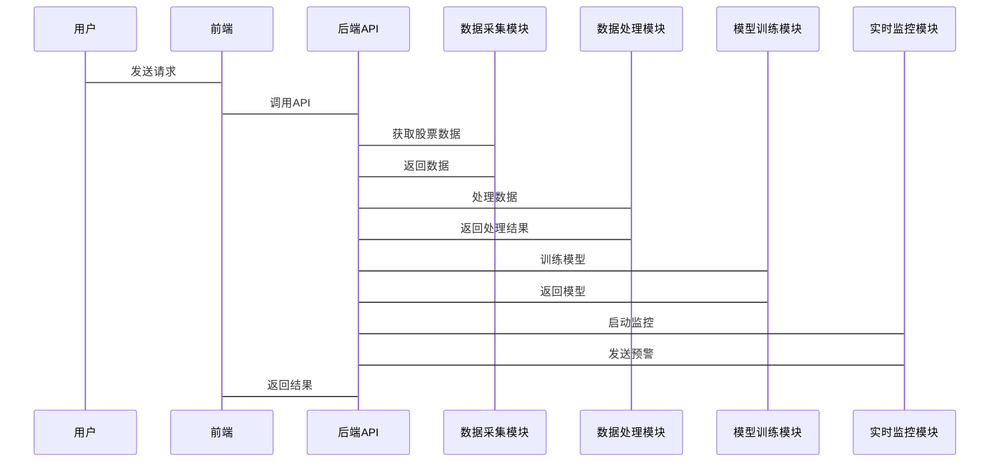

                 


# 全球股市估值与人工智能在金融风控中的应用

> 关键词：全球股市估值，人工智能，金融风控，机器学习，深度学习，自然语言处理

> 摘要：本文系统地探讨了全球股市估值的核心理论与方法，重点分析了人工智能技术在金融风险控制中的应用。通过理论与实践相结合的方式，本文详细阐述了如何利用机器学习、深度学习和自然语言处理等技术提升股市估值的准确性和效率。文章还结合实际案例，展示了人工智能在金融风控中的具体应用，为读者提供了深入的理论指导和实践参考。

---

## 第1章 全球股市估值的背景与现状

### 1.1 全球股市估值的背景

#### 1.1.1 股市估值的基本概念
股市估值是通过对公司财务数据、市场环境和行业趋势的分析，评估股票的内在价值。它帮助投资者判断股票是否被高估或低估。

#### 1.1.2 全球化背景下的股市特点
全球化使得股市估值更加复杂，不同市场的联动性增强，但各市场的独特性也对估值方法提出了更高要求。

#### 1.1.3 股市估值的重要性与挑战
准确的估值有助于投资者做出明智的投资决策，但市场波动、信息不对称和复杂性增加了估值的难度。

### 1.2 人工智能在金融领域的应用现状

#### 1.2.1 人工智能技术的发展与金融行业的结合
人工智能技术的进步为金融行业带来了新的可能性，特别是在数据处理和模式识别方面。

#### 1.2.2 金融风控的核心问题与传统解决方案
金融风控的核心问题包括市场风险、信用风险等，传统解决方案依赖于统计模型和人工判断。

#### 1.2.3 人工智能在金融风控中的优势
人工智能通过大数据分析和自动化模型，提高了风险预测的准确性和效率。

### 1.3 本章小结
本章介绍了全球股市估值的基本概念和重要性，分析了人工智能在金融风控中的应用现状及其优势。

---

## 第2章 全球股市估值的理论与方法

### 2.1 股市估值的基本理论

#### 2.1.1 股票估值的基本原理
股票估值基于公司基本面分析，包括盈利能力、成长性和财务健康状况。

#### 2.1.2 主要的股票估值方法
- **相对估值法**：如市盈率、市净率等。
- **绝对估值法**：如现金流折现法（DCF）。

#### 2.1.3 不同市场环境下的估值调整
市场波动和经济周期对估值方法的选择和调整有重要影响。

### 2.2 市场指数与整体估值分析

#### 2.2.1 常见市场指数的定义与特点
- **道琼斯指数**：反映美国股市整体表现。
- **标普500指数**：覆盖多个行业，具有广泛代表性。

#### 2.2.2 市场指数与整体估值的关系
市场指数的变化可以反映整体市场的估值水平。

#### 2.2.3 市场波动对估值的影响
市场波动会导致估值的短期波动，但长期趋势仍需结合基本面分析。

### 2.3 个股估值与行业估值的差异

#### 2.3.1 个股估值的关键因素
包括公司的收入、利润、成长性等。

#### 2.3.2 行业估值的影响因素
行业周期、政策环境和竞争格局等影响行业估值。

#### 2.3.3 个股与行业估值的相互作用
个股估值受行业估值影响，同时行业估值也受个股表现的影响。

### 2.4 本章小结
本章系统介绍了股市估值的基本理论和方法，分析了市场指数、个股估值与行业估值的关系。

---

## 第3章 人工智能技术在金融风控中的应用

### 3.1 人工智能技术的基本概念

#### 3.1.1 机器学习的定义与特点
机器学习是一种通过数据训练模型的技术，具有自动学习和适应能力。

#### 3.1.2 深度学习的基本原理
深度学习通过多层神经网络模拟人类的思维方式。

#### 3.1.3 自然语言处理在金融中的应用
NLP技术用于分析新闻、社交媒体等文本数据，提取市场情绪。

### 3.2 人工智能在金融风控中的核心算法

#### 3.2.1 监督学习在金融风控中的应用
- **分类算法**：用于识别违约风险。
- **回归算法**：用于预测资产价格。

#### 3.2.2 非监督学习在金融风控中的应用
聚类算法用于识别市场中的异常交易行为。

#### 3.2.3 强化学习在金融风控中的应用
强化学习用于动态调整投资组合，优化风险收益比。

### 3.3 人工智能在金融风控中的优势

#### 3.3.1 数据处理能力的提升
人工智能能够高效处理海量金融数据，提取关键特征。

#### 3.3.2 风险预测的准确性提高
通过复杂模型和实时数据，人工智能提高了风险预测的准确性。

#### 3.3.3 实时监控与快速响应
人工智能能够实时监控市场动态，快速识别潜在风险。

### 3.4 本章小结
本章介绍了人工智能技术的基本概念，分析了其在金融风控中的核心算法和优势。

---

## 第4章 人工智能在股市估值中的具体应用

### 4.1 基于机器学习的股市预测模型

#### 4.1.1 数据特征提取与选择
选择影响股市估值的关键特征，如市盈率、市净率等。

#### 4.1.2 常见机器学习算法的应用
- **线性回归**：用于预测股票价格。
- **随机森林**：用于分类和回归分析。

#### 4.1.3 模型的训练与优化
通过交叉验证和超参数调优，提高模型的准确性和稳定性。

### 4.2 基于深度学习的股市分析

#### 4.2.1 RNN与LSTM在时间序列分析中的应用
LSTM网络适合处理时间序列数据，用于预测股票价格走势。

#### 4.2.2 CNN在金融数据图像分析中的应用
将金融数据转化为图像，利用CNN进行模式识别。

#### 4.2.3 深度学习模型的优缺点
深度学习模型具有强大的特征提取能力，但需要大量数据和计算资源。

### 4.3 基于自然语言处理的市场情绪分析

#### 4.3.1 市场情绪对股市估值的影响
市场情绪通过影响投资者行为，进而影响股票价格。

#### 4.3.2 基于NLP的新闻分析与情绪预测
利用NLP技术分析新闻标题和内容，提取市场情绪。

#### 4.3.3 情绪分析模型的优化与改进
结合市场数据和模型输出，优化情绪分析的准确性。

### 4.4 本章小结
本章详细介绍了人工智能在股市估值中的具体应用，分析了不同算法的优势和应用场景。

---

## 第5章 金融风险与控制的AI解决方案

### 5.1 金融风险的核心问题

#### 5.1.1 市场风险
由于市场波动引起的资产价格波动风险。

#### 5.1.2 信用风险
由于借款人违约引起的损失风险。

#### 5.1.3 操作风险
由于内部操作失误或外部事件引起的损失风险。

### 5.2 AI在金融风险控制中的具体应用

#### 5.2.1 基于机器学习的实时监控系统
利用机器学习模型实时监控市场动态，识别潜在风险。

#### 5.2.2 基于深度学习的异常检测
通过深度学习模型检测交易数据中的异常行为。

#### 5.2.3 基于自然语言处理的新闻事件预警
分析新闻和社交媒体数据，提前预警潜在风险。

### 5.3 AI解决方案的优势

#### 5.3.1 高效性
AI能够快速处理大量数据，提高风险控制的效率。

#### 5.3.2 准确性
通过复杂模型和大数据分析，提高风险预测的准确性。

#### 5.3.3 智能性
AI能够自动适应市场变化，优化风险控制策略。

### 5.4 本章小结
本章分析了金融风险的核心问题，介绍了AI在风险控制中的具体应用及其优势。

---

## 第6章 系统架构与项目实战

### 6.1 项目背景与目标

#### 6.1.1 项目背景
开发一个基于AI的股市估值与风险控制系统。

#### 6.1.2 项目目标
实现股票估值预测和风险监控功能。

### 6.2 系统功能设计

#### 6.2.1 领域模型设计
- 实体：股票、市场、交易数据。
- 关系：股票与市场的关联，交易数据的时序关系。

#### 6.2.2 系统功能模块
- 数据采集模块：收集股票数据和市场新闻。
- 数据处理模块：清洗和特征提取。
- 模型训练模块：训练估值和风控模型。
- 实时监控模块：监控市场动态，预警风险。

### 6.3 系统架构设计

#### 6.3.1 系统架构图


#### 6.3.2 系统接口设计
- API接口：提供数据获取、模型预测和风险预警功能。

#### 6.3.3 系统交互流程


### 6.4 项目实战

#### 6.4.1 环境搭建
- 安装Python、TensorFlow、Keras、Scikit-learn等库。

#### 6.4.2 核心代码实现

##### 数据处理代码
```python
import pandas as pd
import numpy as np

# 数据加载
df = pd.read_csv('stock_data.csv')

# 数据清洗
df = df.dropna()
df = df.drop_duplicates()

# 特征提取
features = df[['市盈率', '市净率', '营收增长率']]
labels = df['股价']
```

##### 模型训练代码
```python
from sklearn.model

