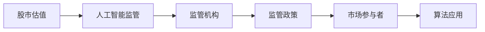
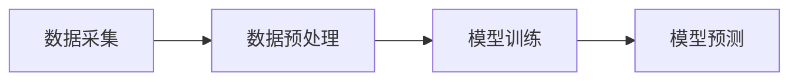
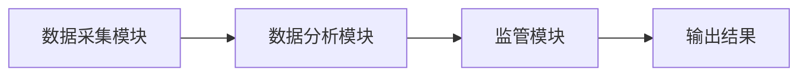
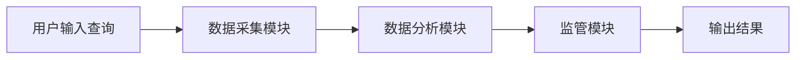

                 


# 全球股市估值与人工智能监管的关系

> 关键词：全球股市估值、人工智能监管、算法原理、系统架构、项目实战

> 摘要：本文探讨了全球股市估值与人工智能监管之间的关系，分析了人工智能技术在股市估值中的应用及其对监管的影响。文章从背景、核心概念、算法原理、系统架构、项目实战等多个维度展开，详细阐述了人工智能如何改变股市估值，并提出了相应的监管策略。

---

# 第一部分：全球股市估值与人工智能监管的背景与概述

## 第1章：全球股市估值与人工智能监管的背景

### 1.1 股市估值的基本概念

#### 1.1.1 股市估值的定义与意义

股市估值是通过对上市公司财务数据、市场趋势和经济指标的分析，确定股票的内在价值和市场价值的过程。其目的是为投资者提供决策依据，帮助其判断股票是否被高估或低估。

#### 1.1.2 股市估值的主要方法

1. **相对估值法**：通过比较市盈率（P/E）、市净率（P/B）等指标，评估股票与市场或行业平均水平的差异。
2. **绝对估值法**：通过现金流折现模型（DCF）等方法，计算股票的内在价值。

---

### 1.2 人工智能监管的基本概念

#### 1.2.1 人工智能监管的定义与目标

人工智能监管是指通过算法和数据分析，对人工智能技术的应用进行监督和管理，以确保其符合法律法规和伦理标准。其目标是防范技术滥用，保护用户隐私和数据安全。

#### 1.2.2 人工智能监管的法律框架

1. **数据隐私**：《通用数据保护条例》（GDPR）等法规要求企业保护用户数据。
2. **算法透明性**：部分国家要求企业公开算法的决策逻辑，以增加透明度。

---

### 1.3 股市估值与人工智能监管的关联性

#### 1.3.1 人工智能在股市估值中的应用

人工智能通过分析海量数据，预测股票价格走势，优化投资组合。例如，使用机器学习模型预测市场情绪，识别市场趋势。

#### 1.3.2 监管对人工智能在股市中的影响

监管机构通过审查算法的透明性和合规性，确保人工智能的应用不违反市场规则。例如，限制高频交易算法的使用，防止市场操纵。

---

## 第2章：全球股市估值与人工智能监管的发展历程

### 2.1 股市估值的历史演变

#### 2.1.1 传统估值方法的局限性

传统估值方法依赖经验判断，主观性强，难以应对市场波动和复杂情况。

#### 2.1.2 现代估值方法的创新

引入大数据分析和机器学习技术，提高了估值的准确性和效率。

---

### 2.2 人工智能技术的发展与监管挑战

#### 2.2.1 人工智能技术的快速发展

深度学习、自然语言处理等技术的应用，使人工智能在金融领域的应用更加广泛。

#### 2.2.2 人工智能监管的逐步加强

各国政府和监管机构开始制定相关政策，规范人工智能的使用。

---

### 2.3 股市估值与人工智能监管的互动关系

#### 2.3.1 人工智能如何改变股市估值

人工智能通过高频交易和算法预测，改变了传统的交易方式和估值方法。

#### 2.3.2 监管如何影响人工智能的应用

严格的监管政策可能会限制某些人工智能技术的应用，例如限制算法交易的频率。

---

## 第3章：股市估值与人工智能监管的核心概念与联系

### 3.1 股市估值的核心概念

#### 3.1.1 股票价格的决定因素

股票价格受宏观经济、公司业绩、市场情绪等多种因素影响。

#### 3.1.2 市场情绪与估值波动

市场情绪通过影响投资者的心理预期，进而影响股票价格。

---

### 3.2 人工智能监管的核心概念

#### 3.2.1 人工智能算法的透明性

透明性是监管机构审查人工智能算法的重要标准。

#### 3.2.2 监管机构的职责与权限

监管机构负责制定政策、审查算法、处理违规行为。

---

### 3.3 股市估值与人工智能监管的联系

#### 3.3.1 人工智能在股市预测中的应用

人工智能可以通过分析历史数据和市场新闻，预测股票价格走势。

#### 3.3.2 监管对人工智能算法的约束

监管政策可能限制某些人工智能技术的应用，以防止市场操纵。

---

### 3.4 核心概念对比分析

#### 3.4.1 股市估值与人工智能监管的对比表格

| 比较维度 | 股市估值 | 人工智能监管 |
|----------|----------|--------------|
| 目标     | 计算股票价值 | 监管AI技术应用 |
| 方法     | 相对估值法、绝对估值法 | 数据分析、政策制定 |
| 影响因素 | 市场情绪、宏观经济 | 法律法规、技术透明性 |

#### 3.4.2 ER实体关系图架构（使用 Mermaid）



---

## 第4章：人工智能在股市估值中的算法原理

### 4.1 常见的人工智能算法

#### 4.1.1 机器学习算法

1. **线性回归**：用于预测股票价格的趋势。
2. **支持向量机（SVM）**：用于分类市场趋势。

#### 4.1.2 深度学习算法

1. **长短期记忆网络（LSTM）**：用于时间序列预测。

---

### 4.2 算法原理与流程图

#### 4.2.1 机器学习模型的流程

1. 数据采集：收集历史股价、财务数据等。
2. 数据预处理：清洗数据，提取特征。
3. 模型训练：使用训练数据训练模型。
4. 模型预测：基于模型预测未来股价。



---

### 4.3 算法的数学模型和公式

#### 4.3.1 线性回归模型

$$ y = \beta_0 + \beta_1x + \epsilon $$

其中，$y$ 是目标变量（股票价格），$x$ 是自变量（时间），$\beta_0$ 和 $\beta_1$ 是回归系数，$\epsilon$ 是误差项。

#### 4.3.2 LSTM模型

LSTM通过门控机制（遗忘门、输入门、输出门）处理时间序列数据，公式较为复杂，但核心思想是通过记忆单元（Cell）捕捉长期依赖关系。

---

## 第5章：系统分析与架构设计方案

### 5.1 项目介绍

本项目旨在构建一个基于人工智能的股市估值系统，并设计相应的监管框架。

---

### 5.2 系统功能设计

#### 5.2.1 数据采集模块

负责采集股票的历史数据和市场新闻。

#### 5.2.2 数据分析模块

使用机器学习算法对数据进行分析，预测股票价格。

#### 5.2.3 监管模块

对算法的应用进行监控，确保符合监管要求。

---

### 5.3 系统架构设计

#### 5.3.1 系统架构图（使用 Mermaid）



---

### 5.4 系统接口设计

1. 数据接口：与数据源（如交易所）对接，获取实时数据。
2. 监管接口：与监管机构系统对接，报告算法运行情况。

---

### 5.5 系统交互设计

#### 5.5.1 交互流程图（使用 Mermaid）



---

## 第6章：项目实战

### 6.1 环境安装

1. 安装Python和相关库（如Pandas、Scikit-learn、TensorFlow）。
2. 安装Jupyter Notebook用于数据分析和建模。

---

### 6.2 核心实现源代码

#### 6.2.1 数据预处理代码

```python
import pandas as pd
import numpy as np

# 读取数据
data = pd.read_csv('stock_data.csv')

# 数据清洗
data.dropna(inplace=True)
data = data[~data['date'].duplicated()]
```

#### 6.2.2 模型训练代码

```python
from sklearn.linear_model import LinearRegression

# 训练模型
model = LinearRegression()
model.fit(X_train, y_train)
```

#### 6.2.3 模型预测代码

```python
# 预测股票价格
y_pred = model.predict(X_test)
```

---

### 6.3 案例分析

以某只股票为例，展示模型的预测结果，并与实际股价进行对比。

---

### 6.4 代码应用解读与分析

通过对代码的解读，分析算法的工作原理，并讨论其优缺点。

---

## 第7章：结论与展望

### 7.1 结论

人工智能技术正在改变股市估值的方式，但监管的缺失可能带来风险。因此，加强监管是必要的。

### 7.2 展望

未来，随着人工智能技术的不断发展，股市估值与监管的关系将更加复杂，需要更多的研究和政策支持。

---

# 参考文献

1. [1] 《人工智能与金融》
2. [2] 《股市分析与投资策略》
3. [3] 相关学术论文

---

# 术语表

1. **股票价格**：股票在市场上的交易价格。
2. **机器学习**：一种人工智能技术，通过数据训练模型。
3. **LSTM**：长短期记忆网络，用于时间序列预测。

---

# 作者

作者：AI天才研究院/AI Genius Institute & 禅与计算机程序设计艺术 /Zen And The Art of Computer Programming

