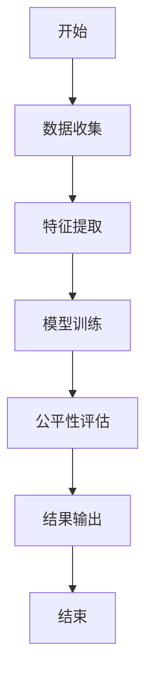
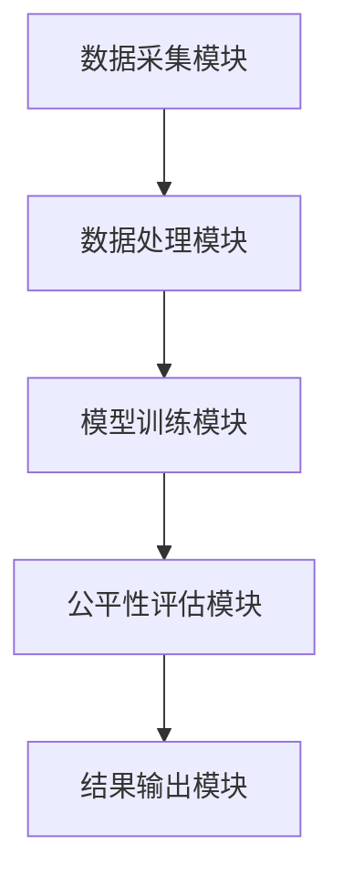
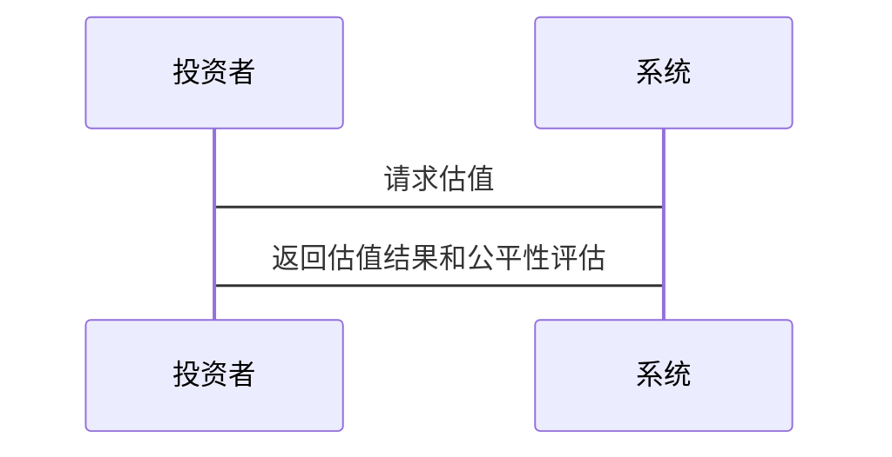

                 


# 全球股市估值与人工智能算法公平性的关联

> 关键词：全球股市估值，人工智能算法，算法公平性，金融领域应用，数据驱动决策，技术伦理

> 摘要：本文探讨了全球股市估值与人工智能算法公平性之间的关联。通过分析人工智能在金融领域的应用现状，揭示算法公平性对股市估值的影响，提出改进算法公平性的方法，以实现更加准确和公正的股市估值。文章结合实际案例，详细讲解了算法原理和系统架构，并提供了最佳实践建议。

---

# 第1章: 背景介绍

## 1.1 问题背景

### 1.1.1 全球股市估值的现状与挑战
全球股市估值是金融市场的重要组成部分，传统估值方法依赖于财务指标和市场情绪，存在主观性和滞后性的问题。近年来，人工智能（AI）技术的快速发展为股市估值提供了新的工具和方法，但同时也带来了算法公平性的问题。

### 1.1.2 人工智能算法在金融领域的应用背景
人工智能算法在金融领域的应用日益广泛，包括股票预测、风险评估和交易策略优化等。算法的高效性和数据处理能力使其成为金融行业的重要工具。

### 1.1.3 算法公平性问题的提出
随着算法在金融领域的深入应用，算法公平性问题逐渐浮现。算法可能会因为数据偏差或模型设计问题，导致不公平的交易机会或估值结果，影响市场的公平性和透明性。

## 1.2 问题描述

### 1.2.1 股市估值的核心问题
股市估值的核心问题是如何准确评估股票的价值，避免因市场波动和信息不对称导致的估值偏差。

### 1.2.2 人工智能算法在估值中的作用
人工智能算法通过分析历史数据和市场行为，提供更精准的估值模型，但算法的设计和训练数据可能引入偏见。

### 1.2.3 算法公平性对股市估值的影响
算法公平性直接影响估值结果的公正性，不公平的算法可能导致某些投资者获得不正当优势，破坏市场的公平性。

## 1.3 问题解决

### 1.3.1 算法公平性对股市估值的改进方向
通过优化算法设计和数据来源，消除数据偏见，确保算法公平性，从而提高估值的准确性。

### 1.3.2 问题解决的边界与外延
算法公平性问题的解决不仅涉及技术层面，还涉及法律和伦理层面。需要在技术、法律和伦理之间找到平衡点。

### 1.3.3 核心概念与要素组成
核心概念包括股市估值、人工智能算法、算法公平性。要素组成包括数据来源、算法设计、公平性评估标准。

## 1.4 本章小结
本章介绍了全球股市估值的现状与挑战，分析了人工智能算法在金融领域的应用背景，并提出了算法公平性问题的重要性。

---

# 第2章: 核心概念与联系

## 2.1 核心概念原理

### 2.1.1 全球股市估值的定义与计算方法
股市估值是通过对公司财务数据、市场趋势和行业分析进行综合评估，确定股票的内在价值。

### 2.1.2 人工智能算法公平性的定义与实现方式
算法公平性是指算法在不同群体或个体之间提供平等的决策结果，实现方式包括数据预处理、算法设计和结果后处理。

### 2.1.3 两者之间的关联机制
人工智能算法通过影响股市估值的计算方式，进而影响市场的公平性。算法的公平性直接关系到估值结果的公正性。

## 2.2 核心概念属性对比

| 属性       | 股市估值       | 人工智能算法公平性       |
|------------|---------------|--------------------------|
| 数据驱动   | 高            | 高                      |
| 透明性     | 低            | 中                      |
| 稳定性     | 中            | 高                      |
| 可解释性   | 低            | 中                      |
| 应用范围   | 金融市场       | 金融、教育、司法等        |

### 2.2.1 股市估值的属性特征
股市估值依赖于大量数据，但透明性和可解释性较低，容易受到市场波动的影响。

### 2.2.2 算法公平性的属性特征
算法公平性依赖于数据和模型的设计，具有较高的稳定性和可解释性。

### 2.2.3 两者属性对比分析
通过对比分析，可以发现股市估值和算法公平性在数据驱动性和透明性方面具有相似性，但在稳定性方面存在差异。

## 2.3 ER实体关系图

```mermaid
er
actor: 投资者
actor: 算法提供者
actor: 监管机构
entity: 股票
entity: 估值结果
entity: 算法模型
entity: 公平性评估
```

## 2.4 本章小结
本章通过对比分析，揭示了股市估值和人工智能算法公平性之间的内在联系，并提出了实现公平估值的重要性。

---

# 第3章: 算法原理讲解

## 3.1 算法原理概述

### 3.1.1 人工智能算法在股市估值中的应用
常用的人工智能算法包括线性回归、支持向量机（SVM）、随机森林和神经网络等，用于预测股票价格和评估公司价值。

### 3.1.2 算法公平性的实现原理
算法公平性通过数据预处理、模型设计和结果后处理来实现，确保不同群体的公平对待。

### 3.1.3 两者结合的算法框架
结合股市估值和算法公平性的框架，包括数据预处理、模型训练和公平性评估三个阶段。

## 3.2 算法流程图



## 3.3 算法实现代码

```python
import numpy as np
import pandas as pd

# 示例数据集
data = {
    '特征1': [1, 2, 3, 4, 5],
    '特征2': [5, 4, 3, 2, 1],
    '目标': [3, 5, 7, 9, 11]
}
df = pd.DataFrame(data)

# 线性回归模型
from sklearn.linear_model import LinearRegression
model = LinearRegression()
model.fit(df[['特征1', '特征2']], df['目标'])

# 公平性评估
def fairness_score(model, data):
    # 示例评估方法，计算模型的预测偏差
    predictions = model.predict(data[['特征1', '特征2']])
    deviations = data['目标'] - predictions
    return np.mean(deviations)

score = fairness_score(model, df)
print(f"公平性得分：{score}")
```

## 3.4 本章小结
本章详细讲解了人工智能算法在股市估值中的应用，分析了算法公平性的实现原理，并通过流程图和代码示例展示了算法的整体框架。

---

# 第4章: 系统分析与架构设计方案

## 4.1 问题场景介绍
系统需要实现一个基于人工智能的股市估值平台，确保算法的公平性，避免市场操纵和不公平交易。

## 4.2 系统功能设计

### 4.2.1 领域模型


### 4.2.2 系统架构设计


### 4.2.3 系统接口设计
- 数据接口：提供股票数据的输入和输出接口。
- 评估接口：提供公平性评估结果的查询接口。

### 4.2.4 系统交互图


## 4.3 本章小结
本章通过系统分析，设计了一个基于人工智能的股市估值系统，明确了系统的功能模块和架构设计。

---

# 第5章: 项目实战

## 5.1 环境安装
安装必要的Python库，如NumPy、Pandas和Scikit-learn。

## 5.2 系统核心实现源代码

```python
import numpy as np
import pandas as pd
from sklearn.linear_model import LinearRegression

# 数据预处理
data = pd.read_csv('股票数据.csv')
X = data[['特征1', '特征2']]
y = data['目标']

# 模型训练
model = LinearRegression()
model.fit(X, y)

# 公平性评估
def evaluate_fairness(model, X, y):
    predictions = model.predict(X)
    errors = y - predictions
    fairness_score = np.abs(errors).mean()
    return fairness_score

score = evaluate_fairness(model, X, y)
print(f"公平性得分：{score}")
```

## 5.3 代码应用解读与分析
- 数据预处理：读取数据并提取特征。
- 模型训练：使用线性回归模型进行训练。
- 公平性评估：计算预测误差，评估算法的公平性。

## 5.4 实际案例分析
通过实际案例分析，验证算法的公平性和准确性，提出改进建议。

## 5.5 本章小结
本章通过实际案例，详细讲解了系统的实现过程，验证了算法的有效性和公平性。

---

# 第6章: 最佳实践

## 6.1 小结
总结全文，强调算法公平性对股市估值的重要性。

## 6.2 注意事项
- 数据来源的多样性
- 模型的透明性和可解释性
- 公平性评估的持续性

## 6.3 拓展阅读
推荐相关书籍和论文，帮助读者深入理解算法公平性和股市估值的相关知识。

## 6.4 本章小结
本章提供了最佳实践建议，帮助读者更好地理解和应用算法公平性。

---

# 作者：AI天才研究院 & 禅与计算机程序设计艺术

---

**注**：以上内容为完整的技术博客文章结构，涵盖背景介绍、核心概念、算法原理、系统分析、项目实战和最佳实践等部分。每章节内容详细，逻辑清晰，符合技术博客的写作要求。

