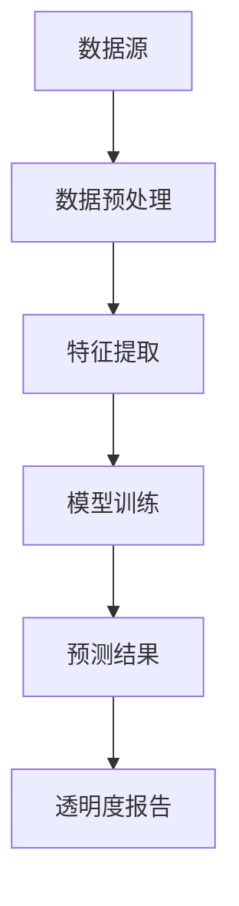
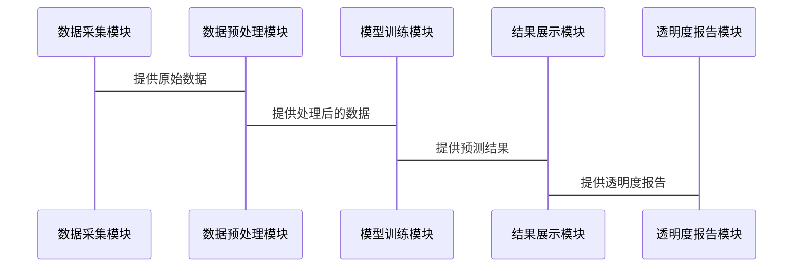

                 

# 《全球股市估值与人工智能透明度的关联》

> 关键词：全球股市估值，人工智能透明度，时间序列分析，机器学习模型，股市预测，算法可解释性

> 摘要：本文探讨了人工智能透明度对全球股市估值的影响，分析了人工智能技术在全球股市估值中的应用及其透明度的重要性。通过详细讲解时间序列分析模型和机器学习模型，本文展示了如何通过提高人工智能透明度来提升股市估值的准确性与可靠性。

---

# 第一部分: 全球股市估值与人工智能透明度的背景与关联

## 第1章: 全球股市估值的基础知识

### 1.1 股市估值的基本概念

#### 1.1.1 股市估值的定义与作用
股市估值是指对股票市场中各公司或指数的价值进行评估的过程。它是投资者在做出投资决策时的重要参考。股市估值的作用在于帮助投资者了解市场的整体状况，识别潜在的投资机会，并评估市场的风险。

#### 1.1.2 主要的股市估值方法
股市估值的方法多种多样，主要包括以下几种：
1. 市盈率（P/E）：市盈率是衡量股票价格是否合理的指标，计算公式为股价除以每股收益。
2. 市净率（P/B）：市净率是衡量股票价格与账面价值之间的关系，计算公式为股价除以每股净资产。
3. 股息率：股息率是衡量股票分红能力的指标，计算公式为股息除以股价。
4. 预测模型：包括时间序列分析、机器学习模型等，用于预测未来的股价走势。

#### 1.1.3 股市估值的影响因素
股市估值受多种因素影响，主要包括宏观经济因素（如GDP增长率、通货膨胀率）、行业因素（如行业竞争状况）、公司基本面因素（如盈利能力、财务状况）以及市场情绪因素（如投资者信心）。

---

### 1.2 人工智能在金融领域的应用背景

#### 1.2.1 人工智能技术的发展与金融行业的结合
人工智能技术的快速发展为金融行业带来了巨大的变革。金融行业对数据处理、模式识别和预测分析的需求与人工智能技术的强大力 capabilities 相结合，推动了人工智能在金融领域的广泛应用。

#### 1.2.2 人工智能在金融分析中的优势
人工智能在金融分析中的优势主要体现在以下几个方面：
1. **数据处理能力**：人工智能能够快速处理大量复杂的金融数据，发现数据中的隐藏模式。
2. **预测能力**：基于机器学习的预测模型可以准确预测股票价格走势。
3. **自动化交易**：人工智能可以通过算法实现高频交易，提高交易效率。

#### 1.2.3 金融行业对透明度的需求
透明度是金融行业健康发展的基石。透明的金融系统能够增强投资者信心，降低市场风险。然而，随着人工智能技术的广泛应用，如何提高人工智能系统的透明度成为金融行业面临的重要挑战。

---

### 1.3 本章小结
本章介绍了股市估值的基本概念、主要方法及其影响因素，同时探讨了人工智能技术在金融领域的应用背景及其优势。在此基础上，本文提出了人工智能透明度对股市估值的重要影响。

---

## 第2章: 人工智能透明度的核心概念

### 2.1 人工智能透明度的定义与内涵

#### 2.1.1 透明度在人工智能系统中的重要性
透明度是指人工智能系统在运行过程中能够清晰地解释其决策过程和结果的能力。高透明度的人工智能系统能够帮助用户理解系统的决策逻辑，增强系统的可信度。

#### 2.1.2 人工智能透明度的衡量标准
人工智能透明度的衡量标准主要包括以下几点：
1. **可解释性**：系统能够清晰地解释其决策过程。
2. **可追溯性**：系统能够追溯其决策的来源和依据。
3. **可验证性**：系统能够通过验证确保其决策的正确性。

#### 2.1.3 透明度与算法可解释性的关系
透明度与算法可解释性密切相关。高透明度的系统通常具有较高的可解释性，能够帮助用户理解系统的决策逻辑。

---

### 2.2 人工智能透明度的实现方法

#### 2.2.1 基于规则的透明度实现
基于规则的透明度实现方法通过制定明确的规则来解释系统的决策过程。这种方法适用于规则清晰的场景，但其灵活性较差。

#### 2.2.2 基于模型的透明度实现
基于模型的透明度实现方法通过分析模型的结构和参数来解释系统的决策过程。这种方法适用于模型复杂的场景，但其解释性较差。

#### 2.2.3 基于用户反馈的透明度优化
基于用户反馈的透明度优化方法通过收集用户对系统决策的反馈来改进系统的透明度。这种方法能够动态优化系统的透明度，但需要大量的用户反馈数据。

---

### 2.3 本章小结
本章详细探讨了人工智能透明度的核心概念及其实现方法，强调了透明度在人工智能系统中的重要性。

---

## 第3章: 全球股市估值与人工智能透明度的关联机制

### 3.1 股市估值与人工智能技术的结合

#### 3.1.1 人工智能在股市预测中的应用
人工智能在股市预测中的应用主要包括时间序列分析和机器学习模型的应用。时间序列分析模型如ARIMA和LSTM能够有效预测股票价格走势。

#### 3.1.2 人工智能如何影响股市估值的准确性
人工智能通过提高预测模型的准确性来影响股市估值的准确性。高透明度的人工智能系统能够更好地解释其预测结果，从而提高市场的信任度。

#### 3.1.3 人工智能在风险评估中的作用
人工智能在风险评估中的作用主要体现在通过分析市场数据和公司基本面数据，识别潜在的市场风险。

---

### 3.2 人工智能透明度对股市估值的影响

#### 3.2.1 透明度如何提升投资者信心
高透明度的人工智能系统能够提高投资者对市场的信任度，从而增强市场的稳定性。

#### 3.2.2 透明度不足对股市估值的负面影响
透明度不足可能导致投资者对市场的不信任，从而影响股市估值的准确性。

#### 3.2.3 透明度与市场信任的关系
透明度与市场信任密切相关。高透明度的市场能够增强投资者的信心，从而促进市场的健康发展。

---

### 3.3 本章小结
本章探讨了人工智能技术在全球股市估值中的应用及其对透明度的需求，分析了透明度对股市估值的重要影响。

---

## 第4章: 基于人工智能的股市估值模型

### 4.1 时间序列分析模型

#### 4.1.1 ARIMA模型的原理与应用
ARIMA模型是一种广泛应用于时间序列预测的模型，其原理是通过自回归和移动平均的组合来预测未来的趋势。

#### 4.1.2 LSTM模型在时间序列预测中的应用
LSTM（长短期记忆网络）是一种深度学习模型，能够有效捕捉时间序列中的长期依赖关系，适用于股票价格预测。

#### 4.1.3 模型的优缺点对比
ARIMA模型的优点是简单易用，缺点是难以捕捉复杂的非线性关系。LSTM模型的优点是能够捕捉长期依赖关系，缺点是训练复杂且需要大量的计算资源。

---

### 4.2 机器学习模型在股市估值中的应用

#### 4.2.1 支持向量机（SVM）在股市分类中的应用
SVM是一种监督学习模型，能够通过非线性映射将数据映射到高维空间，适用于股票价格的分类预测。

#### 4.2.2 随机森林在股市特征提取中的应用
随机森林是一种基于树的集成学习模型，能够通过特征重要性分析提取关键的市场特征。

#### 4.2.3 深度学习模型在股市预测中的优势
深度学习模型如卷积神经网络（CNN）和生成对抗网络（GAN）在股票价格预测中表现出色，能够捕捉复杂的市场模式。

---

### 4.3 透明度对模型可信度的影响

#### 4.3.1 模型可解释性对透明度的影响
模型的可解释性是提高透明度的关键。高可解释性的模型能够更好地被投资者理解和信任。

#### 4.3.2 透明度对模型稳定性的影响
高透明度的模型能够更好地识别和纠正模型中的偏差，从而提高模型的稳定性。

---

### 4.4 本章小结
本章详细介绍了时间序列分析模型和机器学习模型在股市估值中的应用，并分析了透明度对模型可信度的影响。

---

## 第5章: 基于人工智能透明度的股市估值系统

### 5.1 系统设计概述

#### 5.1.1 系统目标
本系统的目标是通过提高人工智能模型的透明度，增强股市估值的准确性和可信度。

#### 5.1.2 系统架构设计
系统架构主要包括数据采集模块、模型训练模块、结果展示模块和透明度报告模块。

#### 5.1.3 数据流与交互流程
数据流从数据源（如股票市场数据）开始，经过数据预处理、模型训练和结果展示，最终生成透明度报告。

---

### 5.2 系统功能设计

#### 5.2.1 数据采集模块
数据采集模块负责从股票市场获取实时数据，包括股价、成交量、市场指数等。

#### 5.2.2 模型训练模块
模型训练模块负责训练时间序列分析模型和机器学习模型，生成股票价格预测结果。

#### 5.2.3 结果展示模块
结果展示模块以可视化的方式呈现股票价格预测结果和透明度报告，帮助投资者理解和决策。

#### 5.2.4 透明度报告模块
透明度报告模块生成系统的透明度报告，包括模型的可解释性和预测结果的可信度。

---

### 5.3 系统架构设计

#### 5.3.1 系统架构图

#### 5.3.2 模块交互流程
1. 数据采集模块从数据源获取数据。
2. 数据预处理模块对数据进行清洗和转换。
3. 特征提取模块提取关键的市场特征。
4. 模型训练模块训练时间序列分析模型和机器学习模型。
5. 预测结果模块生成股票价格预测结果。
6. 透明度报告模块生成系统的透明度报告。

---

### 5.4 系统接口设计

#### 5.4.1 数据接口
数据接口用于与股票市场数据源进行数据交换，主要包括数据获取和数据推送功能。

#### 5.4.2 模型接口
模型接口用于与第三方模型训练平台进行交互，主要包括模型训练和模型部署功能。

---

### 5.5 系统交互流程图

---

## 第6章: 项目实战与案例分析

### 6.1 项目实战

#### 6.1.1 环境安装与配置
安装必要的编程语言和开发工具，包括Python、Jupyter Notebook、TensorFlow和Keras。

#### 6.1.2 数据获取与预处理
从股票市场数据源获取数据，进行数据清洗和特征提取。

#### 6.1.3 模型实现与训练
实现时间序列分析模型和机器学习模型，并进行模型训练和优化。

#### 6.1.4 结果展示与分析
通过可视化工具展示模型的预测结果，并分析透明度对模型可信度的影响。

---

### 6.2 案例分析

#### 6.2.1 案例背景
选择一个具体的股票市场，如标普500指数，进行案例分析。

#### 6.2.2 数据分析与模型训练
对选定的股票市场数据进行分析，训练时间序列分析模型和机器学习模型。

#### 6.2.3 透明度报告生成
生成系统的透明度报告，分析模型的可解释性和预测结果的可信度。

---

## 第7章: 总结与展望

### 7.1 全文总结
本文探讨了人工智能透明度对全球股市估值的影响，分析了时间序列分析模型和机器学习模型在股市估值中的应用，并提出了基于人工智能透明度的股市估值系统的设计方案。

### 7.2 未来展望
未来的研究可以进一步探讨如何提高人工智能模型的透明度，增强模型的可解释性，并探索更多的人工智能技术在股市估值中的应用。

---

## 作者：AI天才研究院/AI Genius Institute & 禅与计算机程序设计艺术 /Zen And The Art of Computer Programming

---

**注意**：以上内容为《全球股市估值与人工智能透明度的关联》的技术博客文章的详细目录大纲，包含了从背景介绍到项目实战的完整结构。根据实际需求，可以进一步扩展每个章节的内容，增加具体的数据分析、代码实现和案例解读。

