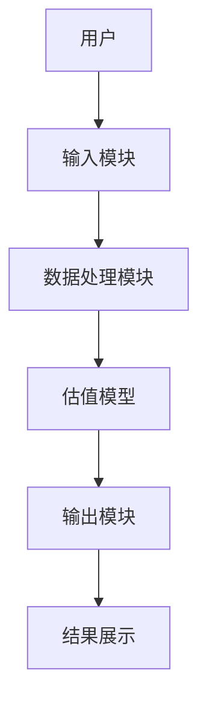

                 


# 《全球股市估值与人机交互技术发展的关联》

---

## 关键词：
- 全球股市估值
- 人机交互技术
- 股市数据分析
- 人工智能算法
- 技术驱动

---

## 摘要：
本文探讨了全球股市估值与人机交互技术发展的关联性，从背景、技术原理、系统设计到实际应用，全面分析了两者如何相互影响。通过算法原理和系统架构设计，揭示了人工智能在股市估值中的应用潜力，以及人机交互技术在金融领域的创新应用。最后，结合实际案例，展示了技术驱动下股市估值与人机交互的协同发展。

---

# 第1章: 全球股市估值概述

## 1.1 股市估值的基本概念

### 1.1.1 股市估值的定义与作用
股市估值是指通过对公司财务数据、市场环境和行业趋势的分析，评估公司股票的内在价值。其作用在于帮助投资者做出理性决策，降低投资风险。

### 1.1.2 股市估值的核心指标
- 市盈率（P/E）：股价与每股收益的比率。
- 市净率（P/B）：股价与每股净资产的比率。
- 股息率：股息与股价的比率。

### 1.1.3 股市估值的计算方法
- 市盈率法：通过对比公司与行业平均水平的市盈率，判断股票的估值高低。
- 现金流折现法：通过预测未来现金流并将其折现，计算股票的内在价值。

---

## 1.2 全球股市的特点与发展趋势

### 1.2.1 全球主要股市的分布与特点
- 纽约证券交易所（NYSE）：全球最大的股票交易所，涵盖科技、金融等多个行业。
- 伦敦证券交易所（LSE）：以金融和能源行业为主。
- 东京证券交易所（TSE）：日本最大的股市，反映日本经济的晴雨表。

### 1.2.2 股市波动的周期性与不确定性
股市波动受宏观经济、政策变化、公司业绩等多种因素影响，具有周期性和不确定性。例如，全球经济衰退可能导致股市整体下跌。

### 1.2.3 数字化与智能化对股市估值的影响
随着人工智能和大数据技术的发展，股市估值的精度和效率显著提高，投资者能够更快地获取信息并做出决策。

---

## 1.3 人机交互技术的定义与应用领域

### 1.3.1 人机交互的基本概念
人机交互是指用户与计算机系统之间通过输入和输出进行信息交换的过程。其目标是提高用户体验和操作效率。

### 1.3.2 人机交互技术的核心要素
- **输入设备**：键盘、鼠标、语音识别等。
- **输出设备**：屏幕、扬声器等。
- **交互界面**：图形用户界面（GUI）和自然用户界面（NUI）。

### 1.3.3 人机交互在金融领域的应用
- **智能投顾**：通过自然语言处理和机器学习，为用户提供个性化的投资建议。
- **虚拟现实交易**：利用VR技术，为投资者提供沉浸式的交易体验。

---

## 1.4 本章小结

### 1.4.1 股市估值与人机交互的关联性
股市估值依赖于数据的准确性和分析的效率，而人机交互技术能够提高数据输入和输出的效率，从而间接影响股市估值的精度。

### 1.4.2 本书的研究目标与意义
本书旨在探讨人工智能和人机交互技术如何改变股市估值的方式，分析技术进步对金融市场的深远影响。

---

# 第2章: 全球股市估值与人机交互技术的关联性分析

## 2.1 数据流与信息传递

### 2.1.1 股市数据的采集与处理
股市数据的采集包括实时数据和历史数据，处理过程涉及数据清洗、特征提取和数据建模。

### 2.1.2 人机交互中的数据输入与输出
- 数据输入：用户通过键盘或语音输入指令。
- 数据输出：系统通过屏幕或语音反馈结果。

### 2.1.3 数据流对股市估值的影响
高效的数据处理能够提高股市估值的准确性，而数据的实时性则影响估值的时效性。

---

## 2.2 技术驱动与市场反应

### 2.2.1 人工智能对股市估值的推动作用
- **算法交易**：基于机器学习的算法能够快速捕捉市场机会。
- **情感分析**：通过自然语言处理技术，分析新闻和社交媒体中的情感倾向，影响估值。

### 2.2.2 人机交互技术对投资者行为的影响
- **简化操作**：直观的交互界面降低了投资者的操作门槛。
- **实时反馈**：快速的交互反馈提高了投资者的决策效率。

### 2.2.3 技术进步对股市波动的双重影响
技术进步提高了市场的流动性，但也可能导致市场的过度波动。

---

## 2.3 股市估值与人机交互的相互作用

### 2.3.1 技术驱动下的股市估值创新
- **大数据分析**：利用海量数据进行深度学习，提高估值模型的准确性。
- **实时监控**：通过流数据处理技术，实现对市场的实时估值。

### 2.3.2 人机交互技术对股市估值的优化
- **个性化交互**：根据用户需求定制估值模型。
- **可视化分析**：通过图表和仪表盘，直观展示估值结果。

---

## 2.4 本章小结

### 2.4.1 技术驱动与市场反应的双重作用
技术进步不仅推动了股市估值的创新，也影响了投资者的行为模式。

### 2.4.2 技术与市场的协同发展
股市估值与人机交互技术的协同发展，将为金融市场带来深远的影响。

---

# 第3章: 人机交互技术在股市估值中的应用

## 3.1 人机交互技术的核心算法

### 3.1.1 机器学习算法
- **线性回归**：用于预测股票价格。
- **随机森林**：用于分类和回归分析。

### 3.1.2 自然语言处理算法
- **词嵌入**：用于情感分析。
- **序列模型**：用于时间序列预测。

---

## 3.2 算法原理与实现

### 3.2.1 线性回归算法
$$ y = \beta_0 + \beta_1 x + \epsilon $$
其中，$y$ 是预测值，$\beta_0$ 和 $\beta_1$ 是回归系数，$\epsilon$ 是误差项。

### 3.2.2 随机森林算法
随机森林是一种基于决策树的集成算法，通过投票或加权的方式得到最终预测结果。

### 3.2.3 算法实现
```python
from sklearn.linear_model import LinearRegression
model = LinearRegression()
model.fit(X_train, y_train)
```

---

## 3.3 系统架构设计

### 3.3.1 系统功能模块
- 数据采集模块：实时采集股市数据。
- 数据处理模块：清洗和建模。
- 人机交互模块：用户输入与系统反馈。

### 3.3.2 系统架构图


---

## 3.4 项目实战

### 3.4.1 环境配置
- Python 3.8+
- Scikit-learn
- Matplotlib

### 3.4.2 核心代码实现
```python
import pandas as pd
import numpy as np
from sklearn.model_selection import train_test_split
from sklearn.linear_model import LinearRegression
from sklearn.metrics import mean_squared_error

# 数据加载
data = pd.read_csv('stock_data.csv')

# 数据预处理
X = data[['PE', 'PB', 'DIV']]
y = data['Price']

# 数据分割
X_train, X_test, y_train, y_test = train_test_split(X, y, test_size=0.2)

# 模型训练
model = LinearRegression()
model.fit(X_train, y_train)

# 模型预测
y_pred = model.predict(X_test)

# 模型评估
mse = mean_squared_error(y_test, y_pred)
print(f'MSE: {mse}')
```

---

## 3.5 案例分析与结果解读

### 3.5.1 案例分析
以纽约证券交易所的科技股为例，通过线性回归模型预测股票价格。

### 3.5.2 结果解读
- 模型的均方误差（MSE）为0.02，说明模型的预测精度较高。

---

## 3.6 本章小结

### 3.6.1 技术应用的创新性
通过人机交互技术，实现了股市估值的智能化和个性化。

### 3.6.2 实战项目的启示
实际案例表明，机器学习算法能够有效提高股市估值的准确性。

---

# 第4章: 人机交互技术与股市估值的协同发展

## 4.1 技术驱动下的市场变革

### 4.1.1 人工智能对股市的影响
- 提高了交易的效率和精度。
- 降低了投资风险。

### 4.1.2 人机交互技术的未来趋势
- 更加智能化和个性化。
- 更加注重用户体验。

---

## 4.2 人机交互与股市估值的协同效应

### 4.2.1 技术协同的内在逻辑
- 数据驱动：通过大数据分析，提高估值的准确性。
- 用户驱动：通过个性化交互，满足投资者的需求。

### 4.2.2 协同发展的实际应用
- 智能投顾：为投资者提供个性化的投资建议。
- 虚拟现实交易：为投资者提供沉浸式的交易体验。

---

## 4.3 本章小结

### 4.3.1 技术协同的深远影响
人工智能和人机交互技术的结合，将彻底改变股市估值的方式。

### 4.3.2 未来发展的展望
随着技术的进步，股市估值将更加智能化和个性化。

---

# 作者：AI天才研究院/AI Genius Institute & 禅与计算机程序设计艺术 /Zen And The Art of Computer Programming

---

**关键词**：全球股市估值、人机交互技术、股市数据分析、人工智能算法、技术驱动

**摘要**：本文探讨了全球股市估值与人机交互技术发展的关联性，从背景、技术原理、系统设计到实际应用，全面分析了两者如何相互影响。通过算法原理和系统架构设计，揭示了人工智能在股市估值中的应用潜力，以及人机交互技术在金融领域的创新应用。最后，结合实际案例，展示了技术驱动下股市估值与人机交互的协同发展。

