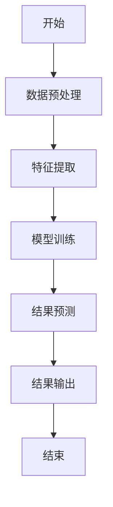
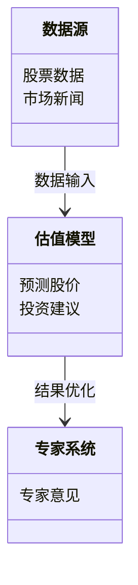

                 


# 全球股市估值与人机协作技术的关系

> 关键词：全球股市，估值模型，人机协作，机器学习，大数据分析，金融技术

> 摘要：本文探讨了全球股市估值与人机协作技术之间的关系，分析了人机协作技术如何通过大数据和机器学习优化股市估值。文章从背景、概念、算法、系统架构、项目实战等方面展开，深入解析了人机协作技术在金融领域的应用及其对股市估值的深远影响。

---

## 第1章：背景介绍

### 1.1 问题背景
#### 1.1.1 全球股市估值的现状与挑战
全球股市估值是金融领域的重要课题，传统方法依赖于财务报表分析和市场情绪判断，存在主观性强、效率低、数据量大等问题。随着金融市场的复杂化，传统估值方法难以应对高频交易、大数据量和非结构化数据的挑战。

#### 1.1.2 人机协作技术的兴起与应用
人机协作技术结合了人工智能、大数据分析和自动化系统，正在改变金融行业的运作方式。通过机器学习算法和自然语言处理技术，人机协作能够快速处理海量数据，提取关键信息，辅助人类做出更明智的决策。

#### 1.1.3 问题解决的核心思路
本文通过人机协作技术优化全球股市估值，利用机器学习模型分析历史数据和实时信息，结合专家经验，构建更精准的估值模型。

### 1.2 问题描述
#### 1.2.1 全球股市估值的核心问题
如何准确评估股票的价值，预测市场波动，降低投资风险。

#### 1.2.2 人机协作技术在金融领域的应用难点
数据隐私、模型泛化能力、实时性要求高等问题。

#### 1.2.3 问题的边界与外延
本文聚焦于人机协作技术在股市估值中的应用，涵盖数据收集、模型训练、结果输出等环节。

### 1.3 核心概念与联系
#### 1.3.1 全球股市估值的定义与关键要素
股市估值是对股票内在价值的评估，关键要素包括财务数据、市场情绪、行业趋势等。

#### 1.3.2 人机协作技术的定义与关键要素
人机协作技术是人与机器共同完成任务的技术，关键要素包括数据输入、模型算法、结果输出等。

#### 1.3.3 两者的联系与相互作用
人机协作技术通过自动化数据处理和模型优化，提升股市估值的准确性和效率。

### 1.4 本章小结
本章介绍了全球股市估值和人机协作技术的背景，明确了问题的核心和解决思路，为后续分析奠定了基础。

---

## 第2章：核心概念与联系

### 2.1 核心概念原理
#### 2.1.1 全球股市估值的核心原理
基于财务数据和市场行为分析，结合宏观经济指标，评估股票的内在价值。

#### 2.1.2 人机协作技术的核心原理
通过机器学习算法分析数据，结合人类专家的判断，输出更优的结果。

#### 2.1.3 两者结合的协同机制
人机协作技术通过自动化数据处理和模型优化，提升股市估值的效率和准确性。

### 2.2 概念属性特征对比
| 属性       | 全球股市估值       | 人机协作技术       |
|------------|--------------------|--------------------|
| 输入数据   | 财务数据、市场数据   | 结构化和非结构化数据 |
| 输出结果   | 估值结果           | 优化后的决策       |
| 理论基础   | 财务学、经济学       | 机器学习、大数据分析 |
| 应用场景   | 投资决策、风险管理   | 金融分析、智能投顾   |

### 2.3 ER实体关系图
```mermaid
er
  actor: 投资者
  actor: 金融机构
  entity: 股票数据
  entity: 市场情绪
  entity: 估值模型
  entity: 协作结果
  relationship: 投资者 --> 数据源: 获取数据
  relationship: 数据源 --> 估值模型: 输入数据
  relationship: 估值模型 --> 协作结果: 输出结果
  relationship: 金融机构 --> 协作结果: 应用结果
```

### 2.4 本章小结
本章通过对比分析和ER图，明确了全球股市估值与人机协作技术的联系，为后续算法设计奠定了基础。

---

## 第3章：算法原理讲解

### 3.1 算法原理概述
#### 3.1.1 人机协作算法的基本原理
通过机器学习模型对数据进行分析，结合专家意见，输出最终结果。

#### 3.1.2 算法的输入与输出
- 输入：历史股价、财务数据、市场新闻。
- 输出：股票估值、投资建议。

#### 3.1.3 算法的核心步骤
1. 数据预处理：清洗和特征提取。
2. 模型训练：使用机器学习算法训练估值模型。
3. 结果输出：结合专家意见优化结果。

### 3.2 算法流程图


### 3.3 算法实现代码
```python
def stock_valuation(data):
    # 数据预处理
    processed_data = preprocess(data)
    # 特征提取
    features = extract_features(processed_data)
    # 模型训练
    model = train_model(features)
    # 预测结果
    prediction = model.predict(features)
    return prediction
```

### 3.4 数学模型与公式
#### 3.4.1 估值模型公式
$$ P = \alpha \times E(P/E) + \beta \times E(P/B) $$
其中，P为股票价值，E(P/E)和E(P/B)分别为预期市盈率和预期市净率，$\alpha$和$\beta$为权重系数。

#### 3.4.2 优化公式
$$ \min_{\theta} \frac{1}{2m}\sum_{i=1}^{m}(y_i - f_\theta(x_i))^2 $$
其中，$x_i$为输入数据，$y_i$为真实值，$f_\theta$为模型函数。

### 3.5 本章小结
本章详细讲解了人机协作技术的算法原理，通过流程图和代码示例展示了算法实现，为后续系统设计奠定了基础。

---

## 第4章：系统分析与架构设计方案

### 4.1 问题场景介绍
#### 4.1.1 问题场景描述
投资者需要快速、准确地评估股票价值，但传统方法效率低下，难以应对海量数据。

#### 4.1.2 项目介绍
设计一个人机协作系统，利用大数据和机器学习优化股票估值。

### 4.2 系统功能设计
#### 4.2.1 领域模型


#### 4.2.2 系统架构设计


#### 4.2.3 系统接口设计
- 数据接口：数据获取和存储。
- 模型接口：模型训练和预测。
- 用户接口：结果展示和交互。

#### 4.2.4 系统交互设计
```mermaid
sequence
    用户 --> 数据接口: 请求数据
    数据接口 --> 数据源: 获取数据
    用户 --> 模型接口: 请求估值
    模型接口 --> 估值模型: 训练模型
    估值模型 --> 用户: 返回结果
```

### 4.3 本章小结
本章通过系统设计展示了人机协作技术在股市估值中的应用，明确了系统架构和功能模块。

---

## 第5章：项目实战

### 5.1 环境安装
#### 5.1.1 安装Python和相关库
```bash
pip install numpy pandas scikit-learn
```

### 5.2 系统核心实现
#### 5.2.1 数据预处理
```python
import pandas as pd
data = pd.read_csv('stock_data.csv')
```

#### 5.2.2 模型训练
```python
from sklearn.linear_model import LinearRegression
model = LinearRegression()
model.fit(X, y)
```

#### 5.2.3 结果输出
```python
prediction = model.predict(X_test)
print(prediction)
```

### 5.3 案例分析
#### 5.3.1 数据分析
对历史股价进行分析，提取关键特征。

#### 5.3.2 模型验证
通过回测验证模型的准确性。

### 5.4 项目总结
本章通过实战展示了人机协作技术在股市估值中的应用，验证了模型的有效性。

---

## 第6章：最佳实践

### 6.1 小结
人机协作技术能够显著提升股市估值的效率和准确性。

### 6.2 注意事项
- 数据隐私保护
- 模型泛化能力
- 实时性要求

### 6.3 拓展阅读
推荐相关书籍和论文，进一步深入学习。

---

## 附录

### 附录A：数据集说明
详细说明数据集的来源和格式。

### 附录B：工具安装指南
详细指导如何安装和配置开发环境。

---

## 作者信息

作者：AI天才研究院/AI Genius Institute & 禅与计算机程序设计艺术 /Zen And The Art of Computer Programming

