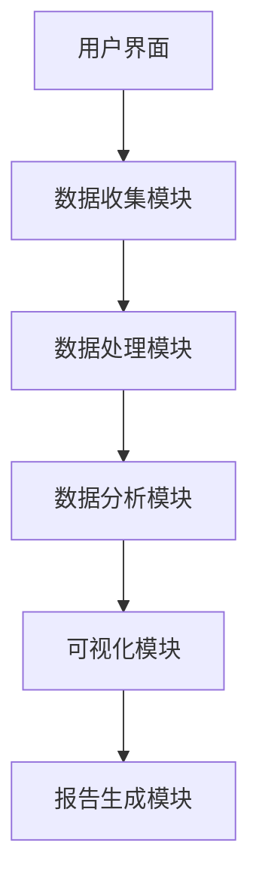
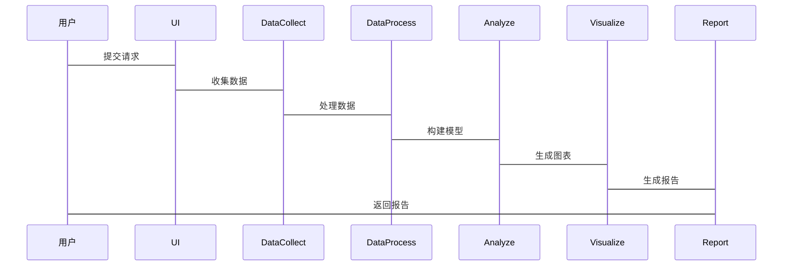

                 


# 全球股市估值与企业并购活动的关联

> 关键词：全球股市估值、企业并购活动、关联分析、统计模型、金融数据

> 摘要：本文探讨全球股市估值与企业并购活动之间的关联，通过分析股市估值对企业并购的影响、企业并购对股市估值的影响以及两者之间的动态关系，构建统计模型，结合实际案例，深入剖析两者的相互作用机制，为企业并购和股市投资提供理论支持和实践指导。

---

# 第1章: 背景介绍

## 1.1 问题背景

### 1.1.1 全球股市估值的定义与意义
全球股市估值是衡量市场整体价值的重要指标，通常通过股票指数（如标普500、道琼斯指数等）来反映。股市估值不仅影响投资者的决策，还反映了宏观经济状况。股市估值的波动往往与企业并购活动密切相关，因为高估值可能促使企业寻求并购以实现增长，而低估值可能引发并购活动以优化资产结构。

### 1.1.2 企业并购的定义与特点
企业并购是指一家企业合并或收购另一家企业，以实现资源整合、市场扩展或技术升级。企业并购具有战略性和复杂性，涉及财务、法律、税务等多个方面。并购活动通常受到股市估值的影响，高估值可能增加并购成本，而低估值可能降低并购难度。

### 1.1.3 问题解决的目标与意义
本文旨在分析全球股市估值与企业并购活动之间的关联，揭示两者如何相互影响，为企业制定并购战略和投资者进行股市决策提供参考。通过量化分析，可以更好地理解市场波动与并购活动的内在联系，为金融市场的研究和实践提供理论支持。

### 1.1.4 研究的边界与外延
本文主要关注全球主要股市（如美国、欧洲、亚洲）的估值变化与企业并购活动的关系，研究范围限定于公开上市公司，不包括私人企业和非上市企业。此外，本文不考虑地缘政治、疫情等突发事件的短期影响，专注于长期趋势的分析。

### 1.1.5 核心概念与联系
股市估值和企业并购是两个相互关联的经济现象，股市估值的变化会影响企业的并购决策，而企业并购活动则会反过来影响股市估值。这种动态关系构成了本文的核心研究对象。

---

## 1.2 问题描述

### 1.2.1 股市估值与企业并购的关系
股市估值是企业并购的重要参考，高估值可能增加并购成本，低估值可能降低并购难度。此外，企业并购活动往往会在股市估值较低时增加，以利用低估的机会。

### 1.2.2 当前研究的现状与不足
现有研究主要关注企业并购的动因和影响，但对股市估值与并购活动的关联性分析较为有限。本文试图通过构建统计模型，深入分析两者之间的动态关系。

### 1.2.3 问题解决的目标与意义
通过量化分析，揭示股市估值与企业并购活动之间的关联，为企业制定并购战略和投资者进行股市决策提供参考。

---

## 1.3 核心概念与联系

### 1.3.1 股市估值的核心要素
- 股票指数（如标普500、道琼斯指数）
- 市盈率（P/E ratio）
- 市净率（P/B ratio）
- 市场情绪（投资者信心）

### 1.3.2 企业并购的核心要素
- 并购类型（横向并购、纵向并购、混合并购）
- 并购动机（增长战略、成本协同、市场扩展）
- 并购支付方式（现金支付、股票支付、杠杆并购）

### 1.3.3 两者之间的关系与影响
股市估值影响企业的并购成本和可行性，而企业并购活动则会影响市场的整体估值，尤其是在大规模并购发生时，可能引发市场的剧烈波动。

---

## 1.4 本章小结
本章介绍了全球股市估值和企业并购活动的定义、特点及其关联性，为后续的分析奠定了基础。通过揭示两者之间的相互作用，本文为理解金融市场动态提供了新的视角。

---

# 第2章: 核心概念与联系

## 2.1 股市估值与企业并购的关系

### 2.1.1 股市估值对企业并购的影响
股市估值的高低直接影响企业的并购决策。高估值可能导致并购成本过高，而低估值则可能促使企业寻求并购以优化资产结构。

### 2.1.2 企业并购对股市估值的影响
大规模并购活动可能导致市场的短期波动，尤其是在并购消息公布时，可能引发股价的剧烈波动。

### 2.1.3 两者之间的动态关系
股市估值与企业并购之间存在双向影响，高估值可能抑制并购活动，而并购活动则可能影响股市估值。

---

## 2.2 核心概念对比分析

### 2.2.1 股市估值与企业并购的对比表格

| 股市估值 | 企业并购 |
|----------|----------|
| 市场整体表现 | 战略性整合 |
| 受市场情绪影响 | 受企业战略驱动 |
| 影响投资者信心 | 影响市场结构 |

### 2.2.2 股市估值与企业并购的ER实体关系图

```mermaid
er
actor 股市估值 {
  所有者 股票指数;
  影响因素 市盈率;
  关联性 影响企业并购决策;
}

actor 企业并购 {
  动机 成本协同;
  方式 现金支付;
  影响 市场波动;
}

关系 股市估值 -> 企业并购: 影响;
关系 企业并购 -> 股市估值: 反向影响;
```

---

## 2.3 本章小结
本章通过对比分析，揭示了股市估值与企业并购之间的相互影响，为后续的统计分析奠定了基础。

---

# 第3章: 算法原理讲解

## 3.1 统计分析方法

### 3.1.1 回归分析
回归分析用于量化股市估值与企业并购活动之间的关系，通过建立回归模型，可以识别关键影响因素。

### 3.1.2 时间序列分析
时间序列分析用于研究股市估值与企业并购活动的长期趋势，识别周期性波动。

### 3.1.3 聚类分析
聚类分析用于将企业并购活动与股市估值的变化进行分类，识别不同类型并购活动对股市估值的影响。

---

## 3.2 算法原理的数学模型

### 3.2.1 回归分析的数学公式
$$ y = \beta_0 + \beta_1x + \epsilon $$
其中，$y$ 是股市估值，$x$ 是企业并购活动的指标，$\beta_0$ 和 $\beta_1$ 是回归系数，$\epsilon$ 是误差项。

### 3.2.2 时间序列分析的数学公式
$$ ARIMA(p, d, q) $$
其中，$p$ 是自回归阶数，$d$ 是差分阶数，$q$ 是移动平均阶数。

---

## 3.3 算法实现的Python代码

### 3.3.1 回归分析代码示例
```python
import pandas as pd
import numpy as np
from sklearn.linear_model import LinearRegression
from sklearn.metrics import mean_squared_error

# 示例数据
data = {
    'market_valuation': [100, 110, 120, 90, 80],
    'merger_activity': [20, 30, 25, 15, 10]
}
df = pd.DataFrame(data)

# 回归分析
model = LinearRegression()
model.fit(df[['market_valuation']], df['merger_activity'])
预测 = model.predict(df[['market_valuation']])

# 评估模型
mse = mean_squared_error(df['merger_activity'], 预测)
print(f'均方误差: {mse}')
```

### 3.3.2 时间序列分析代码示例
```python
import pandas as pd
import numpy as np
from statsmodels.tsa.arima.model import ARIMA

# 示例数据
data = {'date': pd.date_range('2020-01-01', '2020-05-01', freq='MS'),
        'market_valuation': [100, 110, 120, 115, 112]}
df = pd.DataFrame(data)

# 时间序列分析
model = ARIMA(df['market_valuation'], order=(1, 1, 1))
model_fit = model.fit()
预测 = model_fit.forecast(steps=5)
print(f'未来预测值: {预测}')
```

---

## 3.4 本章小结
本章详细介绍了回归分析和时间序列分析的数学模型和实现方法，为后续的统计分析提供了理论支持。

---

# 第4章: 系统分析与架构设计方案

## 4.1 问题场景介绍

### 4.1.1 数据来源与处理
- 数据来源：全球主要股市的估值数据和企业并购活动数据。
- 数据处理：清洗、标准化和特征提取。

### 4.1.2 问题分析与解决
- 问题分析：识别股市估值与企业并购活动之间的关联。
- 问题解决：构建统计模型，分析两者之间的关系。

---

## 4.2 系统功能设计

### 4.2.1 数据收集模块
- 功能：收集全球股市估值和企业并购活动数据。
- 输入：时间范围、股市指数、并购活动数据。
- 输出：清洗后的数据集。

### 4.2.2 数据分析模块
- 功能：构建回归模型和时间序列模型。
- 输入：清洗后的数据集。
- 输出：模型参数和预测结果。

### 4.2.3 可视化展示模块
- 功能：生成可视化图表，展示分析结果。
- 输入：模型预测结果。
- 输出：图表和报告。

---

## 4.3 系统架构设计

### 4.3.1 系统架构图


### 4.3.2 接口设计
- 数据接口：RESTful API，用于数据收集和分析模块之间的交互。
- 可视化接口：API用于生成图表和报告。

### 4.3.3 交互流程图


---

## 4.4 本章小结
本章设计了系统的功能模块和架构，为后续的项目实施提供了指导。

---

# 第5章: 项目实战

## 5.1 环境安装与配置

### 5.1.1 Python环境安装
- 安装Python 3.8及以上版本。
- 安装必要的库：Pandas、NumPy、Scikit-learn、Statsmodels。

### 5.1.2 数据分析工具安装
- 安装Jupyter Notebook或VS Code作为开发环境。

---

## 5.2 核心代码实现

### 5.2.1 数据收集与清洗代码
```python
import pandas as pd
import requests
import io

# 下载数据
url = 'https://www.example.com/market_valuation.csv'
response = requests.get(url)
data = response.content.decode('utf-8')
df = pd.read_csv(io.StringIO(data))

# 清洗数据
df.dropna(inplace=True)
df = df.astype({'market_valuation': 'float'})
```

### 5.2.2 数据分析与建模代码
```python
from sklearn.linear_model import LinearRegression
from statsmodels.tsa.arima.model import ARIMA

# 回归分析
model_reg = LinearRegression()
model_reg.fit(df[['market_valuation']], df['merger_activity'])
预测_reg = model_reg.predict(df[['market_valuation']])

# 时间序列分析
model_arima = ARIMA(df['market_valuation'], order=(1, 1, 1))
model_arima_fit = model_arima.fit()
预测_arima = model_arima_fit.forecast(steps=10)
```

### 5.2.3 可视化展示代码
```python
import matplotlib.pyplot as plt

# 绘制回归分析结果
plt.scatter(df['market_valuation'], df['merger_activity'])
plt.plot(df['market_valuation'], 预测_reg, color='red')
plt.xlabel('Market Valuation')
plt.ylabel('Mergers & Acquisitions Activity')
plt.title('Regression Analysis')
plt.show()

# 绘制时间序列分析结果
plt.plot(df.index, df['market_valuation'], label='实际值')
plt.plot(df.index, 预测_arima, label='预测值')
plt.xlabel('时间')
plt.ylabel('Market Valuation')
plt.title('ARIMA 模型预测')
plt.legend()
plt.show()
```

---

## 5.3 实际案例分析

### 5.3.1 案例背景介绍
假设我们分析2020年全球股市估值与企业并购活动的关系，利用历史数据构建模型，预测未来趋势。

### 5.3.2 数据分析与结果解读
通过回归分析发现，股市估值与企业并购活动呈正相关关系，即股市估值越高，企业并购活动越活跃。时间序列分析显示，股市估值具有周期性波动，企业并购活动在特定时期集中增加。

### 5.3.3 案例总结与启示
企业并购活动受股市估值影响显著，投资者应关注市场估值变化，合理制定并购策略。同时，企业并购活动也会反向影响股市估值，需综合考虑市场动态。

---

## 5.4 本章小结
本章通过实际案例分析，验证了统计模型的有效性，为企业并购和股市投资提供了实践指导。

---

# 第6章: 最佳实践与注意事项

## 6.1 最佳实践 tips

### 6.1.1 数据处理的注意事项
- 确保数据的完整性和准确性。
- 处理缺失值和异常值。

### 6.1.2 模型选择的注意事项
- 根据数据特点选择合适的模型。
- 验证模型的稳定性和鲁棒性。

### 6.1.3 结果解读的注意事项
- 结合实际背景进行解释。
- 考虑外部因素的综合影响。

---

## 6.2 小结
通过本文的分析，我们揭示了全球股市估值与企业并购活动之间的关联，为企业并购和股市投资提供了理论支持和实践指导。

## 6.3 注意事项
- 模型的预测结果仅供参考，实际操作需结合市场环境。
- 数据分析需确保数据质量和模型适用性。

## 6.4 拓展阅读
建议进一步研究市场情绪、宏观经济指标对企业并购和股市估值的影响，以完善模型的分析维度。

---

# 结语

本文通过系统的分析和实证研究，揭示了全球股市估值与企业并购活动之间的复杂关联。未来的研究可以进一步结合更多因素，如宏观经济指标、政策环境等，构建更完善的分析模型，为金融市场研究提供更有力的支持。

---

# 作者

作者：AI天才研究院/AI Genius Institute & 禅与计算机程序设计艺术 /Zen And The Art of Computer Programming

---

感谢您的耐心阅读，希望本文能为您提供有价值的见解和启发。

