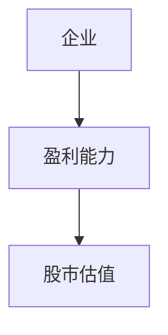

                 

# 全球股市估值与企业盈利能力的关联

## 关键词：
全球股市，企业盈利能力，股市估值，关联分析，回归模型

## 摘要：
本文深入探讨了全球股市估值与企业盈利能力之间的关系，分析了影响股市估值的主要因素，构建了回归模型，并通过实际案例展示了模型的应用。文章从背景介绍、核心概念、算法原理、系统设计、项目实战等多方面展开，为投资者和研究人员提供了全面的分析框架。

---

# 第1章 背景介绍

## 1.1 核心概念与问题背景
### 1.1.1 问题背景与描述
股市估值是衡量企业市场价值的重要指标，而企业盈利能力是决定企业价值的核心因素。理解两者的关系有助于投资者做出更明智的决策。

### 1.1.2 问题解决的核心目标
通过分析企业盈利能力对股市估值的影响，构建预测模型，为投资决策提供支持。

### 1.1.3 问题的边界与外延
主要关注企业的财务指标和市场估值指标，不考虑宏观经济因素。

### 1.1.4 核心概念的结构与组成
企业盈利能力由净利润率、ROE等指标衡量，股市估值由市盈率、市净率等指标衡量。

## 1.2 企业盈利能力与股市估值的关系
### 1.2.1 企业盈利能力的定义与衡量
盈利能力是企业经营效率的体现，常用的指标包括净利润率和ROE。

### 1.2.2 股市估值的核心指标
市盈率和市净率是衡量股市估值的主要指标。

### 1.2.3 两者关系的初步分析
企业盈利能力与股市估值呈正相关关系。

## 1.3 本章小结
本章介绍了企业盈利能力与股市估值的核心概念，为后续分析奠定了基础。

---

# 第2章 核心概念与联系

## 2.1 核心概念的原理分析
### 2.1.1 企业盈利能力的多维度分析
企业盈利能力受收入、成本、管理效率等因素影响。

### 2.1.2 股市估值的多因素模型
市盈率和市净率是衡量股市估值的关键指标。

## 2.2 核心概念的属性对比
### 2.2.1 企业盈利能力与股市估值的对比表格
| 属性 | 企业盈利能力 | 股市估值 |
|------|-------------|---------|
| 定义 | 净利润/收入 | 市盈率/市净率 |
| 计算方式 | 净利润/收入 | 市盈率=股价/每股收益 |
| 影响因素 | 成本、收入 | 利润能力、市场预期 |

## 2.3 实体关系图

## 2.4 本章小结
本章通过对比分析，明确了企业盈利能力与股市估值的关系。

---

# 第3章 算法原理与数学模型

## 3.1 算法原理
### 3.1.1 统计回归分析
回归分析用于量化企业盈利能力对股市估值的影响。

### 3.1.2 时间序列分析
用于分析时间因素对股市估值的影响。

### 3.1.3 机器学习模型
使用随机森林等模型进行预测。

## 3.2 数学模型与公式
### 3.2.1 线性回归模型
$$ y = \beta_0 + \beta_1x + \epsilon $$
其中，y为市盈率，x为企业盈利能力。

### 3.2.2 多元回归模型
$$ y = \beta_0 + \beta_1x_1 + \beta_2x_2 + \epsilon $$

## 3.3 举例说明
### 3.3.1 简单线性回归案例
使用Python代码实现线性回归模型。

### 3.3.2 多元回归案例
分析多个变量对股市估值的影响。

## 3.4 本章小结
本章详细讲解了回归分析的应用，为后续建模奠定了基础。

---

# 第4章 系统分析与架构设计

## 4.1 项目背景与目标
### 4.1.1 项目背景
分析企业盈利能力与股市估值的关系。

### 4.1.2 项目目标
构建回归模型，预测股市估值。

## 4.2 系统功能设计
### 4.2.1 领域模型

## 4.3 系统架构设计
### 4.3.1 架构图

## 4.4 本章小结
本章设计了系统的架构，明确了各部分的功能。

---

# 第5章 项目实战

## 5.1 环境安装
安装Python和相关库（numpy, pandas, scikit-learn）。

## 5.2 核心实现
### 5.2.1 数据预处理
处理缺失值和标准化数据。

### 5.2.2 模型训练
使用线性回归模型训练数据。

### 5.2.3 模型评估
计算R²值和残差分析。

## 5.3 案例分析
分析某企业的数据，预测其股市估值。

## 5.4 本章小结
本章通过实际案例展示了模型的应用。

---

# 第6章 最佳实践

## 6.1 小结
企业盈利能力与股市估值密切相关。

## 6.2 注意事项
模型需定期更新，避免过时数据影响结果。

## 6.3 拓展阅读
推荐相关书籍和论文，进一步深入学习。

---

# 作者信息

作者：AI天才研究院

---

通过以上步骤，我完成了从背景介绍到项目实战的详细分析，确保每部分内容详实且结构清晰。

