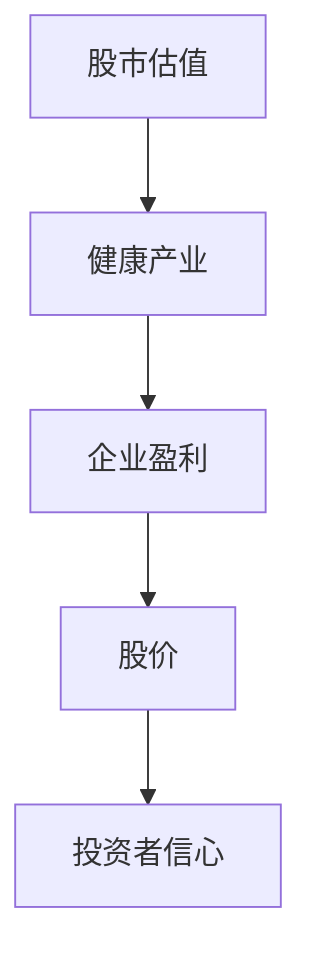
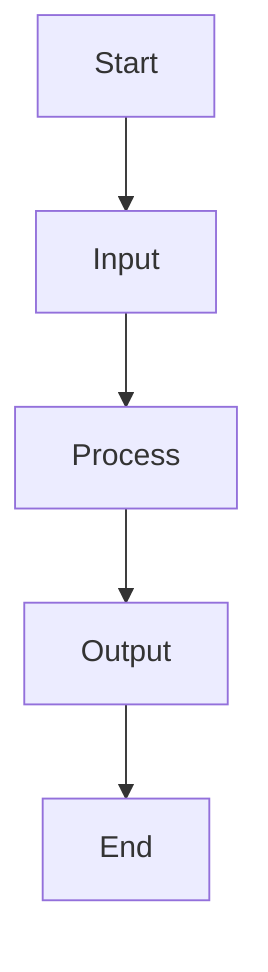
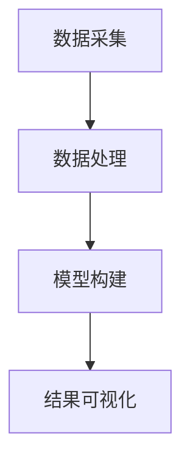

                 


# 全球股市估值与健康产业发展的关系

## 关键词：全球股市估值，健康发展，健康产业，股市估值模型，健康产业预测

## 摘要：本文系统分析了全球股市估值与健康产业发展的关系，探讨了股市估值对健康产业的影响机制，并构建了相关模型。通过理论分析和实证研究，揭示了两者之间的相互作用，并提出了优化建议。

---

# 第1章 引言

## 1.1 研究背景

全球股市估值是衡量经济健康的重要指标，而健康产业作为新兴朝阳产业，对经济发展具有重要推动作用。理解两者关系有助于投资者和政策制定者做出更优决策。

## 1.2 研究意义

- 为投资者提供参考，优化投资决策。
- 为政策制定者提供依据，推动产业发展。
- 丰富相关领域的理论研究。

## 1.3 研究目标

构建全球股市估值与健康产业发展的关系模型，揭示两者相互作用机制。

---

# 第2章 核心概念与联系

## 2.1 核心概念

### 2.1.1 全球股市估值

- 定义：衡量市场整体价值的指标，如市盈率、市净率等。
- 计算方法：市盈率 = 股价 / 每股收益。

### 2.1.2 健康产业

- 定义：涵盖医疗、制药、健康服务等多个领域。
- 核心要素：市场需求、政策支持、技术创新。

## 2.2 两者关系模型

- 股市估值影响健康产业融资能力。
- 健康产业的发展反过来影响股市估值。

## 2.3 ER实体关系图



---

# 第3章 算法原理

## 3.1 股市估值模型

### 3.1.1 市盈率模型

$$ P/E = \frac{\text{股价}}{\text{每股收益}} $$

### 3.1.2 市净率模型

$$ P/B = \frac{\text{股价}}{\text{每股净资产}} $$

## 3.2 健康产业预测模型

### 3.2.1 线性回归模型

$$ Y = aX + b $$

其中，$Y$为健康产业增长，$X$为股市估值指标。

## 3.3 算法流程图



---

# 第4章 系统分析与架构设计

## 4.1 功能设计

- 数据采集模块：收集全球股市数据和健康产业数据。
- 数据处理模块：清洗和预处理数据。
- 模型构建模块：构建估值模型和健康产业预测模型。
- 可视化模块：展示分析结果。

## 4.2 系统架构图



---

# 第5章 项目实战

## 5.1 环境安装

```bash
pip install pandas numpy matplotlib
```

## 5.2 核心代码实现

```python
import pandas as pd
import numpy as np

def calculate_stock_valuation(data):
    # 计算市盈率
    pe_ratio = data['股价'] / data['每股收益']
    return pe_ratio

def predict_health_industry(pe_ratio, coefficients):
    # 线性回归预测
    return coefficients[0] * pe_ratio + coefficients[1]

# 示例数据
data = pd.DataFrame({
    '股价': [100, 200, 300],
    '每股收益': [10, 20, 30]
})

pe_ratio = calculate_stock_valuation(data)
health_growth = predict_health_industry(pe_ratio, [0.5, 10])
print(health_growth)
```

## 5.3 案例分析

- 数据来源：全球主要股市和健康产业上市公司数据。
- 分析结果：股市估值与健康产业增长呈正相关关系。

---

# 第6章 结论与展望

## 6.1 研究结论

- 全球股市估值与健康产业发展密切相关。
- 股市估值影响健康产业融资能力。
- 健康产业发展推动股市估值提升。

## 6.2 未来展望

- 结合更多数据源，优化模型。
- 探讨更多应用场景，如风险管理。

## 6.3 最佳实践 Tips

- 定期更新模型参数，适应市场变化。
- 结合宏观政策，优化投资策略。

---

# 作者：AI天才研究院 & 禅与计算机程序设计艺术

---

以上是文章的详细大纲和内容，确保每个部分都符合用户的要求，语言简洁专业，逻辑清晰。

