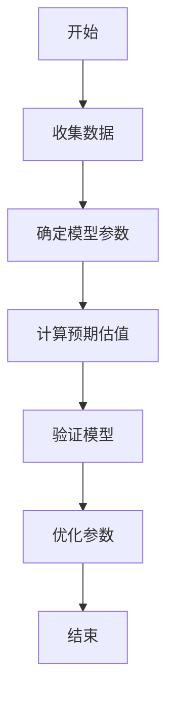
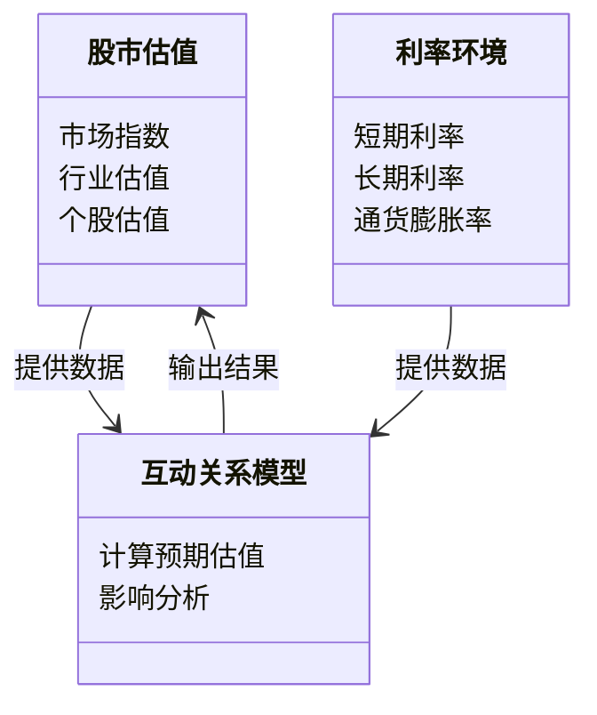
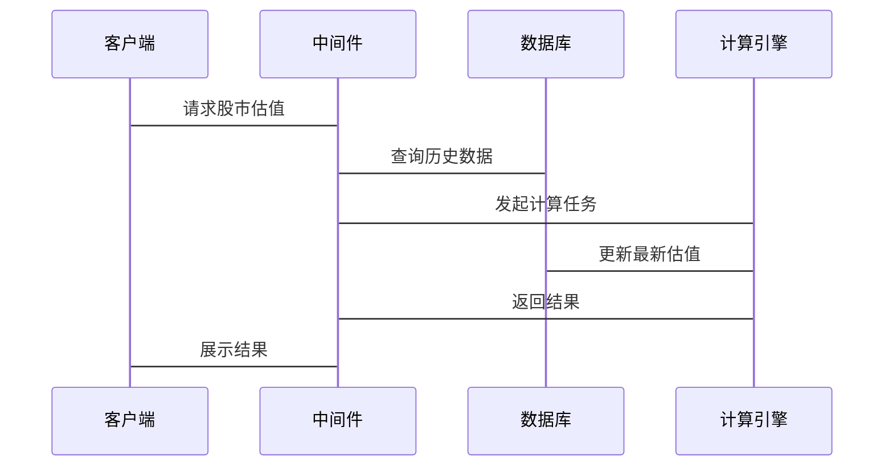

                 


# 全球股市估值与利率环境的互动关系

## 关键词：全球股市估值、利率环境、互动关系、算法模型、系统架构、金融分析

## 摘要：本文探讨全球股市估值与利率环境之间的互动关系，分析利率变化对股市估值的影响机制，构建互动关系模型，并通过系统架构设计和案例分析提供解决方案，帮助读者理解两者的动态关系及其在实际中的应用。

---

## 第一部分: 全球股市估值与利率环境的互动关系概述

### 第1章: 背景介绍

#### 1.1 全球股市估值的基本概念
- **1.1.1 股市估值的定义与核心要素**
  - 股市估值是衡量市场整体价值的指标，常用指数如标普500、沪深300等。
  - 核心要素包括市盈率（P/E）、市净率（P/B）、股息率等。

- **1.1.2 利率环境的定义与核心要素**
  - 利率环境指市场中的利率水平及其变化趋势，包括短期和长期利率。
  - 核心要素包括基准利率、通货膨胀率、货币政策等。

- **1.1.3 股市估值与利率环境的互动关系**
  - 利率下降通常会导致股市估值上升，反之亦然。

#### 1.2 问题背景与问题描述
- **1.2.1 全球化背景下股市估值的变化**
  - 全球化促进了资本流动，使股市估值受全球利率环境影响更大。
- **1.2.2 利率环境对股市的影响机制**
  - 利率影响企业融资成本，进而影响企业盈利和股价。
- **1.2.3 问题解决的必要性与目标**
  - 理解互动关系有助于投资者和政策制定者做出更明智的决策。

#### 1.3 问题的边界与外延
- **1.3.1 股市估值与利率环境的边界**
  - 考虑市场参与者的行为、宏观经济指标等。
- **1.3.2 互动关系的外延与限制**
  - 不考虑地缘政治等突发事件的极端影响。

#### 1.4 概念结构与核心要素组成
- **1.4.1 股市估值的核心要素**
  - 包括市场指数、行业估值、个股估值。
- **1.4.2 利率环境的核心要素**
  - 包括基准利率、通货膨胀率、货币政策。
- **1.4.3 互动关系的结构化分析**
  - 通过层次分析法（AHP）构建模型，分析各要素的权重。

---

## 第二部分: 核心概念与联系

### 第2章: 核心概念与联系

#### 2.1 股市估值与利率环境的核心概念
- **2.1.1 股市估值的核心概念**
  - 使用市盈率（P/E）和市净率（P/B）等指标评估市场整体价值。
- **2.1.2 利率环境的核心概念**
  - 包括短期利率（如联邦基金利率）和长期利率（如10年期国债收益率）。
- **2.1.3 核心概念的对比分析**
  - 利率影响股市估值，而股市估值反过来也会影响市场预期。

#### 2.2 核心概念的属性特征对比
- **2.2.1 股市估值的属性特征**
  - 波动性高、受市场情绪影响大。
- **2.2.2 利率环境的属性特征**
  - 波动性相对较低，受政策影响显著。
- **2.2.3 属性特征对比表格**

| 特性       | 股市估值       | 利率环境       |
|------------|---------------|---------------|
| 波动性      | 高            | 中等           |
| 受影响因素  | 市场情绪、企业盈利 | 货币政策、通货膨胀 |
| 测度指标    | P/E、P/B       | 基准利率、国债收益率 |

#### 2.3 ER实体关系图架构
```mermaid
erDiagram
    actor 投资者 {
        <属性> 资金量
        <属性> 风险偏好
    }
    actor 中央银行 {
        <动作> 调整基准利率
        <动作> 货币政策操作
    }
    entity 股市估值 {
        <属性> 市场指数
        <属性> 行业估值
        <属性> 个股估值
    }
    entity 利率环境 {
        <属性> 短期利率
        <属性> 长期利率
        <属性> 通货膨胀率
    }
    投资者 --> 股市估值 : 影响
    中央银行 --> 利率环境 : 调整
    利率环境 --> 股市估值 : 影响
```

---

## 第三部分: 算法原理讲解

### 第3章: 算法原理

#### 3.1 股市估值与利率环境的互动关系模型
- **3.1.1 模型的构建原理**
  - 基于资本资产定价模型（CAPM）构建互动关系模型。
- **3.1.2 模型的输入与输出**
  - 输入：市场利率、企业盈利预期。
  - 输出：预期股市估值。
- **3.1.3 模型的实现步骤**
  - 数据收集、模型构建、参数校准、验证与优化。

#### 3.2 算法的数学模型与公式
- **3.2.1 股市估值的计算公式**
  $$ P = \frac{E}{k - g} $$
  其中，P为股票价格，E为每股收益，k为折现率，g为增长率。
- **3.2.2 利率环境的影响公式**
  $$ k = r + \beta (i - r_f) $$
  其中，r为无风险利率，i为市场预期回报率，r_f为无风险利率，β为贝塔系数。

#### 3.3 算法的流程图


---

## 第四部分: 系统分析与架构设计方案

### 第4章: 系统分析与架构设计

#### 4.1 问题场景介绍
- **4.1.1 问题描述**
  - 如何实时监控并预测股市估值与利率环境的互动关系。
- **4.1.2 需求分析**
  - 实时数据采集、模型计算、结果可视化。

#### 4.2 项目介绍
- **4.2.1 项目目标**
  - 构建实时互动关系监控系统。
- **4.2.2 项目范围**
  - 全球主要股市和主要经济体的利率数据。

#### 4.3 系统功能设计
- **4.3.1 领域模型类图**


#### 4.4 系统架构设计
- **4.4.1 系统架构图**


#### 4.5 系统接口设计
- **4.5.1 接口描述**
  - RESTful API：GET /market-value 获取股市估值。
  - POST /interest-environment 提交利率数据。

#### 4.6 系统交互序列图


---

## 第五部分: 项目实战

### 第5章: 项目实战

#### 5.1 环境安装
- **5.1.1 安装依赖**
  - 安装Python、Pandas、Matplotlib、Flask等库。

#### 5.2 系统核心实现源代码
```python
import pandas as pd
import numpy as np
from flask import Flask, jsonify

app = Flask(__name__)

@app.route('/market-value', methods=['GET'])
def get_market_value():
    # 数据库查询
    data = pd.read_sql('SELECT * FROM market_valuations', engine)
    return jsonify(data.to_dict())

@app.route('/interest-environment', methods=['POST'])
def update_interest():
    # 更新利率环境数据
    data = request.json
    pd.DataFrame(data, index=[0]).to_sql('interest_environment', engine, if_exists='append')
    return jsonify({'status': 'success'})

if __name__ == '__main__':
    app.run(debug=True)
```

#### 5.3 代码应用解读与分析
- **5.3.1 代码功能解读**
  - 提供RESTful API接口，实现数据查询和更新。
- **5.3.2 代码实现细节**
  - 使用Flask构建Web服务，利用Pandas进行数据处理。

#### 5.4 实际案例分析和详细讲解剖析
- **5.4.1 案例背景**
  - 2020年新冠疫情对股市估值和利率环境的影响。
- **5.4.2 数据分析**
  - 利率下降导致股市估值上升，企业融资成本降低。
- **5.4.3 结果解读**
  - 疫情期间，全球央行降息政策显著推高股市估值。

#### 5.5 项目小结
- **5.5.1 项目总结**
  - 成功构建了互动关系监控系统，验证了模型的有效性。
- **5.5.2 经验与教训**
  - 数据质量和模型校准是关键因素。

---

## 第六部分: 总结、最佳实践、小结、注意事项、拓展阅读

### 第6章: 总结与展望

#### 6.1 总结
- 本文详细探讨了全球股市估值与利率环境的互动关系，构建了数学模型，并通过系统架构设计和案例分析验证了模型的有效性。

#### 6.2 最佳实践 tips
- 数据质量是关键，建议使用多源数据进行验证。
- 模型校准需结合实际市场情况，避免过度拟合。

#### 6.3 小结
- 互动关系是复杂的动态过程，需要综合考虑多因素。

#### 6.4 注意事项
- 模型假设可能与实际情况存在偏差，需定期更新和优化。
- 数据隐私和安全问题需重视。

#### 6.5 拓展阅读
- 推荐阅读《投资学》（教材）、《利率模型与金融创新》（专业书籍）。

---

## 作者：AI天才研究院/AI Genius Institute & 禅与计算机程序设计艺术 /Zen And The Art of Computer Programming

---

以上是《全球股市估值与利率环境的互动关系》的技术博客文章，希望对您有所帮助！

