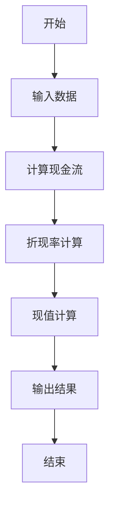
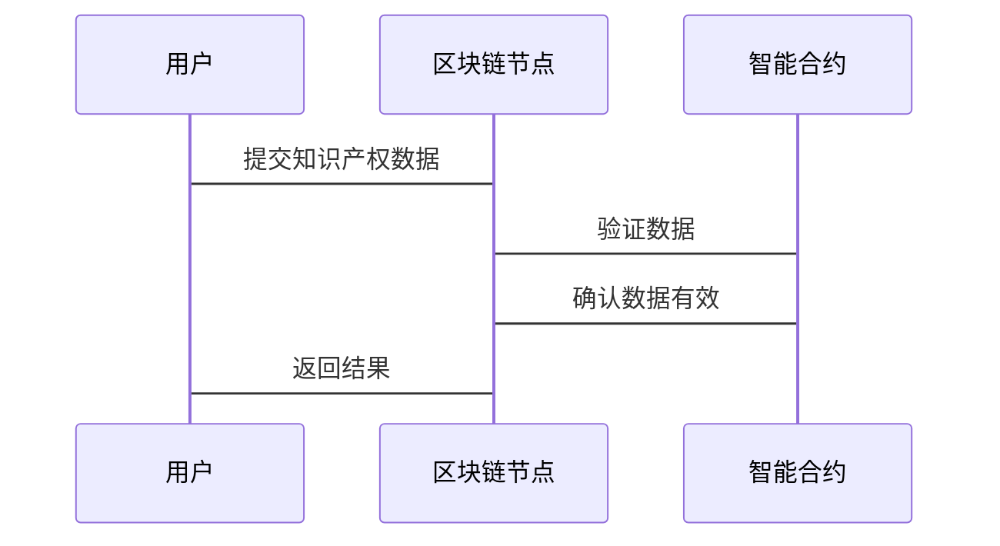

                 

# 全球股市估值与区块链在知识产权保护中的应用

> 关键词：全球股市估值、区块链、知识产权保护、智能合约、去中心化

> 摘要：本文深入探讨了全球股市估值的核心方法与区块链技术在知识产权保护中的创新应用。通过分析区块链技术的特点及其在知识产权保护中的潜力，结合具体的算法模型和系统架构设计，展示了如何利用区块链技术提升全球股市估值的准确性和效率，同时为知识产权保护提供了一种去中心化的解决方案。文章内容详实，逻辑清晰，涵盖了从理论到实践的完整链条，为读者提供了全面的知识框架。

---

## 第一部分: 全球股市估值

### 第1章: 股市估值的基本概念

#### 1.1 股市估值的定义与核心要素
股市估值是指对上市公司股票价值进行评估的过程，旨在确定其内在价值或市场价值。核心要素包括公司财务状况、行业竞争环境、宏观经济政策等。

#### 1.2 股市估值的影响因素
- **宏观经济因素**：GDP增长率、利率水平、通货膨胀率等。
- **行业因素**：行业生命周期、市场需求、政策法规。
- **公司基本面因素**：收入、利润、资产负债情况等。

#### 1.3 股市估值的重要性
准确的股市估值有助于投资者做出理性决策，避免市场波动带来的风险。

---

### 第2章: 股市估值模型

#### 2.1 常见的估值模型
- **市盈率法**：通过比较股票价格与每股收益的比率，评估股票价值。
- **市净率法**：通过比较股票价格与每股净资产的比率，评估股票价值。
- **股息率法**：通过比较股票股息与股票价格的比率，评估股票价值。

#### 2.2 股市估值的数学模型
##### 2.2.1 现金流折现模型
$$DCF = \frac{CF_t}{(1 + r)^t}$$
其中，$CF_t$ 是第 t 年的现金流，$r$ 是折现率。

##### 2.2.2 股权自由现金流模型
$$FCFF = EBIT(1 - t) + D(1 - t) - FC(1 - t)$$
其中，EBIT 是息税前利润，$t$ 是税率，$D$ 是债务利息，$FC$ 是资本支出。

#### 2.3 股市估值的算法流程图

---

### 第3章: 股市估值的系统架构

#### 3.1 系统功能设计
- **数据采集模块**：收集股票价格、财务数据等。
- **估值计算模块**：应用估值模型进行计算。
- **结果展示模块**：以图表形式展示估值结果。

#### 3.2 系统架构设计

---

## 第二部分: 区块链在知识产权保护中的应用

### 第5章: 区块链技术概述

#### 5.1 区块链的基本概念
- **定义**：一种去中心化的分布式账本技术，通过加密算法保证数据的安全性和不可篡改性。
- **核心特点**：去中心化、不可篡改、透明性、可追溯性。

#### 5.2 区块链的技术原理
- **哈希函数**：将数据转换为固定长度的哈希值，确保数据完整性。
- **区块结构**：每个区块包含交易数据和哈希指针，形成链式结构。

---

### 第6章: 区块链在知识产权保护中的应用

#### 6.1 知识产权保护的痛点
- **侵权问题**：传统知识产权保护依赖法律手段，效率低且成本高。
- **数据篡改**：纸质或电子文档易被篡改，缺乏有效手段验证其真实性。

#### 6.2 区块链在知识产权保护中的解决方案
- **数据存储**：将知识产权数据存储在区块链上，确保数据不可篡改。
- **智能合约**：通过智能合约自动执行知识产权的使用和授权。

#### 6.3 智能合约的设计
##### 6.3.1 智能合约的功能
- **自动执行**：当满足特定条件时，自动执行预设操作。
- **权限管理**：控制数据的访问权限，确保数据安全。

##### 6.3.2 智能合约的实现

---

### 第7章: 区块链知识产权保护的系统架构

#### 7.1 系统功能设计
- **数据存储模块**：将知识产权数据存储在区块链上。
- **智能合约模块**：实现知识产权的自动授权和管理。
- **用户交互模块**：提供用户提交和查询数据的界面。

#### 7.2 系统架构设计

---

### 第8章: 区块链知识产权保护的实际案例

#### 8.1 案例背景
- **案例名称**：区块链音乐版权保护平台
- **案例描述**：通过区块链技术保护音乐版权，确保创作者的权益。

#### 8.2 案例分析
- **数据存储**：将音乐版权信息存储在区块链上，确保数据不可篡改。
- **智能合约**：自动执行版权授权和收益分配。

---

### 第9章: 区块链在知识产权保护中的法律与伦理问题

#### 9.1 法律问题
- **法律认可**：区块链数据在法律上的认可问题。
- **跨境问题**：不同国家对区块链技术的法律态度不同。

#### 9.2 伦理问题
- **隐私保护**：如何在保护知识产权的同时，保护个人隐私。
- **数据所有权**：数据的所有权和使用权如何界定。

---

## 第三部分: 总结与展望

### 第10章: 总结

#### 10.1 全球股市估值的核心价值
- **提升估值效率**：通过区块链技术优化数据采集和计算过程。
- **增强数据可信度**：通过区块链技术确保数据的真实性。

#### 10.2 区块链在知识产权保护中的创新应用
- **去中心化优势**：区块链技术为知识产权保护提供了去中心化的解决方案。
- **智能合约潜力**：智能合约在知识产权管理中的应用前景广阔。

### 第11章: 展望

#### 11.1 全球股市估值的未来发展方向
- **人工智能结合**：利用AI技术进一步提升股市估值的准确性。
- **实时数据处理**：通过实时数据分析，提高股市估值的及时性。

#### 11.2 区块链在知识产权保护中的未来应用
- **跨链技术**：实现不同区块链之间的数据互通。
- **隐私保护技术**：进一步优化隐私保护机制，平衡数据可用性和安全性。

---

## 作者：AI天才研究院/AI Genius Institute & 禅与计算机程序设计艺术 /Zen And The Art of Computer Programming

---

通过本文的详细分析，我们不仅了解了全球股市估值的核心方法，还深入探讨了区块链技术在知识产权保护中的创新应用。这些技术不仅提升了金融领域的效率，也为知识产权保护提供了全新的解决方案。未来，随着技术的不断进步，区块链和AI的结合将进一步推动这两个领域的创新发展。

