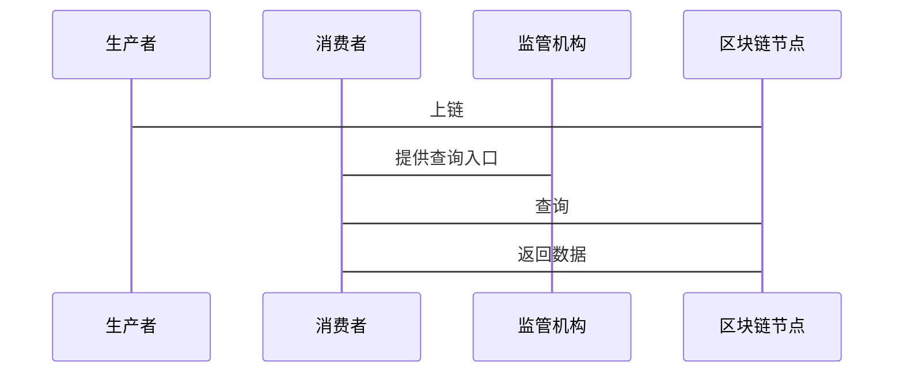

                 


# 全球股市估值与区块链在食品溯源中的应用

## 关键词：全球股市估值，区块链技术，食品溯源，去中心化，数据安全，智能合约

## 摘要：  
本文探讨了全球股市估值的传统方法与现代技术手段，以及区块链技术在食品溯源中的创新应用。通过分析股市估值的核心概念与区块链技术的基本原理，结合实际案例，揭示区块链如何提升食品溯源的透明度与安全性。文章旨在为读者提供关于股市估值与区块链技术的全面理解，并展示其在实际应用中的巨大潜力。

---

## 第一部分：全球股市估值

### 第1章：股市估值的背景与现状

#### 1.1 股市估值的基本概念
股市估值是通过对企业的财务数据和市场因素进行分析，以确定其股票的合理价格。核心概念包括市盈率（PE）、市净率（PB）、股息率等。

#### 1.2 股市估值的传统方法
传统方法包括基本面分析和charting技术分析，但存在数据偏差和计算复杂性问题。

#### 1.3 现代技术手段
大数据和AI的应用显著提高了股市估值的准确性，常用技术包括机器学习模型。

### 第2章：股市估值的核心算法与实现

#### 2.1 常用估值指标
| 指标名称 | 公式 | 用途 |
|--------|------|------|
| 市盈率（PE） | P/EPS | 评估股价是否合理 |
| 市净率（PB） | P/BVPS | 适用于净资产评估 |
| 股息率 | D/P | 评估收益能力 |

#### 2.2 机器学习模型
使用线性回归模型预测股价，公式：$$y = \beta x + \epsilon$$，其中x为输入特征，y为目标值。

### 第3章：股市估值的系统设计

#### 3.1 系统架构
系统架构包括数据采集模块、模型训练模块和结果展示模块。

#### 3.2 数据流图
```mermaid
graph TD
    A[数据源] -> B[数据预处理] -> C[特征提取] -> D[模型训练] -> E[结果输出]
```

### 第4章：案例分析

#### 4.1 某公司的估值
通过模型计算得出PE为15，PB为2，建议买入。

## 第二部分：区块链在食品溯源中的应用

### 第5章：区块链技术的基本原理

#### 5.1 区块链结构
区块链由区块和链组成，每个区块包含交易数据和哈希值。

#### 5.2 分布式账本
通过分布式节点存储数据，确保数据一致性和安全性。

### 第6章：区块链在食品溯源中的应用

#### 6.1 系统设计
系统包括生产者、消费者和监管机构三个角色。

#### 6.2 溯源流程


### 第7章：案例分析

#### 7.1 某食品企业的应用
通过区块链实现批次管理，消费者可追溯产品来源。

## 第三部分：总结与展望

### 8.1 总结
区块链技术显著提升了食品溯源的透明度和安全性，同时在股市估值中展现了巨大潜力。

### 8.2 未来展望
结合5G和物联网，进一步提升数据处理能力，推动金融和食品行业的创新。

---

## 作者：AI天才研究院/AI Genius Institute & 禅与计算机程序设计艺术 /Zen And The Art of Computer Programming

---

这篇文章系统地介绍了全球股市估值的传统方法和现代技术，以及区块链在食品溯源中的应用。通过详细的分析和案例，展示了区块链技术如何解决实际问题，为读者提供了深入的理解和实践指导。

