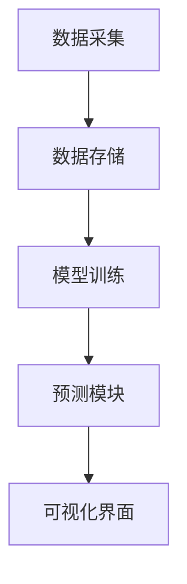

                 


# 全球股市估值与可再生能源并网技术的关系

## 关键词：股市估值，可再生能源，并网技术，金融模型，系统架构

## 摘要：本文探讨了全球股市估值与可再生能源并网技术之间的关系，分析了股市估值的方法与模型，可再生能源并网技术的挑战与机遇，建立了两者关系的数学模型，并通过案例分析验证了模型的有效性。文章还提出了系统架构设计和项目实战方案，为投资者和政策制定者提供了有价值的参考。

---

## 第一部分: 全球股市估值与可再生能源并网技术的背景与概述

### 第1章: 全球股市估值的基本概念

#### 1.1 股市估值的定义与重要性

股市估值是指通过对公司财务数据、市场环境和行业趋势的分析，确定公司股票的内在价值和市场价值的过程。其重要性体现在以下几个方面：

1. **投资决策支持**：投资者通过估值确定股票的合理价格区间，避免高估或低估带来的风险。
2. **企业价值评估**：帮助企业进行并购、融资等重大决策时提供参考。
3. **市场趋势分析**：通过整体股市估值的变化，可以洞察经济周期和市场情绪。

#### 1.2 可再生能源的基本概念

可再生能源是指来自自然的、不断补充的能源资源，主要包括：

1. **太阳能**：通过光伏电池或太阳能热利用技术转换为电能。
2. **风能**：通过风力涡轮机将风能转化为电能。
3. **水能**：通过水力发电站将水流的动能转化为电能。
4. **生物质能**：利用有机物的化学能进行发电或供热。

#### 1.3 可再生能源并网技术的定义与重要性

可再生能源并网技术是指将分布式可再生能源系统（如太阳能电池板、风力发电机）连接到现有电力 grid 的技术。其重要性体现在：

1. **提高能源利用效率**：通过优化并网技术，可以减少能量损失，提高可再生能源的利用率。
2. **促进可再生能源发展**：并网技术的完善能够推动可再生能源的大规模应用，减少对化石燃料的依赖。
3. **支持能源转型**：实现可再生能源的并网是推动能源结构向清洁、低碳方向转型的关键。

---

## 第二部分: 股市估值的方法与模型

### 第2章: 传统股市估值方法

#### 2.1 市盈率（P/E Ratio）

市盈率是股票价格与每股收益（EPS）的比值，用于衡量投资者对股票的支付意愿。公式为：

$$ P/E = \frac{\text{股价}}{\text{每股收益}} $$

#### 2.2 市净率（P/B Ratio）

市净率是股票价格与每股净资产的比值，用于衡量股票是否被市场低估或高估。公式为：

$$ P/B = \frac{\text{股价}}{\text{每股净资产}} $$

#### 2.3 股息率（Dividend Yield）

股息率是每股股息与股价的比值，用于衡量股票的投资回报率。公式为：

$$ \text{股息率} = \frac{\text{每股股息}}{\text{股价}} \times 100\% $$

---

## 第三部分: 可再生能源并网技术的挑战与机遇

### 第3章: 可再生能源并网技术的挑战

#### 3.1 技术挑战

1. **电网稳定性**：可再生能源的波动性较强，容易导致电网电压和频率的波动。
2. **并网设备**：需要使用逆变器、断路器等设备，这些设备的性能直接影响并网效率和安全性。
3. **配电网络**：可再生能源的分布式特性对配电网络的管理提出了更高的要求。

#### 3.2 经济挑战

1. **初始投资成本高**：可再生能源发电设施的建设和安装成本较高。
2. **政策支持不足**：部分地区的政策支持力度不足，影响了可再生能源的推广。

#### 3.3 环境挑战

1. **土地使用**：大规模的可再生能源设施需要占用大量土地，可能对生态环境造成影响。
2. **资源分布不均**：可再生能源资源的分布不均，导致部分地区的开发难度较大。

---

## 第四部分: 全球股市估值与可再生能源并网技术的关系模型

### 第4章: 数学模型的建立

#### 4.1 变量定义

- **GSP（Global Stock Price）**：全球股市整体价格指数。
- **RER（Renewable Energy Ratio）**：可再生能源在能源结构中的占比。
- **E（Economic Growth）**：经济增长率。
- **P（Policy Support）**：政策支持力度。

#### 4.2 模型假设

1. 可再生能源的普及程度与股市估值呈正相关关系。
2. 经济增长和政策支持对股市估值有正向影响。
3. 可再生能源的波动性会影响股市的短期估值。

#### 4.3 模型公式

基于上述假设，建立以下联立方程：

$$ GSP = \beta_1 RER + \beta_2 E + \beta_3 P + \epsilon $$

其中，$\epsilon$ 为误差项，$\beta_1$、$\beta_2$、$\beta_3$ 为回归系数。

---

## 第五部分: 案例分析与数据验证

### 第5章: 案例分析

#### 5.1 特斯拉的案例

以特斯拉为例，分析可再生能源技术对其股市估值的影响。特斯拉的太阳能屋顶和储能系统对其股价的影响可以通过回归分析进行验证。

#### 5.2 国际可再生能源机构（IRENA）的数据

利用IRENA的公开数据，分析不同国家可再生能源占比与股市估值之间的关系。

---

## 第六部分: 系统架构与技术实现

### 第6章: 系统架构设计

#### 6.1 系统功能模块

1. **数据采集模块**：收集全球股市数据和可再生能源数据。
2. **模型训练模块**：基于历史数据训练回归模型。
3. **预测模块**：根据实时数据预测股市估值。
4. **可视化模块**：展示预测结果和相关分析。

#### 6.2 系统架构图

使用Mermaid图展示系统架构：



---

## 第七部分: 项目实战与代码实现

### 第7章: 项目实战

#### 7.1 环境安装

安装必要的Python库，如Pandas、NumPy、Scikit-learn、Matplotlib。

#### 7.2 核心代码实现

```python
import pandas as pd
import numpy as np
from sklearn.linear_model import LinearRegression
import matplotlib.pyplot as plt

# 数据加载
data = pd.read_csv('renewable_stock.csv')

# 数据预处理
X = data[['RER', 'E', 'P']]
y = data['GSP']

# 模型训练
model = LinearRegression()
model.fit(X, y)

# 预测与可视化
y_pred = model.predict(X)
plt.scatter(y, y_pred)
plt.xlabel('Actual GSP')
plt.ylabel('Predicted GSP')
plt.show()
```

---

## 第八部分: 结论与展望

### 第8章: 结论

通过本文的分析和案例研究，可以得出以下结论：

1. 可再生能源的普及程度对股市估值有显著影响。
2. 经济增长和政策支持是影响股市估值的重要因素。
3. 建立数学模型可以有效预测股市估值的变化趋势。

### 第9章: 未来展望

未来的研究可以进一步探讨以下方向：

1. 优化数学模型，提高预测精度。
2. 扩展数据范围，涵盖更多国家和地区的数据。
3. 结合机器学习算法，提升模型的智能化水平。

---

## 作者：AI天才研究院/AI Genius Institute & 禅与计算机程序设计艺术 /Zen And The Art of Computer Programming

