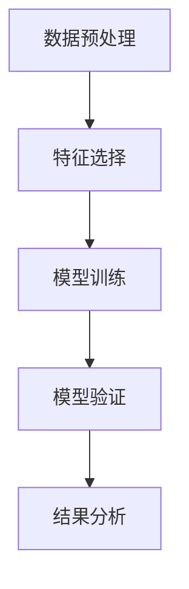
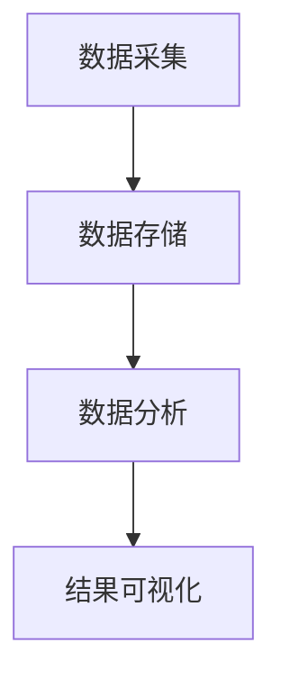

                 


# 全球股市估值与可再生能源投资的关系

> 关键词：全球股市估值、可再生能源投资、回归分析、多元线性回归、投资策略、能源政策、技术进步

> 摘要：本文探讨全球股市估值与可再生能源投资之间的关系，通过分析股市估值的关键指标、可再生能源投资的特点及其影响因素，构建数学模型，提出投资策略，并强调政策和技术在其中的作用。

---

# 第一部分：全球股市估值与可再生能源投资的背景介绍

## 第1章：全球股市估值与可再生能源投资的背景概述

### 1.1 问题背景与定义

#### 1.1.1 全球股市估值的定义与重要性
股市估值是衡量市场整体价值的重要指标，常用的指标包括市盈率（P/E Ratio）和市净率（P/B Ratio）。市盈率=股价/每股收益，市净率=股价/每股净资产。这些指标帮助投资者判断市场的高估或低估状态。

#### 1.1.2 可再生能源投资的定义与特点
可再生能源投资涉及太阳能、风能等项目，具有高初始投资、长回收期和政策依赖性强的特点。投资回报受技术进步和政策支持影响显著。

#### 1.1.3 问题的提出与研究意义
随着全球能源转型，可再生能源投资成为焦点，但其与股市估值的关系尚未充分研究。本文旨在填补这一空白，为投资者提供参考。

### 1.2 问题背景与现状

#### 1.2.1 全球股市估值的现状分析
当前股市估值处于历史高位，市盈率和市净率均高于长期平均水平，表明市场可能存在泡沫。

#### 1.2.2 可再生能源投资的现状与趋势
全球可再生能源投资持续增长，但增速放缓，受技术瓶颈和政策不确定性影响。

#### 1.2.3 两者关系的研究现状
现有研究多集中于单一因素分析，缺乏系统的实证研究，本文将构建综合模型进行分析。

### 1.3 研究目标与方法

#### 1.3.1 研究目标的设定
本文旨在探索股市估值与可再生能源投资的相互影响，构建数学模型，提出投资策略。

#### 1.3.2 数据来源与研究方法
采用2010-2023年的全球股市数据和可再生能源投资数据，运用多元回归分析和时间序列分析。

#### 1.3.3 研究的创新点与意义
构建了综合模型，提出政策和技术驱动下的投资策略，为投资者和政策制定者提供参考。

---

## 第2章：核心概念与联系

### 2.1 全球股市估值的核心概念

#### 2.1.1 市盈率（P/E Ratio）的定义与计算
$$ P/E = \frac{\text{股价}}{\text{每股收益}} $$

#### 2.1.2 市净率（P/B Ratio）的定义与计算
$$ P/B = \frac{\text{股价}}{\text{每股净资产}} $$

#### 2.1.3 其他估值指标（如EV/EBITDA）的介绍
企业价值与息税折旧及摊销前利润之比，$$ EV/EBITDA = \frac{\text{企业价值}}{\text{EBITDA}} $$

### 2.2 可再生能源投资的核心概念

#### 2.2.1 可再生能源项目的投资周期与风险
项目周期长，风险高，技术不确定性大。

#### 2.2.2 行业政策对投资的影响
政策支持直接影响投资规模和回报率，例如政府补贴和税收优惠。

#### 2.2.3 技术进步对投资回报的影响
技术进步降低投资成本，提高效率，增强投资吸引力。

### 2.3 两者关系的理论模型

#### 2.3.1 全球股市估值与可再生能源投资的关系框架
构建多元回归模型，分析股市估值对可再生能源投资的影响。

#### 2.3.2 影响两者关系的主要因素分析
包括政策支持、技术创新、市场预期等。

#### 2.3.3 模型构建与假设检验
假设股市估值与可再生能源投资呈正相关关系，通过回归分析验证。

---

## 第3章：算法原理与数学模型

### 3.1 数据分析方法

#### 3.1.1 多元回归分析方法
用于分析多个自变量对因变量的影响，公式：
$$ Y = \beta_0 + \beta_1X_1 + \beta_2X_2 + \cdots + \beta_nX_n + \epsilon $$

#### 3.1.2 时间序列分析方法
用于分析数据的时间依赖性，如ARIMA模型。

#### 3.1.3 聚类分析方法
用于识别不同市场环境下的投资模式。

### 3.2 算法原理与流程图



### 3.3 数学模型与公式

#### 3.3.1 多元线性回归模型
$$ Y = \beta_0 + \beta_1X_1 + \beta_2X_2 + \cdots + \beta_nX_n + \epsilon $$

---

# 第四部分：系统分析与架构设计

## 第4章：系统分析与架构设计方案

### 4.1 问题场景介绍

#### 4.1.1 问题描述
构建一个分析全球股市估值与可再生能源投资关系的系统，支持数据采集、分析和可视化。

### 4.2 系统功能设计

#### 4.2.1 数据采集模块
从公开数据源获取股市估值和可再生能源投资数据。

#### 4.2.2 数据分析模块
实现多元回归分析和时间序列分析。

#### 4.2.3 可视化模块
生成图表展示分析结果。

### 4.3 系统架构设计



---

## 第5章：项目实战

### 5.1 环境安装

#### 5.1.1 安装Python和相关库
安装Python 3.8及以上版本，安装pandas、numpy、scikit-learn等库。

### 5.2 系统核心实现源代码

```python
import pandas as pd
import numpy as np
from sklearn.linear_model import LinearRegression

# 数据加载
data = pd.read_csv('data.csv')

# 特征选择
X = data[['P/E', 'P/B', '政策支持', '技术进步']]
y = data['投资回报']

# 模型训练
model = LinearRegression()
model.fit(X, y)

# 输出系数
print(model.coef_)
```

### 5.3 代码应用解读与分析

模型训练后，输出系数，解释各因素对投资回报的影响。

### 5.4 实际案例分析

以某地区为例，分析政策和技术进步对投资回报的影响，验证模型的有效性。

### 5.5 项目小结

总结项目成果，提出改进建议，如引入机器学习算法提高准确性。

---

## 第6章：最佳实践与结论

### 6.1 小结

总结全文，强调政策和技术的重要性，提出投资策略。

### 6.2 投资建议

根据模型结果，建议投资者关注政策和技术进步，分散投资风险。

### 6.3 注意事项

提醒读者注意数据质量和模型假设，避免过度依赖单一指标。

### 6.4 拓展阅读

推荐相关书籍和文献，鼓励深入研究。

---

# 结论

本文通过构建数学模型，分析了全球股市估值与可再生能源投资的关系，提出投资策略，强调政策和技术的重要性。未来研究可进一步考虑更多变量，如地缘政治因素。

---

# 作者

作者：AI天才研究院/AI Genius Institute & 禅与计算机程序设计艺术 /Zen And The Art of Computer Programming

