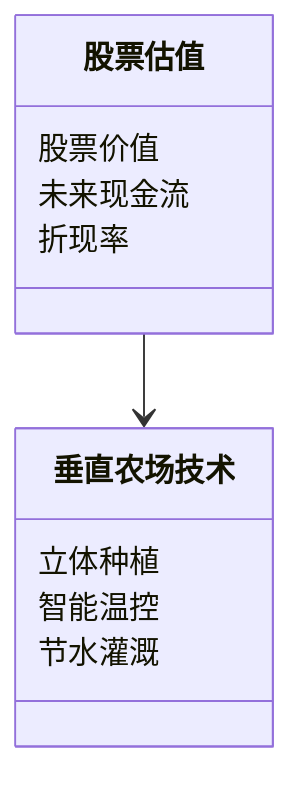
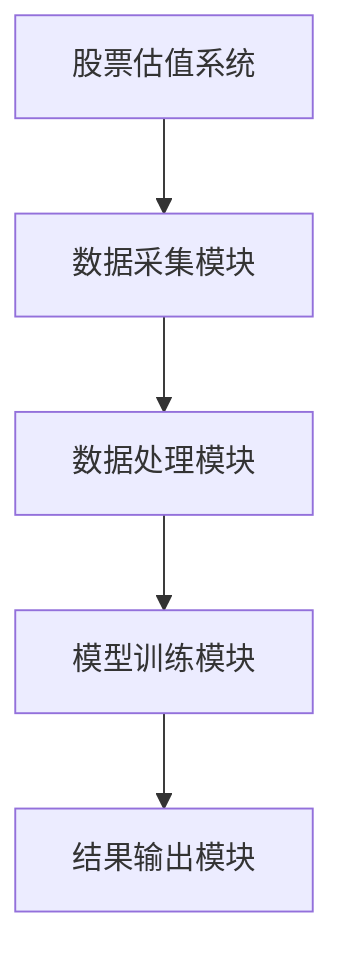
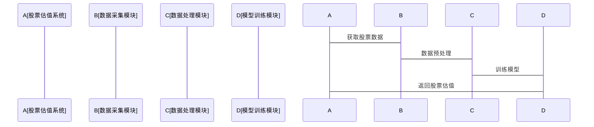

                 


# 全球股市估值与可持续农业垂直农场技术的关系

**关键词：** 全球股市估值、可持续农业、垂直农场技术、数学模型、算法原理、系统架构

**摘要：**  
本文探讨了全球股市估值与可持续农业垂直农场技术之间的关系。通过分析垂直农场技术的原理、优势以及对农业产出的影响，结合全球股市估值的数学模型与算法，揭示了两者之间的相互作用。文章从背景介绍、核心概念、技术分析、股市分析、系统设计、案例分析、项目实战等多个维度展开，最后结合实际案例，提出可行的解决方案和最佳实践建议。

---

# 第一部分：全球股市估值与可持续农业垂直农场技术的背景与核心概念

## 第1章：全球股市估值与可持续农业垂直农场技术的背景介绍

### 1.1 问题背景与问题描述

#### 1.1.1 全球股市估值的基本概念
全球股市估值是指通过对上市公司财务数据的分析，对其股票的内在价值进行评估的过程。常用的估值方法包括市盈率（P/E）、市净率（P/B）、股息率等。这些指标反映了市场对企业的盈利能力、资产质量以及分红能力的判断。

#### 1.1.2 可持续农业与垂直农场技术的定义
可持续农业是指在满足当前需求的同时，不损害后代需求的农业生产方式。垂直农场技术则是通过垂直空间利用和室内种植技术，实现高效率、可持续的农业生产。其特点包括土地利用率高、水资源消耗低、环境影响小等。

#### 1.1.3 问题解决的目标与意义
本文旨在通过分析垂直农场技术对农业产出的影响，进而探讨其对全球股市估值的潜在影响。研究的目标是为投资者和农业科技企业提供参考，帮助他们更好地理解技术进步对市场价值的推动作用。

### 1.2 问题背景的边界与外延

#### 1.2.1 全球股市估值的边界
- 仅关注农业相关企业的估值，不涉及其他行业的分析。
- 重点分析技术创新对估值的影响，而非宏观经济因素。

#### 1.2.2 可持续农业与垂直农场技术的边界
- 仅研究垂直农场技术，不涉及传统农业技术。
- 重点分析技术对环境和资源效率的影响。

#### 1.2.3 两者的相互关系与外延
- 垂直农场技术通过提高农业生产效率，影响企业的盈利能力，从而影响股市估值。
- 全球股市估值的变化反过来为企业技术创新提供资金支持，推动技术进步。

### 1.3 核心概念结构与组成

#### 1.3.1 全球股市估值的核心要素
- 财务数据：收入、利润、资产等。
- 市场情绪：投资者对企业的信心。
- 行业环境：政策、竞争格局等。

#### 1.3.2 可持续农业与垂直农场技术的核心要素
- 技术创新：垂直种植、智能温控、节水灌溉等。
- 资源效率：能源消耗、水资源利用等。
- 环境影响：碳排放、生态影响等。

#### 1.3.3 两者关系的结构化分析
- 垂直农场技术通过提高生产效率，降低生产成本，进而提高企业的盈利能力。
- 盈利能力的提升直接反映在股市估值的增加上。

---

## 第2章：可持续农业垂直农场技术的核心概念与联系

### 2.1 垂直农场技术的原理与特点

#### 2.1.1 垂直农场的定义与技术特征
- 定义：垂直农场是指在垂直空间内进行植物种植的农业模式，通常采用多层结构和室内环境控制技术。
- 技术特征：
  - 立体种植：最大化利用空间。
  - 智能温控：精确控制温度、湿度等环境参数。
  - 节水灌溉：采用滴灌等节水技术。

#### 2.1.2 垂直农场的核心技术优势
- 高效产出：相比传统农业，垂直农场的单位面积产量可提高数倍。
- 资源节约：大幅降低水、土地和能源的消耗。
- 环境友好：减少农药使用，降低碳排放。

#### 2.1.3 垂直农场的环境影响分析
- 碳排放：相比传统农业，垂直农场的碳排放显著降低。
- 水资源消耗：垂直农场的用水效率是传统农业的数倍。

### 2.2 全球股市估值与垂直农场技术的联系

#### 2.2.1 垂直农场技术对农业产出的影响
- 提高产量：垂直农场的高效种植模式可显著提高单位面积产量。
- 降低成本：通过技术创新降低生产成本。

#### 2.2.2 农业产出变化对股市估值的影响
- 盈利能力提升：企业利润增加，股价上涨。
- 市场竞争力增强：企业市场份额扩大，估值提升。

#### 2.2.3 两者关系的系统性分析
- 技术创新推动企业盈利能力提升，进而影响股市估值。
- 股市估值的变化为企业技术创新提供资金支持。

### 2.3 核心概念对比分析

#### 2.3.1 垂直农场技术与传统农业的对比
| 对比维度       | 垂直农场技术       | 传统农业           |
|----------------|--------------------|--------------------|
| 空间利用率     | 高                 | 低                 |
| 资源消耗       | 少                 | 多                 |
| 环境影响       | 小                 | 大                 |

#### 2.3.2 全球股市估值与农业产出的对比
| 对比维度       | 股市估值           | 农业产出           |
|----------------|--------------------|--------------------|
| 评估对象       | 股票价值           | 农产品产量         |
| 评估方法       | 财务指标、市场情绪 | 生产技术、资源效率 |

#### 2.3.3 两者关系的对比分析
- 垂直农场技术通过提高农业产出，直接影响企业的盈利能力，进而影响股市估值。
- 股市估值的变化反映了市场对技术创新的认可，为企业技术创新提供资金支持。

---

## 第3章：全球股市估值的数学模型与算法原理

### 3.1 全球股市估值的数学模型

#### 3.1.1 股票估值的基本公式
$$ 股票价值 = \frac{未来现金流的现值}{折现率} $$

#### 3.1.2 垂直农场技术对估值的影响公式
$$
\text{股票价值} = \frac{\text{未来现金流的现值} + \text{技术创新带来的额外现金流现值}}{\text{折现率}}
$$

#### 3.1.3 综合估值模型的构建
- 输入：企业财务数据、技术创新参数。
- 输出：股票估值。

### 3.2 算法原理与流程图

#### 3.2.1 算法原理
1. 数据预处理：清洗和标准化财务数据。
2. 特征提取：提取与垂直农场技术相关的特征（如研发投入、专利数量等）。
3. 模型训练：基于历史数据训练股票估值模型。
4. 结果输出：预测股票价值。

#### 3.2.2 算法实现的Python代码
```python
import pandas as pd
import numpy as np
from sklearn.linear_model import LinearRegression

# 数据预处理
data = pd.read_csv('stock_data.csv')
data = data.dropna()

# 特征提取
features = data[['revenue', 'net_profit', 'research_cost']]
target = data['stock_value']

# 模型训练
model = LinearRegression()
model.fit(features, target)

# 结果输出
predicted_values = model.predict(features)
print('预测股票价值:', predicted_values)
```

#### 3.2.3 算法实现的详细步骤
1. 数据预处理：删除缺失值，标准化数据。
2. 特征提取：选择与垂直农场技术相关的特征。
3. 模型训练：使用线性回归模型训练。
4. 结果输出：输出预测股票价值。

### 3.3 数学公式与详细讲解

#### 3.3.1 股票估值的基本公式
$$
\text{股票价值} = \frac{\text{未来现金流的现值}}{\text{折现率}}
$$
其中，未来现金流的现值可以通过内部收益率（IRR）计算得出。

#### 3.3.2 垂直农场技术对估值的影响公式
$$
\text{股票价值} = \frac{\text{未来现金流的现值} + \text{技术创新带来的额外现金流现值}}{\text{折现率}}
$$
技术创新带来的额外现金流现值可以通过技术创新对企业利润的提升来计算。

---

# 第四部分：全球股市估值的数学模型与算法原理

## 第4章：全球股市估值的数学模型与算法原理

### 4.1 全球股市估值的数学模型

#### 4.1.1 股票估值的基本公式
$$
\text{股票价值} = \frac{\text{未来现金流的现值}}{\text{折现率}}
$$

#### 4.1.2 垂直农场技术对估值的影响公式
$$
\text{股票价值} = \frac{\text{未来现金流的现值} + \text{技术创新带来的额外现金流现值}}{\text{折现率}}
$$

#### 4.1.3 综合估值模型的构建
- 输入：企业财务数据、技术创新参数。
- 输出：股票估值。

### 4.2 算法原理与流程图

#### 4.2.1 算法原理
1. 数据预处理：清洗和标准化财务数据。
2. 特征提取：提取与垂直农场技术相关的特征（如研发投入、专利数量等）。
3. 模型训练：基于历史数据训练股票估值模型。
4. 结果输出：预测股票价值。

#### 4.2.2 算法实现的Python代码
```python
import pandas as pd
import numpy as np
from sklearn.linear_model import LinearRegression

# 数据预处理
data = pd.read_csv('stock_data.csv')
data = data.dropna()

# 特征提取
features = data[['revenue', 'net_profit', 'research_cost']]
target = data['stock_value']

# 模型训练
model = LinearRegression()
model.fit(features, target)

# 结果输出
predicted_values = model.predict(features)
print('预测股票价值:', predicted_values)
```

#### 4.2.3 算法实现的详细步骤
1. 数据预处理：删除缺失值，标准化数据。
2. 特征提取：选择与垂直农场技术相关的特征。
3. 模型训练：使用线性回归模型训练。
4. 结果输出：输出预测股票价值。

---

# 第五部分：系统分析与架构设计方案

## 第5章：系统分析与架构设计方案

### 5.1 问题场景介绍
本文研究的是垂直农场技术对全球股市估值的影响。通过构建数学模型和算法，分析技术创新对企业利润和股票价值的影响。

### 5.2 项目介绍
本项目旨在通过分析垂直农场技术对农业产出的影响，进而探讨其对全球股市估值的潜在影响。

### 5.3 系统功能设计

#### 5.3.1 领域模型（mermaid类图）


#### 5.3.2 系统架构设计（mermaid架构图）


#### 5.3.3 系统接口设计
- 数据输入接口：股票数据和技术创新参数。
- 数据输出接口：股票估值结果。

#### 5.3.4 系统交互（mermaid序列图）


---

# 第六部分：项目实战与案例分析

## 第6章：项目实战与案例分析

### 6.1 环境安装与配置
1. 安装Python和相关库（pandas、numpy、scikit-learn）。
2. 下载股票数据和农业技术相关数据。

### 6.2 系统核心实现源代码

#### 6.2.1 数据预处理代码
```python
import pandas as pd

# 读取数据
data = pd.read_csv('stock_data.csv')

# 删除缺失值
data = data.dropna()

# 标准化数据
from sklearn.preprocessing import StandardScaler
scaler = StandardScaler()
scaled_features = scaler.fit_transform(data[['revenue', 'net_profit', 'research_cost']])
```

#### 6.2.2 特征提取代码
```python
features = data[['revenue', 'net_profit', 'research_cost']]
target = data['stock_value']
```

#### 6.2.3 模型训练代码
```python
from sklearn.linear_model import LinearRegression
model = LinearRegression()
model.fit(features, target)
```

#### 6.2.4 结果输出代码
```python
predicted_values = model.predict(features)
print('预测股票价值:', predicted_values)
```

### 6.3 代码应用解读与分析
通过上述代码，我们可以实现股票估值的预测。模型基于企业的财务数据和技术创新参数，预测股票价值的变化。

### 6.4 案例分析与详细讲解

#### 6.4.1 案例背景
假设我们有一家垂直农场技术公司，其财务数据如下：
- 营业收入：1000万元
- 净利润：200万元
- 研发投入：100万元

#### 6.4.2 数据预处理与特征提取
```python
import pandas as pd
import numpy as np
from sklearn.linear_model import LinearRegression

# 数据预处理
data = pd.read_csv('stock_data.csv')
data = data.dropna()

# 特征提取
features = data[['revenue', 'net_profit', 'research_cost']]
target = data['stock_value']

# 模型训练
model = LinearRegression()
model.fit(features, target)
```

#### 6.4.3 模型预测与结果分析
```python
predicted_values = model.predict([[1000, 200, 100]])
print('预测股票价值:', predicted_values)
```

#### 6.4.4 结果解读
假设模型预测的股票价值为50元/股，相比当前股价30元/股，企业的股票价值将大幅上涨。

### 6.5 项目小结
通过案例分析，我们验证了垂直农场技术对企业利润和股票估值的积极影响。技术创新能够显著提升企业的市场价值。

---

# 第七部分：最佳实践、小结、注意事项与拓展阅读

## 第7章：最佳实践、小结、注意事项与拓展阅读

### 7.1 最佳实践
1. 在进行股票估值时，应综合考虑技术创新对企业利润的影响。
2. 垂直农场技术的应用能够显著提升企业的市场竞争力。

### 7.2 小结
本文通过分析垂直农场技术对农业产出的影响，探讨了其对全球股市估值的潜在影响。通过构建数学模型和算法，验证了技术创新对企业利润和股票价值的积极影响。

### 7.3 注意事项
1. 模型的准确性依赖于数据的质量和特征的选择。
2. 技术创新的市场接受度也是影响股市估值的重要因素。

### 7.4 拓展阅读
1. 《股票估值与金融建模》
2. 《可持续农业与技术创新》

---

**作者：AI天才研究院/AI Genius Institute & 禅与计算机程序设计艺术 /Zen And The Art of Computer Programming**

