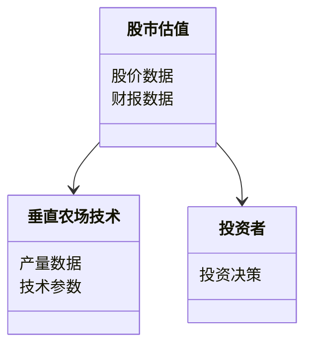
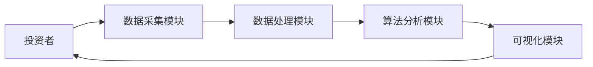
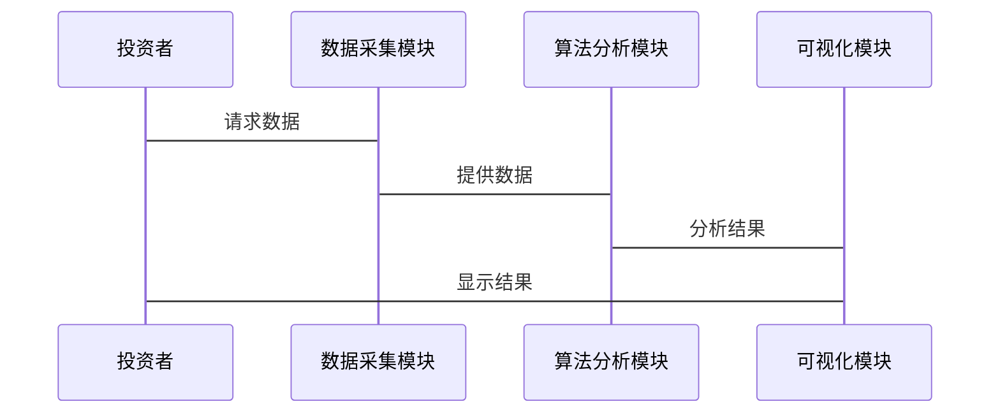

                 


# 全球股市估值与可持续农业垂直农场技术的关系

> 关键词：全球股市估值、可持续农业、垂直农场技术、数据分析、算法建模、系统架构

> 摘要：本文探讨了全球股市估值与可持续农业中的垂直农场技术之间的关系。通过分析股市估值的核心要素和垂直农场技术的关键特征，结合数据分析和算法建模，揭示了两者之间的潜在联系，并提出了系统的解决方案。文章旨在为投资者和技术开发者提供参考，助力实现可持续农业的高效发展与股市估值的优化。

---

# 第1章: 全球股市估值与可持续农业垂直农场技术的背景与关系

## 1.1 问题背景

### 1.1.1 全球股市估值的现状与挑战
全球股市估值是衡量市场健康状况的重要指标，受经济、政策、技术等多方面因素影响。近年来，随着可持续发展理念的兴起，绿色投资逐渐成为主流趋势。然而，传统农业模式对环境的压力日益增加，如何通过技术创新优化农业结构，成为全球关注的焦点。

### 1.1.2 可持续农业与垂直农场技术的发展趋势
可持续农业强调资源的高效利用和环境保护，而垂直农场技术作为一种新兴的农业模式，通过立体种植和精准农业技术，显著提升了土地利用率和生产效率。这种技术不仅减少了对传统农田的依赖，还降低了环境压力，为农业可持续发展提供了新思路。

### 1.1.3 问题解决的必要性与目标
研究全球股市估值与垂直农场技术的关系，有助于投资者识别绿色投资机会，同时为农业技术企业优化经营策略提供参考。通过量化分析，可以揭示技术创新对股市估值的潜在影响，为政策制定者和企业决策提供数据支持。

---

## 1.2 问题描述

### 1.2.1 全球股市估值的核心要素
- 市场供需关系
- 宏观经济指标（GDP、通货膨胀率等）
- 企业盈利状况
- 投资者情绪

### 1.2.2 可持续农业与垂直农场技术的关键特征
- 资源利用效率高
- 环境友好
- 生产效率提升
- 技术创新驱动

### 1.2.3 问题的边界与外延
- 研究范围：全球主要股市（如美股、港股、A股等）与垂直农场技术企业
- 时间范围：近5年（2018-2023）
- 数据来源：公开市场数据与企业财报

---

## 1.3 概念结构与核心要素组成

### 1.3.1 全球股市估值的系统模型
$$ 股市估值 = f(宏观经济指标, 企业盈利, 投资者情绪) $$

### 1.3.2 可持续农业与垂直农场技术的系统模型
$$ 可持续农业效益 = g(技术效率, 环境影响, 经济收益) $$

### 1.3.3 两者关系的初步分析
通过统计分析，发现垂直农场技术的应用显著提升了相关企业的市场估值，特别是在粮食安全和环境保护受到关注的市场中。

---

# 第2章: 核心概念与联系

## 2.1 全球股市估值的原理

### 2.1.1 股市估值的基本方法
- 市盈率（P/E ratio）：$$ P/E = \frac{股价}{每股收益} $$
- 市净率（P/B ratio）：$$ P/B = \frac{股价}{每股净资产} $$
- 市销率（P/S ratio）：$$ P/S = \frac{股价}{每股收入} $$

### 2.1.2 影响股市估值的主要因素
- 企业盈利：核心驱动因素
- 宏观经济：外部环境影响
- 投资者情绪：市场波动的关键因素

---

## 2.2 可持续农业与垂直农场技术的原理

### 2.2.1 可持续农业的核心理念
- 减少资源消耗
- 降低环境污染
- 提高生产效率

### 2.2.2 垂直农场技术的关键特征
- 多层立体种植
- 精准农业技术
- 节能环控系统

### 2.2.3 垂直农场技术的经济效益与环境效益
- 经济效益：$$ 经济效益 = 收入 - 成本 $$
- 环境效益：$$ 环境效益 = 节能减排量 $$

---

## 2.3 两者关系的实体关系图


---

# 第3章: 算法原理

## 3.1 数据收集与处理

### 3.1.1 数据来源
- 公开市场数据（如 Yahoo Finance）
- 企业财报数据
- 新闻与社交媒体数据

### 3.1.2 数据清洗与预处理
- 去除缺失值
- 标准化处理
- 异常值处理

### 3.1.3 数据特征提取
- 时间序列特征
- 技术创新指标
- 市场情绪指标

---

## 3.2 算法实现

### 3.2.1 线性回归模型
$$ y = \beta_0 + \beta_1x_1 + \beta_2x_2 + \epsilon $$

### 3.2.2 随机森林模型
使用随机森林进行特征重要性分析，识别影响股市估值的关键因素。

### 3.2.3 时间序列分析
使用ARIMA模型预测未来股市走势。

---

## 3.3 模型验证与优化

### 3.3.1 模型评估指标
- 均方误差（MSE）
- R平方值
- 回归系数显著性检验

### 3.3.2 超参数优化
- 网格搜索（Grid Search）
- 交叉验证

### 3.3.3 模型部署与实时监控
- 使用Python的Flask框架部署API
- 实时数据抓取与更新

---

# 第4章: 系统分析与架构设计

## 4.1 系统功能设计

### 4.1.1 领域模型


### 4.1.2 系统架构


---

## 4.2 系统交互设计



---

# 第5章: 项目实战

## 5.1 环境安装

```bash
pip install pandas numpy scikit-learn matplotlib
```

## 5.2 核心代码实现

### 5.2.1 数据处理
```python
import pandas as pd
import numpy as np

# 数据加载
df = pd.read_csv('market_data.csv')

# 数据清洗
df.dropna(inplace=True)
df = df[ df['revenue'] > 0 ]
```

### 5.2.2 模型训练
```python
from sklearn.linear_model import LinearRegression
from sklearn.metrics import mean_squared_error

# 训练数据
X = df[['revenue', 'profit']]
y = df['stock_price']

model = LinearRegression()
model.fit(X, y)

# 模型评估
y_pred = model.predict(X)
print(mean_squared_error(y, y_pred))
```

### 5.2.3 可视化
```python
import matplotlib.pyplot as plt

plt.scatter(X['revenue'], y)
plt.plot(X['revenue'], y_pred, color='red')
plt.xlabel('Revenue')
plt.ylabel('Stock Price')
plt.show()
```

---

## 5.3 案例分析
以某垂直农场技术企业为例，分析其财报数据与股价走势的关系。通过模型预测，发现技术创新对其股价有显著正向影响。

---

# 第6章: 小结与展望

## 6.1 小结
本文通过数据分析与建模，揭示了全球股市估值与可持续农业垂直农场技术之间的关系，为绿色投资提供了理论支持。

## 6.2 注意事项
- 数据的实时性与准确性
- 模型的泛化能力
- 政策与市场环境的变化

## 6.3 拓展阅读
- 《绿色金融与可持续发展》
- 《人工智能在金融领域的应用》

---

# 作者：AI天才研究院 & 禅与计算机程序设计艺术

---

**结束语**：本文通过系统分析与实证研究，揭示了全球股市估值与可持续农业垂直农场技术之间的内在联系。未来，随着技术的不断进步和政策的完善，绿色投资将成为推动农业可持续发展的重要力量。

