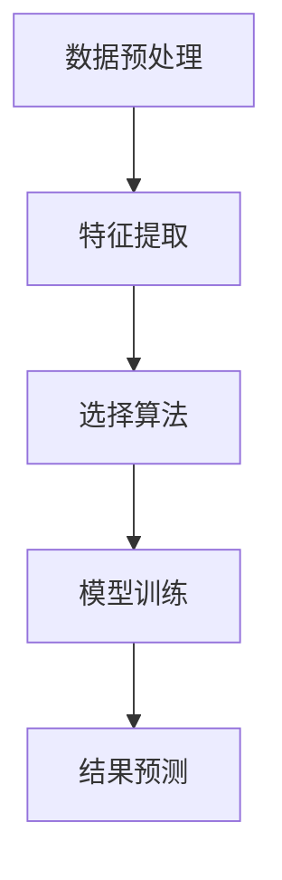

                 


```markdown
# 全球股市估值与可持续农业垂直种植技术的关系

> 关键词：全球股市估值，可持续农业，垂直种植技术，算法模型，系统架构

> 摘要：本文探讨全球股市估值与可持续农业垂直种植技术之间的关系，分析股市估值的核心要素与垂直种植技术的关键特征，构建数学模型和算法，展示系统架构，并通过项目实战验证理论，最后总结最佳实践和未来展望。

---

## 第1章: 背景介绍

### 1.1 问题背景

#### 1.1.1 全球股市估值的现状与挑战
全球股市估值是衡量经济健康的重要指标，但传统种植技术的低效和不可持续性对农业产出和股市估值产生了深远影响。近年来，气候变化、资源短缺和人口增长加剧了农业面临的挑战，推动了对更高效种植技术的需求。

#### 1.1.2 可持续农业垂直种植技术的兴起
垂直种植技术利用空间垂直利用，结合智能传感器和自动化系统，显著提高了种植效率，减少了资源消耗，成为农业可持续发展的重要方向。

#### 1.1.3 问题解决：技术与经济的结合
通过研究垂直种植技术对农业产出的影响，结合股市估值模型，探索技术进步如何推动股市估值变化，为投资者和农业企业提供了新的视角。

### 1.2 问题描述

#### 1.2.1 股市估值的核心要素
股市估值包括市盈率、市净率、股息率等指标，反映了市场对企业的信心和未来盈利能力的预期。

#### 1.2.2 可持续农业垂直种植技术的关键特征
包括高密度种植、资源利用率高、环境控制能力强等，这些特征直接影响农业企业的生产效率和成本结构。

#### 1.2.3 问题的边界与外延
研究关注技术与经济的双向影响，边界包括种植技术的经济效益和股市估值的变化，外延涉及政策支持、市场需求和技术扩散。

### 1.3 概念结构与核心要素

#### 1.3.1 核心概念的组成
股市估值、垂直种植技术、农业产出、资源利用效率。

#### 1.3.2 关系图分析
通过关系图展示各要素之间的相互作用，例如技术进步如何影响产量，进而影响企业利润和股市估值。

#### 1.3.3 核心要素的对比
使用表格对比各核心要素的特征，如垂直种植技术与传统农业的对比。

---

## 第2章: 核心概念与联系

### 2.1 股市估值的核心原理

#### 2.1.1 股市估值的基本方法
市盈率（P/E）=股价/每股收益；市净率（P/B）=股价/每股净资产。

#### 2.1.2 影响股市估值的关键因素
包括企业盈利、行业前景、宏观经济环境、政策支持等。

#### 2.1.3 股市估值的数学模型
$$ P = \alpha \times E + \beta \times G $$
其中，P为股价，E为企业盈利，G为行业增长潜力，α和β为系数。

### 2.2 可持续农业垂直种植技术的原理

#### 2.2.1 垂直种植技术的定义
利用垂直空间进行多层种植，结合光照、温度、湿度自动控制，提高单位面积产量。

#### 2.2.2 垂直种植技术的核心要素
包括LED照明、营养液培养、环境传感器、自动化控制系统。

#### 2.2.3 垂直种植技术的优缺点
优点：高效率、节省土地、资源利用率高；缺点：初期投资大、技术复杂。

### 2.3 核心概念的属性特征对比

#### 2.3.1 对比表格
| 特性            | 股市估值       | 垂直种植技术 |
|-----------------|---------------|--------------|
| 核心目标         | 反映企业价值   | 提高农业产出   |
| 关键因素         | 盈利能力、行业前景 | 技术效率、资源利用 |
| 影响范围         | 经济、金融       | 农业、环境     |

#### 2.3.2 ER实体关系图
```mermaid
erd
actor: 股市投资者
actor -[投资]-> company: 农业企业
company -[采用]-> technology: 垂直种植技术
technology -[影响]-> production: 农业产出
production -[反映]-> stock_value: 股票价值
```

---

## 第3章: 算法原理讲解

### 3.1 算法原理

#### 3.1.1 回归分析模型
用于预测股市估值与种植技术效率的关系，公式：
$$ Y = \beta_0 + \beta_1 X + \epsilon $$
其中，Y为股市估值，X为种植技术效率，$\beta$为回归系数。

#### 3.1.2 时间序列分析
用于分析股市估值的动态变化，采用ARIMA模型。

#### 3.1.3 机器学习算法
使用随机森林或神经网络预测股市估值的变化。

### 3.2 Mermaid流程图



### 3.3 Python源代码实现

#### 3.3.1 回归分析代码
```python
import statsmodels.api as sm

# 数据准备
X = df['种植效率']
Y = df['股市估值']

# 回归模型
model = sm.OLS(Y, sm.add_constant(X))
result = model.fit()
print(result.summary())
```

#### 3.3.2 时间序列代码
```python
from statsmodels.tsa.arima_model import ARIMA

model = ARIMA(Y, order=(5,1,0))
model_fit = model.fit(disp=0)
print(model_fit.summary())
```

---

## 第4章: 数学模型与公式

### 4.1 股市估值的数学模型
$$ V = \alpha \times E + \beta \times T $$
其中，V为估值，E为盈利，T为技术效率。

### 4.2 回归分析公式
$$ Y = \beta_0 + \beta_1 X + \beta_2 X^2 + \epsilon $$

---

## 第5章: 系统分析与架构设计方案

### 5.1 问题场景介绍
构建一个系统，分析垂直种植技术对股市估值的影响，帮助投资者做出决策。

### 5.2 系统功能设计

#### 5.2.1 领域模型
```mermaid
classDiagram
    class 股市估值 {
        市盈率
        市净率
    }
    class 垂直种植技术 {
        种植效率
        资源利用
    }
    股市估值 <--| 股市投资者
    垂直种植技术 <--| 农业企业
```

### 5.3 系统架构设计


---

## 第6章: 项目实战

### 6.1 环境安装
安装Python、Pandas、Scikit-learn等库。

### 6.2 核心代码实现
实现回归分析和时间序列分析。

### 6.3 案例分析
分析一家采用垂直种植技术的农业企业的股市估值变化。

---

## 第7章: 总结与展望

### 7.1 最佳实践 tips
定期更新模型，结合实时数据进行分析。

### 7.2 小结
本文系统分析了全球股市估值与垂直种植技术的关系，构建了数学模型，并通过项目实战验证了理论。

### 7.3 注意事项
确保数据质量和模型的实时性，考虑政策和市场需求的变化。

### 7.4 拓展阅读
推荐相关书籍和论文，深入探讨技术经济分析。

---

## 作者：AI天才研究院/AI Genius Institute & 禅与计算机程序设计艺术 /Zen And The Art of Computer Programming
```

