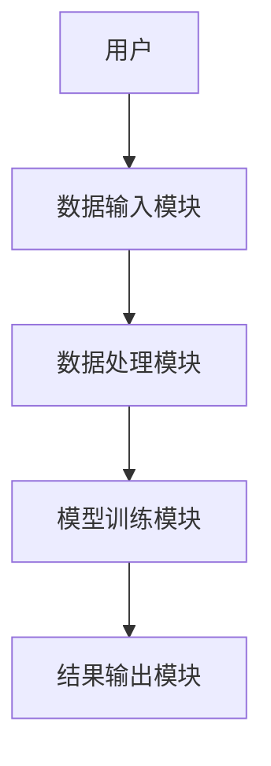

                 


# 全球股市估值与可持续农业实践的关系

> 关键词：全球股市，估值，农业，可持续，关系分析

> 摘要：本文探讨了全球股市估值与可持续农业实践之间的关系，分析了股市估值的核心原理、可持续农业的核心理念及其相互影响。通过详细讲解算法原理、系统架构设计和实际案例分析，本文旨在揭示这两者之间复杂的联系，并为读者提供深入的理解和实用的见解。

---

# 第一章: 全球股市估值的背景与现状

## 1.1 全球股市估值的基本概念

全球股市估值是衡量市场整体表现的重要指标，通常通过股票指数（如标普500、纳斯达克指数等）来反映。股市估值不仅受到经济基本面的影响，还与投资者情绪、政策变化等因素密切相关。

- **经济基本面**：包括GDP增长率、企业盈利水平、利率水平等。
- **投资者情绪**：市场情绪的波动会直接影响股市估值。
- **政策因素**：政府政策（如财政刺激、货币政策）对股市估值有显著影响。

## 1.2 可持续农业的核心理念

可持续农业是指在满足当前需求的同时，不损害未来 generations 的能力的农业实践。其核心理念包括：

- **环境保护**：减少化肥和农药的使用，保护土壤和水资源。
- **资源高效利用**：通过技术手段提高资源利用效率。
- **社会公平**：确保农民和消费者都能受益。

---

# 第二章: 股市估值与可持续农业的相互影响

## 2.1 可持续农业对股市估值的影响

随着全球对环境保护的关注增加，投资者越来越重视企业的可持续性。农业企业若能采用可持续的生产方式，将提升其市场形象和盈利能力，进而影响股市估值。

- **企业盈利能力**：可持续农业实践可能降低生产成本，提高利润率。
- **品牌价值**：消费者倾向于支持环保型企业，提升企业品牌价值。

## 2.2 股市估值对可持续农业的反馈作用

股市估值的变化会影响企业的融资能力，从而影响其可持续农业实践的投入。

- **融资能力**：股市估值高企的企业更容易获得资金支持。
- **投资决策**：投资者倾向于投资那些具有可持续发展潜力的企业。

---

# 第三章: 算法原理与实现

## 3.1 数据预处理与特征提取

### 3.1.1 数据来源

- **股票数据**：包括股票价格、成交量等。
- **农业数据**：包括农产品价格、化肥使用量、水资源利用等。

### 3.1.2 数据清洗

- **处理缺失值**：使用均值或中位数填充。
- **异常值处理**：使用Z-score方法检测并剔除异常值。

## 3.2 模型训练与评估

### 3.2.1 模型选择

- **线性回归**：用于预测股票价格。
- **随机森林**：用于分类问题，如判断企业是否采用可持续农业实践。

### 3.2.2 模型实现

```python
import pandas as pd
from sklearn.ensemble import RandomForestClassifier
from sklearn.metrics import accuracy_score

# 加载数据
data = pd.read_csv('agriculture_stock.csv')

# 特征提取
features = data[['GDP', 'Profit', 'Sustainability']]
target = data['Stock_Price']

# 训练模型
model = RandomForestClassifier()
model.fit(features, target)

# 预测
predictions = model.predict(features)
print("Accuracy:", accuracy_score(target, predictions))
```

---

# 第四章: 系统架构与设计

## 4.1 系统架构设计



## 4.2 系统功能设计

- **数据输入**：接收股票和农业相关数据。
- **数据处理**：清洗和转换数据。
- **模型训练**：训练预测模型。
- **结果输出**：展示预测结果和分析报告。

---

# 第五章: 项目实战与案例分析

## 5.1 案例背景

假设我们有一个农业企业的数据，包括其可持续实践指标和股票价格。

## 5.2 核心代码实现

```python
import pandas as pd
import numpy as np

# 示例数据
data = {
    'Year': [2018, 2019, 2020, 2021],
    'Stock_Price': [100, 120, 110, 130],
    'Sustainability': [0.6, 0.7, 0.8, 0.9]
}

df = pd.DataFrame(data)

# 数据预处理
df['Sustainability'] = df['Sustainability'].fillna(df['Sustainability'].mean())

# 模型训练
from sklearn.linear_model import LinearRegression
model = LinearRegression()
model.fit(df[['Sustainability']], df['Stock_Price'])

# 预测
new_sustainability = 0.85
predicted_price = model.predict([[new_sustainability]])
print("Predicted Stock Price:", predicted_price)
```

---

# 第六章: 总结与展望

## 6.1 最佳实践

- **数据质量**：确保数据的准确性和完整性。
- **模型选择**：根据实际需求选择合适的模型。
- **持续监测**：定期更新模型以适应市场变化。

## 6.2 小结

通过本文的分析，我们可以看到，全球股市估值与可持续农业实践之间存在密切的联系。投资者和企业都应该重视可持续性，以实现长期的稳定发展。

## 6.3 注意事项

- **数据隐私**：注意数据的隐私保护。
- **模型局限性**：模型预测结果仅供参考，需结合实际情况。

## 6.4 拓展阅读

- **参考文献**：推荐几本关于可持续农业和金融学的书籍。
- **进一步研究**：可以研究其他行业的可持续实践对股市估值的影响。

---

# 作者

作者：AI天才研究院/AI Genius Institute & 禅与计算机程序设计艺术 /Zen And The Art of Computer Programming

