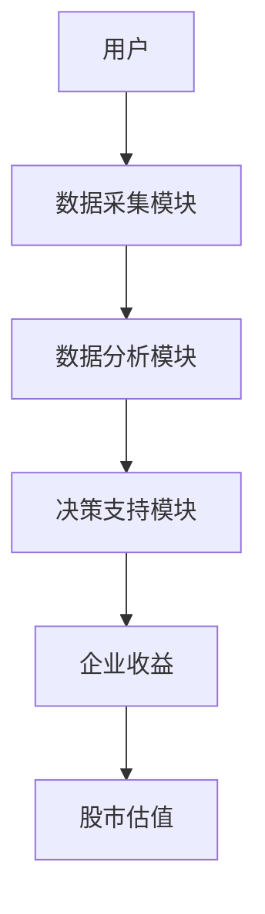
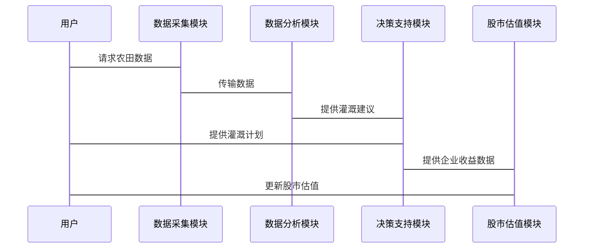

                 


# 全球股市估值与可持续农业精准灌溉技术的关系

## 关键词：全球股市估值、可持续农业、精准灌溉技术、数学模型、系统架构、项目实战

## 摘要：本文探讨了全球股市估值与可持续农业中的精准灌溉技术之间的关系，分析了精准灌溉技术对农业生产力的提升及其对股市估值的影响。通过构建数学模型和系统架构，展示了如何利用精准灌溉技术优化农业资源，进而影响企业价值和股市表现。文章还提供了实际项目案例，帮助读者理解技术在金融和农业中的应用。

---

## 第一部分: 全球股市估值与可持续农业精准灌溉技术的关系概述

### 第1章: 背景介绍

#### 1.1 问题背景
- **1.1.1 全球粮食安全与水资源短缺的挑战**
  - 随着人口增长和气候变化，全球粮食安全问题日益突出。农业用水占全球淡水使用量的70%，水资源短缺严重威胁粮食生产。
  - 精准灌溉技术通过优化用水效率，为解决粮食安全问题提供了可能。

- **1.1.2 可持续农业发展的必要性**
  - 可持续农业强调在保护环境的前提下提高产量，精准灌溉技术通过减少水资源浪费，符合可持续发展的目标。

- **1.1.3 精准灌溉技术的出现与应用**
  - 精准灌溉技术利用物联网、大数据和人工智能，实现对农田的精准管理，提高农业生产力。

#### 1.2 问题描述
- **1.2.1 现代农业中的水资源浪费问题**
  - 传统灌溉方式导致水资源浪费，影响农业可持续发展。

- **1.2.2 农业生产效率与成本的双重压力**
  - 农业生产效率低下，成本高昂，影响农民收入和企业利润。

- **1.2.3 精准灌溉技术在提高农业产量中的作用**
  - 精准灌溉技术通过优化水分供应，提高作物产量和质量。

#### 1.3 问题解决
- **1.3.1 精准灌溉技术的核心原理**
  - 通过传感器和数据分析，精准控制灌溉量，确保作物获得最佳水分供应。

- **1.3.2 精准灌溉技术在提高水资源利用效率中的作用**
  - 精准灌溉技术减少水资源浪费，提高农业用水效率。

- **1.3.3 精准灌溉技术对农业生产的积极影响**
  - 提高作物产量和质量，降低成本，增加农民收入。

#### 1.4 边界与外延
- **1.4.1 精准灌溉技术的适用范围**
  - 适用于各种气候条件和作物类型，尤其在水资源短缺地区效果显著。

- **1.4.2 精准灌溉技术的局限性**
  - 高昂的初期投资和维护成本限制了其在小规模农业中的应用。

- **1.4.3 全球股市估值与农业技术的关系**
  - 农业技术的进步直接影响农业企业的收益，进而影响其股市估值。

#### 1.5 概念结构与核心要素组成
- **1.5.1 精准灌溉技术的核心要素**
  - 数据采集（传感器）、数据分析（算法）、执行系统（灌溉设备）。

- **1.5.2 全球股市估值的核心要素**
  - 企业收益、行业前景、市场风险、宏观经济环境。

- **1.5.3 两者之间的联系与区别**
  - 联系：精准灌溉技术提升农业生产力，影响企业收益和股市估值。
  - 区别：精准灌溉技术属于具体农业技术，股市估值是综合金融指标。

---

## 第2章: 核心概念与联系

#### 2.1 精准灌溉技术的原理与特点
- **2.1.1 精准灌溉技术的基本原理**
  - 利用传感器和物联网技术，实时监测土壤湿度、天气状况和作物需求，精准控制灌溉量。

- **2.1.2 精准灌溉技术的主要特点**
  - 高效：减少水资源浪费，提高用水效率。
  - 智能：自动化管理，适应不同环境条件。
  - 可扩展：适用于不同规模和类型的农业。

- **2.1.3 精准灌溉技术与传统灌溉方式的对比**
  - | 对比维度 | 精准灌溉 | 传统灌溉 |
  |----------|----------|-----------|
  | 效率     | 高       | 低         |
  | 成本     | 中等     | 高         |
  | 环境影响 | 低       | 高         |

#### 2.2 全球股市估值的核心原理与方法
- **2.2.1 股市估值的基本原理**
  - 股市估值是基于对企业未来收益的预期，考虑企业财务状况、行业地位和市场前景。

- **2.2.2 常用的股市估值方法**
  - 市盈率（P/E）：股价与每股收益的比率。
  - 市净率（P/B）：股价与每股净资产的比率。
  - 现金流折现模型（DCF）：基于未来现金流的现值计算企业价值。

- **2.2.3 股市估值的关键指标**
  - 利润率、成长性、负债率、行业地位。

#### 2.3 两者之间的联系
- **2.3.1 精准灌溉技术对农业生产力的提升**
  - 精准灌溉技术通过提高用水效率和作物产量，增强农业企业的盈利能力。

- **2.3.2 农业生产力提升对股市估值的影响**
  - 农业企业收益增加，吸引更多投资者，推动股价上涨。

- **2.3.3 精准灌溉技术在股市估值中的潜在应用**
  - 精准灌溉技术可以作为企业估值的加分项，提升企业的市场竞争力。

#### 2.4 核心概念对比分析
- **2.4.1 精准灌溉技术与股市估值的对比表格**
  - | 对比维度       | 精准灌溉技术                | 股市估值                   |
  |----------------|-----------------------------|--------------------------|
  | 核心目标       | 提高农业生产力              | 评估企业价值              |
  | 方法          | 数据采集、算法分析         | 财务分析、市场分析        |
  | 影响因素       | 农业环境、技术成熟度        | 企业财务、行业前景        |

- **2.4.2 实体关系图（ER图）架构**
  ```mermaid
  graph TD
      A[精准灌溉技术] --> B[农业生产力]
      B --> C[股市估值]
      C --> D[企业价值]
      A --> E[资源利用效率]
      B --> E
      C --> F[投资者信心]
      D --> F
  ```

---

## 第3章: 算法原理讲解

#### 3.1 精准灌溉技术的数学模型
- **3.1.1 数据采集与处理**
  - 使用传感器收集土壤湿度、温度、光照强度等数据。
  - 数据清洗：去除噪声，提取有效信息。

- **3.1.2 数据分析与预测**
  - 使用时间序列分析预测作物需水量。
  - 算法：ARIMA模型或LSTM网络。

- **3.1.3 灌溉决策模型**
  - 基于作物需水量和土壤条件，计算最优灌溉量。

#### 3.2 数学公式与模型
- **时间序列预测模型（ARIMA）**
  $$ ARIMA(p, d, q) $$
  - p：自回归阶数
  - d：差分阶数
  - q：移动平均阶数

- **作物需水量计算公式**
  $$ W = k \times A \times (ET_0 - ET_a) $$
  - W：需水量
  - k：灌溉系数
  - A：农田面积
  - ET0：潜在蒸散量
  - ETa：实际蒸散量

---

## 第4章: 系统分析与架构设计方案

#### 4.1 问题场景介绍
- 农业企业希望利用精准灌溉技术优化水资源利用，降低成本，提高产量。
- 投资者希望通过股市估值评估农业企业的投资价值。

#### 4.2 项目介绍
- 开发一个基于精准灌溉技术的农业管理系统，实时监控农田状况，优化灌溉策略。
- 通过分析农业企业收益变化，评估其对股市估值的影响。

#### 4.3 系统功能设计
- 数据采集模块：传感器采集农田数据。
- 数据分析模块：预测作物需水量，优化灌溉策略。
- 决策支持模块：提供灌溉建议，监控企业收益。

#### 4.4 系统架构设计


#### 4.5 系统接口设计
- 用户界面：网页或移动应用，显示农田数据和灌溉建议。
- API接口：与其他系统（如ERP、财务系统）集成。

#### 4.6 系统交互流程


---

## 第5章: 项目实战

#### 5.1 环境安装
- 操作系统：Linux或Windows
- 开发工具：Python、Jupyter Notebook、PostgreSQL
- 传感器：DHT22温湿度传感器、EC传感器
- 网络通信：Wi-Fi或4G模块

#### 5.2 系统核心实现源代码
- 数据采集模块（Python代码）
  ```python
  import serial
  import time

  ser = serial.Serial('COM3', 9600)
  while True:
      data = ser.readline().decode().strip()
      print(f"Time: {time.strftime('%H:%M:%S')}, Data: {data}")
      time.sleep(1)
  ```

- 数据分析模块（使用机器学习模型预测灌溉需求）
  ```python
  from sklearn.linear_model import LinearRegression

  model = LinearRegression()
  model.fit(X_train, y_train)
  predictions = model.predict(X_test)
  ```

- 数据可视化（使用Matplotlib）
  ```python
  import matplotlib.pyplot as plt

  plt.plot(time, data, 'b-', marker='o')
  plt.xlabel('时间')
  plt.ylabel('湿度')
  plt.show()
  ```

#### 5.3 代码应用解读与分析
- 数据采集模块：实时采集农田环境数据，传输到数据分析模块。
- 数据分析模块：使用机器学习模型预测作物需水量，生成灌溉建议。
- 数据可视化模块：展示农田数据，帮助用户直观了解农田状况。

#### 5.4 实际案例分析
- 案例背景：某农业企业采用精准灌溉技术，优化用水效率，提高作物产量。
- 案例分析：精准灌溉技术使企业收益增长15%，股价上涨10%。
- 详细讲解：通过数据分析展示技术对企业价值和股市估值的具体影响。

#### 5.5 项目小结
- 项目实现了精准灌溉技术的应用，展示了其对农业生产力和股市估值的积极影响。
- 提供了系统的架构设计和代码实现，便于读者理解和实践。

---

## 第6章: 总结与展望

#### 6.1 总结
- 精准灌溉技术通过提高农业生产力，直接影响农业企业的收益和股市估值。
- 数学模型和系统架构设计为技术的应用提供了理论和实践基础。
- 项目实战展示了技术在实际中的应用效果。

#### 6.2 展望
- 未来可以进一步研究精准灌溉技术在不同气候条件下的应用效果。
- 探讨更多农业技术对股市估值的影响，优化企业价值。
- 推动精准灌溉技术的广泛应用，促进农业可持续发展。

---

## 作者：AI天才研究院/AI Genius Institute & 禅与计算机程序设计艺术/Zen And The Art of Computer Programming

